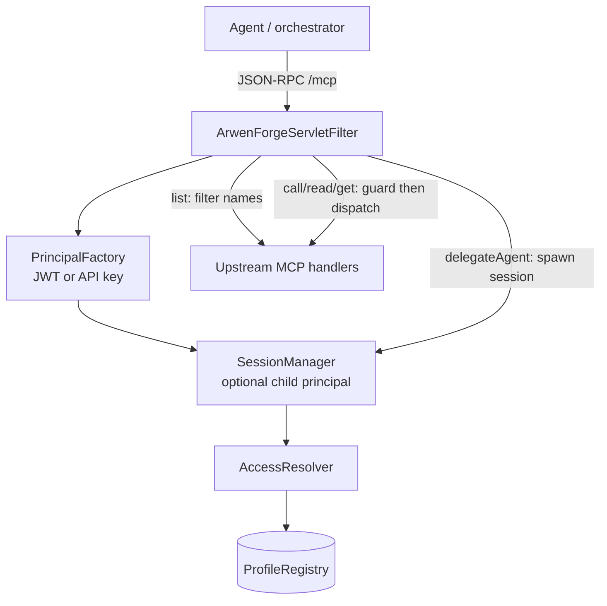
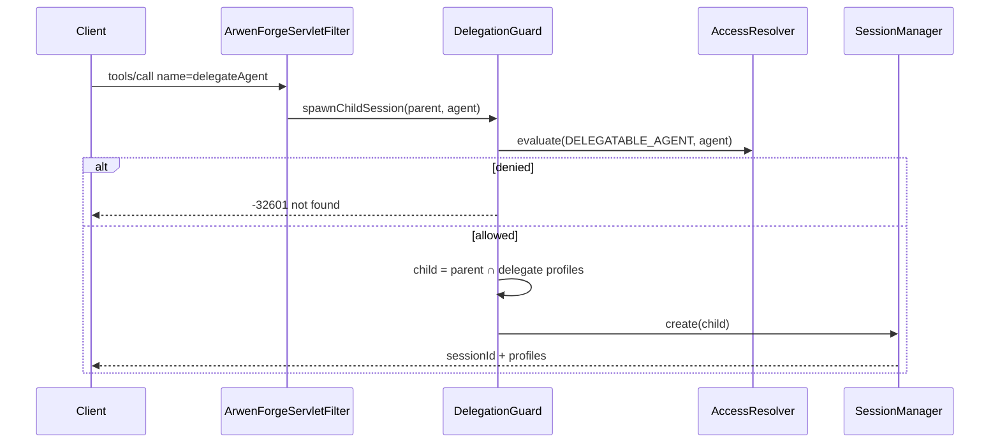

**GitHub:** [github.com/vatsal259/ArwenForge](https://github.com/vatsal259/ArwenForge)

You stand up a Spring AI MCP server. It works. Then you add a second agent. Then a third. Suddenly every agent sees every tool, every resource, every prompt. The LLM’s context window fills with capabilities it should never touch. Worse: if an agent learns a capability name from a log, a sibling session, or a prompt leak, nothing stops it from calling it.

Prompt instructions like “only use support tools” are soft. Gateway path ACLs are coarse. You need the same rule for **what shows up in `tools/list`** and **what is allowed on `tools/call`**.

**[ArwenForge](https://github.com/vatsal259/ArwenForge)** is a Java 21 library that does exactly that. Tag capabilities with **profiles**, assign profiles via RBAC, resolve a **principal** per request, then filter discovery and guard execution — including safe **delegation** into child sessions.

```
Agent: research-bot   profiles {reader, research}
Sees:  search, fetch_article, summarize, …
Misses: update_ticket, delete_user, export_all

Unauthorized tools/call → JSON-RPC -32601 (not found)
No profile leak. Fail closed.
```

---

## Why shared MCP servers go sideways

Multi-agent systems often share **one runtime** and **one MCP endpoint**. Without explicit boundaries you get three failures at once:

1. **Context bloat** — unfiltered `tools/list` / `resources/list` / `prompts/list` inject the full catalog into every session. Tokens burn. Capability surface leaks.
2. **Authorization gap** — discovery without enforcement means “name known ⇒ call allowed.”
3. **Delegation escalation** — a parent that can spawn sub-agents reaches beyond its own entitlement unless spawn *and* child sessions are gated.

| Approach | Discovery filter | Execution guard | Delegation safety |
|----------|------------------|-----------------|-------------------|
| “Please only use X” in the system prompt | Soft | Soft | No |
| API gateway path ACLs | Rarely tool-aware | Coarse | No |
| OPA alone | DIY | Strong if wired | DIY |
| **ArwenForge** | MCP-native | Same rule as list | Intersection + allow-list |

ArwenForge is deliberately **library-first** for Spring Boot MCP servers — not a standalone gateway, not a full IAM product. Drop it into the app that already owns `/mcp`.

---

## The one idea: profiles

A **profile** is a named entitlement surface. Capabilities are tagged with one or more profiles. RBAC assigns profiles to **identity agents** (authenticated callers). At runtime, ArwenForge resolves the caller’s **effective profile set** and applies one rule everywhere:

> Capability is visible and callable iff its profile tags intersect the principal’s effective profiles (and no deny glob wins).

```
profile "support"   →  fetch_ticket, update_ticket, kb://runbooks, triage-ticket, support-agent
profile "research"  →  search, fetch_article, summarize, research-agent
profile "admin"     →  delete_user, export_all, ops-agent
```

Profiles are **capability categories**, not per-user ACLs. That keeps config small and reusable across tools, resources, prompts, and delegatable agents.

### Two meanings of “agent”

| Term | Meaning | Example |
|------|---------|---------|
| **Identity agent** | Authenticated caller (`AgentDefinition`) | `main-agent` — JWT `sub` or API-key map |
| **Delegatable agent** | Spawnable sub-agent capability | `research-agent`, `support-agent` |

Identity = **who**. Delegatable = **what they may invoke**.

### Capability kinds

| Kind | Discovery | Execution |
|------|-----------|-----------|
| `TOOL` | `tools/list` | `tools/call` |
| `RESOURCE` | `resources/list` | `resources/read` |
| `PROMPT` | `prompts/list` | `prompts/get` |
| `DELEGATABLE_AGENT` | `arwen/delegates/list` | `tools/call` → `delegateAgent` |

One vocabulary. Four surfaces. Same resolver.

---

## How a request flows



Roughly:

1. Authenticate → `Principal` (`agentId`, roles, optional token profiles).
2. If `X-Arwen-Session-Id` is present, bind a **child** principal (must match the parent agent id; profiles already narrowed).
3. Rate-limit (enterprise) if enabled.
4. Branch on method:
   - **Lists** → `AccessResolver.allowedNames` → return only permitted items.
   - **Calls / reads / gets** → `CapabilityCallGuard` → allow upstream or `-32601` / approval error.
   - **`delegateAgent`** → `DelegationGuard` → create session with intersected profiles.

**Visibility rule:** no access ⇒ invisible. Lists are filtered only. Unauthorized calls look like “not found,” not “forbidden for your profile.” That avoids leaking the rest of the catalog.

---

## Config that reads like a contract

Place YAML under `classpath:arwen-forge/` (or set `arwen-forge.config-location`):

**`rbac.yaml`** — profiles, roles, identity agents:

```yaml
profiles:
  reader:
    description: Read-only access
    riskLevel: 1
  research:
    description: Research workflows
    riskLevel: 1
  support:
    description: Ticket handling
    riskLevel: 2
  admin:
    description: Destructive operations
    riskLevel: 3

roles:
  orchestrator:
    profiles: [research, support]
  research-agent-role:
    profiles: [reader, research]

agents:
  main-agent:
    roles: [orchestrator]
    allowedDelegates: [research-agent, support-agent]
  research-bot:
    roles: [research-agent-role]
```

**`tools.yaml`** — tool → profile tags (optional risk / approval / blast metadata):

```yaml
tools:
  search:
    profiles: [reader, research]
    risk: read
  update_ticket:
    profiles: [support]
    risk: write
  delete_user:
    profiles: [admin]
    risk: destructive
    blast:
      backend: production
      irreversible: true
```

Same pattern for `resources.yaml`, `prompts.yaml`, and `delegatable-agents.yaml`. You can also overlay annotations (`@ArwenForgeProfile`, `@ArwenForgeRisk`) on Spring AI `@Tool` methods; YAML and annotations merge at bootstrap.

---

## Quick start (≈15 minutes)

Dependency:

```xml
<dependency>
  <groupId>io.arwen.forge</groupId>
  <artifactId>arwen-forge-spring</artifactId>
  <version>1.0.0</version>
</dependency>
```

Requires **Java 21** and **Spring Boot 3.4.x**.

Dev auth via API keys (production: JWT resource server):

```yaml
arwen-forge:
  enabled: true
  config-location: classpath:arwen-forge/
  auth:
    api-keys-enabled: true
    api-keys:
      - key-hash: "$2b$10$..."   # BCrypt of your dev key
        agent-id: research-bot
```

Run the sample:

```bash
mvn -pl examples/multi-agent-server -am spring-boot:run

curl -s http://localhost:8080/mcp \
  -H 'Content-Type: application/json' \
  -H 'Authorization: Bearer <api-key-or-jwt>' \
  -d '{"jsonrpc":"2.0","id":1,"method":"tools/list","params":{}}'
```

Different agents should see different catalogs. Offline checks:

```bash
java -jar arwen-forge-cli-1.0.0.jar validate --config ./config
java -jar arwen-forge-cli-1.0.0.jar blast-radius --config ./config
```

`blast-radius` answers a governance question: *if this agent is compromised, how much of the catalog can it reach?* Useful before you ship a new profile assignment.

---

## Safe delegation without escalation

Orchestrators need to spawn specialists. ArwenForge treats that as a first-class capability kind.

1. Parent calls `arwen/delegates/list` → only allow-listed, profile-permitted delegates.
2. Parent calls `delegateAgent` with a name (e.g. `research-agent`).
3. `DelegationGuard` evaluates access, then builds a **child** principal:
   - Same `agentId` as the parent (session binding stays tied to the authenticated caller).
   - Profiles = **intersection** of parent effective set and the delegate’s profiles.
4. Response returns a session id. Subsequent MCP calls send `X-Arwen-Session-Id`.
5. Child cannot escalate: intersection is a hard ceiling; allow-list is a second gate.



Sessions can be in-memory (dev) or **HMAC-signed** (enterprise) so you do not need Redis just to carry a narrowed principal across instances.

---

## What’s inside the boxes

| Module | Role |
|--------|------|
| `arwen-forge-core` | Model, `AccessResolver`, indexes, approval SPI, blast radius, audit API |
| `arwen-forge-config` | YAML load, annotation scan, merge/overlay, validate, registry factory |
| `arwen-forge-agent` | `DelegationGuard`, `DelegationCatalog`, session managers |
| `arwen-forge-spring` | Boot auto-config, servlet filter, guards/handlers, enterprise ops |
| `arwen-forge-cli` | `validate`, `plan`, `blast-radius` |
| `examples/multi-agent-server` | Runnable Spring MCP demo |

Core types you will touch conceptually: `Principal`, `ProfileRegistry` / `ProfileRegistryHolder`, `AccessResolver` (`Default` → `Reloadable` → optional `ApprovalAware`), `CapabilityCallGuard`, `ArwenForgeServletFilter`.

Enterprise features (approvals, Micrometer metrics, rate limits, signed sessions, hot reload) are **config-gated** on top of the same open-source tree — Community vs Enterprise is a flag story, not a separate binary. See [docs/SKUS.md](https://github.com/vatsal259/ArwenForge/blob/main/docs/SKUS.md).

### Error model (short)

| Code | Meaning |
|------|---------|
| `-32001` | Auth failure |
| `-32601` | Capability not found / not permitted (no leak) |
| `-32004` | Approval required |
| `-32005` | Rate limited |

---

## Good fit / bad fit

**Works well when:**

- You run **Spring Boot + Spring AI MCP** with multiple agent identities on one endpoint
- You want **least-privilege discovery** and **fail-closed execution** from one config
- Delegation must be **allow-listed and non-escalating**
- Ops care about **blast radius**, audit events, and optional human approval for high-risk tools

**Not the right tool when:**

- Your stack is non-JVM only (no Spring adapter yet)
- You need a managed SaaS gateway / multi-server federation today
- You want full IAM / user management (ArwenForge assumes an IdP or API keys already exist)
- You only need client-side prompt filtering (that is soft; ArwenForge is server-side)

---

## Key Takeaways

- **One rule, four surfaces** — tools, resources, prompts, and delegates share the same profile vocabulary and resolver.
- **No access ⇒ invisible** — lists are filtered; unauthorized calls return not-found, not a profile lecture.
- **Delegation is gated** — allow-list plus profile intersection; child sessions cannot climb above the parent.
- **Library, not a gateway** — sits in your Spring MCP app; JWT / API key identity drives access.
- **Govern before you ship** — CLI `validate` and `blast-radius` make policy mistakes obvious offline.
- **Open source** — Apache-2.0; Enterprise controls are config gates on the same code.

---

**Try it:** [github.com/vatsal259/ArwenForge](https://github.com/vatsal259/ArwenForge) · [Getting started](https://github.com/vatsal259/ArwenForge/blob/main/docs/getting-started.md) · [Compare](https://github.com/vatsal259/ArwenForge/blob/main/docs/compare.md)

Author notes: sample profiles in the repo use `reader`, `research`, `support`, `admin`. Map JWT `sub` → agent id; optional claims `roles` and `profiles`. Full product design lives in local `DESIGN.md` (working copy; not all of it is published to GitHub).
