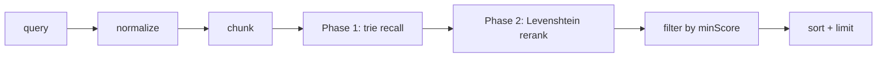

**TRY IT YOURSELF:** [vatsal259.github.io/docube-db/](https://vatsal259.github.io/docube-db/)
**GitHub:** [github.com/vatsal259/docube-db](https://github.com/vatsal259/docube-db)

You have half a million invoice numbers in a text file. A barcode scanner misreads one character. A warehouse operator types a serial number from a smudged label. An OCR pipeline drops a dash. Exact lookup fails. Comparing against every line is too slow. You do not want to spin up Elasticsearch for a laptop-side validation step.

**[docube-db](https://github.com/vatsal259/docube-db)** is an embedded Java library that sits in the middle: structure to prune the catalog, similarity scoring to rank what survives. No server. No database install. Just files in a folder and one jar.

```
Your list:   INV-2024-IND-88492
User typed:  INV-2024-IND-8849Z
Result:      INV-2024-IND-88492  (score ≈ 0.94)
```

---

## Why this problem keeps showing up

Structured codes - invoice IDs, shipment numbers, serials, part numbers, license keys - share a pattern: a **prefix** encodes context (region, year, product line) and a **suffix** encodes identity. When input is wrong, it is usually *almost* right: one swapped character, a misread `Z` for `2`, a missing dash.

| Approach | Strength | Weakness on fuzzy codes |
|----------|----------|-------------------------|
| Hash map / `HashSet` | O(1) exact lookup | Zero tolerance for typos |
| Linear scan + edit distance | Finds close matches | O(n) per query - painful at 500k rows |
| Full-text search (Elasticsearch, etc.) | Great for words in documents | Built for tokenized text, not whole-code similarity |
| **docube-db** | Prunes by prefix, then scores survivors | Prefix-first; not for semantic or random-string search |

docube-db is deliberately narrow: **fast fuzzy lookup over prefix-heavy code lists**, offline, explainable, file-backed.

---

## The idea behind the index

Back in 2021 I read about how Elasticsearch uses **inverted indexes** - the index at the back of a textbook, but for documents. Type a word, jump to matching pages without reading everything. That shortcut works because text splits into words.

Codes do not work that way. `INV-2024-IND-8849Z` is one string with a single typo, not a bag of keywords. The same instinct still applies: **do not read the whole dataset**. docube-db keeps a different shaped index - a **trie of fixed-size code chunks** - so strings that share a prefix share a branch in the tree.

| | Inverted index (Elasticsearch) | docube-db |
|---|---|---|
| What it indexes | words in your text | small **pieces of the whole code** |
| The shortcut | word → documents that contain it | shared **prefix** → codes on that branch |
| Great for | "find documents containing *invoice*" | "find the code almost like this one" |

A query starting with `SHP-` never walks the `INV-` branch. That is the win.

### Visual: codes as paths through a chunk trie

Catalog with `chunkSize = 4`:

```
INV-2024-IND-88490  →  [INV-][2024][-IND][-884][90]
INV-2024-IND-88492  →  [INV-][2024][-IND][-884][92]
SHP-2024-US-00101   →  [SHP-][2024][-US-][0010][1]

Trie (simplified):
root
 ├── "INV-" → "2024" → "-IND" → "-884" → "90"  (line 1)
 │                                    └─ "92"  (line 2)
 └── "SHP-" → "2024" → "-US-" → "0010" → "1"   (line 3)
```

Search is not "scan all lines." It is "walk the tree until you are close enough, collect candidate line numbers, then score only those."

---

## How search works

Every code is split into fixed-size chunks. With `chunkSize = 4`:

```
INV-2024-IND-88492  →  [INV-][2024][-IND][-884][92]
```

### The two-phase pipeline



1. **Recall** - walk the trie to collect a small set of candidate line numbers. How aggressively you explore fuzzy branches depends on the search mode.
2. **Rerank** - read each candidate from disk via byte offsets, score the full string, filter by `minScore`, sort by score (tie-break on line number), return the top `limit` hits.

### Walkthrough: one typo on the last chunk

Catalog: `INV-2024-IND-88492` (line 1). Query: `INV-2024-IND-8849Z`.

| Step | What happens |
|------|----------------|
| Normalize | Query becomes `INV-2024-IND-8849Z` (uppercase, dashes unified) |
| Chunk | `["INV-","2024","-IND","-884","9Z"]` vs stored `["INV-","2024","-IND","-884","92"]` |
| Trie walk | Exact match through `-884`; break on last chunk `9Z` vs `92` |
| `TREE_UNTIL_BREAK` | At break node, score sibling `92` - above `minChunkScore` (0.25) → recall line 1 |
| Rerank | Full-string Levenshtein similarity ≈ 0.94 |
| Result | `SearchHit{ lineNo=1, text="INV-2024-IND-88492", score≈0.94 }` |

Recall cost scales with trie nodes visited - a slice of the catalog - not total line count. Rerank cost is `candidates × Levenshtein`, and candidates are usually dozens, not hundreds of thousands.

### Scoring

Chunk recall and full-string rerank share the same normalized similarity:

```
similarity(a, b) = 1 − editDistance(a, b) / max(len(a), len(b))
```

Range `0.0`–`1.0`. `1.0` = identical. Swap in your own metric by implementing `StringScorer` / `ChunkScorer` (e.g. Jaro-Winkler) and passing it to the `DocubeDB` constructor.

---

## Get started

**Clone and build** (dependencies and build steps are in the [README](https://github.com/vatsal259/docube-db#build)):

```bash
git clone https://github.com/vatsal259/docube-db.git
cd docube-db
mvn clean install
```

Add the jar to your project, or depend on the built artifact from your local Maven cache after `mvn install`.

### Minimal example

```java
DocubeDB db = new DocubeDB("/data/codes");

// Create a collection (chunkSize = 4 chars) and load a file in one step
DocubeFile invoices = db.createFileFromRecords("invoices", 4, Path.of("invoices.txt"));

// Default fuzzy search - great for a single scanner/OCR typo
List<SearchHit> hits = invoices.search(
        "INV-2024-IND-8849Z",
        5,      // limit
        0.85,   // minScore
        SearchMode.TREE_UNTIL_BREAK
);

SearchHit best = hits.get(0);
System.out.println(best.getText() + " @ " + best.getScore());
```

**Input file format:** UTF-8 text, one code per line. Empty lines skipped by default.

### Loading data

| Method | Best for |
|--------|----------|
| `createFileFromRecords(name, chunkSize, file)` | First-time load - create + ingest in one step |
| `ingest(file)` | Bulk append from an export (indexes saved once at the end) |
| `insert(code)` | Add one code (writes to disk on every call) |

```java
DocubeFile file = db.openFile("invoices");

IngestResult result = file.ingest(Path.of("new-invoices.txt"));
System.out.println(result.getInsertedCount() + " added");

// Skip duplicates (vs existing catalog and within the same file)
file.ingest(Path.of("batch.txt"), IngestOptions.defaults().withSkipDuplicates(true));

file.insert("INV-2024-IND-88500");
```

`IngestResult` reports `insertedCount`, `skippedEmptyCount`, `skippedDuplicateCount`. Prefer `ingest()` for bulk - `insert()` rewrites indexes after every record.

---

## Four search modes, one pipeline

Modes differ only in the recall step. Everything else is shared.

| Mode | What it does | Use when |
|------|--------------|----------|
| `EXACT` | Literal full-string match, linear scan | Strict validation gate |
| `PREFIX_STRICT` | Walk trie exactly; return everything under the matched prefix | Autocomplete, "starts with…" |
| `TREE_UNTIL_BREAK` | Walk until first chunk mismatch, fuzzy peek at siblings once | **Default.** Single typo near the end |
| `BEAM_WALK` | Keep top-N fuzzy paths at every chunk step | Multiple typos or transpositions |

```java
// Autocomplete-style prefix listing
invoices.search("INV-2024", 20, 0.0, SearchMode.PREFIX_STRICT);

// Harder noise - keep 4 candidate paths per step
invoices.search("ACBD-EFGH", 5, 0.7, SearchMode.BEAM_WALK,
        SearchOptions.defaults().withBeamWidth(4));

// Strict equality (pass normalized form - stored values are normalized)
invoices.search("INV-2024-IND-88492", 1, 0.0, SearchMode.EXACT);
```

**Mode trade-off example** - catalog `[ABCD-EFGH, ABCE-EFGH]`, query `ACBD-EFGH` (transposed), `chunkSize = 2`:

| Mode | Outcome |
|------|---------|
| `PREFIX_STRICT` | Breaks early - little or nothing returned |
| `TREE_UNTIL_BREAK` | One fuzzy peek at the break - may miss the right row |
| `BEAM_WALK` (beamWidth=4) | Keeps both `ABCD` and `ABCE` paths alive → finds `ABCD-EFGH` |

### Tunables

| Parameter | Where | Default | Effect |
|-----------|-------|---------|--------|
| `chunkSize` | set at `createFile` | - | Trie granularity (chars per chunk) |
| `minChunkScore` | `SearchOptions` | `0.25` | How fuzzy a trie chunk match may be during recall |
| `beamWidth` | `SearchOptions` | `3` | Paths kept per step (`BEAM_WALK` only) |
| `minScore` | `search(...)` | caller | Drop full-string matches below this |
| `limit` | `search(...)` | caller | Max results returned |

`chunkSize` is fixed per collection at creation time. Smaller chunks mean finer branching and more trie nodes; larger chunks mean coarser pruning.

---

## What lives on disk

A collection named `invoices` is four files in your DB root folder:

| File | Holds |
|------|-------|
| `invoices.data` | Normalized codes, one per line (**source of truth**) |
| `invoices.offset.json` | Byte offset per line for O(1) random access |
| `invoices.tree.idx` | Serialized chunk trie (JSON) |
| `invoices.meta.json` | Name, chunk size, line count, created timestamp |

`.data` is authoritative. `.offset.json` and `.tree.idx` are **rebuildable** from `.data` + `.meta.json`.

Open a collection and docube **self-heals**: if the trie line count or offset array size disagrees with `meta.lineCount`, it rebuilds the derived indexes automatically. A corrupted `.tree.idx` is recoverable as long as `.data` is intact.

### Normalization (non-`EXACT` queries and all stored values)

`DefaultNormalizer` applies:

1. `trim()` leading/trailing whitespace
2. `toUpperCase()`
3. remove all internal whitespace
4. unify dash variants (`–`, `-`, `−`) → ASCII `-`

Custom rules: implement `Normalizer`, pass to `DocubeDB`. Use `IdentityNormalizer` for case-sensitive needs.

> **Gotcha:** `EXACT` does **not** normalize the query, but stored values **are** normalized. Pass the normalized form for exact match.

---

## Architecture at a glance

Single Maven module, one jar. Search modes live in isolated sub-packages:

```
com.docube              → DocubeDB, DocubeFile, SearchStrategies (public API)
com.docube.model        → SearchHit, SearchMode, SearchOptions, IngestResult
com.docube.trie         → ChunkTrie, TrieNode, TrieRecallStrategy
com.docube.mode.*       → exact, prefixstrict, treeuntilbreak, beamwalk
com.docube.scoring      → LevenshteinScorer (pluggable)
com.docube.storage      → FileMeta, LineIndex, RecordReader
```

Package layout matches the [README](https://github.com/vatsal259/docube-db#layout). To add a search mode: new sub-package implementing `TrieRecallStrategy`, one `SearchMode` enum value, one line in `SearchStrategies` - same pattern as the four modes in [`src/main/java/com/docube/mode/`](https://github.com/vatsal259/docube-db/tree/main/src/main/java/com/docube/mode).

---

## Good fit / bad fit

**Works well when:**

- Strings share prefixes (region, year, product line, type code)
- Input is nearly correct - typos, OCR noise, not random gibberish
- You need offline, explainable matching on a laptop, kiosk, or edge device
- List size is thousands to low millions
- You want zero ops: no cluster, no connection string, no schema migration

**Not the right tool when:**

- You need full-text, semantic, or vector search
- Data is tens of millions+ (trie loads entirely into memory as one JSON file)
- You need concurrent writers, per-record deletes, or updates (append-only, single-writer)
- Codes have no shared structure (random UUIDs with no prefix signal)

---

## Key Takeaways

- **Prune with structure, rank with similarity** - a chunk trie narrows candidates; Levenshtein picks the winner. Never scan the whole catalog on every query.
- **No infrastructure tax** - plain files, one jar. Drop a folder on disk and go.
- **Modes trade recall for speed** - `TREE_UNTIL_BREAK` for everyday typos, `BEAM_WALK` when input is noisier, `PREFIX_STRICT` for autocomplete, `EXACT` as a hard gate.
- **Self-healing indexes** - `.data` is the source of truth; derived files rebuild on open if they drift.
- **Honest limits** - built for prefix-heavy code lists, not for semantic search at web scale.
- **Open source** - source, docs, and issues on GitHub.

---

## Links

All public docs and source live on the [docube-db repo](https://github.com/vatsal259/docube-db) - README is the canonical reference.

| Resource | URL |
|----------|-----|
| **Repository** | [github.com/vatsal259/docube-db](https://github.com/vatsal259/docube-db) |
| **README** - quick start, API, search modes, tunables | [github.com/vatsal259/docube-db#readme](https://github.com/vatsal259/docube-db#readme) |
| **Source** | [github.com/vatsal259/docube-db/tree/main/src](https://github.com/vatsal259/docube-db/tree/main/src) |
| **Issues** | [github.com/vatsal259/docube-db/issues](https://github.com/vatsal259/docube-db/issues) |

Clone, build, point `DocubeDB` at a text file of codes, and search with a deliberate typo - you will see the trie recall and rerank pipeline in action.

Questions, bug reports, or ideas for a new search mode? [Open an issue](https://github.com/vatsal259/docube-db/issues).
