> Spring Boot looks like magic until you see the machinery: an **ApplicationContext** that owns your object graph, **auto-configuration** that politely creates beans, and **proxies** that implement transactions and security around your code.

This is an **educational book**, not a keyword dump. Each part teaches with:

- Learning goals and mental models
- ASCII + Mermaid diagrams of how the pieces connect
- Decision tables, transaction/isolation matrices, and ops checklists
- Worked labs and "check yourself" prompts
- Deep supplement parts for auto-config authorship, Actuator, security internals, GraphQL/HTTP clients, messaging/SSL/migration
- A **Topic Atlas** — every masterclass syllabus concept with explanation, gotcha, and official docs link

**Assumed stack:** Spring Boot **3.4.x** · Spring Framework **6** · Spring Security **6** · Java **17/21** · Maven (Gradle covered)

**Keep these hubs open while you read:**

- [Spring Boot Reference](https://docs.spring.io/spring-boot/reference/)
- [Spring Framework](https://docs.spring.io/spring-framework/reference/)
- [Spring Security](https://docs.spring.io/spring-security/reference/)
- [Spring Data JPA](https://docs.spring.io/spring-data/jpa/reference/)
- [Spring Cloud](https://docs.spring.io/spring-cloud/)
- [Spring AI](https://docs.spring.io/spring-ai/reference/)
- [Spring Guides](https://spring.io/guides) · [start.spring.io](https://start.spring.io/)

## How to read this book

1. Read the **Prelude**, then Parts **I–VII** lessons until the request path is automatic.
2. Do the **Check yourself** prompts; if you hesitate, re-read diagrams before the atlas.
3. Study deep Parts **XIII–XVI** (starters, Actuator, persistence matrices, security internals) — this is the architect layer.
4. Add **XVII–XVIII** when you need GraphQL, HTTP clients, messaging, SSL, or Boot 2→3 migration.
5. Execute labs in **Part XIX**; ship **Part XX** capstone milestones.
6. Skim **Part XXI** for JdbcClient, Kotlin, CDS/CRaC, custom Actuator, and AuthorizationManager.
7. Use each module's **Topic Atlas** as spaced-repetition + docs portal (972 entries).

## Book map

| Part | Chapter | What you master |
| ---- | ------- | --------------- |
| **I** | Module 0 — Build Tools & Project Setup | Build & run Boot projects |
| **II** | Module 1 — Core Spring Framework | IoC, beans, DI, AOP |
| **III** | Module 2 — Spring Boot Fundamentals | Starters & auto-config |
| **IV** | Module 3 — Web Layer & RESTful Services | REST, validation, errors |
| **V** | Module 4 — Persistence Layer (Spring Data JPA) | JPA, TX, Flyway |
| **VI** | Module 5 — Spring Security 6.x+ | Filter chain, JWT, OAuth2 |
| **VII** | Module 6 — Testing & Quality Assurance | Pyramid & Testcontainers |
| **VIII** | Module 7 — Microservices & Distributed Systems | EDA, Gateway, resilience |
| **IX** | Module 8 — Advanced Features & Performance (2026) | VT, Actuator, Docker, AI |
| **X** | Capstone — Enterprise Portfolio API | Ship a portfolio API |
| **XI** | Quick reference — every `@` annotation (Spring Boot) | Annotation lookup |
| **XII** | Interview power tips | High-signal drill |
| **XIII** | Write your own starter | `@AutoConfiguration` mastery |
| **XIV** | Configuration & Actuator deep dive | Precedence, health, metrics |
| **XV** | Persistence matrices & battles | Propagation, isolation, N+1, Flyway |
| **XVI** | Security internals | Filter chain, JWT, 403 debugging |
| **XVII** | Web advanced + GraphQL | Pipeline, clients, GraphQL |
| **XVIII** | Messaging, SSL, Compose, migration | Brokers, TLS, Boot 2→3 |
| **XIX** | Labs catalog | Hands-on pass criteria |
| **XX** | Capstone specification | Portfolio API brief |
| **XXI** | Remaining architect surfaces | JdbcClient, Kotlin, CRaC, AuthZ |

**Atlas coverage:** 972 topics, each with a docs link.

---

## Table of contents

- [Part I — Module 0 — Build Tools & Project Setup](#part-i)
- [Part II — Module 1 — Core Spring Framework](#part-ii)
- [Part III — Module 2 — Spring Boot Fundamentals](#part-iii)
- [Part IV — Module 3 — Web Layer & RESTful Services](#part-iv)
- [Part V — Module 4 — Persistence Layer (Spring Data JPA)](#part-v)
- [Part VI — Module 5 — Spring Security 6.x+](#part-vi)
- [Part VII — Module 6 — Testing & Quality Assurance](#part-vii)
- [Part VIII — Module 7 — Microservices & Distributed Systems](#part-viii)
- [Part IX — Module 8 — Advanced Features & Performance (2026)](#part-ix)
- [Part X — Capstone — Enterprise Portfolio API](#part-x)
- [Part XI — Quick reference — every `@` annotation (Spring Boot)](#part-xi)
- [Part XII — Interview power tips](#part-xii)
- [Part XIII — Write your own starter](#part-xiii)
- [Part XIV — Configuration & Actuator deep dive](#part-xiv)
- [Part XV — Persistence matrices & battles](#part-xv)
- [Part XVI — Security internals](#part-xvi)
- [Part XVII — Web advanced + GraphQL](#part-xvii)
- [Part XVIII — Messaging, SSL, Compose, migration](#part-xviii)
- [Part XIX — Labs catalog](#part-xix)
- [Part XX — Capstone specification](#part-xx)
- [Part XXI — Remaining architect surfaces](#part-xxi)

---


# Prelude · The Spring Boot mental model (read this first)

> If you only remember one page from this book, remember this one.

Spring Boot applications are easier when you stop treating annotations as magic spells and start seeing **three machines**:

1. **The container** — creates and wires objects (`ApplicationContext`)
2. **The web machine** — turns HTTP into method calls (`DispatcherServlet`)
3. **The cross-cutting machine** — wraps method calls with extra behavior (AOP proxies for transactions, security, caching)

Boot's job is mostly: **decide which beans to create for you** based on classpath + config.

## Big-picture diagram

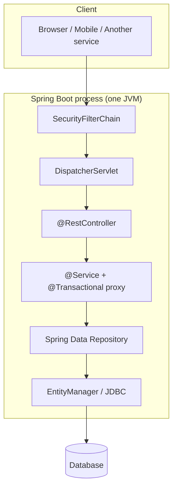

## The object graph you are building

```
Configuration + Component Scan + Auto-Config
                    │
                    ▼
            Bean Definitions
                    │
                    ▼
         ApplicationContext.refresh()
                    │
                    ▼
     Singleton beans created & injected
                    │
                    ▼
     Embedded server starts (Tomcat by default)
                    │
                    ▼
              Ready for traffic
```

## A 10-minute story of one request

1. HTTP `POST /api/orders` hits embedded Tomcat.
2. **Security filters** decide if the caller is authenticated/authorized.
3. **DispatcherServlet** finds `OrderController.create`.
4. Jackson converts JSON → `CreateOrderRequest`; `@Valid` runs.
5. Controller calls `OrderService.create` — but the call hits a **proxy**.
6. Proxy starts a **transaction**, calls real service method.
7. Service uses `OrderRepository.save` → Hibernate SQL → commit.
8. Controller returns `ResponseEntity` 201 + body; Jackson writes JSON.

If you can narrate that story, Boot stops being mysterious.

## How the rest of the book is organized

| You are learning… | Part |
|-------------------|------|
| Build & run | I |
| Container & DI | II |
| Boot auto-config | III |
| HTTP/REST | IV |
| Database | V |
| Security | VI |
| Tests | VII |
| Distributed systems | VIII |
| Production 2026 | IX |
| Capstone | X |

Then drill with the **Topic Atlas** under each part (every syllabus keyword + docs link).

---

# Part I


## Module 0 — Build Tools & Project Setup


> **Learning goal:** start any Spring Boot project confidently — JDK, Maven/Gradle, Initializr, and what actually lands in your JAR.

## Why this chapter exists

Before Spring, before Boot, before `@RestController`, you need a **build**. Most "mysterious" Boot failures are classpath, wrong Java version, or a thin JAR that was never repackaged. Treat the build tool as part of the application.

### Diagram · From source to running process

```
  src/main/java  +  src/main/resources
           │
           ▼
     Maven / Gradle
     (compile → test → package)
           │
           ▼
   spring-boot-maven-plugin
   repackages → executable FAT JAR
           │
           ▼
   java -jar app.jar
           │
           ▼
   JVM + embedded Tomcat + ApplicationContext
```

### Mental model

| Concept | You need it because |
|---------|---------------------|
| **JDK** | Compiles and runs Spring Boot (Boot 3 needs Java 17+) |
| **Maven/Gradle** | Downloads starters, runs tests, packages the app |
| **Coordinates** | `groupId:artifactId:version` uniquely identify every dependency |
| **Fat JAR** | One file contains your code + nested dependency jars |
| **Initializr** | Guarantees compatible starter combinations |

### Teaching note · Parent POM vs BOM

`spring-boot-starter-parent` is a **parent POM**: you inherit plugin config and dependency versions. A **BOM** (Bill of Materials) can be imported via `dependencyManagement` without inheritance — useful in multi-module builds. Either way: **you rarely write version numbers for Spring artifacts**.

### Teaching note · Lifecycle you actually use

```
validate → compile → test → package → verify → install → deploy
              ▲         ▲        ▲
           everyday   CI gate   what you ship
```

Locally: `./mvnw spring-boot:run` or `./mvnw package`. In CI: `./mvnw verify`.


### Check yourself (Part I)

1. What is the difference between a thin JAR and a Spring Boot fat JAR?
2. Why does Boot 3 require Java 17+?
3. What does `./mvnw` buy a team that `mvn` does not?

**Docs hub:** [Maven Lifecycle](https://maven.apache.org/guides/introduction/introduction-to-the-lifecycle.html) · [Spring Boot Build Systems](https://docs.spring.io/spring-boot/reference/using/build-systems.html) · [Initializr](https://docs.spring.io/initializr/docs/current/reference/html/)


## Topic Atlas — Module 0 — Build Tools & Project Setup

Every syllabus topic for this chapter. Read the lesson above first; use this atlas to drill and dive into docs.

### Java & tooling basics

#### JDK vs JRE vs JVM

The JVM (Java Virtual Machine) executes compiled bytecode on any platform, providing write-once-run-anywhere portability. The JRE bundles the JVM plus standard libraries needed to run Java applications but lacks the compiler and developer tools. The JDK includes the full JRE plus javac, jar, javadoc, and other build-time utilities. This distinction matters because Maven, Gradle, and your IDE must locate a JDK—not merely a runtime—to compile Spring Boot code. In every real project you install JDK 17 or 21 locally, set JAVA_HOME, and use JDK-based CI images for build stages. Production containers may ship a slim JRE-only runtime image if the JAR is pre-built, but the compile step always requires the JDK.

> **Watch out:** Installing only JRE and expecting Maven/Gradle to compile — you need the full JDK.

**Official docs:** [JDK vs JRE vs JVM](https://docs.oracle.com/en/java/javase/21/docs/api/index.html)

#### Java LTS versions (17, 21)

LTS (Long-Term Support) Java releases receive security patches and bug fixes for many years, making them safe for production workloads. Java 17 is the minimum baseline for Spring Boot 3.x; Java 21 adds virtual threads, pattern matching improvements, and LTS support through 2031. Non-LTS releases ship features faster but drop support within months, forcing unplanned upgrades. Teams pick LTS to align with Spring's documented support matrix and what cloud vendors certify in their managed runtimes. Choose 17 for maximum library compatibility or 21 when you want Project Loom virtual threads and newer language features. Always align Boot version, JDK, and CI matrix before writing application code.

> **Watch out:** Using a non-LTS Java in production — support ends quickly and Spring may drop it.

**Official docs:** [Java LTS versions (17, 21)](https://docs.oracle.com/en/java/javase/21/docs/api/index.html)

#### JAVA_HOME

JAVA_HOME is an environment variable pointing to the root directory of your JDK installation. Build tools, Gradle, Maven wrappers, and IDEs read it to locate javac and other toolchain binaries. If it points to the wrong version or a JRE-only directory, builds fail with confusing 'release version' or 'tools not found' errors. Correct JAVA_HOME is essential on developer laptops, Docker multi-stage build images, and CI runners. Set it on every machine that compiles Spring Boot and verify with java -version and javac -version from the same shell. Document the expected JDK version in README or Dockerfile so the team stays aligned.

> **Watch out:** Pointing JAVA_HOME at the JRE subfolder instead of the JDK root — compiler tools won't be found.

**Official docs:** [JAVA_HOME](https://docs.oracle.com/en/java/javase/21/docs/api/index.html)

#### JAR vs WAR

A JAR (Java Archive) packages classes and resources into a single file—either as a library dependency or a runnable application. A WAR (Web Application Archive) is designed for deployment into an external servlet container like standalone Tomcat. Spring Boot's default packaging is an executable JAR with embedded Tomcat, Jetty, or Undertow running in the same JVM process. JARs simplify cloud and Kubernetes deployment because you run java -jar with no external server installation. WARs still appear in enterprises that mandate a shared Tomcat farm or legacy operations patterns. Choose JAR for microservices and modern cloud-native deployments; use WAR only when operations explicitly requires external container management.

> **Watch out:** Deploying WAR to external Tomcat when the team standardized on executable JARs — adds unnecessary ops complexity.

**Official docs:** [JAR vs WAR](https://docs.oracle.com/en/java/javase/21/docs/api/index.html)

#### Fat JAR / Uber JAR

A fat (or uber) JAR embeds your application classes plus all dependency JARs in one archive. Spring Boot's repackage goal produces this layout so a single file contains everything needed at runtime. The custom JarLauncher in BOOT-INF knows how to bootstrap nested libraries without manually constructing a classpath. This matters for Docker image layers, artifact storage in Nexus/Artifactory, and repeatable one-binary-per-version deploys. You rely on spring-boot-maven-plugin or Gradle bootJar every time you ship a Boot service to staging or production. Do not confuse the plain thin JAR from mvn package with the repackaged executable unless the plugin's repackage goal actually ran.

> **Watch out:** Running the thin JAR from mvn package without repackage — ClassNotFoundException for dependencies.

**Official docs:** [Fat JAR / Uber JAR](https://docs.oracle.com/en/java/javase/21/docs/api/index.html)

#### Classpath

The classpath tells the JVM where to find compiled .class files, resources, and dependency JARs at runtime and during tests. Maven and Gradle construct it automatically from your dependency graph; manual classpath mistakes cause ClassNotFoundException and NoClassDefFoundError. Understanding classpath helps debug 'works in IDE but fails in CI' issues when dependency scopes or versions differ. In Spring Boot, the executable JAR loader builds an effective classpath from BOOT-INF/lib and BOOT-INF/classes. You rarely set classpath by hand in Boot projects except when running a main class from the IDE without full plugin repackage. Use mvn dependency:tree and verify test vs runtime scopes when jars go missing.

> **Watch out:** Assuming test-scoped dependencies are available at runtime — they won't be on the production classpath.

**Official docs:** [Classpath](https://docs.oracle.com/en/java/javase/21/docs/api/index.html)

#### Maven Wrapper (`mvnw`)

The Maven Wrapper is a small script (mvnw / mvnw.cmd) plus wrapper properties that download and pin a specific Maven version for the project. Everyone on the team and every CI job uses the same Maven release without requiring a global install. The wrapper lives in the repo so onboarding is clone-and-run with no extra setup steps. Spring Initializr projects include mvnw by default. Use ./mvnw clean package instead of bare mvn when you want reproducible builds across laptops and pipelines. Commit wrapper files to version control; never delete them to 'simplify' the project.

> **Watch out:** Using system mvn in CI while developers use mvnw — version drift causes mysterious build failures.

**Official docs:** [Maven Wrapper (`mvnw`)](https://maven.apache.org/guides/introduction/introduction-to-the-lifecycle.html)

#### Gradle Wrapper (`gradlew`)

The Gradle Wrapper (gradlew) downloads and runs a fixed Gradle version declared in gradle/wrapper/gradle-wrapper.properties. It mirrors Maven Wrapper's goal: consistent builds without manual Gradle installation on each machine. Gradle-based Spring projects from start.spring.io include gradlew out of the box. CI should invoke ./gradlew build rather than a preinstalled system gradle command. The wrapper caches distributions locally after the first download, speeding subsequent builds. Treat gradlew as part of the source tree—never assume developers or containers have Gradle globally installed.

> **Watch out:** Skipping gradlew in CI and relying on a preinstalled Gradle — versions may not match the project.

**Official docs:** [Gradle Wrapper (`gradlew`)](https://docs.gradle.org/current/userguide/userguide.html)


### Maven

#### Apache Maven

Apache Maven is a build automation tool that manages dependencies, compiles code, runs tests, and packages JARs using a declarative pom.xml. It enforces a predictable lifecycle so CI pipelines and local builds execute the same compile-test-package sequence every time. Maven is the industry standard alongside Gradle for Java and Spring ecosystems, with the largest corpus of tutorials and enterprise examples. Nearly every Spring Boot project starts with a pom.xml, making Maven fluency non-negotiable for backend developers. You interact with Maven daily through mvnw commands, IDE integration, and Docker build stages. Understanding Maven's model prevents hours lost to dependency conflicts and misconfigured plugins.

> **Watch out:** Editing target/ manually instead of using Maven goals — changes are lost on next build.

**Official docs:** [Apache Maven](https://maven.apache.org/guides/introduction/introduction-to-the-lifecycle.html)

#### Maven coordinates (groupId, artifactId, version)

Maven coordinates are the unique triple—groupId, artifactId, version—that identifies every library artifact in Maven Central and private repositories. For example, org.springframework.boot:spring-boot-starter-web:3.4.5 resolves to one exact JAR on the classpath. Correct coordinates ensure you pull the intended library version and avoid typosquatting or wrong artifacts with similar names. You declare coordinates in pom.xml whenever you add JDBC drivers, Spring starters, or third-party SDKs. The groupId typically mirrors your organization's reverse-DNS; artifactId names the module or library. Omitting version is valid only when a parent POM or BOM manages it.

> **Watch out:** Omitting version without a parent BOM or dependencyManagement — build fails or pulls unpredictable versions.

**Official docs:** [Maven coordinates (groupId, artifactId, version)](https://maven.apache.org/guides/introduction/introduction-to-the-lifecycle.html)

#### Maven Standard Directory Layout

Maven's standard directory layout is a convention: src/main/java for source code, src/main/resources for config, and src/test/java for tests. The same layout appears in every Maven project, making onboarding and IDE import frictionless across teams. Spring Boot expects application.properties, static assets, and templates under src/main/resources by default. Deviating from this layout breaks convention-over-configuration benefits and confuses build plugins. IDEs like IntelliJ and VS Code auto-detect this structure without extra configuration. Stick to the standard layout unless you have a documented multi-module reason to differ.

> **Watch out:** Putting Java sources in src/ instead of src/main/java — Maven won't compile them.

**Official docs:** [Maven Standard Directory Layout](https://maven.apache.org/guides/introduction/introduction-to-the-lifecycle.html)

#### POM (Project Object Model)

The POM (pom.xml) is the XML file defining project metadata, dependencies, plugins, and build settings—the heart of every Maven project. Spring Boot apps inherit versions and plugin configuration through a parent POM and import BOMs within the POM's dependencyManagement section. You edit the POM when adding starters, changing Java version, configuring spring-boot-maven-plugin, or defining profiles. Multi-module projects use a parent POM to centralize dependency versions across child modules. Understanding POM structure lets you diagnose why a dependency resolved to an unexpected version. Treat pom.xml as the single source of truth for your build.

> **Watch out:** Duplicating dependency versions that parent POM already manages — causes override confusion.

**Official docs:** [POM (Project Object Model)](https://maven.apache.org/guides/introduction/introduction-to-the-lifecycle.html)

#### Maven parent POM

A Maven parent POM lets child projects inherit dependency versions, plugin configuration, and properties without repeating them. Spring Boot apps use spring-boot-starter-parent to align Boot, Spring Framework, and third-party library versions that are tested together. Override only what you need in the child POM—the parent keeps the dependency set battle-tested by the Spring team. Parent POMs also define default compiler settings, encoding, and resource filtering. When upgrading Boot, changing the parent version is often the primary migration step. Without a parent or BOM, you manually align dozens of library versions—a frequent source of runtime conflicts.

> **Watch out:** Changing parent version without checking Spring Boot migration guide — breaking API changes surprise you.

**Official docs:** [Maven parent POM](https://maven.apache.org/guides/introduction/introduction-to-the-lifecycle.html)

#### Maven dependency scope (compile, test, runtime, provided)

Maven dependency scope controls when a dependency appears on the classpath: compile (default, everywhere), test (tests only), runtime (run not compile), or provided (container supplies it). Wrong scope causes compile errors or bloated production JARs with test libraries accidentally included. Use provided for APIs the servlet container supplies; test for JUnit and Mockito; runtime for JDBC drivers in some setups. Spring Boot's repackage goal respects scopes when building the fat JAR. Understanding scopes is essential when debugging 'class not found' in production but not in tests. Always verify scope when adding a new dependency to pom.xml.

> **Watch out:** Using compile scope for test-only libraries — they leak into production artifacts.

**Official docs:** [Maven dependency scope (compile, test, runtime, provided)](https://maven.apache.org/guides/introduction/introduction-to-the-lifecycle.html)

#### Maven transitive dependencies

When you add one direct dependency, Maven automatically pulls in its transitive dependencies—libraries that your dependency needs. A single starter can transitively bring dozens of JARs onto the classpath. Transitives can introduce version conflicts when two libraries require incompatible versions of the same artifact. Inspect the dependency tree before blindly excluding or overriding versions in dependencyManagement. Spring Boot's BOM pre-resolves most conflicts for official starters. Understanding transitivity helps you explain why a class appears on the classpath even though you never declared it directly.

> **Watch out:** Blindly excluding transitive deps to fix conflicts — you may remove classes your app needs at runtime.

**Official docs:** [Maven transitive dependencies](https://maven.apache.org/guides/introduction/introduction-to-the-lifecycle.html)

#### Maven dependency tree

Run mvn dependency:tree to see the full graph of direct and transitive dependencies with their resolved versions. Essential when debugging NoClassDefFoundError, duplicate classes, or security scanner findings about vulnerable transitive JARs. Use dependency:tree -Dverbose to see which dependency won a version conflict and which was omitted. In multi-module projects, run from the specific module or root to see the complete reactor graph. CI pipelines sometimes fail builds when dependency-check plugins flag CVEs in transitive libraries. The tree is your first tool when classpath behavior surprises you.

> **Watch out:** Fixing version conflicts in code instead of POM — the tree shows which dependency wins.

**Official docs:** [Maven dependency tree](https://maven.apache.org/guides/introduction/introduction-to-the-lifecycle.html)

#### Maven BOM (Bill of Materials)

A BOM is a special POM that imports managed dependency versions without adding any JARs to your classpath. Spring Boot's dependency management works through BOM imports—you declare dependencies without version numbers and inherit tested versions. Import BOMs in dependencyManagement when building multi-module projects or custom parent POMs outside spring-boot-starter-parent. BOMs eliminate version-alignment guesswork across Spring, Hibernate, Jackson, and other stacks. You still need to declare the actual dependency; the BOM only pins its version. Combining multiple BOMs requires care to avoid conflicting version declarations.

> **Watch out:** Adding version numbers on every dependency when BOM already manages them — unnecessary and error-prone.

**Official docs:** [Maven BOM (Bill of Materials)](https://maven.apache.org/guides/introduction/introduction-to-the-lifecycle.html)

#### Maven repositories (central, local ~/.m2)

Maven Central is the global public repository hub; your local ~/.m2/repository caches downloaded artifacts on your machine. First resolve hits the network; later builds use the local cache for speed. CI pipelines often cache .m2 between runs to avoid re-downloading the internet on every build. Corporate environments may require settings.xml to point at an internal Artifactory or Nexus mirror. Private repositories host internal libraries your team publishes via mvn deploy. Understanding repository resolution explains 'works on my machine' when one developer has a stale or corrupted local cache entry.

> **Watch out:** Deleting entire ~/.m2 to fix one project — forces re-download for all projects.

**Official docs:** [Maven repositories (central, local ~/.m2)](https://maven.apache.org/guides/introduction/introduction-to-the-lifecycle.html)

#### Maven plugins

Maven plugins extend the build with goals bound to lifecycle phases like compile, test, and package. spring-boot-maven-plugin repackages JARs; surefire runs tests; compiler sets Java release version. You configure plugins in pom.xml's build/plugins section with version and execution parameters. Plugin version mismatches with your JDK or parent POM cause subtle build failures. Each plugin goal does one job—understanding which plugin runs when helps debug CI failures. Custom plugins exist but most Spring Boot projects need only a handful of standard ones.

> **Watch out:** Binding custom goals to wrong phase — e.g. integration tests running before package.

**Official docs:** [Maven plugins](https://maven.apache.org/guides/introduction/introduction-to-the-lifecycle.html)

#### maven-compiler-plugin

The maven-compiler-plugin sets the Java source and target (or release) version for compilation. It must match your installed JDK and Spring Boot's minimum requirement—Boot 3 requires Java 17+. Configure release 17 or 21 in the parent POM or explicit plugin config for consistent bytecode across the team. Mismatch between compiler release and runtime JDK causes UnsupportedClassVersionError at startup. The plugin also controls encoding and annotation processor classpath for Lombok or MapStruct. Verify compiler settings after upgrading JDK or Boot parent version.

> **Watch out:** Setting source 17 but running CI on JDK 11 — compiler plugin or Boot parent rejects the build.

**Official docs:** [maven-compiler-plugin](https://maven.apache.org/guides/introduction/introduction-to-the-lifecycle.html)

#### maven-surefire-plugin

The maven-surefire-plugin runs unit tests during the test phase of mvn test and mvn package. Failing tests fail the build—a standard quality gate before merge and deployment. Configure includes/excludes for test class patterns in large projects with mixed unit and integration tests. Surefire integrates with JUnit 5 by default in modern Spring Boot projects. Use -Dtest=ClassName to run a single test class during local debugging. Skipping Surefire in CI to go green hides regressions until production.

> **Watch out:** Naming test classes without *Test or *Tests suffix — Surefire may skip them by default.

**Official docs:** [maven-surefire-plugin](https://maven.apache.org/guides/introduction/introduction-to-the-lifecycle.html)

#### Maven lifecycle phases

Maven lifecycle phases run in order: validate → compile → test → package → verify → install → deploy, each executing bound plugin goals. Understanding phases helps you run partial builds (compile only) and design CI pipeline stages efficiently. mvn package runs compile through package including tests unless explicitly skipped. install adds copying the artifact to local ~/.m2; deploy pushes to a remote repository. You rarely need install for a single standalone Boot app—package or spring-boot:run suffices locally. Phases are the vocabulary for discussing what mvn commands actually do.

> **Watch out:** Thinking mvn install is required to run the app — package or spring-boot:run suffices locally.

**Official docs:** [Maven lifecycle phases](https://maven.apache.org/guides/introduction/introduction-to-the-lifecycle.html)

#### `mvn clean`

mvn clean deletes the target/ directory, removing all compiled classes, packaged JARs, and generated resources from the previous build. Run it when stale classes, weird test failures, or corrupted build artifacts cause unexplained behavior. CI often runs clean package to guarantee no leftover files from previous pipeline runs on shared agents. Clean does not touch your source code or ~/.m2 cache—only the project's target folder. It's the first troubleshooting step when 'it worked yesterday' after dependency or config changes. Combine clean with package for a fully fresh build artifact.

> **Watch out:** Never running clean after major dependency changes — old jars in target/ cause ghost bugs.

**Official docs:** [`mvn clean`](https://maven.apache.org/guides/introduction/introduction-to-the-lifecycle.html)

#### `mvn compile`

mvn compile compiles main source code only—a quick syntax check without running tests or packaging. Faster than full package when iterating on compilation errors across many files. Does not produce a runnable Spring Boot JAR; use package or spring-boot:run for that. Useful in IDE-free environments or scripts that verify code compiles before expensive test suites. The compile phase runs compiler plugin goals bound to the compile lifecycle phase. Does not compile test sources—that happens in the test-compile phase.

> **Watch out:** Expecting compile to run tests — test phase is separate in the lifecycle.

**Official docs:** [`mvn compile`](https://maven.apache.org/guides/introduction/introduction-to-the-lifecycle.html)

#### `mvn test`

mvn test compiles test sources and runs unit tests via Surefire during the test phase. Standard gate in CI before merge—failing tests block deployment pipelines. Use -Dtest=ClassName to run a single test class or method during local debugging. Skipping with -DskipTests or -Dmaven.test.skip=true is acceptable for emergency hotfix builds but dangerous as a habit. Test results appear in target/surefire-reports for CI parsing. A green mvn test locally should match CI before you push.

> **Watch out:** Skipping tests with -DskipTests in CI to go green — hides regressions until production.

**Official docs:** [`mvn test`](https://maven.apache.org/guides/introduction/introduction-to-the-lifecycle.html)

#### `mvn package`

mvn package runs compile, test, and builds the JAR or WAR into target/. Produces the artifact Docker images and deployment pipelines consume. For Boot, ensure spring-boot-maven-plugin's repackage goal ran so the output is an executable fat JAR. This is the most common CI build command for Spring Boot microservices. Package fails if tests fail unless you explicitly skip them. The output filename follows artifactId-version.jar from pom.xml coordinates.

> **Watch out:** Deploying non-repackaged JAR — missing nested dependencies at runtime.

**Official docs:** [`mvn package`](https://maven.apache.org/guides/introduction/introduction-to-the-lifecycle.html)

#### `mvn install`

mvn install packages the artifact and installs it into local ~/.m2/repository for other local projects to depend on. Useful in multi-module builds when module B depends on module A before the full reactor completes. Not required for running a single standalone Boot app—package or spring-boot:run suffices for local dev. CI rarely needs install unless subsequent pipeline steps consume the artifact from local repo on the same agent. install is followed by deploy when publishing to Nexus or Artifactory. Overusing install in single-module projects adds unnecessary I/O.

> **Watch out:** Running install in CI when no other local project consumes the artifact — wastes time.

**Official docs:** [`mvn install`](https://maven.apache.org/guides/introduction/introduction-to-the-lifecycle.html)

#### `mvn dependency:resolve`

mvn dependency:resolve downloads all dependencies without performing a full compile—pre-populating the local cache. Helpful in Docker layer caching: resolve deps in an early layer before copying source code that changes frequently. Diagnoses missing or unreachable repository issues before spending time on compilation. Does not compile your sources or run tests—only resolves and downloads artifacts. Combine with dependency:go-offline in CI for reproducible cached builds. First run on a fresh machine may take minutes depending on project size.

> **Watch out:** Confusing resolve with compile — resolve doesn't compile your sources.

**Official docs:** [`mvn dependency:resolve`](https://maven.apache.org/guides/introduction/introduction-to-the-lifecycle.html)

#### Multi-module Maven project

A multi-module Maven project has one parent POM plus multiple child modules (e.g. api, service, domain) built together in a reactor. Enforces layering: domain has no web dependencies; api exposes controllers only; service holds business logic. Run mvn install from root to build all modules in dependency order determined by the reactor. Shared dependency versions live in the parent POM's dependencyManagement. Multi-module structure scales teams working on different layers with clear boundaries. Spring Boot apps often split into library modules plus a bootable application module.

> **Watch out:** Circular module dependencies — Maven reactor cannot determine build order.

**Official docs:** [Multi-module Maven project](https://maven.apache.org/guides/introduction/introduction-to-the-lifecycle.html)

#### Maven profiles

Maven profiles are conditional POM sections activated by -P profileName, properties, or environment triggers. Use for prod-only dependencies, integration test configuration, or alternate packaging—not for runtime Spring configuration. Spring profiles (spring.profiles.active) are a separate concept for application behavior at runtime. Maven profiles affect what gets compiled and packaged; Spring profiles affect how the running app behaves. Activating a Maven profile at build time can include different resource files or plugins. Don't confuse the two when debugging 'why is this dependency missing in prod'.

> **Watch out:** Using Maven profile for runtime config that should be Spring profile — wrong tool for env switching.

**Official docs:** [Maven profiles](https://maven.apache.org/guides/introduction/introduction-to-the-lifecycle.html)


### Gradle (alternative)

#### Gradle

Gradle is an alternative build tool using Groovy or Kotlin DSL instead of XML, with faster incremental builds and flexible task graphs. Popular in Android development and a growing share of Spring projects generated from Initializr. Same outcomes as Maven: dependency management, compile, test, and bootJar packaging for Spring Boot. Gradle's build cache and parallel execution can speed large multi-module projects. Pick Gradle when your team has expertise or needs custom build logic beyond Maven's conventions. Both are production-grade—choose one per organization and stay consistent.

> **Watch out:** Mixing Maven and Gradle in same repo without clear reason — doubles maintenance.

**Official docs:** [Gradle](https://docs.gradle.org/current/userguide/userguide.html)

#### `build.gradle` / `build.gradle.kts`

The Gradle build file—build.gradle (Groovy) or build.gradle.kts (Kotlin DSL)—plays the same role as pom.xml. Declares plugins, dependencies, and tasks like bootRun, test, and bootJar. Spring Initializr generates one when you pick Gradle as the build tool. Kotlin DSL (.kts) offers type-safe configuration and better IDE autocomplete at the cost of steeper syntax. Plugins block applies spring-boot, dependency-management, and java plugins. Understanding the build file is essential for adding dependencies and configuring Boot-specific tasks.

> **Watch out:** Editing generated DSL without understanding plugin blocks — breaks dependency resolution.

**Official docs:** [`build.gradle` / `build.gradle.kts`](https://docs.gradle.org/current/userguide/userguide.html)

#### Gradle vs Maven

Gradle offers flexible task graphs, faster incremental builds, and Kotlin/Groovy DSL; Maven provides XML, strict conventions, and the largest Spring documentation corpus. Both are production-grade and fully supported by Spring Boot. Gradle suits teams wanting build customization and performance on large codebases; Maven suits teams prioritizing convention and abundant examples. Initializr lets you pick either at project creation—switching later is painful. Align your choice with team skills and CI infrastructure. Neither is wrong for Spring Boot microservices.

> **Watch out:** Choosing Gradle for team that only knows Maven — onboarding cost unless Gradle expertise exists.

**Official docs:** [Gradle vs Maven](https://maven.apache.org/guides/introduction/introduction-to-the-lifecycle.html)


### Spring Initializr

#### start.spring.io

start.spring.io is the official web UI to generate Spring Boot projects with chosen Java version, Boot version, build tool, and dependency starters. Downloads a ready project with main class, build file, and selected starters—saving 30+ minutes of manual setup. Also available as a curl API for scripting project creation in templates or internal tooling. Every generated project includes wrapper scripts, .gitignore, and a minimal Application class. Use it for every new service to guarantee compatible starter combinations. Verify Java and Boot version compatibility before downloading.

> **Watch out:** Generating with wrong Java/Boot combo — Boot 3 requires Java 17 minimum.

**Official docs:** [start.spring.io](https://docs.spring.io/initializr/docs/current/reference/html/)

#### Spring Boot project generation

Initializr creates folder structure, Application main class, pom.xml or build.gradle, and starter dependencies in one step. Eliminates manual wiring for a new service skeleton so you can focus on domain code immediately. Customize groupId, artifactId, and package name before download to match organizational standards. Generated projects follow Maven/Gradle conventions and Boot's recommended package layout. The main class sits in the root package so component scanning covers subpackages automatically. Treat generated projects as the canonical starting point, not a toy example.

> **Watch out:** Moving main class without updating @SpringBootApplication package scan — beans not found.

**Official docs:** [Spring Boot project generation](https://docs.spring.io/spring-boot/reference/)

#### Spring Boot version selection

Match Boot version to Java: Boot 3.x requires Java 17 minimum; Boot 2.x is legacy on Java 8/11. Check Spring Boot release notes and compatibility matrix before upgrading major versions. Align Spring Cloud, Spring Security, and third-party starters to the same Boot release line. Patch versions (3.4.x) bring bug fixes; minor versions add features while maintaining compatibility. Jumping two major versions without reading the migration guide causes javax→jakarta namespace breaks. Pin Boot version in parent POM and upgrade deliberately with regression tests.

> **Watch out:** Jumping two major Boot versions without reading migration guide — javax to jakarta breaks compiles.

**Official docs:** [Spring Boot version selection](https://docs.spring.io/spring-boot/reference/)


*Atlas entries in this part: 36*

---

# Part II


## Module 1 — Core Spring Framework


> **Learning goal:** explain IoC, beans, DI, scopes, lifecycle, and why `@Transactional` needs a proxy — without hand-waving.

## The one idea under everything

**You stop calling `new` for application services.** Spring's container creates objects (**beans**), wires their dependencies (**DI**), and optionally wraps them in proxies (**AOP**). Boot later automates *which* beans appear. This chapter is *how* that graph works.

### Diagram · ApplicationContext owns the graph

```
                    ┌─────────────────────────┐
                    │   ApplicationContext    │
                    │  (bean factory + more)  │
                    └───────────┬─────────────┘
                                │
        ┌───────────────────────┼───────────────────────┐
        ▼                       ▼                       ▼
 ┌──────────────┐       ┌─────────────┐        ┌──────────────┐
 │@RestController│◄─DI──│  @Service   │◄─DI───│ @Repository  │
 │   (web)       │      │ (business)  │        │   (data)     │
 └──────────────┘       └──────┬──────┘        └──────────────┘
                               │
                        AOP PROXY (optional)
                     @Transactional / @Cacheable
```

### Library vs Framework

| | Library | Framework (Spring) |
|---|---------|-------------------|
| Control | You call it | It calls you |
| Object graph | You assemble | Container assembles |
| Extension | Call APIs | Register components + hooks |

### Dependency Injection styles (memorize this ranking)

1. **Constructor injection** — required deps, `final` fields, easy unit tests → **default**
2. **Setter injection** — optional/overridable deps
3. **Field `@Autowired`** — convenient, hides deps, avoid in production

### Diagram · Bean lifecycle

```
 instantiate → inject deps → Aware callbacks
      → @PostConstruct / afterPropertiesSet
      → READY (serve requests)
      → @PreDestroy / destroy
      → gone
```

### Scopes · the trap everyone hits

| Scope | Lifetime |
|-------|----------|
| singleton | One per container (default) |
| prototype | New instance per lookup |
| request / session | Web scopes |

**Trap:** injecting a **prototype** into a **singleton** captures one instance forever. Fix with `ObjectProvider<T>` or a scoped proxy.

### Diagram · Why `@Transactional` needs a proxy

```
  Caller ──► PROXY.placeOrder() ──► begin TX
                 │
                 ▼
            RealService.placeOrder()
                 │
                 ▼
            PROXY ──► commit / rollback
```

`this.placeOrder()` inside the same class **skips the proxy** → no transaction advice. That single fact explains half of "transactions don't work" bugs.


### Mermaid · Constructor injection vs field injection

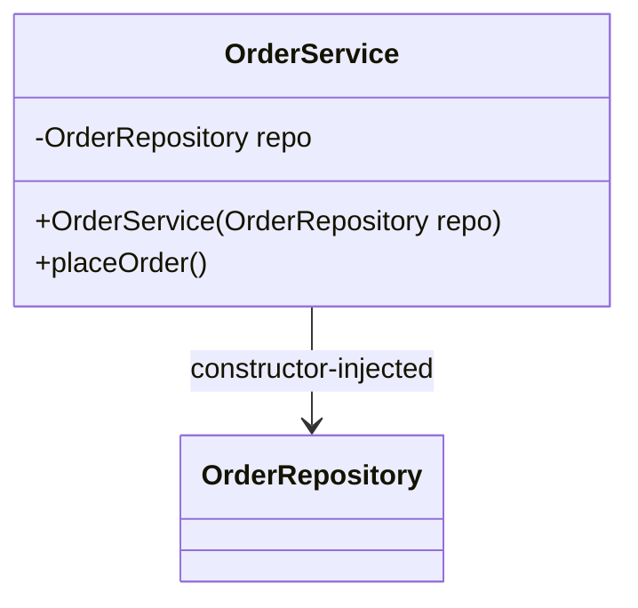

Constructor injection makes dependencies **visible and required**. Field injection hides them and blocks `final`.

### Check yourself (Part II)

1. Why does Spring create a proxy for `@Transactional` services?
2. What happens if `OrderService` calls `this.save()` internally?
3. Why is constructor injection preferred for required dependencies?
4. What is wrong with injecting a request-scoped bean into a singleton without a proxy?

If any answer is shaky, re-read the diagrams above before the atlas.

**Docs hub:** [Spring Core](https://docs.spring.io/spring-framework/reference/core.html) · [Beans](https://docs.spring.io/spring-framework/reference/core/beans.html) · [AOP](https://docs.spring.io/spring-framework/reference/core/aop.html) · [Transactions](https://docs.spring.io/spring-framework/reference/data-access/transaction.html)


### ApplicationContext.refresh() — what actually happens

```
1. Load bean definitions (@ComponentScan, @Bean, auto-config imports)
2. BeanFactoryPostProcessors run (modify definitions)
3. Instantiate singletons (unless @Lazy)
4. Inject dependencies
5. BeanPostProcessors (this is where AOP proxies are often created)
6. @PostConstruct / InitializingBean
7. Context ready → runners → embedded server start
```

When a bean is "missing", ask: **Was it scanned? Was a `@Conditional` false? Was it `@Lazy`? Wrong package?**

### Circular dependencies

Constructor injection **fails fast** on cycles (good). Setter/`@Lazy` can mask cycles (usually a design smell — extract a third type).

### Proxy kinds

| Proxy | Shape | Used when |
|-------|-------|-----------|
| JDK dynamic | Implements interfaces | Bean exposes interface |
| CGLIB | Subclasses concrete class | No interface / class proxy mode |

Self-invocation (`this.x()`) always bypasses both.


## Topic Atlas — Module 1 — Core Spring Framework

Every syllabus topic for this chapter. Read the lesson above first; use this atlas to drill and dive into docs.

### Framework fundamentals

#### Library vs Framework

A library is code you call from your application—you control the flow and decide when to invoke its APIs. A framework inverts that control: it calls your code at well-defined extension points according to its own lifecycle and conventions. Spring Framework is a framework because it owns application startup, bean creation, and request dispatch while your classes plug in as components, controllers, and services. Understanding this inversion explains why you annotate classes and configure beans instead of writing a main() that wires everything manually. In real Spring Boot projects you rarely bootstrap the container yourself; Boot's auto-configuration and starters sit on top of Spring's framework model. Interviewers often ask this to see whether you grasp IoC beyond memorizing annotations.

> **Watch out:** Calling Spring a library — it controls startup and calls your beans, not the other way around.

**Official docs:** [Library vs Framework](https://docs.spring.io/spring-boot/reference/)

#### Spring Framework

Spring Framework is the core open-source Java platform for building enterprise applications with IoC, DI, AOP, data access, and MVC modules. It predates Spring Boot and provides the ApplicationContext, bean factory, and annotation-driven configuration that Boot builds upon. You interact with it daily through @Component, @Autowired, @Transactional, and the underlying bean lifecycle even when Boot hides much of the wiring. Spring Framework 6.x aligns with Jakarta EE namespaces and requires Java 17+, matching Spring Boot 3.x requirements. Removing or bypassing Spring Framework concepts while using Boot leads to confusion when debugging context failures or custom bean registration. Treat Spring Framework knowledge as mandatory—not optional—once you move beyond trivial CRUD tutorials.

> **Watch out:** Thinking Spring Boot replaces Spring Framework — Boot is opinionated configuration on top of it.

**Official docs:** [Spring Framework](https://docs.spring.io/spring-boot/reference/)

#### Inversion of Control (IoC)

Inversion of Control means the framework—not your application code—controls object creation, dependency wiring, and lifecycle management. Instead of new-ing collaborators inside a class, you declare what you need and the container injects it. IoC is the foundational idea behind Spring's design and why configuration moves from imperative Java to declarations, annotations, and externalized properties. It enables testability because you can substitute mocks via the container or constructor injection without changing business logic. Every @Service, @Repository, and @Autowired usage in a Boot app relies on IoC under the hood. When the context fails to start, IoC misconfiguration—missing beans, ambiguous types—is usually the root cause.

> **Watch out:** Creating dependencies with new inside @Service classes — bypasses the container and breaks testability.

**Official docs:** [Inversion of Control (IoC)](https://docs.spring.io/spring-framework/reference/core.html)

#### Dependency Injection (DI)

Dependency Injection is the mechanism Spring uses to fulfill IoC: the container supplies a bean's collaborators rather than the bean fetching them itself. Constructor injection is the recommended style because dependencies are explicit, immutable, and easy to unit-test without Spring. Setter and field injection exist but hide required dependencies and complicate testing and null-safety. DI powers layered architectures where controllers depend on services, services on repositories, and repositories on DataSource beans. Misconfigured DI surfaces as UnsatisfiedDependencyException or NoUniqueBeanDefinitionException at startup. Mastering DI patterns separates developers who can structure maintainable services from those who fight the container.

> **Watch out:** Using field @Autowired in production code — harder to test and hides required dependencies.

**Official docs:** [Dependency Injection (DI)](https://docs.spring.io/spring-framework/reference/core.html)

#### Dependency Inversion Principle (DIP)

DIP states high-level modules should depend on abstractions, not concrete implementations—both sides depend on interfaces. Spring DI makes DIP practical: you inject PaymentGateway instead of StripePaymentGateway and swap implementations via @Primary or @Qualifier. This principle drives interface-based service layers, repository abstractions, and strategy-pattern beans in well-designed codebases. Violating DIP by injecting concrete classes everywhere creates tight coupling and painful refactors when vendors or implementations change. Spring's @Autowired on interfaces resolves the implementation registered in the context. Interviewers link DIP, IoC, and DI together—know how each concept relates without conflating them.

> **Watch out:** Injecting concrete classes everywhere — defeats swapping implementations and unit testing with mocks.

**Official docs:** [Dependency Inversion Principle (DIP)](https://docs.spring.io/spring-boot/reference/)

#### Spring Container

The Spring Container is the runtime environment that creates, configures, and manages bean lifecycles according to definitions it loads from annotations, Java config, or XML. It resolves dependencies, applies post-processors, and exposes beans for lookup or injection. ApplicationContext is the rich, application-facing container interface most Boot apps use; BeanFactory is the lower-level subset. Container startup is what SpringApplication.run() triggers when your Boot app launches. Failures during container refresh—circular dependencies, missing beans—prevent the app from serving traffic. Understanding the container explains where beans live and why scope and proxy behavior matter.

> **Watch out:** Confusing the container with the JVM — it is a framework object graph manager, not the Java runtime.

**Official docs:** [Spring Container](https://docs.spring.io/spring-boot/reference/)

#### ApplicationContext

ApplicationContext extends BeanFactory with enterprise features: internationalization, event publication, resource loading, and automatic BeanPostProcessor registration. In Spring Boot, the context is an annotation-configured ApplicationContext created during startup with all auto-configured beans registered. You rarely fetch it directly except in integration tests, framework code, or legacy utilities implementing ApplicationContextAware. Most application code should depend on injected beans, not the context itself, to avoid service-locator anti-patterns. Context refresh events signal when the container is ready for CommandLineRunner and health checks. Multiple contexts can exist in complex setups but Boot defaults to a single unified context per application.

> **Watch out:** Using ApplicationContext.getBean() everywhere — service locator anti-pattern; prefer constructor injection.

**Official docs:** [ApplicationContext](https://docs.spring.io/spring-framework/reference/core.html)

#### BeanFactory

BeanFactory is the foundational Spring interface for accessing and managing bean instances with lazy-by-default semantics in classic usage. ApplicationContext adds automatic registration of post-processors, events, and message sources on top of BeanFactory capabilities. Modern annotation-driven Boot apps interact with ApplicationContext implementations, not raw BeanFactory, but the bean definition and getBean mechanics originate here. BeanFactoryPostProcessor runs at the factory level before any bean is instantiated, enabling property placeholder resolution across definitions. Knowing BeanFactory clarifies documentation and older Spring XML examples that reference factory terminology. For daily Boot development, ApplicationContext is the practical surface area.

> **Watch out:** Assuming they are identical — ApplicationContext adds events, i18n, and eager post-processor setup.

**Official docs:** [BeanFactory](https://docs.spring.io/spring-framework/reference/core.html)

#### Bean

A bean is an object instantiated, assembled, and managed by the Spring container rather than by your code with new. Beans can be services, repositories, configuration objects, DataSource adapters, or factory-produced instances registered via @Bean methods. The container controls scope, lifecycle callbacks, and dependency injection for each bean. Not every object in your app is a bean—DTOs, entities, and local value objects are typically plain Java objects outside the container. Mis-scoping a bean (singleton holding request state) causes subtle production bugs under load. Identifying what should be a bean versus a plain object is a core design skill in Spring projects.

> **Watch out:** Making every class a @Component — DTOs and entities usually should stay plain POJOs.

**Official docs:** [Bean](https://docs.spring.io/spring-boot/reference/)

#### Bean definition

A bean definition is the metadata recipe describing how to construct a bean: its class, scope, constructor arguments, property values, and init/destroy methods. Annotations like @Component and @Bean methods register definitions during component scanning and configuration parsing. BeanFactoryPostProcessor can modify definitions before instantiation—useful for placeholder replacement and custom scanning. Understanding definitions helps when debugging why a bean was not created or was overridden by another definition. Boot's auto-configuration classes register dozens of conditional bean definitions at startup. Advanced troubleshooting uses actuators or debug logs to inspect which definitions matched and loaded.

> **Watch out:** Thinking @Bean and @Component are unrelated — both register bean definitions with different origins.

**Official docs:** [Bean definition](https://docs.spring.io/spring-boot/reference/)

#### Composition root

The composition root is the single place in an application where object graphs are assembled—wiring implementations to abstractions before the rest of the code runs. In Spring Boot, @SpringBootApplication, @Configuration classes, and auto-configuration collectively serve as the composition root so business classes stay free of new operators and manual wiring. Keeping composition at the edge preserves DIP and makes the dependency graph visible in one layer. Framework code and integration adapters belong near the root; domain logic should not construct infrastructure. Violating this by instantiating clients and repositories inside services spreads wiring logic across the codebase. Clean architecture maps naturally onto Spring when the composition root stays thin and declarative.

> **Watch out:** Scattering new Client() calls in @Service classes — moves wiring out of the composition root.

**Official docs:** [Composition root](https://docs.spring.io/spring-boot/reference/)


### Creating beans

#### @Component

@Component is the generic stereotype marking a class as a Spring-managed bean discovered during component scanning. It tells the container to register an instance, resolve its dependencies, and apply lifecycle callbacks like any other bean. Specialized stereotypes (@Service, @Repository, @Controller) are technically @Component with extra semantics and tooling support. Use @Component for utility beans, adapters, or infrastructure classes that do not fit the specialized categories. Place annotated classes under the base package scanned by @SpringBootApplication or an explicit @ComponentScan. Forgetting scanning coverage is the most common reason a @Component never appears in the context.

> **Watch out:** Placing components outside the scanned base package — Spring never registers them.

**Official docs:** [@Component](https://docs.spring.io/spring-framework/reference/core.html)

#### @Service

@Service marks a class as a business-logic layer bean—a semantic @Component indicating transactional or domain service responsibilities. It carries no extra behavior over @Component but communicates intent to teammates and static analysis tools. Service beans typically sit between @RestController and @Repository layers in layered architectures. Spring does not enforce layering rules; discipline and code review maintain boundaries. Use @Service on stateless or carefully scoped stateful services injected into controllers and other services. Mixing web or persistence annotations on the same class blurs layers and complicates testing.

> **Watch out:** Putting HTTP or JPA code directly in @Service — blurs layers; keep controllers and repositories separate.

**Official docs:** [@Service](https://docs.spring.io/spring-framework/reference/core.html)

#### @Repository

@Repository stereotype marks persistence-layer beans and enables Spring's persistence exception translation into DataAccessException hierarchy. DAO and JPA repository implementations, custom JDBC helpers, and Mongo templates often carry @Repository. Exception translation saves boilerplate try/catch around database access in service code. Spring Data generates repository interfaces without @Repository on each interface, but custom impl classes still benefit from the stereotype. Repository beans should not contain business rules belonging in the service layer. Misplaced transaction boundaries on repositories instead of services cause inconsistent commit behavior.

> **Watch out:** Skipping @Repository on custom JDBC classes — lose automatic DataAccessException translation.

**Official docs:** [@Repository](https://docs.spring.io/spring-framework/reference/core.html)

#### @Controller

@Controller marks MVC controller beans handling HTTP requests and returning view names for server-side rendering with Thymeleaf or JSP. Methods map to URLs via @GetMapping, @PostMapping, and related annotations while the view resolver renders templates. In modern API-first Boot apps, @RestController is more common, but @Controller remains essential for form-based web UIs and admin panels. Controller beans should stay thin—delegating to services for business logic. Returning ModelAndView or model attributes couples web concerns to view technology. Keep validation at the boundary using @Valid on command objects.

> **Watch out:** Returning domain entities directly from @Controller — expose DTOs and control view model shape.

**Official docs:** [@Controller](https://docs.spring.io/spring-framework/reference/core.html)

#### @RestController

@RestController combines @Controller and @ResponseBody, serializing return values directly to JSON or XML via HttpMessageConverters. It is the default choice for REST APIs in Spring Boot web applications. Methods return ResponseEntity, DTOs, or primitives that Jackson maps to HTTP response bodies automatically. RestController beans should validate input, call services, and map results—not execute SQL or complex domain rules inline. Content negotiation and status codes are controlled via annotations and ResponseEntity builders. Misusing @RestController for server-rendered HTML pages fights the framework's JSON defaults.

> **Watch out:** Exposing JPA entities directly — lazy-loading and schema leaks cause serialization errors and security issues.

**Official docs:** [@RestController](https://docs.spring.io/spring-framework/reference/web/webmvc.html)

#### @Configuration

@Configuration marks a class as a source of bean definitions, typically containing @Bean methods processed by Spring's configuration class enhancement. Configuration classes replace XML for programmatic registration of third-party objects, conditional beans, and multi-step factory logic. @Configuration classes are themselves beans and can inject other beans into @Bean methods for composed setup. Prefer @Configuration over component scanning when you do not control the class being registered—DataSource builders, RestTemplate customizers, security filter chains. @Configuration proxying ensures @Bean method singleton semantics when methods call each other. Lite @Configuration without full proxy behaves differently for inter-bean method calls.

> **Watch out:** Calling @Bean methods from other @Bean methods without @Configuration proxy — may create multiple instances.

**Official docs:** [@Configuration](https://docs.spring.io/spring-framework/reference/core.html)

#### @Bean

@Bean declares a method whose return value is registered as a bean in the Spring context, with the method name defaulting to the bean name. Use it inside @Configuration classes to register library classes, builders, or objects requiring programmatic setup you cannot annotate directly. Method parameters on @Bean methods are autowired, letting the container supply dependencies during bean creation. @Bean is essential for integrating non-Spring libraries—OkHttp clients, AWS SDK v1 builders, legacy parsers. Duplicate @Bean names or conflicting types cause startup failures or ambiguous injection errors. Name beans explicitly when multiple instances of the same type coexist.

> **Watch out:** Defining the same @Bean in two @Configuration classes without @Primary — NoUniqueBeanDefinitionException at startup.

**Official docs:** [@Bean](https://docs.spring.io/spring-framework/reference/core.html)

#### XML bean configuration (legacy)

XML bean configuration defines beans in applicationContext.xml using <bean> elements with class names, properties, and constructor-arg values. It was the original Spring wiring style before JavaConfig and annotations dominated new projects. Legacy enterprise apps and Spring Integration samples still use XML; Boot supports it via @ImportResource. Understanding XML helps when maintaining brownfield systems or reading older documentation and books. New greenfield Boot services should prefer annotations and @Configuration unless XML migration cost is prohibitive. Mixing XML and annotations in one app requires clear ownership of which definitions win on conflicts.

> **Watch out:** Adding XML context in Boot without @ImportResource — beans in XML never load.

**Official docs:** [XML bean configuration (legacy)](https://docs.spring.io/spring-boot/reference/)

#### @Import

@Import pulls additional @Configuration classes or component classes into the current application context during parsing. It modularizes configuration so feature modules ship their own config class imported by the main application. @Import is cleaner than duplicating @ComponentScan base packages across microservice variants sharing library modules. Imported classes register their @Bean methods and nested imports recursively. Use @Import for library auto-configuration patterns before extracting a full starter. Forgetting to @Import a module's configuration leaves its beans undefined at runtime.

> **Watch out:** Assuming classpath presence auto-registers beans — you must @Import or scan the configuration class.

**Official docs:** [@Import](https://docs.spring.io/spring-framework/reference/core.html)

#### @ImportResource

@ImportResource loads legacy XML bean definition files into an annotation-driven Boot context. Pass locations like classpath:applicationContext.xml or file paths to merge XML-defined beans with JavaConfig. Common in gradual migrations from Spring 3/4 XML apps to Boot without rewriting every bean at once. XML beans participate in the same context as @Component and @Bean definitions, subject to ordering and override rules. Remove @ImportResource once XML is fully migrated to reduce maintenance burden. Wrong classpath locations fail silently or throw FileNotFoundException depending on settings.

> **Watch out:** Leaving duplicate bean definitions in both XML and @Configuration — ambiguous or overriding beans confuse debugging.

**Official docs:** [@ImportResource](https://docs.spring.io/spring-framework/reference/core.html)

#### FactoryBean

FactoryBean is a Spring interface where the object registered in the container is produced by getObject(), not the FactoryBean class itself. It wraps complex creation logic—MyBatis mapper factories, Feign clients, or proxy generators—behind a standard bean registration point. Callers inject the product type; Spring handles FactoryBean indirection transparently in most cases. Some integrations expose FactoryBean implementations inside starter auto-configuration. Confusion arises when developers inject FactoryBean itself instead of the produced type. Understanding FactoryBean clarifies how certain third-party Spring integrations register non-standard objects.

> **Watch out:** Injecting FactoryBean type instead of getObject() product — usually wrong type in business code.

**Official docs:** [FactoryBean](https://docs.spring.io/spring-boot/reference/)

#### @ComponentScan

@ComponentScan tells Spring which packages to scan for @Component, @Service, @Configuration, and other stereotype annotations. Without scanning, annotated classes on the classpath are invisible to the container unless registered via @Bean or XML. Configure basePackages explicitly when main class sits outside the package hierarchy containing your beans. Filters on @ComponentScan include or exclude types by annotation, assignable type, or regex for fine-grained control. Over-broad scanning slows startup and pulls unintended test or library classes into production contexts. Narrow scans improve startup time in large monorepos.

> **Watch out:** Main class in com.app but beans in com.company — default scan misses them without basePackages.

**Official docs:** [@ComponentScan](https://docs.spring.io/spring-framework/reference/core.html)

#### @SpringBootApplication

@SpringBootApplication is a composed annotation combining @Configuration, @EnableAutoConfiguration, and @ComponentScan on the main class. It is the entry-point marker Boot uses to bootstrap the application context with sensible defaults. Customizing behavior often means adding exclude on auto-configuration, scanBasePackages, or additional @Import modules on this class. Moving the main class to a subpackage without adjusting scanBasePackages breaks bean discovery silently. This annotation is the first file reviewers open to understand how an app is wired. Treat changes here as architectural decisions, not cosmetic edits.

> **Watch out:** Moving main class without updating scanBasePackages — controllers and services stop registering.

**Official docs:** [@SpringBootApplication](https://docs.spring.io/spring-boot/reference/)

#### Base package scanning

Base package scanning defaults to the package of the class carrying @SpringBootApplication and all subpackages beneath it. Spring Boot's convention places Application.java at the root package so com.example.app and com.example.app.web are all scanned automatically. Deviating from this layout requires explicit scanBasePackages or scanBasePackageClasses on @SpringBootApplication. Library JARs on the classpath are not scanned unless their packages fall under the base or are imported via @Import. Organizing code by feature under one root package avoids scan misconfiguration. This convention is one of Boot's highest-impact productivity defaults for new projects.

> **Watch out:** Controllers in a sibling package to root — e.g. com.web vs com — not scanned by default.

**Official docs:** [Base package scanning](https://docs.spring.io/spring-boot/reference/)

#### @Filter on @ComponentScan

@ComponentScan filters include or exclude candidate components using FilterType.ANNOTATION, ASSIGNABLE_TYPE, ASPECTJ, REGEX, or CUSTOM during classpath scanning. Use filters to exclude @Configuration classes from tests, register only specific stereotypes, or avoid duplicate bean registration from shared libraries. includeFilters and excludeFilters combine to precise scanning boundaries in multi-module products. Misconfigured filters cause missing beans or duplicate definitions that fail at startup. Filters apply at scan time—not runtime—so they cannot replace @Profile for environment-specific beans.

> **Watch out:** Over-aggressive excludeFilters — silently drops beans with no clear error until injection fails.

**Official docs:** [@Filter on @ComponentScan](https://docs.spring.io/spring-framework/reference/core.html)

#### Stereotype annotations

Stereotype annotations (@Component, @Service, @Repository, @Controller, @RestController) mark classes for classpath scanning and communicate architectural role. They are meta-annotated with @Component so the container treats them identically for registration purposes. Tooling and AOP pointcuts often target specific stereotypes—@Transactional on @Service, exception translation on @Repository. Consistent stereotype usage across a codebase improves readability and enables convention-based security or metrics aspects. Custom stereotype meta-annotations can encode team-specific conventions with a single composed annotation. Do not create redundant custom stereotypes without team agreement on semantics.

> **Watch out:** Inventing custom stereotypes without @Component meta — they will not be picked up by scanning.

**Official docs:** [Stereotype annotations](https://docs.spring.io/spring-boot/reference/)


### Dependency injection styles

#### Constructor injection

Constructor injection supplies dependencies through the class constructor, making required collaborators explicit and fields final. Spring resolves constructor parameters automatically when a single constructor exists—no @Autowired needed since Spring 4.3. It is the recommended style in Spring documentation because dependencies are immutable and the object is fully initialized after construction. Unit tests instantiate the class with mock constructors without starting the container. Use @Autowired on the constructor only when multiple constructors exist and you must mark the injectable one. Constructor injection fails fast at startup if a dependency is missing, surfacing configuration errors early.

> **Watch out:** Adding a no-arg constructor for frameworks that breaks single-constructor autowiring — specify @Autowired constructor explicitly.

**Official docs:** [Constructor injection](https://docs.spring.io/spring-framework/reference/core.html)

#### Setter injection

Setter injection provides dependencies through annotated or XML-defined setter methods after object construction. It allows optional dependencies and runtime reconfiguration but leaves the object in a partially initialized state until setters run. Spring calls setters after instantiating the bean, which can complicate reasoning about invariants compared to constructor injection. Use setter injection sparingly for truly optional dependencies or legacy beans you cannot refactor. @Autowired(required=false) on setters marks optional collaborators. Prefer constructor injection for required dependencies to avoid null checks in business methods.

> **Watch out:** Using setters for required deps — object usable before all setters called; prefer constructor for mandatory wiring.

**Official docs:** [Setter injection](https://docs.spring.io/spring-boot/reference/)

#### Field injection

Field injection places @Autowired directly on instance fields, letting Spring set them via reflection after construction. It is concise in tutorials but discouraged in production code because fields cannot be final and dependencies are hidden from the public API. Testing requires Spring test context or reflection hacks instead of simple constructor instantiation. Framework teams and style guides increasingly ban field injection in favor of constructor injection. Legacy codebases often contain field injection from older tutorials—refactor incrementally when touching classes. Field injection still appears in quick prototypes but should not ship to production services.

> **Watch out:** Field injection in production services — untestable without Spring context and non-final dependencies.

**Official docs:** [Field injection](https://docs.spring.io/spring-boot/reference/)

#### @Autowired

@Autowired tells Spring to resolve and inject a dependency by type from the application context. It applies to constructors, fields, setter methods, and @Bean method parameters. When multiple beans match the type, Spring throws NoUniqueBeanDefinitionException unless @Qualifier or @Primary disambiguates. Required dependencies fail startup when no match exists unless required=false on optional injection points. @Autowired is the most common injection annotation in Spring codebases though JSR-330 @Inject is an alternative. Understanding resolution order prevents mysterious wiring failures after adding a second implementation.

> **Watch out:** Two implementations of same interface without @Primary or @Qualifier — startup fails with NoUniqueBeanDefinitionException.

**Official docs:** [@Autowired](https://docs.spring.io/spring-framework/reference/core.html)

#### @Qualifier("name")

@Qualifier specifies which named bean to inject when multiple candidates share the same type. Pair it with @Autowired on constructor parameters, fields, or setters to select among implementations such as a named PaymentGateway bean. Bean names default to method names for @Bean definitions and decapitalized class names for @Component types unless overridden. Qualifiers enable strategy-pattern wiring without @Primary forcing a global default. Document qualifier strings as constants to avoid typos that fail at runtime with NoSuchBeanDefinitionException.

> **Watch out:** Typo in qualifier string — fails at startup with NoSuchBeanDefinitionException, not compile time.

**Official docs:** [@Qualifier("name")](https://docs.spring.io/spring-framework/reference/core.html)

#### @Primary

@Primary marks one bean as the default candidate when multiple beans implement the same type and no @Qualifier is specified. Use it when one implementation is the normal production choice and others are test, legacy, or feature-flag alternatives. Only one @Primary bean per injectable type should exist or Spring still cannot disambiguate. @Primary simplifies injection in the common case while @Qualifier handles exceptions explicitly. Overusing @Primary hides ambiguous wiring that should be resolved with explicit qualifiers. Review @Primary beans during refactors when adding new implementations of the same interface.

> **Watch out:** Multiple @Primary beans of same type — still ambiguous; Spring rejects or picks unpredictably.

**Official docs:** [@Primary](https://docs.spring.io/spring-framework/reference/core.html)

#### @Lazy injection

@Lazy on an injection point defers creation of the dependency until first use rather than at context startup. It breaks certain circular dependency chains and speeds startup when expensive beans are rarely needed. @Lazy can apply to @Autowired injection points or on the dependency class itself for global lazy initialization. Lazy proxies may mask startup configuration errors until the dependency is first accessed in production traffic. Do not use @Lazy as a blanket fix for circular dependencies—redesign dependencies or use ObjectProvider instead. Lazy injection changes failure timing from startup to first request, complicating ops monitoring.

> **Watch out:** @Lazy hiding config errors until first use in production — failures surface under traffic, not deploy.

**Official docs:** [@Lazy injection](https://docs.spring.io/spring-framework/reference/core.html)

#### Optional dependencies

Optional dependencies are collaborators the bean can function without—Spring injects them when present and leaves null or empty Optional when absent. Mark injection points with @Autowired(required=false), java.util.Optional<T>, or ObjectProvider<T> for optional wiring. Optional<T> wrapper makes absence explicit and avoids null pointer mistakes in modern code. Use optional dependencies for feature plugins, metrics exporters, or environment-specific integrations not present in every deployment. Do not mark truly required dependencies optional—it defers failures and produces NPEs in business logic. Document which dependencies are optional in configuration README for operators.

> **Watch out:** @Autowired(required=false) on required deps — silent null and NPE in business code later.

**Official docs:** [Optional dependencies](https://docs.spring.io/spring-boot/reference/)

#### Circular dependency

Circular dependency occurs when bean A depends on B and B depends on A, directly or through a longer cycle. Spring resolves some cycles with early singleton references or @Lazy proxies but rejects others with BeanCurrentlyInCreationException. Constructor-only cycles cannot be broken because neither bean can be constructed first. Refactor by extracting shared logic into a third bean, using events, or applying @Lazy as a temporary measure. Field injection cycles sometimes work accidentally but indicate design smells worth fixing. Production codebases should eliminate cycles rather than rely on container workarounds.

> **Watch out:** Constructor injection cycle — cannot be solved with @Lazy alone; refactor or use setter on one side.

**Official docs:** [Circular dependency](https://docs.spring.io/spring-boot/reference/)

#### JSR-330 @Inject

@Inject is the standard javax/jakarta.inject annotation for dependency injection, functionally similar to @Autowired for most Spring use cases. It lacks Spring-specific attributes like required=false, so optional injection uses Provider<T> or ObjectProvider instead. @Inject promotes portability between Spring, Guice, and CDI-style containers in library code. @Named from JSR-330 corresponds to @Qualifier for disambiguation by name. Teams standardizing on Jakarta EE annotations use @Inject in domain modules and Spring extensions at the edges. Mixing @Inject and @Autowired in one class is redundant—pick one style per module.

> **Watch out:** @Inject has no required=false — use Provider or ObjectProvider for optional deps.

**Official docs:** [JSR-330 @Inject](https://docs.spring.io/spring-boot/reference/)


### Bean lifecycle

#### Bean lifecycle callbacks

Bean lifecycle callbacks are hooks Spring invokes at defined stages: after properties are set, before destruction, and via BeanPostProcessor around initialization. They let beans acquire resources, validate configuration, and release connections cleanly. Common callbacks include @PostConstruct, @PreDestroy, InitializingBean, and DisposableBean interfaces. Ordering matters when multiple callbacks exist on the same bean—@PostConstruct runs after dependency injection completes. Misusing lifecycle hooks for heavy business logic slows startup and couples infrastructure to the container. Prefer dedicated startup runners for application-level tasks after the full context is ready.

> **Watch out:** Heavy work in @PostConstruct — slows every context refresh including tests.

**Official docs:** [Bean lifecycle callbacks](https://docs.spring.io/spring-boot/reference/)

#### @PostConstruct

@PostConstruct marks a method invoked once after dependency injection completes and before the bean is put into service. It replaces custom init-method boiler for opening files, validating config, or warming caches on a per-bean basis. The method must take no parameters and should not throw checked exceptions without handling. @PostConstruct runs before ApplicationRunner and CommandLineRunner, which execute after the entire context refreshes. Avoid calling other beans' methods that might not be fully initialized yet in complex graphs. Keep @PostConstruct idempotent and fast for test context reuse performance.

> **Watch out:** Calling injected beans in @PostConstruct that depend on you — partial initialization order bugs.

**Official docs:** [@PostConstruct](https://docs.spring.io/spring-framework/reference/core.html)

#### @PreDestroy

@PreDestroy marks a method called before the container removes the bean during shutdown or context close. Use it to release resources—closing pools, flushing buffers, unregistering listeners—that would leak if the JVM exits uncleanly. In Boot with graceful shutdown, @PreDestroy runs as part of the orderly stop sequence before the process exits. It complements try-with-resources for beans managing long-lived external connections. @PreDestroy methods must not throw exceptions that abort shutdown of other beans. Test shutdown hooks in staging to verify connections close under load balancer drain.

> **Watch out:** Assuming @PreDestroy runs on kill -9 — only on orderly context shutdown.

**Official docs:** [@PreDestroy](https://docs.spring.io/spring-framework/reference/core.html)

#### InitializingBean interface

InitializingBean is a Spring callback interface whose afterPropertiesSet() method runs after dependency injection—similar timing to @PostConstruct. It couples your class to Spring API, which is why annotation-based callbacks are preferred in application code. Framework and library code sometimes still implement InitializingBean for historical compatibility. Do not implement both InitializingBean and @PostConstruct without understanding duplicate invocation risk depending on configuration. Prefer @PostConstruct or init-method in new application beans to keep domain code framework-agnostic. InitializingBean remains fair game in custom Spring extensions and internal infrastructure.

> **Watch out:** Implementing both InitializingBean and @PostConstruct — both may run; pick one approach.

**Official docs:** [InitializingBean interface](https://docs.spring.io/spring-boot/reference/)

#### DisposableBean interface

DisposableBean defines destroy() invoked before bean removal from the container, mirroring @PreDestroy in purpose. Like InitializingBean, it ties application code to Spring interfaces—prefer @PreDestroy or destroy-method attributes for cleaner separation. Legacy Spring modules and some third-party integrations still implement DisposableBean directly. Ensure destroy logic is idempotent in case shutdown paths invoke cleanup multiple times. Resource cleanup here prevents connection leaks during hot redeploys and rolling updates. Combine with JVM shutdown hooks only when container-managed lifecycle is insufficient.

> **Watch out:** Long blocking destroy() — delays graceful shutdown timeout and Kubernetes pod termination.

**Official docs:** [DisposableBean interface](https://docs.spring.io/spring-boot/reference/)

#### init-method / destroy-method

init-method and destroy-method are bean definition attributes—XML attributes or @Bean(initMethod, destroyMethod)—naming custom methods for lifecycle without Spring interfaces or javax annotations. Useful when configuring third-party classes you cannot annotate with @PostConstruct. @Bean(initMethod = "start", destroyMethod = "stop") registers lifecycle method names on the definition. Spring invokes them at the same stages as standard callbacks after properties are set and before destruction. Method names must exist on the class and be callable without parameters. Document init/destroy method contracts when exposing library @Configuration for consumers.

> **Watch out:** Typo in initMethod name — bean starts uninitialized with no obvious error until use.

**Official docs:** [init-method / destroy-method](https://docs.spring.io/spring-boot/reference/)

#### BeanPostProcessor

BeanPostProcessor is an extension point intercepting every bean before and after initialization to modify or wrap instances. Spring's @Autowired processing, @PostConstruct discovery, and AOP proxy creation rely on BeanPostProcessor implementations internally. Custom post-processors can validate beans, attach MDC wrappers, or apply cross-cutting decoration globally. postProcessBeforeInitialization runs before init callbacks; postProcessAfterInitialization runs after. Register post-processors as beans early—they affect nearly every bean in the context. Misimplemented post-processors can break proxy chains or cause infinite recursion.

> **Watch out:** Returning null from postProcessAfterInitialization — bean disappears from context silently.

**Official docs:** [BeanPostProcessor](https://docs.spring.io/spring-boot/reference/)

#### BeanFactoryPostProcessor

BeanFactoryPostProcessor modifies bean definitions before any bean is instantiated—changing property values, registering aliases, or swapping bean classes. PropertySourcesPlaceholderConfigurer resolves ${...} placeholders in definitions at this stage. Custom factory post-processors enable advanced multi-tenant or environment-specific definition rewriting. They operate on the BeanFactory, not live bean instances, so they cannot @Autowired other beans directly in classic implementations. Order implements Ordered or @Order when multiple processors must run sequentially. Incorrect factory post-processing causes beans to wire with wrong property values before any error surfaces at runtime.

> **Watch out:** Confusing with BeanPostProcessor — FactoryPostProcessor runs before any bean exists.

**Official docs:** [BeanFactoryPostProcessor](https://docs.spring.io/spring-framework/reference/core.html)

#### Aware interfaces (ApplicationContextAware, etc.)

Aware interfaces like ApplicationContextAware, BeanNameAware, and EnvironmentAware inject framework objects into beans implementing the callback. ApplicationContextAware provides the running context; EnvironmentAware exposes property resolution. They enable framework integration code but encourage service-locator patterns in application layers if overused. Prefer constructor injection of Environment or specific beans over ApplicationContextAware in business services. Aware callbacks run during bean initialization before @PostConstruct on the same bean. Use Aware interfaces in infrastructure adapters, not domain logic.

> **Watch out:** ApplicationContextAware in @Service — service locator smell; inject specific collaborators instead.

**Official docs:** [Aware interfaces (ApplicationContextAware, etc.)](https://docs.spring.io/spring-framework/reference/core.html)

#### Eager initialization (default)

By default Spring eagerly creates singleton beans during context refresh so wiring errors appear at startup, not on first request. Eager init validates the entire object graph before accepting traffic—a desirable fail-fast behavior for production services. Prototype-scoped beans are always created on demand regardless of singleton eagerness. Large contexts with thousands of beans may see longer startup times due to eager singleton creation. Lazy-init at bean or global level trades startup speed for deferred failure detection. Most Boot apps rely on eager singletons unless profiling shows startup time problems.

> **Watch out:** Expecting prototype beans at startup — they are created only when requested or injected.

**Official docs:** [Eager initialization (default)](https://docs.spring.io/spring-boot/reference/)

#### Lazy initialization (@Lazy on class)

@Lazy on a @Component class wraps the bean in a proxy created at first access rather than during context refresh. It reduces startup time and memory when the bean is expensive or rarely used. All injection points receiving the lazy bean get the proxy, deferring real initialization uniformly. Misapplied @Lazy on critical infrastructure beans delays discovery of misconfiguration until runtime paths exercise them. Global lazy initialization via spring.main.lazy-initialization=true affects the entire context—use cautiously in production. Combine with monitoring to catch first-access failures quickly.

> **Watch out:** Global lazy-initialization=true — hides wiring errors until random code paths hit missing beans.

**Official docs:** [Lazy initialization (@Lazy on class)](https://docs.spring.io/spring-boot/reference/)

#### @Lazy on @ComponentScan

@Lazy on @ComponentScan registers all scanned beans as lazy-init definitions by default for that scan configuration. Useful in modular monoliths or test slices where large portions of the classpath are irrelevant to the current profile. Differs from class-level @Lazy by applying laziness broadly to everything the scan picks up. Startup accelerates but first-request latency increases when many lazy beans wake at once under load. Not a substitute for splitting applications or using @Profile to exclude unused modules. Document lazy scan modules so operators know delayed failure modes.

> **Watch out:** Lazy scan + Actuator health checks — health may pass while critical lazy beans never tested until traffic.

**Official docs:** [@Lazy on @ComponentScan](https://docs.spring.io/spring-framework/reference/core.html)


### Bean scopes

#### @Scope("singleton")

Singleton scope creates one shared bean instance per Spring IoC container—the default for all @Component beans unless overridden. Every injection point receives the same instance, making singletons ideal for stateless services and shared configuration holders. Singleton beans must not store per-request or per-user mutable state without synchronization or external storage. Thread safety becomes your responsibility when singletons cache mutable data. Most beans in a typical Boot API are singletons by design. Explicit @Scope(ConfigurableBeanFactory.SCOPE_SINGLETON) documents intent when multiple scopes coexist in one class hierarchy.

> **Watch out:** Storing HttpServletRequest state in singleton @Service — race conditions under concurrent requests.

**Official docs:** [@Scope("singleton")](https://docs.spring.io/spring-framework/reference/core.html)

#### @Scope("prototype")

Prototype scope yields a new bean instance every time the container injects or provides the bean. Spring does not manage the full lifecycle of prototype beans passed into singletons—the singleton holds a reference without calling @PreDestroy on prototypes. Use prototype for stateful objects, per-operation strategies, or beans wrapping non-thread-safe third-party classes. ObjectProvider<T> or @Lookup method injection refreshes prototype instances inside singletons correctly. Prototype beans increase allocation overhead compared to singletons—use only when instance isolation is required. Misusing prototype for stateless services wastes memory without benefit.

> **Watch out:** Injecting prototype into singleton once — same instance forever; use ObjectProvider or @Lookup.

**Official docs:** [@Scope("prototype")](https://docs.spring.io/spring-framework/reference/core.html)

#### @Scope("request")

Request scope creates one bean instance per HTTP request in web applications, destroyed when the request completes. Ideal for request-scoped context objects—user session data, tenant identifiers, or per-request audit buffers. Injecting request-scoped beans into singletons requires scoped proxies so the singleton holds a proxy resolving the current request's instance. Without proxyMode, startup fails or stale request data leaks across threads. Request scope only works in web-aware ApplicationContext environments. Non-web batch jobs cannot use request scope without simulating request context.

> **Watch out:** Request-scoped bean in singleton without proxy — ScopeNotActiveException or wrong instance.

**Official docs:** [@Scope("request")](https://docs.spring.io/spring-framework/reference/core.html)

#### @Scope("session")

Session scope maintains one bean instance per HTTP session for the lifetime of that session across multiple requests. Useful for shopping carts, wizard flows, or user-specific UI state in server-rendered applications. Like request scope, injection into singletons requires CGLIB or JDK scoped proxies. Session-scoped beans consume server memory proportional to active sessions—plan eviction and timeouts in production. Stateless REST APIs rarely need session scope; JWT or server-side session stores often replace it. Clustered deployments require session replication or sticky sessions for session-scoped state.

> **Watch out:** Session-scoped bean in stateless REST API — unnecessary memory use; prefer token or DB state.

**Official docs:** [@Scope("session")](https://docs.spring.io/spring-framework/reference/core.html)

#### @Scope("application")

Application scope stores one bean instance per ServletContext for the entire web application deployment. It behaves like a singleton visible across all sessions and requests within the same WAR deployment. Use for application-wide caches or counters shared across all users of a web app instance. In Boot executable JARs, application scope aligns closely with singleton but ties semantics to servlet lifecycle. Rare in modern microservices compared to singleton plus external cache. Understand servlet context lifecycle when using @ApplicationScope in hybrid servlet/Boot setups.

> **Watch out:** Confusing with Spring singleton — application scope is servlet-context-bound in WAR deployments.

**Official docs:** [@Scope("application")](https://docs.spring.io/spring-framework/reference/core.html)

#### @Scope("websocket")

WebSocket scope binds a bean instance to the lifecycle of a WebSocket session, distinct from HTTP session scope. One instance serves all messages within a single WebSocket connection until it closes. Requires Spring WebSocket support and appropriate context configuration in STOMP or raw WebSocket handlers. Useful for per-connection state in chat, gaming, or live dashboard backends. Misconfiguring scope causes handlers to share state across connections incorrectly. Most REST-heavy Boot apps never need websocket scope unless building real-time features.

> **Watch out:** Using session scope for WebSocket state — HTTP session and WebSocket session lifecycles differ.

**Official docs:** [@Scope("websocket")](https://docs.spring.io/spring-framework/reference/web/webmvc.html)

#### Scoped proxy problem

The scoped proxy problem arises when a longer-lived bean (singleton) injects a shorter-lived bean (request/session) directly—the singleton captures one instance forever. Spring solves this with scoped proxies that delegate each method call to the bean for the current scope context. Configure proxyMode = TARGET_CLASS (CGLIB) or INTERFACES (JDK) on @Scope or use @RequestScope meta-annotations that enable proxies by default. Without proxies, multi-threaded servers expose wrong tenant data or throw ScopeNotActiveException outside web requests. Understanding proxies explains why injected request beans look like singletons in debugger but behave correctly per request.

> **Watch out:** Injecting request bean into singleton without proxy — one instance shared across all HTTP requests.

**Official docs:** [Scoped proxy problem](https://docs.spring.io/spring-boot/reference/)

#### ObjectProvider<T>

ObjectProvider<T> is a Spring abstraction for deferred or optional bean retrieval, especially prototype instances from singletons. Call getObject() when you need a fresh instance rather than at injection time. It replaces deprecated ObjectFactory and supports stream of all matching beans for strategy discovery. ObjectProvider avoids early initialization of expensive dependencies and clarifies optional wiring without null checks. Use it when a singleton service must create a new prototype collaborator per operation. Prefer constructor injection of ObjectProvider over field lookup patterns.

> **Watch out:** Calling getObject() once in @PostConstruct — still one prototype; call per operation.

**Official docs:** [ObjectProvider<T>](https://docs.spring.io/spring-boot/reference/)

#### @Scope(proxyMode = TARGET_CLASS)

TARGET_CLASS proxy mode creates a CGLIB subclass proxy for scoped beans injected into singletons when no interfaces exist. The proxy intercepts method calls to delegate to the correct scoped instance in the current thread's context. Required for concrete classes without interfaces using custom @Scope on request or session beans. CGLIB proxies prevent final classes and methods from being proxied correctly. Debugging shows a proxy subclass rather than your original class name. TARGET_CLASS is the default for @RequestScope and @SessionScope meta-annotations in web stacks.

> **Watch out:** Final class with request scope — CGLIB cannot subclass; use interfaces or remove final.

**Official docs:** [@Scope(proxyMode = TARGET_CLASS)](https://docs.spring.io/spring-framework/reference/core.html)

#### @Scope(proxyMode = INTERFACES)

INTERFACES proxy mode creates JDK dynamic proxies based on the bean's interfaces for scoped injection into singletons. The bean must implement at least one interface for this mode to work. Preferred when your scoped bean already exposes an interface-based API—cleaner than CGLIB subclassing. Method calls on the injected interface proxy route to the active scope instance. Fails if you inject the concrete class type instead of the interface. Choose INTERFACES when designing request-scoped services behind explicit interfaces.

> **Watch out:** Injecting concrete class while using INTERFACES proxy — injection or cast failures.

**Official docs:** [@Scope(proxyMode = INTERFACES)](https://docs.spring.io/spring-framework/reference/core.html)

#### @RequestScope

@RequestScope is a composed annotation equivalent to @Scope(WebApplicationContext.SCOPE_REQUEST) with proxy registration for web contexts. It marks beans whose lifecycle matches a single HTTP request—commonly used for request context holders or per-request validators. Spring Boot web starter enables the web context required for request scope to activate. REST controllers and filters can inject @RequestScope beans when building request-aware services. Missing web starter in a batch module causes scope configuration errors at startup. Keep request-scoped beans lightweight to avoid allocation pressure per HTTP call.

> **Watch out:** Using @RequestScope in non-web batch app — context not active; use @JobScope or singleton.

**Official docs:** [@RequestScope](https://docs.spring.io/spring-framework/reference/core.html)

#### @SessionScope

@SessionScope binds beans to HTTP session lifecycle with scoped proxy defaults for safe singleton injection. Appropriate for multi-step flows storing user-specific state server-side between requests. Memory scales with concurrent sessions—size session data carefully and configure session timeout in server or Spring Session. In API-first architectures, prefer client-held tokens over @SessionScope server state. Spring Session Redis externalizes session scope for horizontal scaling in clustered setups. Session fixation and invalidation security concerns apply when storing authentication context in session-scoped beans.

> **Watch out:** Storing large objects in session-scoped beans — memory pressure and poor cluster replication.

**Official docs:** [@SessionScope](https://docs.spring.io/spring-framework/reference/core.html)

#### @ApplicationScope

@ApplicationScope maps to servlet application context scope—one instance per web application deployment shared across all users and sessions. Meta-annotation wrapping @Scope with application-level semantics and proxy support where needed. Use sparingly in Boot microservices where singleton beans plus Redis achieve similar shared state more clearly. Relevant in traditional WAR deployments with shared ServletContext attributes. Distinguish from Spring's general application context terminology to avoid conceptual confusion in interviews. Document lifecycle tied to servlet container redeploy events.

> **Watch out:** Confusing with ApplicationContext — @ApplicationScope is servlet-context scope, not the Spring container itself.

**Official docs:** [@ApplicationScope](https://docs.spring.io/spring-framework/reference/core.html)


### Configuration & properties (core)

#### application.properties

application.properties is the default flat key-value configuration file in src/main/resources loaded automatically by Spring Boot at startup. It configures datasource URLs, server ports, logging levels, feature flags, and third-party integration credentials using dot-separated keys. Boot's relaxed binding also accepts environment variables and command-line overrides mapping to the same properties. Properties files are the simplest format for teams avoiding YAML indentation pitfalls. Profile-specific files like application-dev.properties layer overrides without changing code. Never commit secrets in plain application.properties—use env vars, Vault, or Spring Cloud Config in production.

> **Watch out:** Wrong file location outside src/main/resources — Boot never loads your config.

**Official docs:** [application.properties](https://docs.spring.io/spring-boot/reference/)

#### application.yml

application.yml provides hierarchical YAML configuration alternative to .properties with nested structures for complex settings. Spring Boot loads application.yml automatically when present, with the same precedence rules as properties files. YAML suits multi-document files, lists, and nested actuator or datasource blocks readable at a glance. Indentation errors cause silent misconfiguration or parse failures at startup—use IDE YAML validation. You can mix .properties and .yml but should standardize one format per project to reduce confusion. Profile-specific application-dev.yml is common for local developer overrides.

> **Watch out:** Tabs or bad indentation in YAML — parser fails or maps keys to wrong nesting.

**Official docs:** [application.yml](https://docs.spring.io/spring-boot/reference/)

#### @Value("${property}")

@Value injects individual property values from Environment into fields, constructor parameters, or @Bean methods using ${key} placeholders. It supports default values with ${key:default} syntax and SpEL expressions when combined with #{...}. Simple and fine for one-off flags but scatters magic strings across classes compared to @ConfigurationProperties. Required properties missing from Environment fail at startup with IllegalArgumentException during placeholder resolution. Use @Value for single properties in @Component classes; prefer typed config classes for groups of related settings. Encrypted values require additional setup beyond raw @Value.

> **Watch out:** Typo in property key — fails at startup; no compile-time check on string keys.

**Official docs:** [@Value("${property}")](https://docs.spring.io/spring-framework/reference/core.html)

#### @Value default value syntax

Default value syntax ${property.name:defaultValue} supplies a fallback when the property is undefined in any PropertySource. Colons inside default values require escaping or SpEL alternatives when ambiguous with nested colons. Defaults prevent startup failure for optional toggles but can hide missing production configuration if defaults are unsafe for prod. Document which properties require explicit operator configuration versus sensible defaults. Empty string defaults ${key:} are valid for optional text fields. Review defaults during security audits— insecure defaults in prod are a common misconfiguration.

> **Watch out:** Using dev-safe default in prod — app starts but connects to wrong database or disables security.

**Official docs:** [@Value default value syntax](https://docs.spring.io/spring-framework/reference/core.html)

#### @PropertySource

@PropertySource loads additional property files beyond Boot's default application.properties into the Environment. Use it for domain-specific bundles—billing.properties, feature-flags.properties—in modular libraries or @Configuration classes. @PropertySource on @Configuration classes makes extra files available to @Value and @ConfigurationProperties in that module. Boot's config import and spring.config.import replace many @PropertySource patterns in Boot 2.4+. Missing files fail by default unless ignoreResourceNotFound=true. PropertySource order affects override behavior when keys collide.

> **Watch out:** @PropertySource file not on classpath — startup error unless ignoreResourceNotFound set.

**Official docs:** [@PropertySource](https://docs.spring.io/spring-framework/reference/core.html)

#### @ConfigurationProperties

@ConfigurationProperties binds a prefix of properties to a typed Java class with fields matching relaxed binding conventions. It groups related config—app.datasource.*, app.security.*—into one validated object instead of dozens of @Value fields. Enable via @EnableConfigurationProperties or @ConfigurationPropertiesScan on the config class or application. IDE metadata generation from spring-boot-configuration-processor improves autocomplete in application.yml. Immutability via constructor binding is supported in modern Boot for safer config objects. @ConfigurationProperties is the standard pattern for library starters exposing tunable behavior.

> **Watch out:** Missing @EnableConfigurationProperties — bean never registered and properties stay unbound.

**Official docs:** [@ConfigurationProperties](https://docs.spring.io/spring-boot/reference/)

#### @EnableConfigurationProperties

@EnableConfigurationProperties registers specified @ConfigurationProperties classes as beans in the context without @Component on the properties class itself. Pass MyProperties.class to enable binding and injection of that typed config object. Boot auto-configuration often uses this to register library property classes when a starter is on the classpath. Keeps properties classes free of @Component so they remain pure configuration POJOs. Multiple property classes can be listed in one annotation. Forgetting registration leaves @ConfigurationProperties class unbound despite correct YAML entries.

> **Watch out:** Properties class not listed and not scanned — YAML values ignored silently.

**Official docs:** [@EnableConfigurationProperties](https://docs.spring.io/spring-framework/reference/core.html)

#### Relaxed binding

Relaxed binding maps environment variables, system properties, and YAML keys to @ConfigurationProperties field names flexibly. APP_DATASOURCE_URL, app.datasource.url, and app.datasource-url bind to the same field per Boot rules. It enables twelve-factor deployment where Kubernetes env vars override file-based config without code changes. Kebab-case in YAML maps to camelCase Java fields automatically. Understanding relaxed binding explains why a property appears bound despite different naming in deployment manifests. Edge cases exist for acronym fields—consult Boot docs for app.my-url vs app.myUrl.

> **Watch out:** Wrong env var name — APP_DATASOURCE-URL vs APP_DATASOURCE_URL breaks binding silently.

**Official docs:** [Relaxed binding](https://docs.spring.io/spring-boot/reference/)

#### @Validated on config class

@Validated on a @ConfigurationProperties class enables JSR-303/380 bean validation on config field constraints like @NotNull, @Min, @Pattern. Invalid configuration fails at startup with bind exception instead of causing runtime NPEs or misbehavior. Pair with @Validated on the properties class and constraint annotations on fields or constructor parameters. Validation groups support profile-specific rules when needed. Custom validators ensure cross-field consistency—port ranges, URL schemes, mutual exclusivity flags. Production readiness checks should treat config validation errors as deploy blockers.

> **Watch out:** Validation annotations without @Validated — constraints never enforced at bind time.

**Official docs:** [@Validated on config class](https://jakarta.ee/specifications/bean-validation/3.0/jakarta-bean-validation-spec-3.0.html)

#### Environment abstraction

Environment is Spring's unified abstraction over all PropertySources—files, env vars, system properties, command line, and cloud config servers. Inject Environment when you need programmatic property lookup, active profile checks, or conditional resolution in @Configuration classes. environment.getProperty and getActiveProfiles support conditional logic without @Value on every field. Environment exposes property precedence so you know which source wins for a given key. Abstracting config access simplifies testing with @TestPropertySource or DynamicPropertySource. Application code should rarely depend on Environment directly—prefer @ConfigurationProperties for structured access.

> **Watch out:** Hardcoding profile checks with string literals — use @Profile or @ConditionalOnProperty instead.

**Official docs:** [Environment abstraction](https://docs.spring.io/spring-boot/reference/)

#### Property precedence / order

Property precedence defines which PropertySource wins when the same key appears in multiple places—command line beats env vars, which beat application.properties, with profile-specific files layered in between. Spring Boot documents a strict order so operators predict override behavior in Kubernetes and CI. Later sources override earlier ones in the composite Environment for conflicting keys. Misunderstanding order causes 'I set the env var but nothing changed' incidents when profile files or config imports override unexpectedly. spring.config.location and spring.config.import add external files at defined precedence points. Document deployment override strategy for each environment in runbooks.

> **Watch out:** Assuming application.yml beats env vars — env and command line override file config.

**Official docs:** [Property precedence / order](https://docs.spring.io/spring-boot/reference/)

#### @Profile("dev")

@Profile conditionally registers beans or @Configuration classes only when the named profile is active in the Environment. Use dev for H2 databases, stub email senders, and debug controllers; prod for real integrations. Multiple profiles can be active simultaneously—@Profile accepts expression syntax for AND/OR in advanced cases. Beans without matching profiles are skipped entirely during context refresh, not just disabled. Profile-specific @Configuration keeps environment differences out of business logic. Avoid profile-specific code scattered without structure—centralize in config packages.

> **Watch out:** Forgetting to activate profile — @Profile("prod") beans missing and app fails wiring.

**Official docs:** [@Profile("dev")](https://docs.spring.io/spring-boot/reference/)

#### spring.profiles.active=dev

spring.profiles.active sets which Spring profiles are active at startup via application.properties, YAML, env var SPRING_PROFILES_ACTIVE, or command line. It activates profile-specific property files, @Profile beans, and conditional configuration blocks together. Multiple profiles use comma separation: dev,local,debug. Default profile activation in committed config should be safe—never prod secrets in default profile. CI and production inject profiles through environment rather than baking into JARs. Changing active profile without updating dependent config causes partial context loading failures.

> **Watch out:** Setting prod profile in committed application.properties — dangerous defaults shipped to all environments.

**Official docs:** [spring.profiles.active=dev](https://docs.spring.io/spring-boot/reference/)

#### Profile-specific YAML (application-dev.yml)

Profile-specific files like application-dev.yml load when their profile is active, overriding keys from the base application.yml. Naming convention application-{profile}.yml integrates seamlessly with Boot's config loading without extra imports. Teams store local database URLs, disabled security, and verbose logging in dev profiles kept out of prod bundles. Profile files merge with base config rather than replacing entirely—only defined keys override. Use spring.config.activate.on-profile in multi-document YAML for single-file profile sections. Keep prod profile files minimal and managed by deployment pipelines.

> **Watch out:** Profile file not matching active profile name — overrides never apply; typo in profile name.

**Official docs:** [Profile-specific YAML (application-dev.yml)](https://docs.spring.io/spring-boot/reference/)

#### Spring Expression Language (SpEL)

SpEL is Spring's expression language for evaluating dynamic values at runtime in @Value, @Conditional, security annotations, and XML config. Expressions like #{systemProperties['user.home']} or #{@beanName.method()} resolve beans and environment data programmatically. SpEL enables conditional wiring without Java code when placeholders alone are insufficient. Overuse in annotations obscures configuration and complicates static analysis. Prefer @ConfigurationProperties or explicit @Bean methods when expressions grow complex. SpEL errors surface at context refresh with expression parse or evaluation exceptions.

> **Watch out:** Complex SpEL in @Value — hard to test and debug; move logic to @Configuration @Bean methods.

**Official docs:** [Spring Expression Language (SpEL)](https://docs.spring.io/spring-boot/reference/)

#### @ConditionalOnProperty

Spring Boot's @ConditionalOnProperty registers beans only when specified configuration keys match expected values or exist at all. It drives feature toggles—enable.kafka=true activates Kafka listeners; missing property skips optional integrations. prefix and name attributes map to relaxed binding keys in Environment. havingValue defaults to true for boolean flags when only name is specified. Use on @Configuration classes in custom starters to auto-enable modules conditionally. Wrong property names silently skip bean registration, causing missing bean errors later rather than at condition evaluation logs.

> **Watch out:** Property name mismatch — bean never loads; enable debug logging for condition report.

**Official docs:** [@ConditionalOnProperty](https://docs.spring.io/spring-boot/reference/)


### AOP & proxies

#### Aspect-Oriented Programming (AOP)

AOP modularizes cross-cutting concerns—logging, security, transactions, metrics—into aspects separate from business logic. Instead of duplicating try/finally logging in every service method, one aspect advises all matching join points consistently. Spring AOP implements a subset of full AspectJ focused on Spring bean method interception via proxies. AOP keeps domain code clean and enforces policies uniformly across layers. Over-aspecting obscures control flow and makes debugging harder when advisors stack deeply. Use AOP for infrastructure concerns, not core business rules that belong in explicit service code.

> **Watch out:** Putting business rules in aspects — hidden logic hard to test and reason about.

**Official docs:** [Aspect-Oriented Programming (AOP)](https://docs.spring.io/spring-framework/reference/core.html)

#### Spring AOP

Spring AOP applies advice to Spring-managed beans through runtime proxies, not compile-time AspectJ weaving by default. It supports @Before, @After, @Around, @AfterReturning, and @AfterThrowing advice on method execution join points. Proxies wrap beans at container startup via BeanPostProcessor infrastructure. Spring AOP only advises public methods on Spring beans—self-invocation bypasses the proxy. Enable with @EnableAspectJAutoProxy or rely on Boot auto-configuration when spring-boot-starter-aop is present. Understanding Spring AOP limits prevents expecting aspects on private methods or non-Spring objects.

> **Watch out:** Expecting AOP on private methods or non-Spring objects — only public Spring bean methods are advised.

**Official docs:** [Spring AOP](https://docs.spring.io/spring-framework/reference/core.html)

#### JDK Dynamic Proxy

JDK dynamic proxies implement advice by generating a runtime proxy class implementing the target bean's interfaces. Spring uses JDK proxies when the advised bean implements at least one interface and proxyTargetClass is false. Method calls on the proxy delegate to interceptors before reaching the target object. Limitation: beans without interfaces cannot use JDK proxies—they require CGLIB. Debugging shows jdk.proxy.$Proxy123 instead of your implementation class. Design service layers with interfaces when you want JDK proxies and cleaner testing against interfaces.

> **Watch out:** No interface on service — Spring falls back to CGLIB or skips interface-based proxy expectations.

**Official docs:** [JDK Dynamic Proxy](https://docs.oracle.com/en/java/javase/21/docs/api/index.html)

#### CGLIB proxy

CGLIB creates subclasses of concrete classes at runtime to intercept method calls for AOP and scoped beans. Spring uses CGLIB when no interfaces exist or when proxyTargetClass=true forces subclass proxies. Final classes and methods cannot be subclassed—CGLIB fails or skips those methods. CGLIB proxies require a no-arg constructor accessible to the subclass machinery in some scenarios. You may see EnhancedBySpringCGLIB in stack traces during debugging. Prefer interfaces where possible to avoid CGLIB limitations on final methods and constructor requirements.

> **Watch out:** Final class or final advise method — CGLIB cannot subclass; advice never applies.

**Official docs:** [CGLIB proxy](https://docs.spring.io/spring-framework/reference/core.html)

#### @Aspect

@Aspect marks a class as an aspect containing pointcuts and advice methods processed by Spring AOP. Combine with @Component or @Configuration so the aspect registers as a bean in the context. Aspect classes should remain thin—delegate heavy logic to injected services. Order multiple aspects with @Order when advice execution sequence matters for transactions and security. Aspects are singleton beans by default—do not store request state in aspect fields without scoped dependencies. Unit test advice logic by invoking advised methods through the Spring proxy in integration tests.

> **Watch out:** @Aspect without @Component — aspect never registered and advice silently skipped.

**Official docs:** [@Aspect](https://docs.spring.io/spring-framework/reference/core.html)

#### @Before / @After / @Around advice

@Before runs before the join point; @After (finally) runs after regardless of outcome; @Around wraps the join point and can proceed or short-circuit. @Around is the most powerful—it controls whether proceed() runs and can modify return values or exceptions. Choose the narrowest advice type—use @Before for validation, @Around for timing and retry, @AfterReturning for result logging. Advice methods receive join point context via parameters like JoinPoint or ProceedingJoinPoint. Incorrect @Around that forgets proceed() blocks the original method entirely.

> **Watch out:** @Around without proceed() — original method never runs.

**Official docs:** [@Before / @After / @Around advice](https://docs.spring.io/spring-framework/reference/core.html)

#### Pointcut

A pointcut expression selects which join points advice applies to—by execution, within, annotation, or bean name patterns. Common pattern execution(* com.example.service.*.*(..)) advises all service layer methods. Reuse pointcuts via @Pointcut method references to keep aspect classes DRY. Overly broad pointcuts accidentally advise getters, toString, or repository methods causing performance and recursion issues. Test pointcuts against representative methods when introducing new packages. AspectJ expression syntax errors fail at context startup with parse exceptions.

> **Watch out:** Pointcut too broad — advises getters/setters and causes infinite recursion or noise.

**Official docs:** [Pointcut](https://docs.spring.io/spring-boot/reference/)

#### Join point

A join point is a point in program execution where aspect advice can attach—method execution, constructor call, field access in full AspectJ. Spring AOP supports only method execution join points on Spring beans in typical usage. The join point context exposes target object, method signature, and arguments to advice code. Understanding join points clarifies what Spring can and cannot intercept in your architecture. Field and constructor join points require AspectJ weaving mode, not default Spring AOP proxies. Design cross-cutting hooks around public service methods for compatibility.

> **Watch out:** Expecting field-level advice with default Spring AOP — only method execution is supported.

**Official docs:** [Join point](https://docs.spring.io/spring-boot/reference/)

#### @Transactional proxy mechanism

@Transactional works via Spring AOP proxies that begin, commit, or rollback transactions around advised method boundaries. The proxy—not the raw object—intercepts calls and delegates to PlatformTransactionManager. Transaction boundaries apply only to public methods on proxied beans called from outside the class. Internal self-invocation skips the proxy and ignores @Transactional on the called method. Rollback rules depend on exception type—checked exceptions do not rollback by default unless configured. Understanding proxy mechanics explains most @Transactional 'not working' production bugs.

> **Watch out:** @Transactional on private method or self-call — proxy never intercepts; no transaction started.

**Official docs:** [@Transactional proxy mechanism](https://docs.spring.io/spring-framework/reference/data-access/transaction.html)

#### Self-invocation problem

Self-invocation occurs when a bean calls its own method directly via this, bypassing the Spring AOP proxy around the object. @Transactional, @Cacheable, @Async, and security annotations on the inner call are ignored because no proxy intercepts this.method(). Fix by moving advised logic to another bean, using self-injection of the proxied interface, or AspectJ compile-time weaving. This is the most common root cause of 'transaction not rolling back' reports from developers. Code review should flag this.foo() calls inside @Service classes where foo carries transactional or caching annotations. Refactoring to a collaborator bean is the cleanest long-term fix.

> **Watch out:** this.internalMethod() from same class — @Transactional on internalMethod ignored.

**Official docs:** [Self-invocation problem](https://docs.spring.io/spring-framework/reference/core.html)

#### @EnableAspectJAutoProxy

@EnableAspectJAutoProxy activates Spring AOP proxy creation for @Aspect beans in the application context. Spring Boot auto-configures it when spring-boot-starter-aop is on the classpath—manual enablement is rarely needed in Boot apps. proxyTargetClass=true forces CGLIB for classes without interfaces. exposeProxy=true makes AopContext.currentProxy() available for advanced self-invocation workarounds. Missing @EnableAspectJAutoProxy in plain Spring (non-Boot) leaves aspects registered but inactive. Verify starter dependency before debugging why advice never fires.

> **Watch out:** Aspect present but starter-aop missing — no proxies created and advice ignored.

**Official docs:** [@EnableAspectJAutoProxy](https://docs.spring.io/spring-framework/reference/core.html)


### Spring events

#### ApplicationEvent

ApplicationEvent is the base class for application events published through Spring's event infrastructure in classic Spring applications. Custom events extend ApplicationEvent or use POJO events in Spring 4.2+ with @EventListener. Events decouple modules—OrderPlacedEvent triggers email, inventory, and analytics listeners without the order service knowing them. Synchronous delivery runs listeners in the publishing thread unless @Async is configured. Event payloads should be immutable and contain identifiers, not heavy entity graphs. Overusing events for core synchronous flows obscures call chains compared to explicit service calls.

> **Watch out:** Publishing events with mutable shared state — listeners see inconsistent data under concurrency.

**Official docs:** [ApplicationEvent](https://docs.spring.io/spring-boot/reference/)

#### @EventListener

@EventListener marks methods on Spring beans that handle specific event types when published to the application context. The listener method can accept the event type, optional Event headers, or related types for polymorphic handling. Register listeners as regular @Component beans—no interface implementation required unlike classic ApplicationListener. condition SpEL attribute filters events dynamically without separate listener classes. Order listeners with @Order when sequence matters—audit before notification. Exceptions in one listener can abort others in synchronous mode unless configured otherwise.

> **Watch out:** Heavy work in synchronous @EventListener — blocks publisher thread and HTTP response.

**Official docs:** [@EventListener](https://docs.spring.io/spring-framework/reference/core.html)

#### @Async + events

@Async on @EventListener methods dispatches handling to the task executor pool, decoupling publisher latency from listener work. Requires @EnableAsync and a configured TaskExecutor bean in the context. Async listeners improve HTTP response time when reactions—email, webhooks—need not complete before returning. Failure handling shifts to async error handlers; exceptions do not propagate to the publisher. Transaction boundaries do not span async boundaries unless explicitly propagated with specialized setup. Monitor async pool saturation when many events fire under peak load.

> **Watch out:** @Async without @EnableAsync — listener still runs synchronously silently.

**Official docs:** [@Async + events](https://docs.spring.io/spring-framework/reference/core.html)

#### ApplicationEventPublisher

ApplicationEventPublisher is the interface for publishing events to the Spring application context's listener infrastructure. Inject it into services to emit domain events without coupling to specific listener implementations. ApplicationContext extends ApplicationEventPublisher; autowired publisher is the standard emission point. Publishing after transaction commit often requires @TransactionalEventListener to avoid listeners reading uncommitted data. Test publishers by asserting listener side effects or capturing events in @TestConfiguration. Avoid publishing events in tight loops without batching when listeners are expensive.

> **Watch out:** Publishing before transaction commit — listeners read uncommitted data; use @TransactionalEventListener.

**Official docs:** [ApplicationEventPublisher](https://docs.spring.io/spring-boot/reference/)

#### Observer pattern in Spring

Spring's event system implements the Observer pattern: subjects publish events and observers (listeners) react without direct coupling. It replaces brittle lists of callback registrations with container-managed discovery of @EventListener methods. Modular monoliths use events to break compile-time dependencies between feature packages sharing one deployment unit. Contrast with message brokers when you need durability, cross-service delivery, or replay—events are in-memory and local to the JVM by default. Choose Spring events for intra-application decoupling; choose Kafka or RabbitMQ for inter-service communication.

> **Watch out:** Using Spring events across microservices — they do not cross JVM boundaries; use messaging instead.

**Official docs:** [Observer pattern in Spring](https://docs.spring.io/spring-boot/reference/)


### Startup hooks

#### CommandLineRunner

CommandLineRunner beans run after the Spring context is fully loaded, receiving raw command-line args as a String array. Use for one-time startup tasks—cache warming, schema validation, batch kickoff—that need the complete bean graph ready. Multiple runners execute in @Order or Ordered order when sequencing matters. Return quickly from run() or offload long work to async executors to avoid delaying readiness probes. CommandLineRunner suits CLI-oriented Boot apps and ops scripts packaged as Boot jars. Distinguish from ApplicationRunner when you want typed Option objects instead of raw strings.

> **Watch out:** Long blocking work in run() — delays readiness probe and Kubernetes marks pod not ready.

**Official docs:** [CommandLineRunner](https://docs.spring.io/spring-boot/reference/)

#### ApplicationRunner

ApplicationRunner is like CommandLineRunner but receives ApplicationArguments with parsed option names and values from Spring Boot's argument parsing. Prefer it when distinguishing --flag=value style options from positional args programmatically. Runs after context refresh alongside CommandLineRunner beans with shared ordering semantics. Useful for feature toggles activated via command line in deployed containers without changing properties files. Keep runner logic idempotent when DevTools restarts context frequently during development. Extract heavy initialization into dedicated services the runner invokes.

> **Watch out:** Duplicating logic in both runner types — pick one based on whether you need ApplicationArguments.

**Official docs:** [ApplicationRunner](https://docs.spring.io/spring-boot/reference/)

#### @PostConstruct vs ApplicationRunner

@PostConstruct runs during individual bean initialization before the entire context finishes refreshing; ApplicationRunner runs after all beans are ready. Use @PostConstruct for bean-local setup—opening connections owned by that bean. Use ApplicationRunner for application-wide tasks needing other beans fully initialized and ready. Runners see a complete context including lazy beans that @PostConstruct on other beans may not have triggered yet depending on order. Migration from @PostConstruct startup hacks to ApplicationRunner fixes subtle ordering bugs in large apps. Do not perform cross-bean orchestration in @PostConstruct.

> **Watch out:** Cross-bean calls in @PostConstruct — other beans may not be fully initialized yet.

**Official docs:** [@PostConstruct vs ApplicationRunner](https://docs.spring.io/spring-framework/reference/core.html)

#### ApplicationListener<ContextRefreshedEvent>

ContextRefreshedEvent fires when the ApplicationContext completes initialization or refresh, including after DevTools restarts. ApplicationListener implementations or @EventListener methods on this event run startup logic tied to context lifecycle rather than CLI args. Useful for registering metrics, validating global invariants, or starting embedded schedulers after all beans exist. Can fire twice in parent/child context hierarchies—guard one-time logic with atomic flags or @Order. Prefer ApplicationRunner for most Boot startup tasks unless you need event semantics for library integration.

> **Watch out:** Listener runs twice with parent/child contexts — duplicate startup side effects without guard.

**Official docs:** [ApplicationListener<ContextRefreshedEvent>](https://docs.spring.io/spring-boot/reference/)

#### SmartLifecycle

SmartLifecycle extends lifecycle control with autoStartup, phase ordering, and stop callbacks for beans managing long-running resources. Implement it for embedded servers, connection pools, or consumers needing ordered startup and shutdown relative to other lifecycle beans. phase determines start order—lower starts first, stop reverses order. SmartLifecycle integrates with context refresh and graceful shutdown hooks in Boot. Higher-level abstractions like @Scheduled or message listener containers often implement lifecycle internally. Use directly when building custom infrastructure beans with explicit start/stop semantics.

> **Watch out:** Wrong phase value — bean starts before dependencies ready or stops after resources already closed.

**Official docs:** [SmartLifecycle](https://docs.spring.io/spring-boot/reference/)


*Atlas entries in this part: 99*

---

# Part III


## Module 2 — Spring Boot Fundamentals


> **Learning goal:** demystify Boot — starters, auto-configuration, external config, profiles, and DevTools.

## What Boot adds on top of Spring

Spring Framework already had IoC and MVC. Boot adds:

1. **Starters** — curated dependency sets
2. **Auto-configuration** — beans appear when classpath + properties say so
3. **Embedded server** — Tomcat/Jetty/Undertow inside your JAR
4. **Production features** — Actuator, externalized config, graceful shutdown

### Diagram · `@SpringBootApplication` is three annotations

```
@SpringBootApplication
        │
        ├── @SpringBootConfiguration (@Configuration)
        ├── @EnableAutoConfiguration
        └── @ComponentScan  (this package + below)
```

### Diagram · Auto-configuration decision

```
Classpath has DataSource driver?
        │
        ▼
@ConditionalOnClass ──no──► skip DataSourceAutoConfiguration
        │ yes
        ▼
User defined DataSource @Bean?
        │
@ConditionalOnMissingBean
        │ no user bean
        ▼
Create Boot's DataSource (HikariCP, etc.)
```

**Rule:** your `@Bean` wins. Auto-config is a polite default, not a prison.

### Configuration precedence (simplified)

```
command-line args
  > OS env vars
    > profile-specific application-{profile}.yml
      > application.yml
        > @PropertySource
```

Prefer **`@ConfigurationProperties`** for groups of settings. Prefer **`@Value`** only for one-offs.

### Profiles

`spring.profiles.active=dev` loads `application-dev.yml` and `@Profile("dev")` beans. Use profiles for env differences — not random `if (prod)` in business code.


### Mermaid · Profile activation

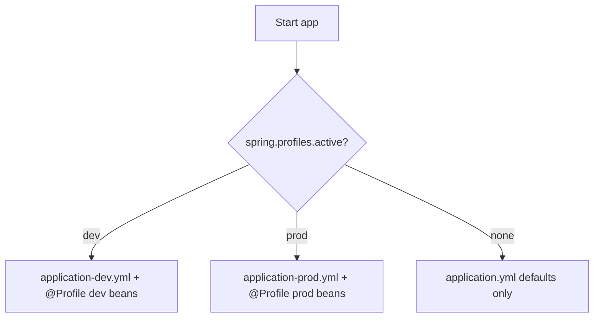

### Check yourself (Part III)

1. Name the three annotations inside `@SpringBootApplication`.
2. What does `@ConditionalOnMissingBean` protect against?
3. When should you prefer `@ConfigurationProperties` over many `@Value` fields?

**Docs hub:** [Spring Boot Reference](https://docs.spring.io/spring-boot/reference/) · [Auto-configuration](https://docs.spring.io/spring-boot/reference/features/developing-auto-configuration.html) · [External Config](https://docs.spring.io/spring-boot/reference/features/external-config.html)


### Reading the CONDITIONS EVALUATION REPORT

Run with `--debug` (or configure debug logging for conditions). You will see:

- **Positive matches** — auto-config that applied
- **Negative matches** — skipped, with the failing `@Conditional*`

This report is how you debug "why didn't Boot create my DataSource?" without guessing.

### DevTools reality check

DevTools restarts on classpath changes and disables itself in production packaging by default. It is not a substitute for understanding hot-swap limits (especially Hibernate entity changes).


## Topic Atlas — Module 2 — Spring Boot Fundamentals

Every syllabus topic for this chapter. Read the lesson above first; use this atlas to drill and dive into docs.

### What is Spring Boot

#### Spring Boot

Spring Boot is an opinionated layer on Spring Framework that auto-configures beans, embeds servers, and ships production-ready defaults for Java applications. It eliminates XML-heavy setup and manual dependency alignment through starters and sensible defaults. SpringApplication.run() bootstraps a context with embedded Tomcat, logging, and actuator in seconds from a single main class. Boot does not replace Spring concepts—you still need IoC, DI, and MVC knowledge when things break. It is the standard way new Java backend services start in 2024+ enterprise and startup environments. Master Boot to ship features fast; master Spring Framework to debug deep context issues.

> **Watch out:** Treating Boot as separate from Spring Framework — debugging still requires core Spring knowledge.

**Official docs:** [Spring Boot](https://docs.spring.io/spring-boot/reference/)

#### Convention over configuration

Convention over configuration means Boot assumes sensible defaults—embedded Tomcat on 8080, classpath resource locations, Jackson JSON—so you write only what differs from the norm. It reduces decision fatigue and boiler config compared to plain Spring where every integration is explicit. Deviating from conventions remains possible via properties and @Configuration when requirements demand it. Conventions accelerate onboarding because experienced Spring developers predict project structure instantly. Fighting every default without reason wastes time—embrace conventions until a concrete requirement forces override. Document intentional deviations in README for operators.

> **Watch out:** Overriding every default preemptively — adds config debt before requirements exist.

**Official docs:** [Convention over configuration](https://docs.spring.io/spring-boot/reference/)

#### Embedded servlet container

Embedded servlet container runs Tomcat, Jetty, or Undertow inside the same JVM process as your Boot application—no external WAR deployment required. The server starts when SpringApplication.run() executes and stops during graceful shutdown. Embedded containers simplify Docker images, local development, and cloud-native deployment to one artifact. Switch containers via starter dependencies—spring-boot-starter-web defaults to Tomcat. Configure ports, SSL, and compression through server.* properties without touching server.xml. External Tomcat deployment remains supported but is uncommon in greenfield Boot microservices.

> **Watch out:** Expecting external Tomcat with executable JAR — JAR runs embedded server; WAR needed for external deploy.

**Official docs:** [Embedded servlet container](https://docs.spring.io/spring-boot/reference/)

#### Standalone Spring Boot application

A standalone Boot application is a self-contained process with embedded server, configuration, and dependencies packaged in one executable JAR runnable via java -jar. It includes a main method annotated @SpringBootApplication as the single entry point. Standalone apps fit container orchestration where each pod runs one JVM with one service instance. Health checks, metrics, and logging flow through Boot actuators and standard SLF4J without application server admin consoles. This model replaced traditional shared application server farms for most new Java APIs. Ops teams scale by replicating JAR containers horizontally behind load balancers.

> **Watch out:** Missing spring-boot-maven-plugin repackage — JAR is not executable standalone.

**Official docs:** [Standalone Spring Boot application](https://docs.spring.io/spring-boot/reference/)

#### Spring Boot vs Spring MVC

Spring MVC is the web framework module for controllers, dispatchers, and view resolution within Spring Framework. Spring Boot includes and auto-configures Spring MVC when spring-boot-starter-web is present—it is not a competing web framework. Boot adds embedded server, Jackson, error handling defaults, and DispatcherServlet auto-setup on top of MVC primitives. You write @RestController and @GetMapping the same way in both plain Spring and Boot. Saying 'we use Boot not MVC' in interviews signals misunderstanding—Boot projects use MVC for servlet-stack REST. WebFlux is the reactive alternative, not Boot itself.

> **Watch out:** Saying Boot replaces MVC — Boot auto-configures MVC; they work together.

**Official docs:** [Spring Boot vs Spring MVC](https://docs.spring.io/spring-framework/reference/web/webmvc.html)

#### Spring Boot vs Servlet API

The Servlet API is the low-level javax/jakarta HTTP specification—HttpServlet, filters, and servlet context—that containers implement. Spring MVC abstracts servlets with DispatcherServlet mapping requests to @Controller methods. Boot embeds a servlet container and registers DispatcherServlet automatically—you rarely write servlets directly in Boot apps. Direct servlet usage remains valid for legacy filters or container-specific hooks but bypasses MVC conventions. Understanding servlets explains filter ordering, request scope, and security filter chains beneath Spring abstractions. Prefer MVC controllers unless servlet-level control is explicitly required.

> **Watch out:** Writing raw servlets in Boot without reason — bypasses MVC, validation, and exception handling conventions.

**Official docs:** [Spring Boot vs Servlet API](https://docs.spring.io/spring-boot/reference/)

#### Spring Boot advantages

Spring Boot advantages include rapid project bootstrap via Initializr, curated starter dependencies, auto-configuration, embedded servers, production-ready actuators, and unified externalized configuration. Teams ship REST APIs in hours instead of days spent wiring DataSource, Jackson, and Tomcat manually. Starter BOM alignment reduces dependency conflict hunting across Spring ecosystem versions. DevTools, test slices, and native image support improve developer experience further. Advantages assume you accept opinionated defaults and learn override mechanisms when needed. Boot is not magic—complex distributed systems still require architecture beyond Boot basics.

> **Watch out:** Assuming Boot eliminates need for architecture — it accelerates setup, not system design.

**Official docs:** [Spring Boot advantages](https://docs.spring.io/spring-boot/reference/)


### Starters & dependencies

#### Spring Boot Starter

A Spring Boot Starter is a dependency descriptor bundling libraries and transitive dependencies needed for a feature—web, JPA, security—in one Maven coordinate. Starters follow spring-boot-starter-* naming and are curated by the Spring team for compatible versions. Adding spring-boot-starter-web pulls Spring MVC, Jackson, Tomcat, and validation without listing each JAR. Custom starters wrap internal company modules with auto-configuration for reuse across microservices. Starters are not code generators—they are POM dependency aggregates plus optional auto-config. Pick minimal starters to keep classpath lean and startup fast.

> **Watch out:** Adding every starter just in case — bloated classpath, slower startup, more CVE surface.

**Official docs:** [Spring Boot Starter](https://docs.spring.io/spring-boot/reference/)

#### spring-boot-starter-parent

spring-boot-starter-parent is a Maven parent POM providing dependency management, plugin versions, and default compiler settings aligned to a Boot release. Child projects inherit tested versions for Spring, Jackson, Tomcat, and hundreds of transitive libraries. Override individual versions in dependencyManagement only when necessary and documented. Parent also configures resource filtering and surefire defaults for Boot projects. Gradle projects use the dependency-management plugin with Boot BOM instead of this parent. Upgrading parent version is the primary path for Boot version migrations in Maven.

> **Watch out:** Overriding many versions manually — defeats BOM and reintroduces conflict hell.

**Official docs:** [spring-boot-starter-parent](https://docs.spring.io/spring-boot/reference/)

#### spring-boot-starter-web

spring-boot-starter-web brings Spring MVC, embedded Tomcat, Jackson, Hibernate Validator, and spring-webmvc for building REST and servlet-stack web applications. It is the default choice for synchronous HTTP APIs serving JSON to browsers and mobile clients. Includes DispatcherServlet auto-configuration, static resource handling, and error page conventions. Pair with spring-boot-starter-data-jpa or jdbc for typical CRUD backends. For reactive non-blocking stacks, use webflux starter instead—not both unless migrating. Missing starter means no embedded server or MVC auto-config despite having controller classes.

> **Watch out:** Controllers without starter-web — no embedded server or MVC auto-configuration.

**Official docs:** [spring-boot-starter-web](https://docs.spring.io/spring-boot/reference/)

#### spring-boot-starter-webflux

spring-boot-starter-webflux enables reactive web applications on Netty with Spring WebFlux and Project Reactor. Use for high-concurrency I/O-bound workloads with non-blocking drivers—WebClient, R2DBC, reactive Mongo. Includes Netty embedded server instead of Tomcat by default. Mixing MVC and WebFlux in one app is possible but adds complexity—pick one programming model per service typically. Blocked calls on reactive threads starve the event loop—keep chains non-blocking end to end. WebFlux suits gateway and streaming scenarios; classic MVC remains simpler for typical CRUD APIs.

> **Watch out:** Blocking JDBC or Thread.sleep on reactive threads — kills throughput; use boundedElastic or stay on MVC.

**Official docs:** [spring-boot-starter-webflux](https://docs.spring.io/spring-boot/reference/)

#### spring-boot-starter-data-jpa

spring-boot-starter-data-jpa adds Hibernate, Spring Data JPA, JDBC, and transaction management for ORM-based persistence. Auto-configures DataSource when properties present and EntityManagerFactory for @Entity classes. Enables repository interfaces extending JpaRepository with query method generation. Default H2 appears for development when no datasource URL configured in some setups—verify prod config explicitly. Lazy loading, N+1 queries, and session management remain developer responsibilities. Pair with database driver starter or explicit driver dependency for PostgreSQL, MySQL, etc.

> **Watch out:** Missing database driver dependency — JPA starts but cannot connect at runtime.

**Official docs:** [spring-boot-starter-data-jpa](https://docs.spring.io/spring-boot/reference/)

#### spring-boot-starter-data-jdbc

spring-boot-starter-data-jdbc provides Spring Data JDBC for explicit SQL mapping without Hibernate ORM overhead. Suits simple aggregate persistence where full JPA entity graphs and lazy loading are unnecessary complexity. Lighter than JPA for read-heavy microservices with straightforward table mappings. Auto-configures NamedParameterJdbcTemplate and repository infrastructure when entities are present. No persistence context or dirty checking—updates are explicit SQL operations. Choose JDBC starter when ORM magic causes more problems than it solves for your domain.

> **Watch out:** Expecting lazy loading and cascade — JDBC is explicit SQL; no ORM session cache.

**Official docs:** [spring-boot-starter-data-jdbc](https://docs.spring.io/spring-boot/reference/data/sql.html)

#### spring-boot-starter-security

spring-boot-starter-security adds Spring Security with default authentication, CSRF, and secure headers for every endpoint. Default user with generated password logs at startup in dev—override immediately for any exposed environment. Configure HttpSecurity in a SecurityFilterChain @Bean for JWT, OAuth2, or form login patterns. Security auto-configuration runs early—order custom filters carefully with @Order. Missing starter leaves endpoints completely open despite @PreAuthorize annotations doing nothing. Security is never optional for internet-facing APIs regardless of Boot defaults.

> **Watch out:** Dev default password in prod — rotate and configure real auth before exposing service.

**Official docs:** [spring-boot-starter-security](https://docs.spring.io/spring-boot/reference/)

#### spring-boot-starter-test

spring-boot-starter-test bundles JUnit 5, Mockito, AssertJ, Hamcrest, Spring Test, and MockMvc for testing Boot applications. Scope test in Maven keeps testing libraries off production classpath. @SpringBootTest loads full or sliced contexts; @WebMvcTest and @DataJpaTest provide lighter test slices. Testcontainers integrations often add separately for real database tests. Include starter-test in every Boot project from Initializr generation. Skipping tests in CI defeats the purpose of the curated test stack.

> **Watch out:** Using @SpringBootTest for every unit test — slow; use slices or plain Mockito for isolation.

**Official docs:** [spring-boot-starter-test](https://docs.spring.io/spring-boot/reference/)

#### spring-boot-starter-actuator

spring-boot-starter-actuator exposes production-ready endpoints—health, metrics, info, env—for monitoring and orchestration platforms. Kubernetes liveness and readiness probes commonly hit /actuator/health after securing sensitive endpoints. Expose only needed endpoints via management.endpoints.web.exposure.include in production. Actuator integrates with Micrometer for Prometheus, Datadog, and other backends. Default exposure is limited—opening all endpoints publicly is a security risk. Actuator is standard in every production Boot deployment for observability.

> **Watch out:** Exposing env and beans endpoints publicly — leaks secrets and internals.

**Official docs:** [spring-boot-starter-actuator](https://docs.spring.io/spring-boot/reference/)

#### spring-boot-starter-validation

spring-boot-starter-validation brings Hibernate Validator and JSR-380 support for @Valid, @NotNull, @Size on request DTOs and @ConfigurationProperties. Without it, validation annotations compile but do not enforce constraints at runtime. Controller methods need @Valid on @RequestBody parameters to trigger validation before business logic. Validation errors map to 400 responses via Boot's default exception handler when configured. Include this starter in any API accepting external input. Custom validators implement cross-field business rules on command objects.

> **Watch out:** @NotNull on DTO without starter-validation — silently no validation at runtime.

**Official docs:** [spring-boot-starter-validation](https://docs.spring.io/spring-boot/reference/)

#### spring-boot-starter-cache

spring-boot-starter-cache adds Spring's cache abstraction with support for Caffeine, Redis, EhCache providers via additional config. Enable with @EnableCaching and annotate methods @Cacheable, @CacheEvict, @CachePut. Auto-configuration detects cache provider on classpath and configures CacheManager beans. Reduces database load for read-heavy reference data and computed aggregates. Cache invalidation strategy must be designed—stale data bugs are common without TTL or eviction on writes. Pair with spring-boot-starter-data-redis for distributed cache across pod replicas.

> **Watch out:** @Cacheable on self-invoked method — proxy skipped; cache never applies.

**Official docs:** [spring-boot-starter-cache](https://docs.spring.io/spring-boot/reference/)

#### spring-boot-starter-mail

spring-boot-starter-mail configures JavaMailSender for SMTP email sending from Boot applications. Set spring.mail.host, port, and credentials in properties for transactional emails—password reset, order confirmations. Templates often combine with Thymeleaf for HTML email bodies. Use async sending or message queues for high volume to avoid blocking HTTP threads on SMTP latency. Spring Mail integrates with JavaMail API; test with GreenMail or mail sandbox in CI. Never hardcode SMTP secrets in source—use env vars or secret managers.

> **Watch out:** Blocking SMTP in request thread — slow API; queue or @Async email sends.

**Official docs:** [spring-boot-starter-mail](https://docs.spring.io/spring-boot/reference/)

#### spring-boot-starter-oauth2-client

spring-boot-starter-oauth2-client enables Boot apps to login users via OAuth2/OIDC providers—Google, Okta, Azure AD—as clients redirecting to authorization servers. Configures ClientRegistrationRepository and OAuth2AuthorizedClientManager beans from spring.security.oauth2.client properties. Use for 'Login with Google' in web apps or service-to-service delegated auth patterns. Differs from resource server starter which validates incoming tokens on APIs. PKCE and redirect URI registration with identity provider are setup prerequisites. Misconfigured redirect URIs cause opaque OAuth errors in browser flows.

> **Watch out:** Redirect URI mismatch with IdP registration — authorization fails after login redirect.

**Official docs:** [spring-boot-starter-oauth2-client](https://docs.spring.io/spring-security/reference)

#### spring-boot-starter-oauth2-resource-server

spring-boot-starter-oauth2-resource-server validates JWT or opaque access tokens on incoming API requests without handling login flows. Configure spring.security.oauth2.resourceserver.jwt.issuer-uri for OIDC discovery and automatic key rotation. Enables stateless API security scalable across microservices without server sessions. Pair with API gateways that terminate TLS and forward bearer tokens. Wrong issuer or JWK URI causes 401 on all requests with little application-level logging without debug. Standard for REST APIs behind Auth0, Keycloak, or Cognito.

> **Watch out:** Wrong issuer-uri — all requests 401; verify JWT iss claim matches configuration.

**Official docs:** [spring-boot-starter-oauth2-resource-server](https://docs.spring.io/spring-security/reference)

#### spring-boot-starter-data-redis

spring-boot-starter-data-redis auto-configures Lettuce or Jedis Redis connection factory and RedisTemplate or StringRedisTemplate beans. Use for caching, session storage, rate limiting, pub/sub, and distributed locks. Set spring.data.redis.host and password for connection in each environment. Redis cluster and SSL require additional Lettuce configuration properties. Session data in Redis enables horizontal scaling of stateful web features. Monitor memory eviction policies—cache without TTL fills Redis and evicts unpredictably.

> **Watch out:** No TTL on cache keys — Redis memory fills; set expiration in cache or Redis config.

**Official docs:** [spring-boot-starter-data-redis](https://docs.spring.io/spring-boot/reference/)

#### spring-boot-starter-amqp

spring-boot-starter-amqp integrates Spring AMQP with RabbitMQ for reliable message queuing between services. Auto-configures ConnectionFactory, RabbitTemplate, and listener container factories from spring.rabbitmq properties. Use for async work distribution, event-driven decoupling, and peak load buffering. Dead letter queues and manual acks handle failure scenarios in production messaging. Local dev runs RabbitMQ via Docker Compose alongside Boot app. Message schema evolution requires versioning strategy—consumers break on incompatible payloads without forward compatibility.

> **Watch out:** Auto-ack listeners losing messages on failure — use manual ack and DLQ patterns.

**Official docs:** [spring-boot-starter-amqp](https://docs.spring.io/spring-boot/reference/)

#### spring-boot-starter-kafka

spring-boot-starter-kafka adds Spring for Apache Kafka with KafkaTemplate and @KafkaListener support for publish-subscribe streaming. Configure bootstrap.servers and consumer group ids via spring.kafka properties. Suited for event sourcing, log aggregation, and high-throughput inter-service event buses. Idempotent consumers and offset management prevent duplicate processing bugs during restarts. Kafka differs from RabbitMQ in log-based retention and consumer group scaling model. Production requires understanding partitions, replication, and consumer lag monitoring.

> **Watch out:** Same consumer group id across dev machines — consumers steal partitions from each other.

**Official docs:** [spring-boot-starter-kafka](https://docs.spring.io/spring-boot/reference/)

#### spring-boot-starter-aop

spring-boot-starter-aop adds AspectJ weaver and Spring AOP enabling @Aspect, @Transactional proxy, and @Cacheable interception. Without it, @Transactional may not create transactional proxies in non-Boot plain Spring setups; Boot web/data starters often pull it transitively but explicit dependency guarantees AOP availability. Enables @EnableAspectJAutoProxy auto-configuration for custom aspects. Verify starter presence when transactional or caching annotations appear ignored. Lightweight dependency with high impact on proxy behavior across the context.

> **Watch out:** @Transactional not working — starter-aop missing and no proxy created.

**Official docs:** [spring-boot-starter-aop](https://docs.spring.io/spring-framework/reference/core.html)

#### Optional dependencies

Optional dependencies in Maven POMs mark artifacts consumers may not need—Boot starters use optional to avoid pulling every integration into your classpath. spring-boot-autoconfigure treats optional deps as hints for conditional auto-config without forcing them on all users. When building custom starters, mark provider-specific libs optional so apps without that tech skip unused config. Gradle uses compileOnly or features for similar semantics. Understanding optional clarifies why adding one starter does not always activate every related auto-configuration class. Explicitly add the starter you need rather than expecting transitive optional pulls.

> **Watch out:** Expecting optional transitive dep on classpath — must declare explicitly if your app needs it.

**Official docs:** [Optional dependencies](https://docs.spring.io/spring-boot/reference/)

#### Excluding auto-configurations

Exclude auto-configurations via @SpringBootApplication(exclude = {...}), spring.autoconfigure.exclude property, or @EnableAutoConfiguration exclude when defaults conflict with custom setup. Common exclusions: DataSourceAutoConfiguration when using custom multi-tenant routing, SecurityAutoConfiguration for bespoke security, RedisAutoConfiguration when Redis absent. Exclusion prevents unwanted beans from loading—duplicate DataSources, accidental security lockdown. Use auto-configuration report in debug to identify which classes to exclude surgically. Over-excluding breaks Boot magic—you must manually register excluded functionality.

> **Watch out:** Excluding too much — app missing beans you expected Boot to provide; check conditions report.

**Official docs:** [Excluding auto-configurations](https://docs.spring.io/spring-boot/reference/)


### Auto-configuration

#### @EnableAutoConfiguration

@EnableAutoConfiguration tells Spring Boot to apply auto-configuration classes that register beans based on classpath and properties. @SpringBootApplication includes it—manual use is rare in Boot apps but appears in non-Boot Spring tests or custom bootstrap. Can exclude specific classes via exclude attribute when defaults conflict with custom beans. Auto-configuration runs after user @Configuration but respects @ConditionalOnMissingBean for overrides. Disabling via spring.boot.autoconfigure.enable=false stops all auto-config—rarely desirable. Understanding this annotation links @SpringBootApplication to the magic behind DataSource and MVC setup.

> **Watch out:** Disabling auto-config globally — you must wire everything manually.

**Official docs:** [@EnableAutoConfiguration](https://docs.spring.io/spring-framework/reference/core.html)

#### Spring Boot auto-configuration

Spring Boot auto-configuration is a collection of @Configuration classes in spring-boot-autoconfigure that register beans when classpath conditions and properties match. Each integration—JPA, Redis, Security—has a conditional auto-config class activated by starters. Conditions like @ConditionalOnClass prevent loading JPA beans when Hibernate is absent. Auto-config respects user-defined @Bean methods via @ConditionalOnMissingBean. Debug logging with -Ddebug or logging.level.org.springframework.boot.autoconfigure=DEBUG shows the conditions report at startup. Auto-configuration is convention over configuration implemented as conditional Java conditionals.

> **Watch out:** Assuming starter alone creates beans — conditions must match; check debug report.

**Official docs:** [Spring Boot auto-configuration](https://docs.spring.io/spring-boot/reference/)

#### @ConditionalOnClass

@ConditionalOnClass registers beans only when specified classes are present on the classpath—typically library marker classes. DataSource auto-configuration uses it to skip JPA setup when JDBC driver classes are missing. name attribute accepts string class names to avoid ClassNotFoundException during condition evaluation itself. Custom starters use @ConditionalOnClass on integration classes to activate only when optional libraries are added. Wrong class name in condition silently prevents auto-config activation. Inspect conditions report when expected auto-config does not load.

> **Watch out:** Typo in class name — auto-config never activates with no obvious error.

**Official docs:** [@ConditionalOnClass](https://docs.spring.io/spring-boot/reference/)

#### @ConditionalOnMissingBean

@ConditionalOnMissingBean registers a default bean only when the user has not already defined a bean of that type or name. It is the escape hatch letting you override Boot defaults with your own @Bean while keeping auto-config for other integrations. Define your DataSource @Bean and Boot skips default DataSource auto-config bean creation. Multiple beans of same type without @Primary still break injection even if auto-config backs off. Order matters—user @Configuration processed alongside auto-config with missing-bean checks at registration time. Primary customization pattern for production tuning.

> **Watch out:** Defining bean with wrong type — auto-config default still loads; two beans conflict.

**Official docs:** [@ConditionalOnMissingBean](https://docs.spring.io/spring-boot/reference/)

#### @ConditionalOnProperty

Boot's @ConditionalOnProperty activates beans when configuration properties match havingValue or exist with matchIfMissing semantics. Feature flags like spring.kafka.enabled=false disable Kafka auto-config without removing the starter from POM in some setups. prefix combines with name for relaxed binding to Environment keys. Used heavily inside auto-configuration classes rather than application code. Misnamed property keys cause features to silently stay off—grep application.yml against starter documentation. Complements @Profile for finer-grained toggles than whole environment profiles.

> **Watch out:** Property default mismatch — feature off when you expected matchIfMissing true.

**Official docs:** [@ConditionalOnProperty](https://docs.spring.io/spring-boot/reference/)

#### @ConditionalOnWebApplication

@ConditionalOnWebApplication limits bean registration to servlet or reactive web application contexts. Prevents servlet-specific beans from loading in batch or CLI apps without a web stack. WEB type checks for DispatcherServlet context; REACTIVE checks for WebFlux. Misapplied when running headless tests that accidentally pull web starter transitively. Use when building library auto-config that only makes sense for HTTP services. Reduces startup noise and bean count in non-web modules of multi-module builds.

> **Watch out:** Web starter in batch module — unnecessary servlet beans load unless excluded.

**Official docs:** [@ConditionalOnWebApplication](https://docs.spring.io/spring-boot/reference/)

#### @ConditionalOnExpression

@ConditionalOnExpression evaluates SpEL against the Environment for complex activation logic combining multiple properties or beans. Enables conditions like '${feature.a:true} and ${feature.b:false}' impossible with single @ConditionalOnProperty. SpEL errors fail condition evaluation—test expressions carefully in isolation. Use sparingly in custom starters when property combinations gate features. Overly complex SpEL in conditions hurts readability—prefer multiple composed @Configuration classes. Debug logs show expression evaluation outcomes in conditions report.

> **Watch out:** SpEL typo — condition false; bean missing with little surface error.

**Official docs:** [@ConditionalOnExpression](https://docs.spring.io/spring-boot/reference/)

#### @AutoConfigureBefore / @AutoConfigureAfter

@AutoConfigureBefore and @AutoConfigureAfter order auto-configuration classes relative to each other when registration sequence matters. Security auto-config often runs before MVC to install filters early; Redis may run after cache infrastructure. Boot's auto-config imports use these to prevent bean dependency ordering failures during context refresh. Custom starter authors set ordering when depending on beans from another auto-config class. Wrong ordering causes intermittent NoSuchBeanDefinitionException during startup. Rare in application code—primarily starter and framework internals.

> **Watch out:** Custom auto-config without ordering — runs too late; required beans missing.

**Official docs:** [@AutoConfigureBefore / @AutoConfigureAfter](https://docs.spring.io/spring-framework/reference/core.html)

#### spring.autoconfigure.exclude

spring.autoconfigure.exclude property lists fully qualified auto-configuration class names to disable without code changes—useful in externalized prod config banning unused integrations. Comma-separated list in application.properties or env var SPRING_AUTOCONFIGURE_EXCLUDE. Prefer surgical exclusion over broad spring.boot.autoconfigure.enable=false. Document excluded classes so future upgrades re-evaluate whether exclusion still needed. YAML list syntax works for multiple entries cleanly. Wrong class name excludes nothing—verify in conditions report.

> **Watch out:** Wrong FQCN in exclude list — auto-config still loads; copy exact class name from report.

**Official docs:** [spring.autoconfigure.exclude](https://docs.spring.io/spring-boot/reference/)

#### Auto-configuration report

The auto-configuration report logs which auto-configuration classes matched, did not match, and were excluded at startup when debug is enabled. Run with --debug or set logging.level.org.springframework.boot.autoconfigure=DEBUG to print CONDITIONS EVALUATION REPORT. Essential troubleshooting when beans you expect from a starter never appear in the context. Shows which @Conditional failed—missing class, property, or existing user bean. Save report output when filing issues against Spring Boot or internal starters. First diagnostic step for 'starter on classpath but no DataSource' problems.

> **Watch out:** Never enabling debug — hours guessing why auto-config skipped.

**Official docs:** [Auto-configuration report](https://docs.spring.io/spring-boot/reference/)

#### @ConfigurationPropertiesScan

@ConfigurationPropertiesScan registers @ConfigurationProperties classes under specified base packages without listing each in @EnableConfigurationProperties. Boot 2.2+ feature reducing registration boiler when many property classes exist in a library. Place on @SpringBootApplication or @Configuration with basePackages pointing at config package roots. Scanned classes become beans with properties bound from Environment. Does not replace need for validation annotations on property classes. Combine with spring-boot-configuration-processor for IDE metadata generation.

> **Watch out:** Properties class outside scanned packages — properties never bind.

**Official docs:** [@ConfigurationPropertiesScan](https://docs.spring.io/spring-boot/reference/)


### Running & packaging

#### SpringApplication.run()

SpringApplication.run() bootstraps the Spring Boot application: creates ApplicationContext, applies auto-configuration, starts embedded server, and registers shutdown hooks. Static entry point called from main passing the primary @SpringBootApplication class and args. Returns ConfigurableApplicationContext for programmatic access in non-web or test scenarios. Customizes via SpringApplication builder before run—banner, listeners, additional sources. Failures during run exit with non-zero status and logged stack traces—CI should treat as deploy failure. Wrapping run in try/catch is anti-pattern unless converting to controlled exit codes.

> **Watch out:** Swallowing startup exceptions — process exits 0 in wrapper scripts masking failure.

**Official docs:** [SpringApplication.run()](https://docs.spring.io/spring-boot/reference/)

#### spring-boot-maven-plugin

spring-boot-maven-plugin repackages the Maven-built JAR into an executable fat JAR with nested dependencies and JarLauncher main class. Bind repackage goal to package phase so mvn package produces runnable artifact. Configure mainClass if multiple candidates exist in multi-module builds. build-info and layers goals support Docker layer caching and version metadata. Without repackage, target/*.jar is thin and java -jar fails with missing dependencies. Plugin version aligns with Boot parent BOM—do not drift independently.

> **Watch out:** Deploying thin JAR without repackage — ClassNotFoundException at runtime.

**Official docs:** [spring-boot-maven-plugin](https://maven.apache.org/guides/introduction/introduction-to-the-lifecycle.html)

#### spring-boot:run

spring-boot:run Maven goal compiles and launches the Boot application in place without manual java -jar—ideal for local development iteration. Uses forked JVM with project classpath and passes command-line args via -Dspring-boot.run.arguments. Faster feedback loop than package-then-run for code changes though DevTools improves further with restart. CI rarely uses run goal—prefer package and container entrypoint. Gradle equivalent is bootRun task with same purpose. JVM args and profiles pass through plugin configuration properties.

> **Watch out:** Running run goal without compiling test scope changes — confusing when tests pass but run uses stale classes.

**Official docs:** [spring-boot:run](https://docs.spring.io/spring-boot/reference/)

#### Executable JAR layout

Boot executable JAR layout splits BOOT-INF/classes (your code), BOOT-INF/lib (dependencies), and META-INF/MANIFEST.MF with Main-Class JarLauncher and Start-Class your application. JarLauncher sets up classloader reading nested JARs—distinct from flat classpath JARs. Layered JARs split dependencies for Docker COPY --from cache efficiency in cloud builds. Understanding layout helps debug 'class not found' when wrong artifact is deployed. unzip -l app.jar verifies repackage succeeded before shipping to production.

> **Watch out:** Assuming flat JAR classpath — nested JARs require Boot loader; wrong layout breaks deploy.

**Official docs:** [Executable JAR layout](https://docs.spring.io/spring-boot/reference/)

#### application.properties location

Boot loads application.properties from classpath root src/main/resources and optionally ./config/ adjacent to the JAR or working directory. Search order favors file system config/ over classpath for external overrides without rebuilding. Multiple locations merge with later sources overriding per property precedence rules. Profile-specific files sit beside base file with naming application-{profile}.properties. Misplaced files in src/main/java or wrong module resources folder cause 'properties ignored' bugs. Document expected config mount paths for Kubernetes ConfigMaps and secrets.

> **Watch out:** Config file in wrong module resources — multi-module project loads unexpected file.

**Official docs:** [application.properties location](https://docs.spring.io/spring-boot/reference/)

#### External config location

External config location loads settings from filesystem paths outside the JAR via spring.config.location or spring.config.additional-location. Operators mount production secrets and environment-specific YAML without rebaking images. spring.config.import supports optional and required file URLs in Boot 2.4+ including cloud config servers. Paths can be file:, classpath:, or optional:file: prefixes for fail-soft loading. CI injects locations through env vars for reproducible deploys. Verify file permissions and mount paths in Kubernetes—missing mounts cause startup failure on required imports.

> **Watch out:** Wrong mount path in K8s — app starts with defaults and connects to wrong DB.

**Official docs:** [External config location](https://docs.spring.io/spring-boot/reference/)

#### spring.config.import

spring.config.import pulls additional configuration from files, optional classpath entries, or config servers as part of Boot's config data API. Supports optional: prefix so missing dev files do not crash startup. Replaces legacy bootstrap context patterns from Spring Cloud Config in many setups. List multiple imports comma-separated in application.properties or as YAML list. Import order participates in property precedence—later imports override earlier for same keys. Use for splitting large config across team-owned files or importing vault-backed secrets.

> **Watch out:** Required import of missing file — hard startup failure; use optional: for dev-only files.

**Official docs:** [spring.config.import](https://docs.spring.io/spring-boot/reference/)

#### Graceful shutdown

Graceful shutdown lets Boot finish in-flight HTTP requests and release resources before JVM exit on SIGTERM from Kubernetes or orchestrator. Enable via server.shutdown=graceful and configure spring.lifecycle.timeout-per-shutdown-phase for max wait. Works with embedded Tomcat/Netty stopping accept while draining active connections. @PreDestroy and SmartLifecycle stop hooks run during shutdown phase. Too-short timeout kills requests mid-flight causing client errors during rolling deploys. Test rolling updates under load to tune timeout with real traffic patterns.

> **Watch out:** Zero shutdown timeout — kube kills pod mid-request during rollouts.

**Official docs:** [Graceful shutdown](https://docs.spring.io/spring-boot/reference/)

#### Banner customization

Boot prints ASCII banner at startup from classpath banner.txt or images via spring.banner.location properties. Disable with spring.main.banner-mode=off for log-noise reduction in centralized logging environments. banner.txt supports ${application.version} placeholders resolved from Environment. Fun for local dev; production often disables or replaces with minimal branding. Custom Banner bean implements programmatic banners for dynamic content. Banner mode console log off still logs application startup info separately.

> **Watch out:** Huge banner in prod logs — noise in log aggregation; set banner-mode off.

**Official docs:** [Banner customization](https://docs.spring.io/spring-boot/reference/)

#### Spring Boot DevTools

DevTools improves developer productivity with automatic restart on classpath change and LiveReload for static resources. Mark optional dependency so it never ships to production Maven/Gradle artifacts. Restart uses two classloaders—base for dependencies, restart for your code—for faster cycles than cold start. Property spring.devtools.restart.exclude tunes which paths trigger restart. Remote dev support exists but security-sensitive—avoid exposing in production networks. Disable in CI test runs if restart causes flaky context lifecycle tests.

> **Watch out:** DevTools in prod dependency scope — security and performance risk; keep optional/test only.

**Official docs:** [Spring Boot DevTools](https://docs.spring.io/spring-boot/reference/)

#### DevTools classloader restart

DevTools restart uses a separate RestartClassLoader reloading only your project classes while caching third-party JAR classloaders for speed. File watcher on /target/classes or build output triggers context refresh without full JVM restart. Full JVM restart still required for dependency POM changes or static initializer changes DevTools cannot hot-swap. spring.devtools.restart.trigger-file allows IDE-integrated manual trigger via .reloadtrigger file. Understanding limits saves frustration when 'restart did not pick up change'. Some beans disable restart for safety via spring.devtools.restart.enabled=false locally.

> **Watch out:** Expecting restart after dependency change — only full rebuild and JVM restart works.

**Official docs:** [DevTools classloader restart](https://docs.spring.io/spring-boot/reference/)

#### Spring Boot properties vs YAML

Boot treats application.properties and application.yml equivalently for binding—choice is team preference and readability for nested structures. YAML supports lists and nested maps cleanly; properties use dot notation and indexed keys for same data. Mixing both in one app works but confuses operators—standardize per project. YAML multi-document files separate profiles in one physical file with spring.config.activate.on-profile. Properties excel for simple key-flat configs and env var mapping mental models. Invalid YAML indentation causes harder-to-spot errors than properties typos.

> **Watch out:** Same key in both files — precedence rules may surprise; pick one primary format.

**Official docs:** [Spring Boot properties vs YAML](https://docs.spring.io/spring-boot/reference/)


### Logging

#### Logback (default)

Logback is Spring Boot's default logging implementation via spring-boot-starter-logging, excluded when switching to Log4j2. Auto-configures console and file appenders with sensible defaults from logging.* properties. logback-spring.xml in resources customizes appenders with Spring profile sections unlike plain logback.xml. Structured JSON logging often configured through Logback encoders for ELK stacks. Removing default logging requires excluding spring-boot-starter-logging when adding Log4j2 starter. Most Boot apps never leave Logback unless enterprise mandates Log4j2.

> **Watch out:** logback.xml vs logback-spring.xml — plain file ignores Spring profile blocks.

**Official docs:** [Logback (default)](https://docs.spring.io/spring-boot/reference/)

#### Log4j2

Log4j2 replaces Logback by excluding spring-boot-starter-logging and adding spring-boot-starter-log4j2 dependency. Required when organizations standardize on Log4j2 appenders or async Log4j2 context for high-throughput logging. Configure via log4j2-spring.xml with Spring Boot extensions for profile support. Verify no transitive Logback on classpath—duplicate binding causes SLF4J conflicts. Log4Shell CVE history means keep Log4j2 versions current via Boot BOM. Test logging configuration in staging before production rollout.

> **Watch out:** Both Logback and Log4j2 on classpath — SLF4J multiple binding error.

**Official docs:** [Log4j2](https://docs.spring.io/spring-boot/reference/)

#### logging.level.root

logging.level.root sets default log level for all loggers unless overridden by more specific logging.level.package keys. Production typically uses INFO or WARN root with DEBUG only on troubleshooting packages temporarily. Root DEBUG floods centralized logging costs and hides signal in noise during incidents. Change via application.properties, env LOGGING_LEVEL_ROOT, or actuator loggers endpoint dynamically. Revert DEBUG overrides after incident resolution to control storage spend. Root level applies at startup before custom logback-spring.xml in some setups—know precedence.

> **Watch out:** Leaving root DEBUG in prod — log volume explodes and PII may leak in verbose traces.

**Official docs:** [logging.level.root](https://docs.spring.io/spring-boot/reference/)

#### logging.level.com.example

Package-specific logging.level.com.example keys override root for your application base package only—standard pattern for targeted debug during development. Set com.example.service=DEBUG while keeping root INFO in application-dev.yml. Env var LOGGING_LEVEL_COM_EXAMPLE maps via relaxed binding for container overrides without rebuild. Actuator /actuator/loggers allows runtime level changes when endpoint exposed—powerful for prod troubleshooting with audit trail. Narrow scope minimizes performance impact compared to root DEBUG. Remove package DEBUG commits before merge to avoid accidental prod enablement.

> **Watch out:** Typo in package name — debug never activates; verify logger name matches class package.

**Official docs:** [logging.level.com.example](https://docs.spring.io/spring-boot/reference/)

#### SLF4J

SLF4J is the logging facade Boot apps use—LoggerFactory.getLogger in code decouples from Logback or Log4j2 implementation beneath. Always log through SLF4J in application code; never import org.apache.logging directly in business classes. Boot bridges SLF4J to Logback by default with jul-to-slf4j bridging for third-party libraries using java.util.logging. Facade enables switching implementations via starter swap without code changes. Parameterized logging logger.debug('id={}', id) avoids string allocation when level disabled.

> **Watch out:** Using System.out.println — bypasses log levels, MDC, and aggregation pipelines.

**Official docs:** [SLF4J](https://docs.spring.io/spring-boot/reference/)

#### Structured logging / JSON logs

Structured logging emits log lines as JSON objects with fields—timestamp, level, logger, message, stackTrace—for ELK, Loki, and CloudWatch parsing. Configure Logback LogstashEncoder or Log4j2 JSONLayout in xml config rather than hand-building JSON in log messages. Boot 3.4+ ecosystem adds observability improvements—check current docs for built-in structured logging properties. JSON logs enable reliable querying by traceId and userId fields in incident response. Pair with MDC for correlation field injection on every line automatically.

> **Watch out:** Manual JSON string in log message — invalid JSON for parsers; use encoder.

**Official docs:** [Structured logging / JSON logs](https://docs.spring.io/spring-boot/reference/)

#### MDC (Mapped Diagnostic Context)

MDC is a thread-local map attaching contextual key-value pairs—userId, requestId—to every log line in that thread until cleared. Servlet filters or WebMvc interceptors set MDC at request entry and clear in finally to prevent thread-pool leakage in Tomcat. Logback pattern %X{requestId} prints MDC values in each append. Critical for tracing user actions across service logs before distributed tracing tools. Forgetting MDC.clear() after async handoff copies stale context to next request on pooled threads.

> **Watch out:** Not clearing MDC after request — wrong requestId on next request from same thread.

**Official docs:** [MDC (Mapped Diagnostic Context)](https://docs.spring.io/spring-boot/reference/)

#### Correlation ID

Correlation ID is a unique identifier propagated across HTTP headers, MDC, and downstream service calls tracing one logical operation end to end. Generate UUID at API gateway or first service entry; pass X-Correlation-ID or W3C traceparent to callees. MDC stores correlation ID so all log lines in a service share the same field for grep in Kibana. Without correlation IDs, debugging distributed failures across microservices is guesswork. Align with OpenTelemetry trace IDs when adopting full observability stacks.

> **Watch out:** Generating new ID per internal call — breaks end-to-end trace; propagate header.

**Official docs:** [Correlation ID](https://docs.spring.io/spring-boot/reference/)


### Internationalization

#### MessageSource

MessageSource resolves localized messages from basename property files for UI labels, validation messages, and email templates. Boot auto-configures ResourceBundleMessageSource when spring.messages.basename is set—default messages.properties on classpath. Inject MessageSource in controllers or services calling getMessage with Locale and args for placeholders. Enables single codebase serving multiple languages without hardcoded strings. Missing key throws NoSuchMessageException unless configured with useCodeAsDefaultMessage. Test all supported locales in CI catching missing translations early.

> **Watch out:** Hardcoded English strings in templates — i18n bypassed; use #{...} message keys.

**Official docs:** [MessageSource](https://docs.spring.io/spring-boot/reference/)

#### messages.properties

messages.properties is the default locale message bundle at classpath root with key=value pairs like greeting=Hello. Spring MessageSource loads keys by code passed to getMessage from Thymeleaf #{messages.key} or Java code. Default file serves English when no locale-specific variant matches request. Keep keys hierarchical—error.validation.email=Invalid email—for organization in large apps. UTF-8 encoding requires native2ascii or UTF-8 aware ResourceBundle configuration in older setups; Boot handles UTF-8 cleanly in modern versions.

> **Watch out:** Non-ASCII chars without UTF-8 build — mojibake in localized strings.

**Official docs:** [messages.properties](https://docs.spring.io/spring-boot/reference/)

#### messages_fr.properties

messages_fr.properties provides French translations parallel to default messages.properties keys with locale suffix _fr (or _fr_FR for region). MessageSource resolves fr locale requests to French values falling back to default file for missing keys. Maintain key parity across locale files—missing French key falls back or fails depending on config. Locale from Accept-Language header or SessionLocaleResolver drives selection. Professional i18n uses translation management tools exporting consistent key sets per locale.

> **Watch out:** Missing keys in locale file — silent fallback to English confuses QA expecting translated text.

**Official docs:** [messages_fr.properties](https://docs.spring.io/spring-boot/reference/)

#### LocaleResolver

LocaleResolver determines current Locale per HTTP request—AcceptHeaderLocaleResolver reads Accept-Language by default in Spring MVC. SessionLocaleResolver stores user language choice in session for persistent preference across requests. Register resolver as bean; DispatcherServlet consults it for MessageSource and view locale. Custom resolver supports subdomain or path-prefix locale strategies—/fr/products. Wrong resolver bean name or missing @Bean registration defaults unpredictably. Test locale switching in UI flows with session and cookie patterns.

> **Watch out:** No resolver bean — locale fixed; user language preference ignored.

**Official docs:** [LocaleResolver](https://docs.spring.io/spring-boot/reference/)


*Atlas entries in this part: 62*

---

# Part IV


## Module 3 — Web Layer & RESTful Services


> **Learning goal:** design REST APIs with correct HTTP semantics, validation, and consistent error bodies.

## Request journey

### Diagram · DispatcherServlet front controller

```
 HTTP Request
      │
      ▼
┌──────────────────┐
│ DispatcherServlet │  ← front controller
└────────┬─────────┘
         │ HandlerMapping
         ▼
   @RestController method
         │
         ▼ return DTO / ResponseEntity
   HttpMessageConverter (Jackson)
         │
         ▼
   JSON Response + status
```

### REST design checklist

| Do | Don't |
|----|-------|
| `/api/v1/orders/{id}` nouns | `/getOrder?id=` verbs in path |
| GET/POST/PUT/PATCH/DELETE | Everything as POST |
| Validate DTOs with `@Valid` | Expose JPA entities as JSON |
| Problem Details for errors | Ad-hoc `{ "error": "oops" }` |
| `ResponseEntity` when status matters | Always return 200 with error flags |

### Diagram · Validation at the boundary

```
JSON body → @RequestBody OrderRequest
                │
            @Valid
                │ fail
                ▼
     MethodArgumentNotValidException
                │
         @RestControllerAdvice
                │
         ProblemDetail 400
```

### Error semantics worth memorizing

| Status | Meaning |
|--------|---------|
| 400 | Bad input / validation |
| 401 | Not authenticated |
| 403 | Authenticated but forbidden |
| 404 | Missing resource |
| 409 | Conflict (duplicate, optimistic lock) |
| 500 | Unhandled bug — fix code, don't leak stacks |


### Mermaid · REST request path

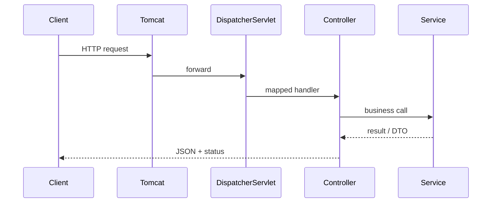

### Check yourself (Part IV)

1. When do you use `@RequestParam` vs `@PathVariable` vs `@RequestBody`?
2. Why validate DTOs instead of entities?
3. What is Problem Details (RFC 7807) and why prefer it?

**Docs hub:** [Web MVC](https://docs.spring.io/spring-framework/reference/web/webmvc.html) · [REST Exceptions](https://docs.spring.io/spring-framework/reference/web/webmvc/mvc-ann-rest-exceptions.html) · [springdoc-openapi](https://springdoc.org/)


### Status code decision tree

```
Create succeeded → 201 + Location
Delete succeeded, no body → 204
Client sent bad JSON/fields → 400
No/invalid credentials → 401
Authenticated but forbidden → 403
Unknown id → 404
Version conflict / duplicate → 409
Bug/unhandled → 500 (log server-side; ProblemDetail without stack traces)
```

### Argument resolution order (simplified)

Path variables → request params → headers → `@RequestBody` (converter) → validate if `@Valid`.


## Topic Atlas — Module 3 — Web Layer & RESTful Services

Every syllabus topic for this chapter. Read the lesson above first; use this atlas to drill and dive into docs.

### Servlet & MVC architecture

#### Servlet API

The Servlet API is Java's standard specification for handling HTTP requests and responses at a low level. Servlets receive `HttpServletRequest` and produce `HttpServletResponse`, making them the foundation on which Spring MVC is built. You rarely write raw servlets in modern Spring Boot apps, but understanding them explains how filters, sessions, and request dispatching work under the hood. In real projects, servlets matter when you need servlet-level hooks, custom filters, or when debugging how the container processes requests. Spring MVC ultimately delegates to servlet infrastructure even though you work at the controller abstraction.

> **Watch out:** Thinking Spring MVC bypasses servlets entirely — every `@RestController` request still passes through the servlet container first.

**Official docs:** [Servlet API](https://docs.spring.io/spring-boot/reference/)

#### Servlet container

A servlet container (also called a web container) is the server runtime that hosts servlets, manages HTTP connections, and handles the servlet lifecycle. In Spring Boot, Tomcat is the default embedded container, packaged inside your executable JAR so you don't need external deployment. The container listens on a port, accepts TCP connections, parses HTTP, and dispatches to the appropriate servlet. In production, you tune container thread pools and connection timeouts to match expected load. Understanding the container helps when diagnosing port binding issues, SSL termination, or graceful shutdown behavior.

> **Watch out:** Confusing servlet container with the JVM or Spring context — Tomcat runs servlets; Spring manages beans separately on top.

**Official docs:** [Servlet container](https://docs.spring.io/spring-boot/reference/)

#### DispatcherServlet

`DispatcherServlet` is Spring MVC's front controller — the single entry point for all HTTP requests in a typical Spring web app. It receives every request first, consults handler mappings to find the right controller method, invokes it via a handler adapter, and processes the return value into an HTTP response. In REST APIs, it routes JSON requests to `@RestController` methods and serializes results back through message converters. You rarely configure it directly in Boot because auto-configuration registers it at `/` by default. Knowing its role helps trace request flow when debugging 404s or unexpected handler selection.

> **Watch out:** Assuming a 404 means "no controller" — it can also mean no matching `HandlerMapping` or unsupported HTTP method on an existing mapping.

**Official docs:** [DispatcherServlet](https://docs.spring.io/spring-framework/reference/web/webmvc.html)

#### HandlerMapping

`HandlerMapping` is the Spring MVC component that maps an incoming request's URL path and HTTP method to a specific controller handler method. Multiple handler mapping beans can coexist (e.g., request mapping, resource handlers), evaluated in order until one matches. In real projects, this is how `/api/users/42` paired with GET reaches `UserController.getById`. Misconfigured base paths on `@RequestMapping` at the class level are a common source of unexpected routing. Handler mappings also respect path patterns, consumes/produces constraints, and custom conditions.

> **Watch out:** Forgetting that class-level `@RequestMapping("/api")` prefixes every method mapping — leads to double-prefix bugs like `/api/api/users`.

**Official docs:** [HandlerMapping](https://docs.spring.io/spring-framework/reference/web/webmvc.html)

#### HandlerAdapter

`HandlerAdapter` invokes the matched controller method and handles processing of its return value into a `ModelAndView` or raw response body. Different adapters exist for `@RequestMapping` methods, `HttpRequestHandler`, and other handler types. After invocation, it coordinates with argument resolvers (for `@PathVariable`, `@RequestBody`, etc.) and return value handlers. In REST apps, the adapter ensures your DTO return type gets passed to Jackson via `HttpMessageConverter`. You won't implement adapters in daily work, but they're central to how Spring bridges HTTP to Java method calls.

> **Watch out:** Return type mismatches (e.g., returning `void` when client expects JSON) often trace back to missing `@ResponseBody` or wrong adapter handling.

**Official docs:** [HandlerAdapter](https://docs.spring.io/spring-boot/reference/)

#### ViewResolver

`ViewResolver` converts a logical view name returned by a `@Controller` (e.g., `"home"`) into an actual view implementation, typically a Thymeleaf template file like `home.html`. It's essential for server-rendered HTML applications but largely irrelevant when using `@RestController`, which skips view resolution entirely. Multiple resolvers can be chained with precedence order. In hybrid apps (admin panel + REST API), you configure Thymeleaf or JSP resolvers alongside JSON endpoints. Misconfigured template paths cause "view not found" errors at runtime.

> **Watch out:** Using `@Controller` and returning a string view name in an API endpoint — clients get HTML fragment or 404 instead of JSON. Use `@RestController` for APIs.

**Official docs:** [ViewResolver](https://docs.spring.io/spring-boot/reference/)

#### HttpMessageConverter

`HttpMessageConverter` transforms HTTP request/response bodies between bytes and Java objects. Jackson's `MappingJackson2HttpMessageConverter` handles JSON by default in Spring Boot web apps. Converters are selected based on `Content-Type`, `Accept` headers, and supported Java types. In real projects, you add custom converters for CSV, XML, or protobuf when clients require non-JSON formats. They run automatically on `@RequestBody` deserialization and `@ResponseBody` serialization. Understanding converters explains why wrong `Content-Type` headers cause 415 Unsupported Media Type errors.

> **Watch out:** Sending JSON without `Content-Type: application/json` — Spring may fail to deserialize `@RequestBody` or pick the wrong converter.

**Official docs:** [HttpMessageConverter](https://docs.spring.io/spring-boot/reference/)

#### Spring MVC request flow

The standard Spring MVC request flow is: HTTP request → `DispatcherServlet` → `HandlerMapping` finds handler → `HandlerAdapter` invokes controller → service layer executes business logic → return value processed by message converters or view resolver → HTTP response. Filters run before the dispatcher; interceptors wrap the controller call. In a typical REST CRUD endpoint, Jackson serializes the service result to JSON automatically. Tracing this flow is the first step in debugging latency, auth failures, or missing response bodies. Production apps often add filters for logging, security, and tracing at the servlet layer.

> **Watch out:** Placing business logic in filters/interceptors instead of services — hard to test and bypasses transaction boundaries.

**Official docs:** [Spring MVC request flow](https://docs.spring.io/spring-framework/reference/web/webmvc.html)

#### Filter vs Interceptor

**Filters** operate at the servlet container level, before `DispatcherServlet`, and can intercept any request including static resources. **Interceptors** operate inside Spring MVC, after dispatcher entry, and only around controller handlers. Use filters for cross-cutting concerns that must run early (encoding, security headers, request logging). Use interceptors for MVC-specific tasks (timing, per-controller auth checks, model attributes). In real projects, Spring Security uses filters heavily; custom interceptors suit lightweight pre/post-controller logic. Knowing the distinction prevents placing logic at the wrong layer.

> **Watch out:** Expecting a `HandlerInterceptor` to run for static `/static/` requests — it won't; only servlet filters see those.

**Official docs:** [Filter vs Interceptor](https://docs.spring.io/spring-boot/reference/)

#### `@EnableWebMvc`

`@EnableWebMvc` tells Spring to take full manual control of MVC configuration, disabling many Spring Boot auto-config defaults for message converters, static resources, and view resolvers. It's appropriate for legacy apps migrating to Boot or when you need pixel-perfect custom MVC setup. In modern Boot projects, prefer implementing `WebMvcConfigurer` without `@EnableWebMvc` to extend rather than replace defaults. Enabling it accidentally removes Boot's Jackson auto-config conveniences and static resource handling. Most interview scenarios expect you to know why Boot discourages this annotation.

> **Watch out:** Adding `@EnableWebMvc` in a Boot app and losing JSON support or static file serving — extend defaults instead of replacing them.

**Official docs:** [`@EnableWebMvc`](https://docs.spring.io/spring-boot/reference/)


### REST API design

#### REST (Representational State Transfer)

REST is an architectural style for designing networked applications using stateless HTTP communication. Resources are identified by URLs, and actions are expressed through HTTP verbs rather than action names in the path. Each response carries representations (typically JSON) of resource state, and clients navigate via links or known URL patterns.

> **Watch out:** Calling any HTTP API RESTful when it uses RPC-style URLs like /createUser — verbs belong in HTTP methods.

**Official docs:** [REST (Representational State Transfer)](https://docs.spring.io/spring-boot/reference/)

#### RESTful API design

RESTful design uses nouns for resource paths (`/users/{id}`) and HTTP methods for actions (GET read, POST create, PUT replace, DELETE remove). Collections use plural nouns (`/orders`), and nested resources express relationships (`/users/{id}/orders`). Query parameters handle filtering, sorting, and pagination without polluting the path.

> **Watch out:** Using verbs in URLs (/getUserById/5) — use GET /users/5 instead.

**Official docs:** [RESTful API design](https://docs.spring.io/spring-boot/reference/)

#### `@RestController`

`@RestController` combines `@Controller` and `@ResponseBody`, meaning every handler method's return value is serialized directly to the HTTP response body (usually JSON). It's the standard stereotype for REST APIs in Spring Boot. You place it on a class along with a base `@RequestMapping` path prefix.

> **Watch out:** Returning a String from @RestController — serialized as JSON string, not a view.

**Official docs:** [`@RestController`](https://docs.spring.io/spring-framework/reference/web/webmvc.html)

#### `@RequestMapping`

`@RequestMapping` maps URL patterns and HTTP methods to handler methods and can be applied at both class and method level. Class-level mappings define a shared prefix (e.g., `/api/v1/users`); method-level mappings append specific paths and verbs. It supports `method`, `params`, `headers`, `consumes`, and `produces` attributes for fine-grained matching.

> **Watch out:** Omitting method on @RequestMapping — matches ALL HTTP methods on the path.

**Official docs:** [`@RequestMapping`](https://docs.spring.io/spring-boot/reference/)

#### `@GetMapping`

`@GetMapping` is shorthand for `@RequestMapping(method = RequestMethod.GET)` and maps HTTP GET requests to a handler method. GET should be safe and idempotent — retrieving data without side effects. Use it for fetching single resources, collections, and search queries.

> **Watch out:** Using GET with @RequestBody — violates HTTP semantics; caches may strip body.

**Official docs:** [`@GetMapping`](https://docs.spring.io/spring-framework/reference/web/webmvc.html)

#### `@PostMapping`

`@PostMapping` handles HTTP POST requests, typically for creating new resources or triggering non-idempotent actions. The request body usually carries the resource representation via `@RequestBody`. Successful creation should return 201 Created with a Location header pointing to the new resource.

> **Watch out:** Returning 200 OK instead of 201 Created after resource creation.

**Official docs:** [`@PostMapping`](https://docs.spring.io/spring-framework/reference/web/webmvc.html)

#### `@PutMapping`

`@PutMapping` handles HTTP PUT for replacing an entire resource at a known URI. The client sends the full resource representation, and the server replaces the existing state entirely. PUT is idempotent — repeated identical requests produce the same result.

> **Watch out:** Using PUT for partial updates — overwrites omitted fields with null.

**Official docs:** [`@PutMapping`](https://docs.spring.io/spring-boot/reference/)

#### `@DeleteMapping`

`@DeleteMapping` maps HTTP DELETE requests to remove a resource at the given URI. Successful deletion typically returns 204 No Content or 200 OK with a confirmation body. DELETE is idempotent — deleting an already-deleted resource should still return success (404 is also acceptable by convention).

> **Watch out:** Hard-deleting rows with FK constraints — throws 500; use soft delete or cascade.

**Official docs:** [`@DeleteMapping`](https://docs.spring.io/spring-boot/reference/)

#### `@PatchMapping`

`@PatchMapping` handles HTTP PATCH for partial resource updates, modifying only the fields present in the request body. Spring doesn't provide built-in JSON Merge Patch or JSON Patch — you implement partial update logic in the service layer. PATCH is useful for mobile clients sending small payloads.

> **Watch out:** Treating PATCH like PUT — clients may unintentionally null fields.

**Official docs:** [`@PatchMapping`](https://docs.spring.io/spring-boot/reference/)

#### `@PathVariable`

`@PathVariable` binds a URI template segment to a method parameter, e.g., `/users/{id}` maps to `Long id`. Variable names must match unless you specify `@PathVariable("id")`. Path variables identify specific resources and are required by default.

> **Watch out:** Mismatch between {userId} in path and @PathVariable("id") without explicit name.

**Official docs:** [`@PathVariable`](https://docs.spring.io/spring-boot/reference/)

#### `@RequestParam`

`@RequestParam` binds query string parameters to method arguments, e.g., `/users?page=1&size=20`. Parameters can be optional with `required = false` or have `defaultValue`. Use query params for filtering, pagination, sorting, and optional inputs — not for resource identity.

> **Watch out:** Using @RequestParam for resource IDs instead of @PathVariable — breaks REST design.

**Official docs:** [`@RequestParam`](https://docs.spring.io/spring-boot/reference/)

#### `@RequestBody`

`@RequestBody` deserializes the HTTP request body (typically JSON) into a Java object using `HttpMessageConverter`. Always pair it with `@Valid` or `@Validated` to trigger Bean Validation on incoming data. The Content-Type header must match a supported converter (usually `application/json`).

> **Watch out:** Accepting @RequestBody on GET or exposing JPA entities — lazy-load errors.

**Official docs:** [`@RequestBody`](https://docs.spring.io/spring-framework/reference/web/webmvc.html)

#### `@RequestHeader`

`@RequestHeader` extracts an HTTP header value and binds it to a method parameter, such as `Authorization`, `Accept`, or custom headers like `X-Request-Id`. Headers carry metadata rather than resource data — auth tokens, content negotiation preferences, tracing IDs. In real projects, prefer Spring Security for Authorization header parsing rather than manual extraction in every controller.

> **Watch out:** Manually parsing Authorization in every controller — use Spring Security.

**Official docs:** [`@RequestHeader`](https://docs.spring.io/spring-boot/reference/)

#### `@CookieValue`

`@CookieValue` reads a cookie from the HTTP request and binds it to a method parameter. Cookies are typically used for session IDs, remember-me tokens, or UI preferences — less common in pure REST APIs than in browser-facing apps. In stateless JWT-based APIs, cookies are rarely used for auth.

> **Watch out:** Storing JWT in non-HttpOnly cookies — XSS can steal tokens.

**Official docs:** [`@CookieValue`](https://docs.spring.io/spring-boot/reference/)

#### `@MatrixVariable`

`@MatrixVariable` binds URI matrix parameters — key-value pairs embedded in a path segment like `/users;sort=name;order=asc`. Matrix variables are part of the URI path, not the query string, and were more common in older REST frameworks. They're rarely used in modern Spring Boot APIs where query parameters suffice.

> **Watch out:** Using matrix variables without enabling them — silently ignored.

**Official docs:** [`@MatrixVariable`](https://docs.spring.io/spring-boot/reference/)

#### `@ModelAttribute`

`@ModelAttribute` binds query parameters or form fields to a Java object, populating fields by name. It's primarily used in traditional MVC form handling (`@Controller` + Thymeleaf) rather than JSON REST APIs. For REST, prefer `@RequestBody` with JSON.

> **Watch out:** Using @ModelAttribute for JSON POST — fields stay empty/default.

**Official docs:** [`@ModelAttribute`](https://docs.spring.io/spring-boot/reference/)

#### `produces` / `consumes`

The `produces` attribute restricts a mapping to requests whose `Accept` header matches specified media types; `consumes` restricts based on the request `Content-Type`. Use them to serve both JSON and XML from the same path with different handlers, or to reject unsupported formats early. In real APIs, `consumes = "application/json"` on POST/PUT endpoints documents and enforces expected input format.

> **Watch out:** Global produces=application/xml breaks JSON clients with 406.

**Official docs:** [`produces` / `consumes`](https://docs.spring.io/spring-boot/reference/)

#### API versioning (URL, header, param)

API versioning lets you evolve your API without breaking existing clients. URL versioning (`/v1/users`, `/v2/users`) is the most visible and common approach. Header versioning uses custom headers or Accept types (`Accept: application/vnd.myapp.v2+json`).

> **Watch out:** Breaking changes without versioning — silently breaks mobile clients.

**Official docs:** [API versioning (URL, header, param)](https://docs.spring.io/spring-boot/reference/)

#### Idempotent HTTP methods

An idempotent HTTP method produces the same server-side effect when called multiple times with identical input. GET, PUT, DELETE, and HEAD are idempotent; POST is not (each call may create a new resource). Idempotency matters for retry logic — clients and gateways safely retry idempotent requests on network failure.

> **Watch out:** Retrying POST without idempotency keys — duplicate orders.

**Official docs:** [Idempotent HTTP methods](https://docs.spring.io/spring-boot/reference/)

#### HATEOAS

HATEOAS (Hypermedia as the Engine of Application State) means API responses include links describing available next actions, so clients discover the API dynamically rather than hardcoding URLs. A user response might include links to `self`, `orders`, and `delete`. It reduces client coupling to URL structures but adds response complexity.

> **Watch out:** Claiming REST Level 3 without hypermedia links in responses.

**Official docs:** [HATEOAS](https://docs.spring.io/spring-boot/reference/)

#### Spring HATEOAS

Spring HATEOAS is a library that adds hypermedia links (`_links`) to REST responses using `EntityModel`, `CollectionModel`, and `WebMvcLinkBuilder`. It integrates with Spring MVC to generate link URLs from controller mappings automatically. Use it when building APIs where clients should navigate dynamically.

> **Watch out:** Mixing HATEOAS wrapped responses with plain DTOs — inconsistent API shape.

**Official docs:** [Spring HATEOAS](https://docs.spring.io/spring-boot/reference/)

#### DTO (Data Transfer Object)

A DTO is a plain Java object shaped specifically for API input/output, separate from your internal domain model or JPA entity. DTOs define the public contract — which fields are exposed, their types, and validation rules. They prevent leaking database structure, internal IDs, and lazy-loaded relations to clients.

> **Watch out:** Skipping DTOs for speed — entity changes break all API clients later.

**Official docs:** [DTO (Data Transfer Object)](https://docs.spring.io/spring-framework/reference/web/webmvc.html)

#### Entity vs DTO

JPA entities map to database tables and carry persistence concerns (lazy relations, `@Version`, audit fields); DTOs carry API contract concerns (validation, JSON shape, computed fields). Never return entities directly from controllers — it exposes schema, causes LazyInitializationException, and couples API to DB refactorings. Never accept entities as `@RequestBody` — clients can set fields you didn't intend (e.g., `role=ADMIN`).

> **Watch out:** Returning @Entity from @RestController — N+1 or LazyInitializationException.

**Official docs:** [Entity vs DTO](https://docs.spring.io/spring-framework/reference/web/webmvc.html)

#### MapStruct

MapStruct is a compile-time annotation processor that generates type-safe mapping code between entities and DTOs at build time. It's faster than reflection-based mappers because mapping logic is plain Java source generated during compilation. Define a `@Mapper` interface with mapping methods; MapStruct generates the implementation.

> **Watch out:** Forgetting @Mapper(componentModel = "spring") — mapper not a bean.

**Official docs:** [MapStruct](https://docs.spring.io/spring-boot/reference/)

#### ModelMapper

ModelMapper is a runtime reflection-based library that maps objects by matching field names and types automatically. It requires less setup than MapStruct — create a bean and call `modelMapper.map(source, Destination.class)`. However, reflection makes it slower and errors surface at runtime, not compile time.

> **Watch out:** Convention mapping with different field names — silently maps null.

**Official docs:** [ModelMapper](https://docs.spring.io/spring-boot/reference/)


### HTTP responses

#### `ResponseEntity`

`ResponseEntity<T>` wraps the HTTP response body along with status code and headers, giving full control over the outgoing response. Use it when you need 201 Created with a Location header, custom headers, or conditional status codes based on business logic. It works seamlessly with `@RestController` — return `ResponseEntity.ok(body)` or `ResponseEntity.status(HttpStatus.CREATED).body(body)`.

> **Watch out:** Overusing ResponseEntity when plain DTO + @ResponseStatus suffices.

**Official docs:** [`ResponseEntity`](https://docs.spring.io/spring-framework/reference/web/webmvc.html)

#### `HttpStatus` enum

`HttpStatus` provides typed constants for all standard HTTP status codes: `OK(200)`, `CREATED(201)`, `NO_CONTENT(204)`, `BAD_REQUEST(400)`, `NOT_FOUND(404)`, etc. Using the enum instead of raw integers prevents typos and improves readability. In Spring, use it with `ResponseEntity`, `@ResponseStatus`, or exception handlers.

> **Watch out:** Returning 200 OK with error message body — clients miss failures.

**Official docs:** [`HttpStatus` enum](https://docs.spring.io/spring-boot/reference/)

#### `@ResponseStatus`

`@ResponseStatus` declaratively sets the HTTP status code on a controller method or exception class. Place it on exception classes (`@ResponseStatus(NOT_FOUND)`) for clean, annotation-driven error mapping without explicit `ResponseEntity`. Method-level usage sets status for successful responses (e.g., 201 on create).

> **Watch out:** @ResponseStatus on method returning ResponseEntity — status conflict.

**Official docs:** [`@ResponseStatus`](https://docs.spring.io/spring-boot/reference/)

#### `@ResponseBody`

`@ResponseBody` tells Spring to serialize the method return value directly into the HTTP response body via `HttpMessageConverter`, bypassing view resolution. It's included automatically by `@RestController` on every method. Use it on individual `@Controller` methods that should return JSON alongside view-returning methods in the same class.

> **Watch out:** Forgetting @ResponseBody on @Controller method — resolves view name.

**Official docs:** [`@ResponseBody`](https://docs.spring.io/spring-boot/reference/)

#### 201 Created + Location header

After successfully creating a resource via POST, return HTTP 201 Created with a `Location` header pointing to the new resource's URI (e.g., `Location: /api/users/42`). This follows HTTP standards and lets clients immediately fetch the created resource. Use `ResponseEntity.created(URI.create("/api/users/" + id)).body(dto)` in Spring.

> **Watch out:** Returning 201 without Location header — clients can't discover new URL.

**Official docs:** [201 Created + Location header](https://docs.spring.io/spring-boot/reference/)

#### 204 No Content

HTTP 204 No Content signals successful processing with no response body — common for DELETE operations and PUT/PATCH updates where returning the resource is unnecessary. Use `ResponseEntity.noContent().build()` in Spring. It reduces bandwidth for operations where the client already knows the outcome.

> **Watch out:** Returning 204 with a body — clients may ignore body per HTTP spec.

**Official docs:** [204 No Content](https://docs.spring.io/spring-boot/reference/)

#### Pagination response wrapper

A pagination wrapper returns the current page of data plus metadata: `content`, `totalElements`, `totalPages`, `number` (page index), `size`, and `first`/`last` flags. Spring Data's `Page<T>` interface provides this structure automatically from repository methods. Clients use metadata to render pagination UI and know if more pages exist.

> **Watch out:** Returning bare List without total count — no pagination UI possible.

**Official docs:** [Pagination response wrapper](https://docs.spring.io/spring-boot/reference/)

#### Jackson JSON serialization

Jackson is the default JSON library in Spring Boot, automatically serializing Java objects to JSON and deserializing JSON to objects via `MappingJackson2HttpMessageConverter`. It respects annotations like `@JsonIgnore`, `@JsonProperty`, and `@JsonInclude` on your DTOs. Boot auto-configures Jackson with sensible defaults including Java 8 date/time support.

> **Watch out:** Bidirectional JPA relations without @JsonIgnore — infinite recursion.

**Official docs:** [Jackson JSON serialization](https://docs.spring.io/spring-framework/reference/web/webmvc.html)

#### `@JsonIgnore` / `@JsonProperty`

`@JsonIgnore` excludes a field from JSON serialization and deserialization entirely — use for passwords, internal flags, or back-references in bidirectional relations. `@JsonProperty` renames a field in JSON (e.g., Java `firstName` → JSON `first_name`) or marks a getter-only property. In DTOs, prefer explicit naming over `@JsonProperty` when possible for clarity.

> **Watch out:** @JsonIgnore on field blocks deserialization too — use READ_ONLY access.

**Official docs:** [`@JsonIgnore` / `@JsonProperty`](https://docs.spring.io/spring-boot/reference/)

#### `@JsonInclude(NON_NULL)`

`@JsonInclude(JsonInclude.Include.NON_NULL)` omits fields with null values from JSON output, producing cleaner, smaller responses. Apply at class level on DTOs or globally via ObjectMapper configuration. Clients see only populated fields, reducing ambiguity about optional vs missing data.

> **Watch out:** Global NON_NULL — clients can't distinguish unset vs explicitly null.

**Official docs:** [`@JsonInclude(NON_NULL)`](https://docs.spring.io/spring-boot/reference/)

#### Java 8 date/time JSON (`JavaTimeModule`)

Spring Boot auto-registers Jackson's `JavaTimeModule`, serializing `LocalDateTime`, `LocalDate`, and `Instant` as ISO-8601 strings (e.g., `"2024-03-15T10:30:00"`). Without this module, Java 8 time types fail to serialize. Configure global date format via `spring.jackson.date-format` or `@JsonFormat` on specific fields.

> **Watch out:** LocalDateTime for timestamps without timezone — ambiguous across clients.

**Official docs:** [Java 8 date/time JSON (`JavaTimeModule`)](https://docs.spring.io/spring-boot/reference/)

#### Custom JSON serializer/deserializer

Custom Jackson serializers and deserializers handle types that Jackson doesn't map cleanly by default — money types, enums with custom formats, encrypted strings, or polymorphic types. Implement `JsonSerializer<T>` / `JsonDeserializer<T>` and register via `@JsonSerialize`/`@JsonDeserialize` on fields or via ObjectMapper module. In real projects, use them for `Money` value objects, phone number formatting, or masking sensitive fields.

> **Watch out:** Custom serializer when @JsonFormat would suffice — unnecessary complexity.

**Official docs:** [Custom JSON serializer/deserializer](https://docs.spring.io/spring-boot/reference/)


### Validation

#### Jakarta Bean Validation (JSR 380)

Jakarta Bean Validation (formerly JSR 303/380) is the standard for declarative validation on Java beans using annotations like `@NotNull` and `@Size`. Hibernate Validator is the reference implementation bundled with Spring Boot, so validation works out of the box without extra setup. You apply constraints on DTO fields and let the framework reject bad input before business logic runs.

> **Watch out:** Validation only on entities — DTO @RequestBody never validated.

**Official docs:** [Jakarta Bean Validation (JSR 380)](https://jakarta.ee/specifications/bean-validation/3.0/jakarta-bean-validation-spec-3.0.html)

#### `@Valid`

`@Valid` triggers cascading Bean Validation on a method parameter, typically paired with `@RequestBody` on incoming DTOs. When validation fails, Spring throws `MethodArgumentNotValidException` before your controller method body executes. Use it on nested objects too — validation cascades into `@Valid` child fields.

> **Watch out:** Forgetting @Valid on @RequestBody — constraints on DTO ignored.

**Official docs:** [`@Valid`](https://jakarta.ee/specifications/bean-validation/3.0/jakarta-bean-validation-spec-3.0.html)

#### `@Validated`

`@Validated` is Spring's variant that adds support for validation groups and method-level parameter validation on `@RequestParam`, `@PathVariable`, and service methods. Put it on controller classes or service classes to enable `@Min`/`@NotBlank` directly on simple parameters. Use validation groups like `@Validated(Create.class)` to apply different rules for create vs update on the same DTO.

> **Watch out:** Using @Valid on @RequestParam — need @Validated on class for @Min.

**Official docs:** [`@Validated`](https://jakarta.ee/specifications/bean-validation/3.0/jakarta-bean-validation-spec-3.0.html)

#### `@NotNull`

`@NotNull` asserts that a field or parameter is not null — but an empty string `""` still passes. Use it for required reference types, wrappers, and objects where absence is invalid. It does not apply to primitives (they can't be null).

> **Watch out:** @NotNull on String allows "" — use @NotBlank for text.

**Official docs:** [`@NotNull`](https://jakarta.ee/specifications/bean-validation/3.0/jakarta-bean-validation-spec-3.0.html)

#### `@NotBlank`

`@NotBlank` applies only to CharSequence types and requires non-null content with at least one non-whitespace character. It's the right choice for user-facing text fields: names, titles, usernames, search queries. Whitespace-only strings like `"   "` fail validation.

> **Watch out:** Using @NotEmpty instead of @NotBlank — whitespace-only passes.

**Official docs:** [`@NotBlank`](https://jakarta.ee/specifications/bean-validation/3.0/jakarta-bean-validation-spec-3.0.html)

#### `@NotEmpty`

`@NotEmpty` requires that strings, collections, maps, or arrays are not null and contain at least one element (for strings, length > 0, including whitespace-only). Use it for lists that must have items, like `List<@NotBlank String> tags` on a create request. For plain strings where whitespace shouldn't count, prefer `@NotBlank`.

> **Watch out:** @NotEmpty on String accepts "   " — only @NotBlank rejects whitespace.

**Official docs:** [`@NotEmpty`](https://docs.spring.io/spring-boot/reference/)

#### `@Size`

`@Size` constrains the length of strings, collections, maps, and arrays with optional `min` and `max` attributes. Use it on passwords, descriptions, tag lists, and any field with business or DB column length limits. Align `max` with your database column definition to catch oversize input at the API layer.

> **Watch out:** DTO @Size(max=255) but DB column VARCHAR(100) — INSERT fails at DB.

**Official docs:** [`@Size`](https://docs.spring.io/spring-boot/reference/)

#### `@Min` / `@Max`

`@Min` and `@Max` enforce inclusive lower and upper bounds on numeric types (`int`, `long`, `BigDecimal`, etc.). Use them on pagination params, quantities, ages, and rating scores. On `@RequestParam`, remember to enable method validation with `@Validated` on the controller.

> **Watch out:** @Min on @RequestParam without @Validated on controller — never runs.

**Official docs:** [`@Min` / `@Max`](https://docs.spring.io/spring-boot/reference/)

#### `@Email`

`@Email` validates that a string conforms to a reasonable email format (not that the mailbox exists). Use on registration, login, and notification preference DTOs. The default regex is permissive; customize with the `regexp` attribute for stricter rules.

> **Watch out:** Assuming @Email verifies mailbox exists — format only.

**Official docs:** [`@Email`](https://docs.spring.io/spring-boot/reference/)

#### `@Pattern`

`@Pattern` validates that a string matches a regular expression, useful for phone numbers, postal codes, slugs, and custom IDs. Specify `regexp` and optional `message` for client-friendly errors. Test regexes against edge cases — overly strict patterns reject valid international formats.

> **Watch out:** Regex missing double backslashes in Java strings — invalid patterns.

**Official docs:** [`@Pattern`](https://docs.spring.io/spring-boot/reference/)

#### `@Past` / `@Future`

`@Past` requires a date/time before the current instant; `@Future` requires after now. Use for birth dates, appointment slots, expiry dates, and scheduled events. Works with `LocalDate`, `LocalDateTime`, `Instant`, and legacy `Date`.

> **Watch out:** @Past with LocalDateTime without timezone clarity — off-by-one-day rejections.

**Official docs:** [`@Past` / `@Future`](https://docs.spring.io/spring-boot/reference/)

#### Custom constraint annotation

A custom constraint pairs an annotation (e.g., `@ValidPhoneNumber`) with a `ConstraintValidator` implementation for domain-specific rules that built-in annotations can't express. Apply it like any standard annotation on DTO fields. Reuse across endpoints and services for consistent validation of business identifiers, tax IDs, or region-specific formats.

> **Watch out:** Missing @Constraint(validatedBy=...) — validator never runs.

**Official docs:** [Custom constraint annotation](https://jakarta.ee/specifications/bean-validation/3.0/jakarta-bean-validation-spec-3.0.html)

#### `ConstraintValidator`

`ConstraintValidator<A, T>` is the interface implementing validation logic for your custom annotation `A` on type `T`. Implement `isValid(value, context)` returning false to fail; use `context.buildConstraintViolationWithTemplate()` for custom messages. Spring auto-discovers validators on the classpath as CDI/Spring beans if needed for dependency injection.

> **Watch out:** Heavy DB lookups inside validators — hard to test, wrong layer.

**Official docs:** [`ConstraintValidator`](https://jakarta.ee/specifications/bean-validation/3.0/jakarta-bean-validation-spec-3.0.html)

#### Validation groups

Validation groups let the same DTO enforce different rules depending on context — e.g., `Create` group requires password, `Update` group omits it. Activate with `@Validated(Create.class)` on the controller method and `@NotNull(groups = Create.class)` on fields. Default group applies when no group is specified.

> **Watch out:** Mixing grouped and ungrouped constraints — ungrouped skipped when group specified.

**Official docs:** [Validation groups](https://docs.spring.io/spring-boot/reference/)

#### `MethodValidationPostProcessor`

`MethodValidationPostProcessor` is a Spring bean that enables Bean Validation on method parameters and return values for classes annotated with `@Validated`. It's auto-configured in Spring Boot when validation is on the classpath. Without it (non-Boot setups), `@Min` on `@RequestParam` won't work.

> **Watch out:** @Min on service params without @Validated on class — not enforced.

**Official docs:** [`MethodValidationPostProcessor`](https://docs.spring.io/spring-boot/reference/)

#### BindingResult

`BindingResult` captures validation errors when you add it immediately after the `@Valid` parameter in a `@Controller` (not `@RestController`) method signature. Check `bindingResult.hasErrors()` to decide whether to re-render the form with error messages. In REST APIs, you typically don't use `BindingResult` — let Spring throw `MethodArgumentNotValidException` and handle it in `@ControllerAdvice`.

> **Watch out:** BindingResult not immediately after @Valid parameter — startup error.

**Official docs:** [BindingResult](https://docs.spring.io/spring-boot/reference/)


### Error handling

#### `@ControllerAdvice`

`@ControllerAdvice` is a global Spring component that applies cross-cutting logic — typically exception handling — to all `@Controller` and `@RestController` beans. Place it in a dedicated package like `com.app.web.advice` so it's discovered by component scanning. Centralizing handlers keeps controllers free of try/catch boilerplate and ensures consistent error responses across the API.

> **Watch out:** Multiple @ControllerAdvice with overlapping handlers — use @Order.

**Official docs:** [`@ControllerAdvice`](https://docs.spring.io/spring-framework/reference/web/webmvc.html)

#### `@RestControllerAdvice`

`@RestControllerAdvice` combines `@ControllerAdvice` with `@ResponseBody`, so exception handler return values are serialized directly to JSON without view resolution. It's the standard choice for REST APIs returning structured error bodies. Use it instead of plain `@ControllerAdvice` unless you also serve HTML error pages from the same handlers.

> **Watch out:** @ControllerAdvice returning DTO — may resolve view instead of JSON.

**Official docs:** [`@RestControllerAdvice`](https://docs.spring.io/spring-framework/reference/web/webmvc.html)

#### `@ExceptionHandler`

`@ExceptionHandler` marks a method in `@ControllerAdvice` (or a controller) that handles a specific exception type and converts it to an HTTP response. Map domain exceptions like `UserNotFoundException` to 404 and validation failures to 400. Handler methods can accept the exception, `WebRequest`, or `HttpServletRequest` for context.

> **Watch out:** @ExceptionHandler(Exception.class) swallowing all errors — masks bugs.

**Official docs:** [`@ExceptionHandler`](https://docs.spring.io/spring-framework/reference/web/webmvc.html)

#### RFC 7807 Problem Details

RFC 7807 defines a standard JSON error format with fields: `type` (URI identifying the problem), `title`, `status`, `detail`, and `instance` (URI of the failing request). It replaces ad-hoc `{ "error": "something went wrong" }` shapes with a machine-readable contract. Clients can branch on `type` URIs for i18n and retry logic.

> **Watch out:** Custom error JSON per endpoint — clients can't build generic error UI.

**Official docs:** [RFC 7807 Problem Details](https://docs.spring.io/spring-boot/reference/)

#### Spring `ProblemDetail` class

Spring 6+ provides `ProblemDetail`, a builder-friendly class implementing RFC 7807 that integrates with `ResponseEntity` and `@ExceptionHandler`. Create instances via `ProblemDetail.forStatusAndDetail(HttpStatus.NOT_FOUND, "User not found")` and add custom properties with `setProperty()`. It sets `Content-Type: application/problem+json` automatically when returned from MVC handlers.

> **Watch out:** Wrapping ProblemDetail in outer object — clients expect top-level fields.

**Official docs:** [Spring `ProblemDetail` class](https://docs.spring.io/spring-framework/reference/web/webmvc.html)

#### `@ExceptionHandler` + `ProblemDetail`

Combining `@ExceptionHandler` with `ProblemDetail` gives you typed, structured error responses from a single advice method per exception. Set `detail` for human-readable messages and `type` to a stable URI like `https://api.example.com/problems/user-not-found`. Add extension fields (`errorCode`, `fieldErrors`) via `setProperty`.

> **Watch out:** Stack traces or SQL in detail field — leaks internals.

**Official docs:** [`@ExceptionHandler` + `ProblemDetail`](https://docs.spring.io/spring-framework/reference/web/webmvc.html)

#### `ErrorController` / `/error`

Spring Boot registers a default `/error` endpoint via `BasicErrorController` that handles errors outside MVC (filter chain failures, unmapped paths in some configs). It returns JSON or HTML based on the `Accept` header. Customize by implementing `ErrorController` or configuring `server.error.*` properties.

> **Watch out:** Security filter throws before @ControllerAdvice — hits /error default format.

**Official docs:** [`ErrorController` / `/error`](https://docs.spring.io/spring-boot/reference/)

#### Whitelabel error page

The whitelabel error page is Boot's default HTML fallback showing a generic error message and status code when no custom error template exists. It appears in browser requests during development when exceptions aren't caught. Disable or replace it in production with custom templates or ensure API clients always get JSON.

> **Watch out:** Testing API in browser — whitelabel HTML doesn't mean advice is broken.

**Official docs:** [Whitelabel error page](https://docs.spring.io/spring-boot/reference/)

#### Custom error attributes

Custom error attributes extend Boot's default error response with extra fields like `errorCode`, `timestamp`, or `traceId` by implementing `ErrorAttributes` or using `@ExceptionHandler` with a custom body. In distributed systems, include a correlation/request ID for support debugging. Keep client-facing fields stable across releases.

> **Watch out:** Adding sensitive debug fields to production error JSON.

**Official docs:** [Custom error attributes](https://docs.spring.io/spring-boot/reference/)

#### Exception hierarchy design

Design a small hierarchy of domain-specific runtime exceptions (`ResourceNotFoundException`, `DuplicateEmailException`, `BusinessRuleViolationException`) rather than throwing generic exceptions or raw `ResponseStatusException` everywhere. Map each type to one HTTP status in `@ControllerAdvice`. Services throw domain exceptions; controllers don't catch them.

> **Watch out:** IllegalArgumentException for both validation and not-found — can't map 400 vs 404.

**Official docs:** [Exception hierarchy design](https://docs.spring.io/spring-boot/reference/)

#### 400 Bad Request

HTTP 400 indicates the client sent malformed or semantically invalid input — failed Bean Validation, bad JSON syntax, or impossible parameter combinations. Return Problem Details with field-level errors for validation failures. Don't use 400 for authentication (401) or missing resources (404).

> **Watch out:** Returning 400 for user not found on update — that's 404.

**Official docs:** [400 Bad Request](https://docs.spring.io/spring-boot/reference/)

#### 401 Unauthorized

HTTP 401 means the request lacks valid authentication credentials — missing token, expired JWT, or wrong password. Include a `WWW-Authenticate` header when using standard auth schemes. Clients should prompt re-login or token refresh on 401.

> **Watch out:** Returning 403 when user isn't logged in — spec says 401 for missing auth.

**Official docs:** [401 Unauthorized](https://docs.spring.io/spring-boot/reference/)

#### 403 Forbidden

HTTP 403 means the client is authenticated but lacks permission for the requested action — wrong role, insufficient scope, or row-level access denied. The server understood the request but refuses to execute it. Use for "logged in as USER, tried to delete admin resource." In real apps, return a clear message without revealing whether the resource exists (sometimes 404 is used instead for security).

> **Watch out:** Inconsistent 404 vs 403 to hide resources — pick and document policy.

**Official docs:** [403 Forbidden](https://docs.spring.io/spring-boot/reference/)

#### 404 Not Found

HTTP 404 indicates the requested resource doesn't exist at the given URI — unknown user ID, deleted record, or wrong path. Return Problem Details with a stable `type` URI and helpful `detail` without leaking internal IDs unnecessarily. For collections, 404 on `/users/999` is correct; empty list on `/users?status=INACTIVE` returns 200 with `[]`.

> **Watch out:** NPE on missing entity becomes 500 — map Optional.empty() to 404.

**Official docs:** [404 Not Found](https://docs.spring.io/spring-boot/reference/)

#### 409 Conflict

HTTP 409 signals a conflict with current resource state — duplicate unique key, optimistic lock failure, or invalid state transition (cancel shipped order). Use for `DataIntegrityViolationException` on unique constraints and `OptimisticLockException` on concurrent updates. Clients may retry with refreshed data.

> **Watch out:** Duplicate key as 500 — map DataIntegrityViolationException to 409.

**Official docs:** [409 Conflict](https://docs.spring.io/spring-boot/reference/)

#### 500 Internal Server Error

HTTP 500 indicates an unexpected server failure — unhandled exception, downstream service outage, or bug. Log full stack trace with correlation ID server-side; return generic Problem Details to clients without internal messages, SQL, or stack traces. Alert on 500 rate spikes in production.

> **Watch out:** Returning e.getMessage() to clients — exposes SQL/Hibernate errors.

**Official docs:** [500 Internal Server Error](https://docs.spring.io/spring-boot/reference/)


### Content negotiation & media types

#### Content negotiation

Content negotiation is the process where the server selects the response representation format based on client preferences, primarily the `Accept` header, and sometimes URL extensions or query params. Spring MVC consults registered `HttpMessageConverter` beans to pick JSON, XML, or other formats. In real REST APIs, JSON is the default and negotiation rarely matters day-to-day.

> **Watch out:** Client Accept */* gets XML when Jackson XML registered with priority.

**Official docs:** [Content negotiation](https://docs.spring.io/spring-boot/reference/)

#### `MediaType.APPLICATION_JSON`

`MediaType.APPLICATION_JSON` is Spring's constant for the `application/json` MIME type, used in `produces`/`consumes` attributes, `ResponseEntity` headers, and programmatic content negotiation. Prefer constants over raw strings to avoid typos. In real projects, most `@PostMapping` endpoints declare `consumes = MediaType.APPLICATION_JSON_VALUE`.

> **Watch out:** Typo applicaton/json in raw string — mapping never matches.

**Official docs:** [`MediaType.APPLICATION_JSON`](https://docs.spring.io/spring-boot/reference/)

#### XML responses (Jackson XML / JAXB)

Spring can serve XML responses when Jackson XML (`jackson-dataformat-xml`) or JAXB is on the classpath and the client sends `Accept: application/xml`. Return the same DTO; the converter serializes to XML automatically based on negotiation. Use when integrating with legacy enterprise systems or SOAP-adjacent consumers.

> **Watch out:** Adding Jackson XML — browsers get XML instead of JSON unexpectedly.

**Official docs:** [XML responses (Jackson XML / JAXB)](https://docs.spring.io/spring-framework/reference/web/webmvc.html)

#### `Accept` header

The `Accept` header tells the server which response media types the client can process, e.g., `Accept: application/json` or `Accept: application/xml, application/json;q=0.9`. Spring picks the best match among handler `produces` values and available converters. Clients that omit `Accept` typically receive the handler's default (usually JSON in Boot).

> **Watch out:** Strict produces without wildcard — picky clients get 406.

**Official docs:** [`Accept` header](https://docs.spring.io/spring-boot/reference/)

#### `Content-Type` header

The `Content-Type` header declares the media type of the request or response body, e.g., `Content-Type: application/json` on POST bodies. Spring uses it to select the correct `HttpMessageConverter` for `@RequestBody` deserialization. Mismatch between actual body format and Content-Type causes parse failures or 415 Unsupported Media Type.

> **Watch out:** JSON body with Content-Type text/plain — @RequestBody binding fails.

**Official docs:** [`Content-Type` header](https://docs.spring.io/spring-boot/reference/)


### CORS & web config

#### CORS (Cross-Origin Resource Sharing)

CORS is a browser security mechanism that blocks JavaScript running on one origin (e.g., `https://app.example.com`) from calling an API on another origin (`https://api.example.com`) unless the API explicitly allows it via response headers. Server-side tools like curl and mobile apps are not restricted by CORS — only browsers enforce it. In real projects, configure CORS when your SPA frontend and backend are on different domains.

> **Watch out:** Works in Postman but fails in browser — CORS is browser-only.

**Official docs:** [CORS (Cross-Origin Resource Sharing)](https://docs.spring.io/spring-framework/reference/web/webmvc.html)

#### `@CrossOrigin`

`@CrossOrigin` enables CORS on a specific controller class or method, setting allowed origins, methods, and headers. Use for quick dev setups or isolated public endpoints. Attributes include `origins`, `allowedHeaders`, `methods`, and `maxAge`.

> **Watch out:** @CrossOrigin(origins="*") with allowCredentials=true — browsers reject.

**Official docs:** [`@CrossOrigin`](https://docs.spring.io/spring-boot/reference/)

#### `WebMvcConfigurer.addCorsMappings`

Implement `WebMvcConfigurer.addCorsMappings(CorsRegistry registry)` for global CORS policy applied to all endpoints matching path patterns. This is the production-preferred approach — one place to maintain allowed origins per environment via config properties. Register `registry.addMapping("/api/**").allowedOrigins(frontendUrl).allowedMethods("GET","POST",...)` .

> **Watch out:** CORS in MVC but Spring Security blocks OPTIONS — enable http.cors().

**Official docs:** [`WebMvcConfigurer.addCorsMappings`](https://docs.spring.io/spring-framework/reference/web/webmvc.html)

#### Preflight OPTIONS request

A preflight OPTIONS request is sent by the browser before "non-simple" cross-origin requests (custom headers, PUT/DELETE, non-standard content types) to ask the server if the actual request is permitted. The server must respond with appropriate `Access-Control-Allow-*` headers and often 200/204 with no body. Spring handles this when CORS is configured correctly.

> **Watch out:** Security requires auth for OPTIONS — preflight fails with 401.

**Official docs:** [Preflight OPTIONS request](https://docs.spring.io/spring-boot/reference/)

#### Static resource handling

Spring Boot serves static files from classpath locations `/static`, `/public`, `/resources`, and `/META-INF/resources` automatically at the root URL path. Drop `index.html`, CSS, JS, and images there for simple SPAs or docs. No controller needed — Tomcat serves them directly.

> **Watch out:** SPA files in templates/ instead of static/ — 404 on assets.

**Official docs:** [Static resource handling](https://docs.spring.io/spring-boot/reference/)

#### Thymeleaf template engine

Thymeleaf is a server-side HTML template engine integrated with Spring MVC for rendering dynamic pages. `@Controller` methods return logical view names; Thymeleaf resolves them to `.html` templates with natural templating (valid HTML with `th:` attributes). Use for admin panels, email HTML generation, and legacy server-rendered apps — not for JSON REST APIs.

> **Watch out:** redirect: from @RestController — serialized as JSON string.

**Official docs:** [Thymeleaf template engine](https://docs.spring.io/spring-boot/reference/)

#### `@Controller` + view name

With `@Controller`, returning a `String` from a handler method resolves to a view name via `ViewResolver`, not JSON. Return `"users/list"` to render `templates/users/list.html`. Use `Model` or `ModelAndView` to pass data to the template.

> **Watch out:** Mixing view returns and JSON in same @Controller class.

**Official docs:** [`@Controller` + view name](https://docs.spring.io/spring-boot/reference/)

#### Redirect vs Forward

A **redirect** (`redirect:/path`) sends HTTP 302/303 to the client, which makes a new request to the target URL — URL bar changes, good after POST to prevent duplicate submit. A **forward** (`forward:/path`) is server-internal — same request dispatched to another handler, URL unchanged, slightly faster. Use redirect for PRG (Post-Redirect-Get) pattern after form submission.

> **Watch out:** Forward to external URL — use redirect for external navigation.

**Official docs:** [Redirect vs Forward](https://docs.spring.io/spring-boot/reference/)

#### File upload (`MultipartFile`)

Spring MVC handles `multipart/form-data` uploads via `@RequestParam MultipartFile file` or `@RequestPart` for complex multipart (file + JSON). `MultipartFile` provides `getBytes()`, `transferTo()`, original filename, and content type. In real projects, validate file type/size, scan for malware, and store in S3/blob storage — not local disk in cloud deployments.

> **Watch out:** Upload without size limit — large file exhausts memory.

**Official docs:** [File upload (`MultipartFile`)](https://docs.spring.io/spring-boot/reference/)

#### `spring.servlet.multipart.max-file-size`

This property caps individual uploaded file size (e.g., `10MB`); pair with `max-request-size` for total multipart request limit. Prevents denial-of-service via huge uploads exhausting disk or memory. Set per environment — dev may allow larger for testing.

> **Watch out:** Only max-file-size set — many files in one request still DoS.

**Official docs:** [`spring.servlet.multipart.max-file-size`](https://docs.spring.io/spring-boot/reference/)


### API documentation

#### OpenAPI 3

OpenAPI 3 (formerly Swagger) is the industry-standard YAML/JSON format describing REST APIs: paths, operations, request/response schemas, authentication, and examples. It serves as the contract between backend and frontend/mobile teams and enables codegen for clients and servers. In real projects, the spec lives in source control and is reviewed in PRs like code.

> **Watch out:** Spec drift from implementation — auto-generate or validate in CI.

**Official docs:** [OpenAPI 3](https://springdoc.org/)

#### Swagger UI

Swagger UI is a browser-based interface that renders an OpenAPI spec as interactive documentation where developers can explore endpoints and execute test requests. It's invaluable for onboarding, QA manual testing, and partner integration. In Spring Boot, springdoc-openapi serves it at `/swagger-ui.html` or `/swagger-ui/index.html`.

> **Watch out:** Leaving Swagger UI public in production — attackers map all endpoints.

**Official docs:** [Swagger UI](https://springdoc.org/)

#### springdoc-openapi

springdoc-openapi auto-generates OpenAPI 3 documentation from your Spring MVC controllers, DTOs, and security config at runtime with zero annotation boilerplate for basic cases. Add `springdoc-openapi-starter-webmvc-ui` dependency and docs appear automatically. It supports Spring Boot 3/Jakarta and replaces older Springfox.

> **Watch out:** Migrating from Springfox on Boot 3 — use springdoc, not springfox hacks.

**Official docs:** [springdoc-openapi](https://springdoc.org/)

#### `@Operation` / `@Schema`

`@Operation` documents an endpoint's summary, description, and response codes in the generated OpenAPI spec. `@Schema` describes DTO fields: examples, required status, min/max, and descriptions visible in Swagger UI. Use them on public API controllers to improve generated docs quality.

> **Watch out:** Documenting entities in public spec — exposes DB field names.

**Official docs:** [`@Operation` / `@Schema`](https://springdoc.org/)

#### API-first design

API-first design means writing the OpenAPI spec before implementation, then generating server stubs or validating the implementation against the spec in CI. Frontend and backend teams work in parallel from the same contract. Reduces integration surprises and breaking changes.

> **Watch out:** Editing generated server stubs — changes overwritten on regen.

**Official docs:** [API-first design](https://docs.spring.io/spring-boot/reference/)


### Other web topics

#### WebSocket

WebSocket provides a full-duplex, persistent TCP connection between client and server, enabling real-time bidirectional communication without HTTP polling overhead. Use for chat, live dashboards, collaborative editing, and gaming. Spring Framework supports WebSocket via `@EnableWebSocket` and handler interfaces or STOMP messaging.

> **Watch out:** WebSocket through LB without sticky sessions or shared broker.

**Official docs:** [WebSocket](https://docs.spring.io/spring-framework/reference/web/webmvc.html)

#### STOMP over WebSocket

STOMP is a simple text-based messaging protocol layered on WebSocket, providing destinations (`/topic/news`, `/queue/user123`) and subscribe/send semantics similar to JMS. Spring's `@EnableWebSocketMessageBroker` configures an in-memory or external broker. Clients use SockJS fallback when WebSocket is blocked.

> **Watch out:** In-memory broker in cluster — messages don't cross instances.

**Official docs:** [STOMP over WebSocket](https://docs.spring.io/spring-framework/reference/web/webmvc.html)

#### `@MessageMapping`

`@MessageMapping` maps incoming STOMP messages to handler methods, analogous to `@RequestMapping` for HTTP. Clients send to `/app/chat` (application prefix); server broadcasts to `/topic/messages`. Method parameters bind message payload, headers, and principal.

> **Watch out:** Client sends to /topic/ instead of /app/ — handler never invoked.

**Official docs:** [`@MessageMapping`](https://docs.spring.io/spring-boot/reference/)

#### Server-Sent Events (SSE)

SSE is a one-way HTTP stream where the server pushes events to the client over a long-lived connection using the `text/event-stream` content type. Simpler than WebSocket when only server-to-client updates are needed — stock tickers, progress bars, live logs. Spring supports it via `SseEmitter` or reactive `Flux` returned from controllers.

> **Watch out:** Nginx buffering SSE — clients see delayed events.

**Official docs:** [Server-Sent Events (SSE)](https://docs.spring.io/spring-boot/reference/)

#### Spring WebClient

WebClient is Spring WebFlux's non-blocking, reactive HTTP client for calling external services with fluent API and backpressure support. Preferred over RestTemplate for new code, especially in reactive stacks or when concurrency matters. Integrates with Reactor (`Mono`/`Flux`) for composable async pipelines.

> **Watch out:** Blocking on .block() everywhere — defeats non-blocking benefits.

**Official docs:** [Spring WebClient](https://docs.spring.io/spring-framework/reference/web/webmvc.html)

#### RestClient (Spring 6.1+)

RestClient is Spring's modern fluent synchronous HTTP client introduced in Spring Framework 6.1, designed as the RestTemplate replacement with a cleaner API similar to WebClient. Use in traditional servlet-based Spring Boot apps for service-to-service calls. Supports interceptors, error handlers, and URI templates.

> **Watch out:** Using RestTemplate in new Spring 6 code — prefer RestClient.

**Official docs:** [RestClient (Spring 6.1+)](https://docs.spring.io/spring-framework/reference/web/webmvc.html)

#### RestTemplate (legacy)

RestTemplate is the classic blocking synchronous HTTP client long used in Spring applications for REST calls. It remains widely deployed but is in maintenance mode — no new features. Methods like `getForObject`, `postForEntity`, and `exchange` cover CRUD HTTP operations.

> **Watch out:** Default RestTemplate without pool — socket exhaustion under load.

**Official docs:** [RestTemplate (legacy)](https://docs.spring.io/spring-framework/reference/web/webmvc.html)

#### HTTP exchange / CRUD with WebClient

WebClient CRUD follows a fluent pattern: build request with method and URI, attach headers/body, `retrieve()` or `exchangeToMono()`, then map body to type. Example flow: GET user by ID, POST create, PUT update, DELETE remove — each composes as `Mono`/`Flux` operators. Use `bodyToMono(User.class)` for single objects and `bodyToFlux` for streams.

> **Watch out:** Ignoring 4xx/5xx — retrieve() throws without onStatus handler.

**Official docs:** [HTTP exchange / CRUD with WebClient](https://docs.spring.io/spring-framework/reference/web/webmvc.html)

#### Server compression

Enabling response compression via `server.compression.enabled=true` gzip-compresses HTTP responses above a minimum size threshold, reducing bandwidth for JSON-heavy APIs and static assets. Clients must send `Accept-Encoding: gzip`. Most browsers and HTTP clients support this automatically.

> **Watch out:** Compressing JPEG/PNG — wastes CPU; exclude binary mime-types.

**Official docs:** [Server compression](https://docs.spring.io/spring-boot/reference/)


*Atlas entries in this part: 108*

---

# Part V


## Module 4 — Persistence Layer (Spring Data JPA)


> **Learning goal:** persist data correctly — entities, relationships, N+1, transactions, and migrations.

## Persistence stack

### Diagram · Layers

```
 @Service  (@Transactional)
      │
 @Repository / JpaRepository
      │
 EntityManager / Persistence Context
      │
 Hibernate (JPA provider)
      │
 HikariCP DataSource
      │
 PostgreSQL / MySQL / H2
```

### Entity states

```
 Transient ──persist──► Managed ──detach/close──► Detached
                              │
                           remove
                              ▼
                           Removed ── flush/commit ──► deleted in DB
```

### Relationships · owning side

The **owning side** has the foreign key (`@JoinColumn`). The inverse side uses `mappedBy`. Persist changes from the owning side or you will "save" nothing.

### Diagram · N+1 problem

```
SELECT * FROM orders;          -- 1 query
for each order:
  SELECT * FROM items WHERE order_id=?;   -- N queries
────────────────────────────────────────
Total = 1 + N   ← death by a thousand queries
```

**Fixes:** `JOIN FETCH`, `@EntityGraph`, DTO projections, batch size. Disable Open Session In View for APIs (`spring.jpa.open-in-view=false`) so lazy loads fail loudly in the service layer instead of hiding N+1.

### Transactions · put them on services

| Setting | Remember |
|---------|----------|
| Default propagation | `REQUIRED` — join or create |
| `REQUIRES_NEW` | Independent TX (audit that must commit alone) |
| Rollback default | Runtime exceptions |
| Self-invocation | `this.method()` skips proxy |

### Schema evolution

Production: **Flyway/Liquibase**. Not `ddl-auto=update`.


### Mermaid · Transaction boundary

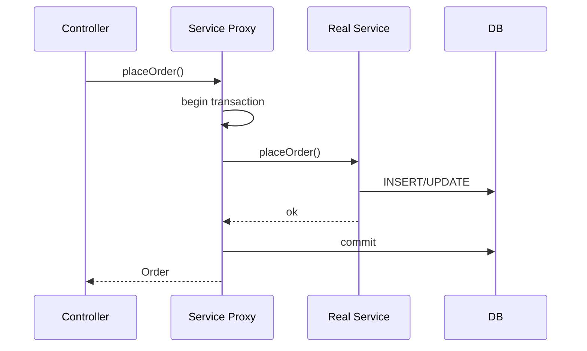

### Check yourself (Part V)

1. Where should `@Transactional` live — controller, service, or repository?
2. What is the N+1 problem in one sentence?
3. Why is `ddl-auto=update` dangerous in production?

**Docs hub:** [Spring Data JPA](https://docs.spring.io/spring-data/jpa/reference/) · [Transactions](https://docs.spring.io/spring-framework/reference/data-access/transaction.html) · [Boot SQL](https://docs.spring.io/spring-boot/reference/data/sql.html) · [Flyway](https://documentation.red-gate.com/fd/flyway-documentation-138346877.html)


### When SQL actually fires

Dirty checking + flush happens at flush/commit (and some queries). Calling `save()` does not always mean "SQL now." Think in **persistence context**, not in repository method names.

### Page vs Slice

| Type | Count query? | Use |
|------|--------------|-----|
| `Page<T>` | Yes (extra cost) | UI pages needing totals |
| `Slice<T>` | No | Infinite scroll / next-only |

### Hikari sizing intuition

Threads (or virtual threads) can wait on **connections**. If pool=10 and you start 10k VT requests hitting DB, most wait on Hikari — tune pool to DB capacity, not to thread count.


## Topic Atlas — Module 4 — Persistence Layer (Spring Data JPA)

Every syllabus topic for this chapter. Read the lesson above first; use this atlas to drill and dive into docs.

### JDBC basics

#### JDBC (Java Database Connectivity)

JDBC is Java's low-level standard API for connecting to relational databases, executing SQL, and processing result sets. It provides `Connection`, `Statement`, `PreparedStatement`, and `ResultSet` interfaces that every Java database driver implements. You write explicit SQL and manually manage connections, which is verbose but gives full control over queries and performance.

> **Watch out:** Not closing Connection in finally — use try-with-resources.

**Official docs:** [JDBC (Java Database Connectivity)](https://docs.spring.io/spring-boot/reference/data/sql.html)

#### DataSource

A `DataSource` is a factory interface that provides database connections, abstracting how connections are created and pooled. In production, it's backed by a connection pool (HikariCP in Boot) rather than opening a new physical connection per request. Spring Boot auto-configures a `DataSource` from `spring.datasource.*` properties.

> **Watch out:** DriverManager.getConnection() manually — bypasses pooling.

**Official docs:** [DataSource](https://docs.spring.io/spring-boot/reference/data/sql.html)

#### HikariCP

HikariCP is a high-performance JDBC connection pool and the default in Spring Boot 2.x+. It maintains a pool of open connections ready for reuse, dramatically reducing connection establishment overhead. Tune `maximum-pool-size`, `connection-timeout`, and `idle-timeout` based on your database's capacity and concurrent request patterns.

> **Watch out:** Pool size 100+ without checking DB max_connections limit.

**Official docs:** [HikariCP](https://docs.spring.io/spring-boot/reference/data/sql.html)

#### `JdbcTemplate`

`JdbcTemplate` is Spring's helper that eliminates JDBC boilerplate — opening connections, creating statements, handling exceptions, and closing resources. It provides methods like `query`, `update`, `queryForObject`, and batch operations with automatic resource cleanup. Use it for simple SQL operations, batch imports, or when JPA is overkill.

> **Watch out:** String-concatenating user input into SQL — still SQL injection.

**Official docs:** [`JdbcTemplate`](https://docs.spring.io/spring-boot/reference/data/sql.html)

#### RowMapper

`RowMapper<T>` is a functional interface that maps one row of a `ResultSet` to a Java object of type T. Implement `mapRow(ResultSet rs, int rowNum)` to extract columns and construct your object. Spring calls it for each row when using `jdbcTemplate.query(sql, rowMapper)`.

> **Watch out:** Wrong ResultSet column name — fails at runtime not compile time.

**Official docs:** [RowMapper](https://docs.spring.io/spring-boot/reference/)

#### `NamedParameterJdbcTemplate`

`NamedParameterJdbcTemplate` extends JDBC templating with named parameters (`:email`, `:status`) instead of positional `?` placeholders. Named params make complex SQL with repeated parameters readable and less error-prone. Pass parameters via `MapSqlParameterSource` or `@Param`-style bean wrappers.

> **Watch out:** Mixing ? and :name in same SQL string.

**Official docs:** [`NamedParameterJdbcTemplate`](https://docs.spring.io/spring-boot/reference/data/sql.html)

#### SQL injection prevention

SQL injection occurs when user input is concatenated directly into SQL strings, allowing attackers to execute arbitrary SQL. Always use parameterized queries with `?` or `:name` placeholders — never build SQL via string concatenation with user data. JPA/JPQL, `JdbcTemplate`, and `PreparedStatement` all support parameterization by default.

> **Watch out:** Native @Query with string concatenation — use @Param binding.

**Official docs:** [SQL injection prevention](https://docs.spring.io/spring-boot/reference/)

#### Spring Data JDBC

Spring Data JDBC is a lightweight persistence framework that maps aggregates to tables without JPA's full ORM complexity — no lazy loading, no persistence context, no dirty checking. You write explicit SQL via `@Query` or derived methods and get predictable, transparent database access. Use when JPA's magic causes more problems than it solves — simple CRUD domains, event sourcing read models, or performance-critical paths.

> **Watch out:** Expecting lazy loading like JPA — explicit saves on aggregate root only.

**Official docs:** [Spring Data JDBC](https://docs.spring.io/spring-boot/reference/data/sql.html)

#### `@EnableJdbcRepositories`

`@EnableJdbcRepositories` activates Spring Data JDBC repository support, scanning for interfaces extending `CrudRepository` or related base interfaces. Place it on a `@Configuration` class or rely on Boot auto-configuration when spring-data-jdbc is on the classpath. Repository interfaces get implementation proxies generated at startup.

> **Watch out:** Mixing JPA and JDBC repos without separate enable configs.

**Official docs:** [`@EnableJdbcRepositories`](https://docs.spring.io/spring-boot/reference/data/sql.html)


### JPA & Hibernate

#### JPA (Java Persistence API)

JPA is the Java standard specification for Object-Relational Mapping (ORM), defining annotations and APIs to map Java objects to relational database tables. It specifies `@Entity`, `@Id`, relationships, and query languages (JPQL) without mandating an implementation. In Spring Boot, you use JPA through Spring Data JPA, which hides most `EntityManager` boilerplate.

> **Watch out:** Confusing JPA spec with Hibernate implementation.

**Official docs:** [JPA (Java Persistence API)](https://docs.spring.io/spring-data/jpa/reference)

#### Hibernate

Hibernate is the most widely used JPA implementation and the default ORM in Spring Boot via `spring-boot-starter-data-jpa`. It generates SQL from entity mappings, manages the persistence context, and provides extensions like Envers auditing and second-level caching. Hibernate translates JPQL to SQL dialect-specific statements for PostgreSQL, MySQL, etc.

> **Watch out:** Hibernate-only annotations then switching provider — code breaks.

**Official docs:** [Hibernate](https://docs.spring.io/spring-data/jpa/reference)

#### ORM (Object-Relational Mapping)

ORM bridges the object-oriented Java domain model and relational database tables, mapping classes to tables, fields to columns, and references to foreign keys. It eliminates most hand-written SQL for CRUD and relationship navigation. The trade-off is complexity — lazy loading, N+1 queries, and session management require understanding.

> **Watch out:** Treating ORM as no SQL needed — still must fix N+1 and tune queries.

**Official docs:** [ORM (Object-Relational Mapping)](https://docs.spring.io/spring-boot/reference/)

#### EntityManager

`EntityManager` is the core JPA interface for persistence operations: `persist()`, `find()`, `merge()`, `remove()`, and `createQuery()`. It manages the persistence context (first-level cache) within a transaction. In Spring, `@PersistenceContext` injects a container-managed proxy that joins the current transaction's persistence context.

> **Watch out:** merge() expecting same in-memory object — returns new managed copy.

**Official docs:** [EntityManager](https://docs.spring.io/spring-data/jpa/reference)

#### Persistence Context

The persistence context is Hibernate's first-level cache — a set of managed entity instances tracked within a single `EntityManager`/transaction scope. When you load an entity, Hibernate returns the cached instance if already managed, avoiding duplicate queries. Changes to managed entities are automatically detected and flushed to the database at transaction commit (dirty checking).

> **Watch out:** Modifying detached entity outside transaction — changes lost.

**Official docs:** [Persistence Context](https://docs.spring.io/spring-data/jpa/reference)

#### `@Entity`

`@Entity` marks a Java class as a JPA entity mapped to a database table, requiring a no-arg constructor and an `@Id` field. By default, the table name matches the class name (configurable via `@Table`). Only classes annotated with `@Entity` are managed by JPA/Hibernate.

> **Watch out:** Missing no-arg constructor — Hibernate fails at startup.

**Official docs:** [`@Entity`](https://docs.spring.io/spring-data/jpa/reference)

#### `@Table`

`@Table` specifies the database table name and schema when the entity class name doesn't match the table or you need custom schema/catalog. Attributes include `name`, `schema`, `catalog`, and unique constraints. Use when legacy databases have naming conventions like `tbl_users` vs Java `User`.

> **Watch out:** Renaming @Table without Flyway migration — validate fails in prod.

**Official docs:** [`@Table`](https://docs.spring.io/spring-data/jpa/reference)

#### `@Id`

`@Id` marks the primary key field of an entity. Every JPA entity must have exactly one `@Id` (or composite key via `@IdClass`/`@EmbeddedId`). The field type should match the database column type — `Long` for BIGINT, `UUID` for UUID columns.

> **Watch out:** int primitive as @Id — use Long/Integer wrapper for generated keys.

**Official docs:** [`@Id`](https://docs.spring.io/spring-data/jpa/reference)

#### `@GeneratedValue`

`@GeneratedValue` configures automatic primary key generation with strategies: `IDENTITY` (DB auto-increment), `SEQUENCE` (DB sequence), `AUTO` (provider chooses), or `UUID`. `IDENTITY` is common for MySQL/PostgreSQL serial columns; `SEQUENCE` for Oracle/PostgreSQL sequences. In distributed systems, consider UUID or Snowflake IDs to avoid collision.

> **Watch out:** IDENTITY with batch inserts — Hibernate can't batch efficiently.

**Official docs:** [`@GeneratedValue`](https://docs.spring.io/spring-boot/reference/)

#### `@Column`

`@Column` maps an entity field to a database column with attributes: `name`, `nullable`, `length`, `unique`, `insertable`, `updatable`. Use when Java field names differ from column names (`@Column(name = "first_name")`) or to enforce constraints at the ORM level. In real projects, align `length` with Flyway migration VARCHAR sizes.

> **Watch out:** @Column(nullable=false) but DB allows NULL — validate fails at startup.

**Official docs:** [`@Column`](https://docs.spring.io/spring-boot/reference/)

#### `@Enumerated`

`@Enumerated` stores Java enum values in the database as `STRING` (column stores enum name) or `ORDINAL` (integer position). Always prefer `EnumType.STRING` — ordinals break when you reorder enum constants. Use for status fields, categories, and type discriminators.

> **Watch out:** Default ORDINAL — reordering enum corrupts stored integers.

**Official docs:** [`@Enumerated`](https://docs.spring.io/spring-boot/reference/)

#### `@Embedded` / `@Embeddable`

`@Embeddable` marks a value object class whose fields are stored as columns in the owning entity's table (no separate table). `@Embedded` on the owning entity field embeds the value object's columns inline — e.g., `Address` columns inside `users` table. Use for reusable value types that don't have their own identity.

> **Watch out:** Two embedded Address fields without @AttributeOverrides — column collision.

**Official docs:** [`@Embedded` / `@Embeddable`](https://docs.spring.io/spring-boot/reference/)

#### `@Transient`

`@Transient` marks a field that JPA should not persist to the database — computed values, cached calculations, or runtime-only state. Unlike `@JsonIgnore`, `@Transient` affects persistence only. Use for fields populated by service logic after loading, not stored in DB.

> **Watch out:** Java transient keyword alone — use @Transient for JPA to ignore field.

**Official docs:** [`@Transient`](https://docs.spring.io/spring-boot/reference/)

#### Entity lifecycle states

JPA entities exist in four states: **Transient** (new, not associated with persistence context), **Managed** (tracked, changes auto-persisted), **Detached** (was managed, session closed, changes not tracked), **Removed** (scheduled for deletion, still managed until flush). Understanding states explains `persist()` vs `merge()` behavior and LazyInitializationException. In real projects, entities become detached after transaction ends — passing them to controllers causes lazy-load failures.

> **Watch out:** Returning managed entity after tx ends — LazyInitializationException in controller.

**Official docs:** [Entity lifecycle states](https://docs.spring.io/spring-boot/reference/)

#### `persist()`

`persist()` transitions a transient entity to managed state and schedules an INSERT at flush/commit time. The entity must be new (no existing PK in DB) — calling persist on a detached entity throws `EntityExistsException`. In Spring Data JPA, `repository.save()` on a new entity calls persist internally.

> **Watch out:** persist() on entity with existing ID in DB — EntityExistsException.

**Official docs:** [`persist()`](https://docs.spring.io/spring-boot/reference/)

#### `merge()`

`merge()` reattaches a detached entity to the persistence context, returning a new managed copy. The original detached instance remains detached — changes to it are ignored. Hibernate copies state from detached to managed instance.

> **Watch out:** Updating detached object not merge() return value — changes lost.

**Official docs:** [`merge()`](https://docs.spring.io/spring-boot/reference/)

#### `remove()`

`remove()` transitions a managed entity to removed state, scheduling a DELETE at flush/commit. The entity must be managed — call `merge()` first if detached. In Spring Data JPA, `repository.delete(entity)` or `deleteById(id)` handles removal.

> **Watch out:** remove() on detached entity — must merge first to manage.

**Official docs:** [`remove()`](https://docs.spring.io/spring-boot/reference/)

#### `flush()`

`flush()` forces pending SQL (INSERT, UPDATE, DELETE) to the database immediately without committing the transaction. Hibernate batches changes and normally flushes at commit or before queries that need fresh data. Use when you need generated IDs before commit or database constraints checked mid-transaction.

> **Watch out:** Thinking flush commits — rollback after flush still undoes in transaction.

**Official docs:** [`flush()`](https://docs.spring.io/spring-boot/reference/)

#### `clear()`

`clear()` detaches all entities from the persistence context, clearing the first-level cache. Subsequent queries fetch fresh data from the database. Use in long-running batch jobs processing many entities to prevent memory growth from cached entities.

> **Watch out:** Using entities after clear() — detached, changes not tracked.

**Official docs:** [`clear()`](https://docs.spring.io/spring-boot/reference/)

#### First-level cache

The first-level cache is the persistence context's per-transaction entity cache — Hibernate returns the same managed instance for repeated loads of the same PK within one transaction. It prevents duplicate SELECT queries and ensures consistency within a transaction. It's automatic and always enabled.

> **Watch out:** Second findById in same tx returns stale data after external update.

**Official docs:** [First-level cache](https://docs.spring.io/spring-boot/reference/)

#### Second-level cache

The second-level cache is a shared cache across all persistence contexts/sessions (Hibernate-specific), storing entities and query results at the SessionFactory level. Use for read-heavy, rarely-changed reference data (countries, categories, config). Requires explicit enablement and `@Cache` annotations on entities.

> **Watch out:** Second-level cache without eviction on updates — stale reads.

**Official docs:** [Second-level cache](https://docs.spring.io/spring-boot/reference/)

#### `@Cacheable` entity (Hibernate)

Hibernate's `@Cache(usage = CacheConcurrencyStrategy.READ_ONLY)` (often referred to as cacheable entity) marks an entity for second-level caching with a concurrency strategy. `READ_ONLY` for immutable data, `READ_WRITE` for occasionally updated data with soft locks, `NONSTRICT_READ_WRITE` for tolerable stale reads. In real projects, only cache entities proven hot by profiling — caching everything wastes memory.

> **Watch out:** Caching entities with eager collections — memory bloat and stale data.

**Official docs:** [`@Cacheable` entity (Hibernate)](https://docs.spring.io/spring-data/jpa/reference)


### Relationships

#### `@OneToOne`

`@OneToOne` maps a one-to-one relationship where each entity instance relates to exactly one instance of the other — e.g., `User` ↔ `Profile`. It can be unidirectional or bidirectional with `@JoinColumn` on the owning side holding the foreign key. In real projects, use shared primary key (`@MapsId`) when the dependent entity's lifecycle is tied to the parent.

> **Watch out:** Both sides own FK with @JoinColumn — schema conflict.

**Official docs:** [`@OneToOne`](https://docs.spring.io/spring-data/jpa/reference)

#### `@OneToMany`

`@OneToMany` maps a parent entity to a collection of child entities — e.g., `Order` → `List<OrderItem>`. The `@ManyToOne` side on the child is the owning side with the FK column; `@OneToMany(mappedBy="order")` is the inverse side. Default fetch is LAZY for collections.

> **Watch out:** Only updating inverse collection — FK column not updated.

**Official docs:** [`@OneToMany`](https://docs.spring.io/spring-data/jpa/reference)

#### `@ManyToOne`

`@ManyToOne` maps many entities referencing one parent — e.g., many `Order` rows point to one `Customer`. It's the owning side of a many-to-one/one-to-many relationship and carries `@JoinColumn` for the FK. Default fetch is EAGER for `@ManyToOne` (unlike collections).

> **Watch out:** Default EAGER @ManyToOne on list queries — massive joins.

**Official docs:** [`@ManyToOne`](https://docs.spring.io/spring-data/jpa/reference)

#### `@ManyToMany`

`@ManyToMany` maps entities with a many-to-many relationship via a join table — e.g., `Student` ↔ `Course`. One side owns the relationship with `@JoinTable`; the other uses `mappedBy`. In real projects, many-to-many often becomes two `@ManyToOne` relationships through an explicit join entity (`Enrollment`) for extra columns (grade, enrolledDate).

> **Watch out:** ManyToMany when join table needs extra columns — use explicit entity.

**Official docs:** [`@ManyToMany`](https://docs.spring.io/spring-data/jpa/reference)

#### `@JoinColumn`

`@JoinColumn` specifies the foreign key column name and constraints on the owning side of a relationship. Attributes include `name`, `nullable`, `unique`, and `referencedColumnName`. In real DDL, FK column names should match Flyway migration scripts.

> **Watch out:** @JoinColumn on both sides of bidirectional relation.

**Official docs:** [`@JoinColumn`](https://docs.spring.io/spring-boot/reference/)

#### `mappedBy`

`mappedBy` on the inverse (non-owning) side of a bidirectional relationship points to the field name on the owning side that holds the FK. It tells JPA "the other side manages this relationship." Changes to the relationship are persisted only when the owning side is updated. In real code, always maintain both sides in sync in helper methods (e.g., `order.addItem(item)` sets both directions).

> **Watch out:** Misunderstanding `mappedBy` — verify with a minimal Spring Boot example and official docs.

**Official docs:** [`mappedBy`](https://docs.spring.io/spring-boot/reference/)

#### Owning side vs inverse side

The owning side of a JPA relationship holds the foreign key column in the database and is responsible for persisting relationship changes. For `@OneToMany`/`@ManyToOne`, the `@ManyToOne` side owns the FK. For `@ManyToMany`, the side with `@JoinTable` is the owner.

> **Watch out:** save(parent) after only mutating inverse collection — FK unchanged.

**Official docs:** [Owning side vs inverse side](https://docs.spring.io/spring-boot/reference/)

#### `@JoinTable`

`@JoinTable` configures the join table for `@ManyToMany` relationships, specifying table name, join columns, and inverse join columns. Example: `@JoinTable(name = "student_course", joinColumns = @JoinColumn(name = "student_id"), inverseJoinColumns = @JoinColumn(name = "course_id"))`. In real schemas, join table names and column names should match migration scripts.

> **Watch out:** Auto-generated join table name doesn't match Flyway scripts.

**Official docs:** [`@JoinTable`](https://docs.spring.io/spring-boot/reference/)

#### Bidirectional relationship

A bidirectional relationship has navigation properties on both entities — parent knows children and child knows parent. It requires owning/inverse side configuration and discipline to keep both sides synchronized in code. In real projects, add helper methods (`addOrderItem`) that set both sides of the relationship atomically.

> **Watch out:** Jackson infinite recursion on bidirectional entities without @JsonIgnore.

**Official docs:** [Bidirectional relationship](https://docs.spring.io/spring-boot/reference/)

#### Unidirectional relationship

A unidirectional relationship has a reference on only one entity — e.g., `Order` has `@ManyToOne Customer` but `Customer` has no `orders` collection. Simpler to maintain with no sync issues and no risk of circular serialization. In real projects, prefer unidirectional unless you frequently traverse from parent to children in JPQL or business logic.

> **Watch out:** Expecting parent→children navigation when only child→parent mapped.

**Official docs:** [Unidirectional relationship](https://docs.spring.io/spring-boot/reference/)

#### Cascade types (ALL, PERSIST, MERGE, REMOVE)

Cascade types define which persistence operations propagate from parent to related entities. `PERSIST` cascades insert, `MERGE` cascades update, `REMOVE` cascades delete, `ALL` combines all types. In real projects, cascade `PERSIST` and `MERGE` on parent-child compositions (Order → OrderItems) but avoid `REMOVE` cascade broadly — it can delete more than intended.

> **Watch out:** CascadeType.REMOVE on @ManyToOne to shared entity — deletes parent.

**Official docs:** [Cascade types (ALL, PERSIST, MERGE, REMOVE)](https://docs.spring.io/spring-boot/reference/)

#### `orphanRemoval = true`

`orphanRemoval = true` on a `@OneToMany` automatically deletes child entities removed from the parent's collection when the parent is managed. It's stronger than cascade — removing an item from `order.getItems().remove(item)` triggers DELETE on flush. Use for true composition where children can't exist without parent (OrderItems without Order).

> **Watch out:** Replacing entire collection — old children deleted unexpectedly.

**Official docs:** [`orphanRemoval = true`](https://docs.spring.io/spring-boot/reference/)

#### FetchType.LAZY

`FetchType.LAZY` loads the related entity or collection only when accessed in code — Hibernate issues a separate SELECT on first access. It's the default for `@OneToMany` and `@ManyToMany` collections. In real production APIs, lazy loading outside a transaction causes `LazyInitializationException`.

> **Watch out:** Lazy collection accessed after @Transactional service returns — 500 error.

**Official docs:** [FetchType.LAZY](https://docs.spring.io/spring-data/jpa/reference)

#### FetchType.EAGER

`FetchType.EAGER` loads the relationship immediately with the parent entity in the same or follow-up query. Default for `@ManyToOne` and `@OneToOne`. Eager fetching causes performance problems at scale — loading 1000 orders eagerly loads all customers, items, and nested relations.

> **Watch out:** EAGER @OneToMany — loading one parent pulls entire graph.

**Official docs:** [FetchType.EAGER](https://docs.spring.io/spring-data/jpa/reference)

#### N+1 query problem

The N+1 problem occurs when loading N parent entities triggers 1 query for the list plus N additional queries (one per parent) when lazy associations are accessed. It's the most common JPA performance bug — app works correctly but slowly. In real projects, detect it by enabling Hibernate SQL logging and counting queries per request.

> **Watch out:** N+1 hidden in dev with small datasets — explodes in production.

**Official docs:** [N+1 query problem](https://docs.spring.io/spring-data/jpa/reference)

#### `@EntityGraph`

`@EntityGraph` declares which associations to fetch eagerly as part of a repository query, avoiding N+1 without global eager fetching. Define on the entity with `@NamedEntityGraph` and reference via `@EntityGraph("Order.withItems")` on repository methods. In real projects, create named graphs for common fetch patterns (order with items, user with roles).

> **Watch out:** Multiple bag fetches in one graph — MultipleBagFetchException.

**Official docs:** [`@EntityGraph`](https://docs.spring.io/spring-data/jpa/reference)

#### JOIN FETCH (JPQL)

`JOIN FETCH` in JPQL eagerly loads associations in a single query: `SELECT o FROM Order o JOIN FETCH o.items WHERE o.customer.id = :id`. It eliminates N+1 by joining and fetching in one round trip. In real service methods, use for read operations needing parent + children within the transaction.

> **Watch out:** JOIN FETCH with Pageable — in-memory pagination of huge result sets.

**Official docs:** [JOIN FETCH (JPQL)](https://docs.spring.io/spring-data/jpa/reference)

#### `@BatchSize`

Hibernate's `@BatchSize(size = 25)` on an entity class or collection batches lazy-load queries — instead of N queries, Hibernate loads up to 25 associations per IN-clause query. Apply on entity class or lazy collection field. In real projects, use as a lighter alternative to JOIN FETCH when you can't modify the query.

> **Watch out:** Expecting @BatchSize to replace JOIN FETCH entirely — reduces but doesn't eliminate N+1.

**Official docs:** [`@BatchSize`](https://docs.spring.io/spring-boot/reference/)

#### Open Session In View (OSIV)

OSIV (Open Session In View) keeps the JPA persistence context/session open for the entire HTTP request, including during view rendering or JSON serialization. Enabled by default in Spring Boot (`spring.jpa.open-in-view=true`). Lazy associations load successfully in controllers because the session is still open.

> **Watch out:** OSIV hides N+1 — extra queries fire during JSON serialization.

**Official docs:** [Open Session In View (OSIV)](https://docs.spring.io/spring-boot/reference/)

#### OSIV anti-pattern debate

The OSIV debate: proponents say it simplifies lazy loading in MVC apps; critics say it hides design flaws, extends transaction/session scope unnecessarily, and encourages loading data in the wrong layer. Spring Boot team recommends `spring.jpa.open-in-view=false` for REST APIs where the service layer should fully load needed data. In real production APIs, disable OSIV and fetch explicitly in services.

> **Watch out:** Disabling OSIV without fetch strategy — LazyInitializationException everywhere.

**Official docs:** [OSIV anti-pattern debate](https://docs.spring.io/spring-boot/reference/)


### Spring Data JPA repositories

#### Spring Data JPA

Spring Data JPA generates repository implementation proxies from interfaces at runtime, eliminating boilerplate CRUD code. Extend `JpaRepository<Entity, ID>` and get save, find, delete, pagination, and custom queries for free. In real Boot projects, repositories are the primary data access layer — services call repos, never EntityManager directly.

> **Watch out:** Business logic in repository interfaces — belongs in services.

**Official docs:** [Spring Data JPA](https://docs.spring.io/spring-boot/reference/)

#### `Repository` (marker interface)

`Repository<T, ID>` is the root marker interface in Spring Data with no methods — purely for classification and type safety. Other interfaces like `CrudRepository` extend it. You typically don't extend `Repository` directly; use `CrudRepository` or `JpaRepository` instead.

> **Watch out:** Interface not extending Spring Data base — no implementation generated.

**Official docs:** [`Repository` (marker interface)](https://docs.spring.io/spring-boot/reference/)

#### `CrudRepository`

`CrudRepository<T, ID>` provides basic CRUD: `save`, `findById`, `findAll`, `deleteById`, `count`, and `existsById`. It's the minimal useful repository interface without JPA-specific features like flush or batch delete. Use when you want simple persistence without pagination or JPA extras.

> **Watch out:** findAll() on large table — always paginate list endpoints.

**Official docs:** [`CrudRepository`](https://docs.spring.io/spring-data/jpa/reference)

#### `PagingAndSortingRepository`

`PagingAndSortingRepository` extends `CrudRepository` with `findAll(Pageable)` and `findAll(Sort)` for paginated and sorted queries. Pass `PageRequest.of(page, size, sort)` to get a `Page<T>` with content and metadata. In real REST APIs, all list endpoints should use pagination through this interface.

> **Watch out:** findAll(Sort) without Pageable on huge tables — OOM risk.

**Official docs:** [`PagingAndSortingRepository`](https://docs.spring.io/spring-boot/reference/)

#### `JpaRepository`

`JpaRepository<T, ID>` extends `PagingAndSortingRepository` with JPA-specific methods: `flush()`, `saveAll()`, `saveAllAndFlush()`, `deleteInBatch()`, and `deleteAllInBatch()`. It's the most commonly used base interface in Spring Boot JPA projects. Batch delete methods generate single DELETE statements instead of loading entities first.

> **Watch out:** deleteInBatch() without @Transactional — partial or no delete.

**Official docs:** [`JpaRepository`](https://docs.spring.io/spring-data/jpa/reference)

#### `JpaSpecificationExecutor`

`JpaSpecificationExecutor<T>` adds `findAll(Specification<T>)` for type-safe dynamic query composition. Specifications combine predicates with `and`/`or` for filterable search endpoints (e.g., filter users by name, status, date range). In real projects, use for admin search screens with optional filters instead of string-concatenated JPQL.

> **Watch out:** Giant Specification in controller — compose in repository layer.

**Official docs:** [`JpaSpecificationExecutor`](https://docs.spring.io/spring-boot/reference/)

#### Derived query methods

Derived query methods are repository methods whose names Spring parses into queries — `findByEmailAndStatus(String email, Status status)` generates `WHERE email = ? AND status = ?`. No `@Query` annotation needed.

> **Watch out:** findByName when field is firstName — PropertyReferenceException at startup.

**Official docs:** [Derived query methods](https://docs.spring.io/spring-boot/reference/)

#### Query method naming conventions

Spring Data query method conventions: prefix (`find`, `read`, `get`, `query`, `count`, `delete`, `exists`) + `By` + property names + operators (`And`, `Or`, `Between`, `LessThan`, `Like`, `In`, `OrderBy`). Example: `findTop5ByStatusOrderByCreatedDateDesc`. In real code, follow conventions strictly — non-standard names won't parse.

> **Watch out:** findByStatusOrderByName without Asc/Desc — ambiguous sort.

**Official docs:** [Query method naming conventions](https://docs.spring.io/spring-boot/reference/)

#### `@Query` (JPQL)

`@Query` with JPQL writes custom queries using entity names and field names, not table/column names: `@Query("SELECT u FROM User u WHERE u.active = true")`. Use when derived method names become unwieldy or you need joins, aggregations, or subqueries. In real projects, JPQL is portable across databases (mostly).

> **Watch out:** SQL table names in JPQL — use entity class names.

**Official docs:** [`@Query` (JPQL)](https://docs.spring.io/spring-data/jpa/reference)

#### `@Query` (native SQL)

`@Query` with `nativeQuery = true` runs raw SQL against the database, useful for database-specific features, complex reports, or performance-critical queries. Example: `@Query(value = "SELECT * FROM users WHERE status = :status", nativeQuery = true)`. In real projects, use sparingly — ties you to specific DB dialect.

> **Watch out:** Native query column mismatch — partial null entities.

**Official docs:** [`@Query` (native SQL)](https://docs.spring.io/spring-data/jpa/reference)

#### `@Param`

`@Param("name")` binds a repository method parameter to a named query parameter (`:name`) in `@Query` JPQL or native SQL. Required when parameter names don't match or for multiple params. In real code, always name parameters explicitly for readability.

> **Watch out:** Multiple params without @Param and no -parameters compiler flag.

**Official docs:** [`@Param`](https://docs.spring.io/spring-boot/reference/)

#### `@Modifying`

`@Modifying` marks a `@Query` as an UPDATE or DELETE operation (not SELECT). Must be paired with `@Transactional` on the repository method or calling service. Optionally set `clearAutomatically = true` to flush persistence context after the query.

> **Watch out:** @Modifying query without @Transactional — TransactionRequiredException.

**Official docs:** [`@Modifying`](https://docs.spring.io/spring-boot/reference/)

#### `@Transactional` on repository

Repository methods inherit transaction boundaries from the calling service's `@Transactional` for reads. `@Modifying` queries require an active transaction — annotate the repository method or ensure the service caller is transactional. In real projects, keep `@Transactional` on the service layer (class or method level) rather than repositories for consistent boundary control.

> **Watch out:** Transactional only on repo — multi-repo service calls not atomic.

**Official docs:** [`@Transactional` on repository](https://docs.spring.io/spring-framework/reference/data-access/transaction.html)

#### Pagination (`Pageable`, `Page<T>`)

Pass `Pageable` (usually `PageRequest.of(page, size, sort)`) to repository methods; get `Page<T>` with `getContent()`, `getTotalElements()`, `getTotalPages()`, and navigation flags. In real REST APIs, accept page/size as query params and return pagination metadata in the response wrapper. Always cap max page size in the controller to prevent abuse.

> **Watch out:** Page index 0-based — client page=1 returns second page.

**Official docs:** [Pagination (`Pageable`, `Page<T>`)](https://docs.spring.io/spring-data/jpa/reference)

#### Sorting (`Sort.by("name").descending()`)

`Sort` specifies ordering for query methods: `Sort.by("lastName").ascending().and(Sort.by("firstName"))`. Pass as parameter to `findAll(Sort)` or within `PageRequest.of(page, size, sort)`. In real APIs, validate sort field names against an allowlist — never pass user input directly as sort property (property name injection).

> **Watch out:** Client-provided sort field without allowlist — property injection risk.

**Official docs:** [Sorting (`Sort.by("name").descending()`)](https://docs.spring.io/spring-boot/reference/)

#### Projections (interface-based)

Interface-based projections return a subset of entity fields via a closed interface with getter methods matching entity property names. Spring creates a proxy implementing the interface at query time. Use for read-only queries needing fewer columns than the full entity.

> **Watch out:** Native SQL projection — aliases must match getter property names.

**Official docs:** [Projections (interface-based)](https://docs.spring.io/spring-boot/reference/)

#### DTO projections (class-based)

Class-based DTO projections use JPQL constructor expressions: `@Query("SELECT new com.app.dto.UserDto(u.name, u.email) FROM User u")`. The DTO must have a matching constructor. Returns fully populated DTO objects without loading full entities.

> **Watch out:** SELECT new DTO field order mismatch — wrong mapping silently.

**Official docs:** [DTO projections (class-based)](https://docs.spring.io/spring-framework/reference/web/webmvc.html)

#### `@NamedEntityGraph`

`@NamedEntityGraph` on an entity defines a reusable fetch plan specifying which associations to load. Reference it in repository queries via `@EntityGraph("User.withOrders")`. In real projects, define graphs for common access patterns to avoid repeating JOIN FETCH in JPQL.

> **Watch out:** Over-fetching associations in named graph — slow queries.

**Official docs:** [`@NamedEntityGraph`](https://docs.spring.io/spring-boot/reference/)

#### Custom repository implementation

Custom repository implementation adds methods beyond Spring Data's auto-generation: create `UserRepositoryCustom` interface, `UserRepositoryCustomImpl` class (must end with `Impl`), and extend both in `UserRepository extends JpaRepository, UserRepositoryCustom`. Use for complex Criteria API queries, native SQL, or multi-step data access. In real projects, keep custom impls focused — don't put business logic there.

> **Watch out:** Class named *CustomImplementation not *CustomImpl — not detected.

**Official docs:** [Custom repository implementation](https://docs.spring.io/spring-boot/reference/)

#### `@NoRepositoryBean`

`@NoRepositoryBean` marks an intermediate repository interface that should not get its own Spring bean instance. Use on a shared base interface like `BaseRepository<T, ID>` extended by concrete repos. Without it, Spring Data tries to instantiate the intermediate interface and fails.

> **Watch out:** Missing @NoRepositoryBean on base interface — instantiation fails.

**Official docs:** [`@NoRepositoryBean`](https://docs.spring.io/spring-boot/reference/)

#### Spring Data REST

Spring Data REST auto-exposes repository interfaces as HAL/JSON REST endpoints at `/entityName` without writing controllers. Add `spring-boot-starter-data-rest` and repos become CRUD APIs automatically. In real production APIs, it's rarely used — you lose control over URL design, DTO mapping, validation, and security granularity.

> **Watch out:** All repositories exported publicly — security nightmare without exported=false.

**Official docs:** [Spring Data REST](https://docs.spring.io/spring-boot/reference/)


### Advanced JPA

#### JPQL (Java Persistence Query Language)

JPQL queries entity names and field names rather than table/column names — `SELECT u FROM User u WHERE u.status = 'ACTIVE'`. It's portable across databases (with dialect differences) and integrates with JPA's persistence context. Use via `@Query`, EntityManager.createQuery, or Spring Data derived methods (which generate JPQL).

> **Watch out:** SELECT u FROM users u — must use entity name User.

**Official docs:** [JPQL (Java Persistence Query Language)](https://docs.spring.io/spring-data/jpa/reference)

#### Criteria API

The Criteria API builds type-safe, programmatic JPA queries using `CriteriaBuilder`, `CriteriaQuery`, and `Predicate` without string JPQL. Compile-time checking prevents typos in field names. Use for dynamic queries where filters are optional and constructed at runtime.

> **Watch out:** Raw Criteria verbosity — prefer Specifications wrapper.

**Official docs:** [Criteria API](https://docs.spring.io/spring-boot/reference/)

#### JPA Specifications

JPA Specifications implement `Specification<T>` with a `toPredicate()` method returning a Criteria API predicate. Combine with `and`/`or` for dynamic filters: `Specification.where(hasName(name)).and(hasStatus(status))`. Spring Data's `JpaSpecificationExecutor` executes them.

> **Watch out:** Specification returning null predicate — skip with Optional filters.

**Official docs:** [JPA Specifications](https://docs.spring.io/spring-data/jpa/reference)

#### Querydsl

Querydsl generates type-safe query classes (QUser, QOrder) at compile time from entities, enabling fluent query construction: `queryFactory.selectFrom(qUser).where(qUser.email.eq(email)).fetch()`. Alternative to Criteria API with better readability. Requires annotation processing setup in Maven/Gradle.

> **Watch out:** Q-classes not generated — missing annotation processor config.

**Official docs:** [Querydsl](https://docs.spring.io/spring-boot/reference/)

#### `@SqlResultSetMapping`

`@SqlResultSetMapping` on an entity defines how native SQL query results map to entities, DTOs, or constructor results. Required for complex native queries returning non-standard result shapes. Define `@EntityResult` and `@ColumnResult` mappings.

> **Watch out:** @ConstructorResult column order must match DTO constructor.

**Official docs:** [`@SqlResultSetMapping`](https://docs.spring.io/spring-boot/reference/)

#### `@Version` (optimistic locking)

`@Version` on a numeric or timestamp field enables optimistic locking — Hibernate includes `WHERE version = ?` in UPDATE statements and increments the version on success. Concurrent updates to the same row cause `OptimisticLockException` when the version doesn't match. In real e-commerce and booking systems, prevent lost updates without DB row locks.

> **Watch out:** No @Version — last write wins silently on concurrent updates.

**Official docs:** [`@Version` (optimistic locking)](https://docs.spring.io/spring-data/jpa/reference)

#### OptimisticLockException

`OptimisticLockException` is thrown when an UPDATE or DELETE fails because the `@Version` field changed since the entity was read — indicating a concurrent modification. Handle in `@ControllerAdvice` by returning HTTP 409 Conflict with a message to refresh and retry. In real UIs, show "someone else modified this record" and reload fresh data.

> **Watch out:** Retry without refresh — uses stale version, fails again.

**Official docs:** [OptimisticLockException](https://docs.spring.io/spring-boot/reference/)

#### Pessimistic locking

Pessimistic locking acquires a database row lock during the transaction, preventing other transactions from modifying the row until commit. Use when conflicts are frequent and retry logic is unacceptable — seat booking, inventory deduction. In JPA, via `@Lock(LockModeType.PESSIMISTIC_WRITE)` on repository queries.

> **Watch out:** Long transaction holding pessimistic lock — blocks all writers.

**Official docs:** [Pessimistic locking](https://docs.spring.io/spring-boot/reference/)

#### `@Lock(LockModeType.PESSIMISTIC_WRITE)`

`@Lock(PESSIMISTIC_WRITE)` on a repository query method generates `SELECT ... FOR UPDATE`, locking matching rows until transaction commit. Other transactions block on write to those rows.

> **Watch out:** @Lock without @Transactional — lock not held.

**Official docs:** [`@Lock(LockModeType.PESSIMISTIC_WRITE)`](https://docs.spring.io/spring-boot/reference/)

#### `@Auditing` / `@CreatedDate` / `@LastModifiedDate`

Spring Data JPA auditing auto-populates audit fields: `@CreatedDate` on creation, `@LastModifiedDate` on every update. Enable with `@EnableJpaAuditing` on a config class. Fields must use `Instant`, `LocalDateTime`, or similar temporal types.

> **Watch out:** Forgetting @EnableJpaAuditing — timestamps always null.

**Official docs:** [`@Auditing` / `@CreatedDate` / `@LastModifiedDate`](https://docs.spring.io/spring-data/jpa/reference)

#### `@CreatedBy` / `@LastModifiedBy`

`@CreatedBy` and `@LastModifiedBy` auto-populate the user who created or last modified an entity. Requires an `AuditorAware<T>` bean returning the current user ID from SecurityContext. In real enterprise apps, audit trails for compliance (SOX, GDPR) depend on these fields.

> **Watch out:** AuditorAware not reading SecurityContext — batch jobs get null user.

**Official docs:** [`@CreatedBy` / `@LastModifiedBy`](https://docs.spring.io/spring-boot/reference/)

#### Soft delete

Soft delete marks records as deleted (`deleted = true` or `deletedAt` timestamp) instead of running SQL DELETE, preserving data for audit and recovery. Implement via `@SQLDelete` + `@Where(clause = "deleted = false")` or a custom `@PreRemove` listener. In real production APIs, soft delete is standard for user data, orders, and compliance-regulated records.

> **Watch out:** Unique email constraint — soft-deleted row blocks re-registration.

**Official docs:** [Soft delete](https://docs.spring.io/spring-boot/reference/)

#### Multitenancy (JPA)

JPA multitenancy isolates each tenant's data in shared tables (discriminator column), separate schemas, or separate databases. Hibernate supports `DISCRIMINATOR`, `SCHEMA`, and `DATABASE` strategies via `MultiTenancyStrategy` and `CurrentTenantIdentifierResolver`. In real SaaS apps, the tenant ID comes from JWT, subdomain, or header, resolved per request.

> **Watch out:** Missing tenant filter on query — cross-tenant data leak.

**Official docs:** [Multitenancy (JPA)](https://docs.spring.io/spring-boot/reference/)

#### `@Formula` (Hibernate)

Hibernate's `@Formula` defines a read-only computed property from a SQL subexpression, not stored in the table: `@Formula("(SELECT COUNT(*) FROM orders o WHERE o.user_id = id)")`. Calculated at query time from SQL. Use for denormalized read-only stats without maintaining counter columns.

> **Watch out:** @Formula subquery per row — N+1 at SQL level on lists.

**Official docs:** [`@Formula` (Hibernate)](https://docs.spring.io/spring-data/jpa/reference)

#### Envers (Hibernate)

Hibernate Envers automatically maintains audit history tables tracking entity changes over time with revision numbers. Annotate entities with `@Audited` and query historical states via Envers API. In real compliance-heavy apps (finance, healthcare), Envers provides who-changed-what-when without custom audit tables.

> **Watch out:** Auditing all lazy collections — audit tables grow massive.

**Official docs:** [Envers (Hibernate)](https://docs.spring.io/spring-data/jpa/reference)

#### `@Converter`

JPA `@Converter` (AttributeConverter) transforms entity attribute types to/from database column types — encrypt strings, store JSON as VARCHAR, or map enums.custom. Implement `AttributeConverter<X, Y>` and apply with `@Convert` on a field or `@Converter(autoApply = true)` globally. In real projects, use for PII encryption at rest, JSON columns, or legacy column format mapping.

> **Watch out:** autoApply=true converter affects all fields of that type globally.

**Official docs:** [`@Converter`](https://docs.spring.io/spring-boot/reference/)

#### UUID as primary key

UUID primary keys (`@GeneratedValue` with UUID strategy or `@GeneratedValue(generator = "uuid")`) provide globally unique IDs without coordination across services. Ideal for distributed systems, public-facing IDs (non-guessable), and microservices. Tradeoffs: larger index size (16 bytes vs 8 for BIGINT), slower inserts on some DBs, non-sequential (index fragmentation).

> **Watch out:** Random UUID PK on high-insert table — index fragmentation.

**Official docs:** [UUID as primary key](https://docs.spring.io/spring-boot/reference/)

#### Composite primary key (`@IdClass`, `@EmbeddedId`)

Composite keys use multiple columns as primary key via `@IdClass` (separate PK class with matching fields) or `@EmbeddedId` (embeddable PK object). Required when the natural key is multi-column (orderId + lineNumber). In real projects, composite keys are awkward with JPA and Spring Data — prefer surrogate `@GeneratedValue` Long ID plus a unique constraint on business columns.

> **Watch out:** findById() with composite key — need custom method with all key parts.

**Official docs:** [Composite primary key (`@IdClass`, `@EmbeddedId`)](https://docs.spring.io/spring-data/jpa/reference)

#### `@MapsId`

`@MapsId` in `@OneToOne` shares the primary key between parent and dependent entity — the dependent's PK is also the FK to the parent. The dependent entity's `@Id` field is populated from the parent's ID on persist. In real projects, use for tightly coupled one-to-one like `User`/`UserProfile` where profile can't exist without user.

> **Watch out:** Setting @Id manually before persist — set parent reference first.

**Official docs:** [`@MapsId`](https://docs.spring.io/spring-boot/reference/)


### Transactions (deep dive)

#### Database transaction

A database transaction groups multiple SQL operations into an atomic unit — all commit together on success or all roll back on failure. Transactions ensure data consistency when operations span multiple tables or rows. In Spring Boot, transactions are managed by Spring's transaction manager wrapping the underlying JDBC/JPA connection.

> **Watch out:** Long @Transactional with external HTTP — exhausts connection pool.

**Official docs:** [Database transaction](https://docs.spring.io/spring-boot/reference/)

#### ACID properties

ACID guarantees transaction reliability: **Atomicity** (all or nothing), **Consistency** (valid state before and after), **Isolation** (concurrent transactions don't interfere), **Durability** (committed data survives crashes). Databases implement ACID via logging, locking, and MVCC. In real system design, understand which ACID properties your isolation level provides.

> **Watch out:** Assuming @Transactional alone guarantees isolation — depends on DB default.

**Official docs:** [ACID properties](https://docs.spring.io/spring-framework/reference/data-access/transaction.html)

#### `@Transactional`

`@Transactional` declaratively wraps a method in a Spring-managed transaction — begin before method, commit on success, rollback on runtime exception. Place on service layer methods, not controllers or repositories (usually). In real Boot apps, this is the primary transaction mechanism.

> **Watch out:** @Transactional on private method — proxy can't intercept.

**Official docs:** [`@Transactional`](https://docs.spring.io/spring-framework/reference/data-access/transaction.html)

#### `@EnableTransactionManagement`

`@EnableTransactionManagement` activates Spring's annotation-driven transaction management, registering infrastructure for `@Transactional` processing. Auto-configured in Spring Boot when JDBC or JPA is on the classpath — you rarely add it explicitly. Required in non-Boot Spring apps.

> **Watch out:** Non-Boot Spring without @EnableTransactionManagement — @Transactional ignored.

**Official docs:** [`@EnableTransactionManagement`](https://docs.spring.io/spring-boot/reference/)

#### PlatformTransactionManager

`PlatformTransactionManager` is Spring's abstraction for transaction coordination, with implementations for JDBC (`DataSourceTransactionManager`), JPA (`JpaTransactionManager`), and JTA. Boot auto-configures the appropriate manager based on classpath. It handles begin, commit, rollback, and suspend/resume for propagation.

> **Watch out:** Multiple datasources without specifying manager — wrong tx used.

**Official docs:** [PlatformTransactionManager](https://docs.spring.io/spring-framework/reference/data-access/transaction.html)

#### JpaTransactionManager

`JpaTransactionManager` is the transaction manager for JPA, binding transactions to the EntityManager/persistence context. It synchronizes JPA flush/commit with JDBC transaction commit. Auto-configured when JPA is on the classpath.

> **Watch out:** JDBC and JPA without synchronized tx — independent commits.

**Official docs:** [JpaTransactionManager](https://docs.spring.io/spring-boot/reference/)

#### Declarative transactions

Declarative transactions use annotations (`@Transactional`) to define transaction boundaries declaratively rather than manual begin/commit/rollback code. Spring's AOP proxy handles the lifecycle. Preferred over programmatic in 95% of cases for readability and consistency.

> **Watch out:** Scattered @Transactional on repos and services — conflicting propagation.

**Official docs:** [Declarative transactions](https://docs.spring.io/spring-boot/reference/)

#### Programmatic transactions

Programmatic transactions use `TransactionTemplate.execute(status -> { ... })` or `PlatformTransactionManager.getTransaction()` for manual control. Use when transaction boundaries depend on runtime conditions that annotations can't express, or in non-Spring-managed code.

> **Watch out:** Manual tx without commit/rollback — use TransactionTemplate.

**Official docs:** [Programmatic transactions](https://docs.spring.io/spring-boot/reference/)

#### Transaction rollback rules

By default, Spring rolls back on unchecked (runtime) exceptions but commits on checked exceptions. This surprises developers who throw `IOException` expecting rollback. Configure with `@Transactional(rollbackFor = Exception.class)` to rollback on all exceptions.

> **Watch out:** Checked IOException in @Transactional — commits unless rollbackFor set.

**Official docs:** [Transaction rollback rules](https://docs.spring.io/spring-framework/reference/data-access/transaction.html)

#### `@Transactional(rollbackFor=...)`

`rollbackFor` specifies additional exception types that trigger rollback — e.g., `@Transactional(rollbackFor = {SQLException.class, BusinessException.class})`. Override the default checked-exception-commits behavior. In real enterprise apps, use when business exceptions are checked but represent failure states requiring rollback.

> **Watch out:** rollbackFor on interface method ignored — put on concrete class.

**Official docs:** [`@Transactional(rollbackFor=...)`](https://docs.spring.io/spring-framework/reference/data-access/transaction.html)

#### `@Transactional(noRollbackFor=...)`

`noRollbackFor` specifies exceptions that should NOT trigger rollback even though they're runtime exceptions. Use when a specific failure should persist partial work — e.g., logging an audit record that must survive even if notification fails. In real projects, rare and potentially dangerous — use REQUIRES_NEW for audit instead.

> **Watch out:** noRollbackFor on broad RuntimeException — masks bugs that should rollback.

**Official docs:** [`@Transactional(noRollbackFor=...)`](https://docs.spring.io/spring-framework/reference/data-access/transaction.html)

#### Transaction propagation

Propagation defines behavior when a `@Transactional` method calls another `@Transactional` method — join existing, create new, or fail. Configured via `@Transactional(propagation = Propagation.REQUIRED)`. Misunderstanding propagation causes subtle bugs where inner method commits independently or outer rollback doesn't affect inner work.

> **Watch out:** REQUIRES_NEW in loop — N connections opened.

**Official docs:** [Transaction propagation](https://docs.spring.io/spring-framework/reference/data-access/transaction.html)

#### Propagation REQUIRED

`REQUIRED` (default) joins the existing transaction if one exists, or creates a new one if none. The outer and inner methods share the same transaction — one's rollback rolls back both. In real projects, this is correct for 90% of service-to-service calls within the same bounded context.

> **Watch out:** Nested REQUIRED method can't rollback independently of outer tx.

**Official docs:** [Propagation REQUIRED](https://docs.spring.io/spring-framework/reference/data-access/transaction.html)

#### Propagation REQUIRES_NEW

`REQUIRES_NEW` suspends the current transaction and always starts a fresh, independent transaction. The inner method commits or rolls back independently of the outer. Use for audit logs, event publishing, or operations that must persist even if the outer transaction fails.

> **Watch out:** REQUIRES_NEW via this.audit() — self-invocation skips new tx.

**Official docs:** [Propagation REQUIRES_NEW](https://docs.spring.io/spring-framework/reference/data-access/transaction.html)

#### Propagation NESTED

`NESTED` creates a nested transaction using JDBC savepoints within the existing transaction. Inner rollback rolls back to savepoint; outer can still commit if inner failure is caught. Requires savepoint-capable database (most do).

> **Watch out:** NESTED on non-savepoint DataSource — partial rollback fails.

**Official docs:** [Propagation NESTED](https://docs.spring.io/spring-framework/reference/data-access/transaction.html)

#### Propagation SUPPORTS

`SUPPORTS` joins an existing transaction if present, but runs non-transactionally if no transaction exists. Use for read methods that work with or without a transaction context. In real projects, rarely configured explicitly — REQUIRED handles most read cases.

> **Watch out:** SUPPORTS without outer tx — each query may auto-commit separately.

**Official docs:** [Propagation SUPPORTS](https://docs.spring.io/spring-framework/reference/data-access/transaction.html)

#### Propagation NOT_SUPPORTED

`NOT_SUPPORTED` suspends any existing transaction and runs the method non-transactionally. Use for operations that shouldn't participate in transactions — long-running reports, external API calls that would hold DB connections. In real projects, prevent long IO operations inside transactions to avoid connection pool exhaustion.

> **Watch out:** NOT_SUPPORTED doing JPA writes — auto-commit partial failures.

**Official docs:** [Propagation NOT_SUPPORTED](https://docs.spring.io/spring-framework/reference/data-access/transaction.html)

#### Propagation MANDATORY

`MANDATORY` requires an existing transaction — throws `IllegalTransactionStateException` if called without one. Use for methods that must run within a caller's transaction context — internal service methods that should never be entry points. In real projects, enforce that data-modifying repository operations are only called from transactional services.

> **Watch out:** MANDATORY service called from non-transactional test — fails.

**Official docs:** [Propagation MANDATORY](https://docs.spring.io/spring-framework/reference/data-access/transaction.html)

#### Propagation NEVER

`NEVER` requires that no transaction exists — throws exception if called within a transaction. Extremely rare in practice. Use to enforce that a method must not hold database resources.

> **Watch out:** Rarely used — throws if any transaction exists.

**Official docs:** [Propagation NEVER](https://docs.spring.io/spring-framework/reference/data-access/transaction.html)

#### Transaction isolation levels

Isolation levels control how much one transaction sees of other concurrent transactions' uncommitted or committed changes. Higher isolation = more consistency but less concurrency. Configure via `@Transactional(isolation = Isolation.READ_COMMITTED)`.

> **Watch out:** SERIALIZABLE on all methods — severe lock contention.

**Official docs:** [Transaction isolation levels](https://docs.spring.io/spring-framework/reference/data-access/transaction.html)

#### ISOLATION DEFAULT

`DEFAULT` uses the underlying database's default isolation level — READ COMMITTED for PostgreSQL and Oracle, REPEATABLE READ for MySQL InnoDB. In real projects, leave as DEFAULT unless profiling reveals specific isolation bugs. Changing isolation should be driven by proven concurrency issues, not speculation.

> **Watch out:** H2 vs PostgreSQL isolation differences — bugs only in prod.

**Official docs:** [ISOLATION DEFAULT](https://docs.spring.io/spring-framework/reference/data-access/transaction.html)

#### ISOLATION READ_UNCOMMITTED

READ UNCOMMITTED allows dirty reads — seeing other transactions' uncommitted changes. Lowest isolation, highest concurrency, rarely used in production. No mainstream database fully implements it (PostgreSQL treats it as READ COMMITTED).

> **Watch out:** Choosing READ_UNCOMMITTED to fix slow queries instead of indexing.

**Official docs:** [ISOLATION READ_UNCOMMITTED](https://docs.spring.io/spring-framework/reference/data-access/transaction.html)

#### ISOLATION READ_COMMITTED

READ COMMITTED prevents dirty reads — you only see committed data from other transactions. Default for PostgreSQL and most enterprise databases. Non-repeatable reads and phantom reads are still possible.

> **Watch out:** Same query twice in one tx returns different rows — expected behavior.

**Official docs:** [ISOLATION READ_COMMITTED](https://docs.spring.io/spring-framework/reference/data-access/transaction.html)

#### ISOLATION REPEATABLE_READ

REPEATABLE READ ensures that reading the same row twice within a transaction returns the same value, even if another transaction commits an update between reads. MySQL InnoDB default. Phantom reads (new rows appearing) may still occur in some databases.

> **Watch out:** MySQL gap locks with REPEATABLE READ — unexpected deadlocks.

**Official docs:** [ISOLATION REPEATABLE_READ](https://docs.spring.io/spring-framework/reference/data-access/transaction.html)

#### ISOLATION SERIALIZABLE

SERIALIZABLE provides full isolation — transactions behave as if executed sequentially. Prevents dirty reads, non-repeatable reads, and phantom reads. Highest consistency, lowest concurrency, most locking.

> **Watch out:** SERIALIZABLE globally — throughput collapse.

**Official docs:** [ISOLATION SERIALIZABLE](https://docs.spring.io/spring-framework/reference/data-access/transaction.html)

#### Dirty read

A dirty read occurs when one transaction reads data modified by another transaction that hasn't committed yet — if the other rolls back, the read data was never valid. Prevented by READ COMMITTED and above. In real debugging, dirty reads manifest as displaying data that "disappears" after refresh.

> **Watch out:** Analytics without proper isolation reading uncommitted data.

**Official docs:** [Dirty read](https://docs.spring.io/spring-framework/reference/data-access/transaction.html)

#### Non-repeatable read

A non-repeatable read occurs when the same query within a transaction returns different data because another transaction committed an update to the row between reads. Prevented by REPEATABLE READ and above. In real apps, happens when a transaction reads a balance, processes logic, and re-reads — balance changed.

> **Watch out:** Check-then-act without lock — two threads pass on stale read.

**Official docs:** [Non-repeatable read](https://docs.spring.io/spring-boot/reference/)

#### Phantom read

A phantom read occurs when a repeated range query returns different numbers of rows because another transaction inserted or deleted matching rows and committed. Prevented only by SERIALIZABLE or next-key locking (MySQL). In real booking systems, two users may both see "seats available" and book the last seat.

> **Watch out:** Offset pagination while rows inserted — duplicate or skipped pages.

**Official docs:** [Phantom read](https://docs.spring.io/spring-framework/reference/data-access/transaction.html)

#### `@Transactional(readOnly=true)`

`@Transactional(readOnly = true)` hints that the transaction performs no writes, enabling optimizations: Hibernate skips dirty checking, some databases optimize read-only connections. Apply to query/service methods that only read data. In real projects, mark all read-only service methods for performance and as documentation of intent.

> **Watch out:** readOnly=true but method calls save() — may still write.

**Official docs:** [`@Transactional(readOnly=true)`](https://docs.spring.io/spring-framework/reference/data-access/transaction.html)

#### `@Transactional(timeout=N)`

`@Transactional(timeout = 30)` sets a maximum transaction duration in seconds — exceeding it throws `TransactionTimedOutException` and rolls back. Prevents hung transactions from holding connections indefinitely. In real production, set timeouts on operations involving external calls or complex processing.

> **Watch out:** Timeout includes slow external API — false timeouts.

**Official docs:** [`@Transactional(timeout=N)`](https://docs.spring.io/spring-framework/reference/data-access/transaction.html)

#### Transaction synchronization

Transaction synchronization registers callbacks (`TransactionSynchronization` interface) to run code at transaction lifecycle points: beforeCommit, afterCommit, afterCompletion. Lower-level than `@TransactionalEventListener`. Use for resource cleanup or pre-commit validation tied to transaction state.

> **Watch out:** Manual sync callbacks without understanding commit order.

**Official docs:** [Transaction synchronization](https://docs.spring.io/spring-boot/reference/)

#### `@TransactionalEventListener`

`@TransactionalEventListener` runs event handler methods after transaction commit (default), rollback, or completion. Use to publish side effects — send email, notify external system, publish to message queue — only after DB changes are committed. Prevents sending "order confirmed" email when the order transaction rolled back.

> **Watch out:** @EventListener instead — runs before commit, email on rollback.

**Official docs:** [`@TransactionalEventListener`](https://docs.spring.io/spring-framework/reference/data-access/transaction.html)

#### Connection leak

A connection leak occurs when a database connection is acquired from the pool but never returned — usually because code path skips close/commit in an exception handler. Eventually the pool is exhausted and all requests hang waiting for connections. Enable HikariCP `leak-detection-threshold` in dev/staging to log stack traces of leaked connections.

> **Watch out:** Missing @Transactional on service — connections not returned.

**Official docs:** [Connection leak](https://docs.spring.io/spring-boot/reference/)

#### `@Rollback` (test annotation)

`@Rollback` (Spring Test) forces a test transaction to roll back after completion even if the test succeeds, keeping the test database clean. Default behavior in `@DataJpaTest` and `@SpringBootTest` with `@Transactional`. Set `@Rollback(false)` when you need to verify committed state or share data between test steps.

> **Watch out:** @Rollback(false) in CI — test data accumulates.

**Official docs:** [`@Rollback` (test annotation)](https://docs.spring.io/spring-framework/reference/data-access/transaction.html)

#### Chained transaction manager

ChainedTransactionManager coordinates transactions across multiple datasources/resources in a best-effort chain — commits in order, rolls back in reverse on failure. Not true atomicity across datasources. In real projects, prefer single-database designs or event-driven eventual consistency over chained transactions.

> **Watch out:** Expecting ACID across two DBs with chaining — use saga/outbox.

**Official docs:** [Chained transaction manager](https://docs.spring.io/spring-boot/reference/)

#### XA transactions / JTA

XA transactions (JTA — Java Transaction Access) use two-phase commit (2PC) for true atomic commits across multiple resources (two databases, DB + message queue). Coordinated by an XA transaction manager (Atomikos, Narayana). In real projects, avoided due to complexity, performance overhead, and blocking during prepare phase.

> **Watch out:** XA for simple dual write — use event-driven outbox instead.

**Official docs:** [XA transactions / JTA](https://docs.spring.io/spring-boot/reference/)

#### `@Transactional` on private methods

`@Transactional` on private methods does not work because Spring AOP uses proxy-based interception that only intercepts public method calls on the proxied bean. Private methods bypass the proxy entirely. In real code reviews, flag `@Transactional private` as a bug — the annotation is silently ignored.

> **Watch out:** @Transactional on private helper — silently ignored.

**Official docs:** [`@Transactional` on private methods](https://docs.spring.io/spring-framework/reference/data-access/transaction.html)

#### Self-invocation transaction bug

Self-invocation occurs when a method within a class calls another `@Transactional` method on the same class via `this.method()` — the call bypasses the Spring proxy, so transaction advice is not applied. Fix by moving the method to a separate bean, using `AopContext.currentProxy()`, or injecting self. In real projects, this is the #2 transaction bug after private methods.

> **Watch out:** REQUIRES_NEW on this.method() — runs in same transaction.

**Official docs:** [Self-invocation transaction bug](https://docs.spring.io/spring-framework/reference/core.html)


### Database config & migrations

#### `spring.datasource.url`

`spring.datasource.url` sets the JDBC connection URL specifying database type, host, port, and database name — e.g., `jdbc:postgresql://localhost:5432/mydb`. Additional parameters control SSL, timeout, and timezone: `?sslmode=require&serverTimezone=UTC`. In real projects, externalize per environment via profiles (`application-dev.yml`, `application-prod.yml`).

> **Watch out:** Wrong JDBC URL params — SSL/timezone connection failures in prod.

**Official docs:** [`spring.datasource.url`](https://docs.spring.io/spring-boot/reference/data/sql.html)

#### PostgreSQL Spring Boot config

PostgreSQL configuration requires driver `org.postgresql.Driver` (auto-detected with `postgresql` dependency), JDBC URL `jdbc:postgresql://host:port/dbname`, username, and password in `application.yml`. Add `org.postgresql:postgresql` runtime dependency. In real production, enable SSL, connection pooling via HikariCP defaults, and set `spring.jpa.properties.hibernate.dialect` to `PostgreSQLDialect` (auto-detected).

> **Watch out:** Missing postgresql dependency — DataSource auto-config fails.

**Official docs:** [PostgreSQL Spring Boot config](https://docs.spring.io/spring-boot/reference/data/sql.html)

#### MySQL Spring Boot config

MySQL configuration uses driver `com.mysql.cj.jdbc.Driver`, URL `jdbc:mysql://host:port/dbname?serverTimezone=UTC&useSSL=true`, and credentials in YAML. Add `com.mysql:mysql-connector-j` dependency. In real projects, specify `serverTimezone` explicitly to prevent timestamp bugs.

> **Watch out:** Omitting serverTimezone — timestamp off-by-hours bugs.

**Official docs:** [MySQL Spring Boot config](https://docs.spring.io/spring-boot/reference/data/sql.html)

#### H2 in-memory database

H2 is an embedded in-memory (or file-based) database ideal for development and testing without installing PostgreSQL/MySQL. URL: `jdbc:h2:mem:testdb` for in-memory, `jdbc:h2:file:./data/testdb` for file persistence. Spring Boot auto-configures H2 when on classpath.

> **Watch out:** Using H2 in-memory semantics in prod — not for production data.

**Official docs:** [H2 in-memory database](https://docs.spring.io/spring-boot/reference/data/sql.html)

#### H2 console

The H2 console is a web-based SQL browser at `/h2-console` for inspecting and querying H2 data during development. Enable with `spring.h2.console.enabled=true`. Connect using the JDBC URL from your config.

> **Watch out:** H2 console enabled in production — full DB access exposure.

**Official docs:** [H2 console](https://docs.spring.io/spring-boot/reference/data/sql.html)

#### `spring.jpa.hibernate.ddl-auto`

`ddl-auto` controls Hibernate's automatic schema management: `none` (no action), `validate` (check match), `update` (add columns), `create` (drop and create), `create-drop` (create on start, drop on stop). In real production, use `none` or `validate` with Flyway/Liquibase handling migrations. Never use `update` or `create` in production — uncontrolled schema changes cause data loss.

> **Watch out:** ddl-auto=update in production — uncontrolled schema changes.

**Official docs:** [`spring.jpa.hibernate.ddl-auto`](https://docs.spring.io/spring-data/jpa/reference)

#### ddl-auto=validate (production)

`validate` makes Hibernate compare entity mappings against the existing database schema at startup, failing fast on mismatch without making changes. Safe for production when combined with Flyway migrations that manage actual schema evolution. Catches forgotten migrations or entity-DB drift before serving traffic.

> **Watch out:** Entity changed without migration — validate fails at startup.

**Official docs:** [ddl-auto=validate (production)](https://docs.spring.io/spring-boot/reference/data/sql.html)

#### `spring.jpa.show-sql`

`show-sql=true` logs all SQL statements to the console — useful for development debugging to see generated queries, N+1 problems, and parameter binding. In real projects, enable only in dev profile. Never enable in production — performance overhead and sensitive data in logs.

> **Watch out:** show-sql=true in production — PII in logs and performance hit.

**Official docs:** [`spring.jpa.show-sql`](https://docs.spring.io/spring-boot/reference/)

#### `spring.jpa.properties.hibernate.format_sql`

`hibernate.format_sql=true` pretty-prints logged SQL with indentation and line breaks for readability during development. Pair with show-sql or SQL logging level. In real debugging sessions, formatted SQL is easier to copy into a SQL client for EXPLAIN analysis.

> **Watch out:** Relying on show-sql only in prod — use structured logging/APM instead.

**Official docs:** [`spring.jpa.properties.hibernate.format_sql`](https://docs.spring.io/spring-data/jpa/reference)

#### Flyway

Flyway manages database schema migrations as versioned SQL scripts in `src/main/resources/db/migration/` named `V1__description.sql`, `V2__description.sql`. Runs automatically on startup, tracking applied versions in `flyway_schema_history` table. In real production projects, Flyway is the standard for controlled, reviewable, repeatable schema changes.

> **Watch out:** Editing applied Flyway migration — checksum mismatch on deploy.

**Official docs:** [Flyway](https://documentation.red-gate.com/fd/flyway-documentation-138346877.html)

#### Liquibase

Liquibase is an alternative migration tool supporting XML, YAML, JSON, and SQL changelogs with rollback support built into changeset definitions. More flexible formatting than Flyway's single SQL files but more complex. In real enterprise projects, chosen when rollback capability or multi-format changelogs are required.

> **Watch out:** Mixing Flyway and Liquibase uncoordinated — duplicate schema changes.

**Official docs:** [Liquibase](https://docs.spring.io/spring-boot/reference/data/sql.html)

#### Flyway `V1__init.sql` naming

Flyway migration naming convention: `V{version}__{description}.sql` — version number, double underscore, description with underscores. Examples: `V1__create_users_table.sql`, `V2__add_email_index.sql`. Versions must be unique and ordered.

> **Watch out:** Single underscore V1_description — Flyway ignores file.

**Official docs:** [Flyway `V1__init.sql` naming](https://documentation.red-gate.com/fd/flyway-documentation-138346877.html)

#### Flyway baseline

Flyway baseline marks an existing database at a specific version without running earlier migrations — for adopting Flyway on a database that already has schema from manual changes or ddl-auto. Run `flyway baseline` or set `spring.flyway.baseline-on-migrate=true` with `baseline-version`. In real brownfield projects, baseline at the current schema version then add V{n+1} for new changes.

> **Watch out:** Baseline wrong version — migrations skipped or re-applied.

**Official docs:** [Flyway baseline](https://documentation.red-gate.com/fd/flyway-documentation-138346877.html)

#### Flyway rollback strategies

Flyway Community Edition has no automatic rollback — applied migrations are forward-only. Rollback strategies: write a compensating migration (`V6__undo_V5_add_column.sql`), restore from backup, or use Flyway Teams undo migrations. In real production, always have a forward-fix migration ready before applying risky changes.

> **Watch out:** Expecting automatic rollback — write forward-fix migration instead.

**Official docs:** [Flyway rollback strategies](https://documentation.red-gate.com/fd/flyway-documentation-138346877.html)

#### Database seeding

Database seeding inserts initial reference or test data — admin users, categories, configuration values — via `data.sql`, `import.sql`, or seed migration scripts (`R__seed_data.sql`). In real projects, reference data goes in Flyway repeatable migrations; test data in `@Sql` test annotations. Never seed production with test data.

> **Watch out:** data.sql in prod profile — test data shipped to production.

**Official docs:** [Database seeding](https://docs.spring.io/spring-boot/reference/)

#### `@Sql` (test)

`@Sql({"/test-data/users.sql"})` runs SQL scripts before or after test methods (`@BeforeTestMethod` default) or test classes. Use in integration tests to set up specific data scenarios without relying on shared test state. In real test suites, each test gets its own data via `@Sql` rather than depending on execution order.

> **Watch out:** Tests depending on execution order instead of per-test @Sql.

**Official docs:** [`@Sql` (test)](https://docs.spring.io/spring-boot/reference/)

#### Connection pool tuning (HikariCP)

HikariCP tuning sets `maximum-pool-size` based on concurrent DB-bound requests (typically 10-20 for moderate APIs), `minimum-idle` for warm connections, `connection-timeout` for max wait, and `idle-timeout` for unused connection cleanup. In real production, monitor pool metrics (active, idle, waiting threads) via Micrometer/Actuator. Rule of thumb: pool size ≈ (core_count * 2) + effective_spindle_count for traditional HDD; lower for SSD/cloud DB.

> **Watch out:** Pool max >> DB max_connections — connection refused errors.

**Official docs:** [Connection pool tuning (HikariCP)](https://docs.spring.io/spring-boot/reference/data/sql.html)

#### Read replica routing

Read replica routing directs read queries to replica databases and writes to the primary, distributing load in read-heavy applications. Implement via Spring's `AbstractRoutingDataSource` with a thread-local key set by `@Transactional(readOnly=true)`. In real high-traffic apps, replicas reduce primary load but introduce replication lag — reads may be slightly stale.

> **Watch out:** Reading replica before replication lag — stale data bugs.

**Official docs:** [Read replica routing](https://docs.spring.io/spring-boot/reference/)

#### Multiple datasources

Multiple datasources configure separate databases in one application — each with its own `@Configuration`, `DataSource`, `EntityManagerFactory`, and `PlatformTransactionManager` beans. Mark one `@Primary` for default injection. In real projects, needed for legacy system integration, reporting DB, or multi-tenant separate databases.

> **Watch out:** Missing @Primary on default DataSource — wrong bean injected.

**Official docs:** [Multiple datasources](https://docs.spring.io/spring-boot/reference/data/sql.html)


### Caching data

#### Spring Cache abstraction

Spring Cache provides a unified annotation-based caching API — `@Cacheable`, `@CacheEvict`, `@CachePut` — independent of the underlying cache provider (Caffeine, Redis, EhCache). Add `@EnableCaching` and a cache provider dependency; Boot auto-configures when available. In real projects, cache expensive service method results (user profiles, config, product catalogs) to reduce DB load.

> **Watch out:** Caching without eviction on updates — stale data served.

**Official docs:** [Spring Cache abstraction](https://docs.spring.io/spring-boot/reference/)

#### `@EnableCaching`

`@EnableCaching` on a `@Configuration` class activates Spring's cache annotation processing, registering AOP advice for `@Cacheable`, `@CacheEvict`, and `@CachePut`. Boot auto-configures it when `spring-boot-starter-cache` and a provider are on classpath. In real projects, add to your main application config or a dedicated cache config class.

> **Watch out:** Forgetting @EnableCaching — cache annotations silently ignored.

**Official docs:** [`@EnableCaching`](https://docs.spring.io/spring-boot/reference/io/caching.html)

#### Redis as cache

Redis as a cache backend provides distributed, shared caching across multiple application instances — critical for horizontally scaled deployments. Add `spring-boot-starter-data-redis` and configure `spring.cache.type=redis`. In real microservices, Redis cache ensures all instances serve the same cached data with TTL-based expiration.

> **Watch out:** Local Caffeine cache in cluster — each instance has different cache.

**Official docs:** [Redis as cache](https://docs.spring.io/spring-boot/reference/io/caching.html)

#### Caffeine cache

Caffeine is a high-performance in-process (local) cache used as Spring Boot's default when on classpath. Faster than Redis for single-instance apps — no network overhead. Configure max size, TTL, and eviction via `spring.cache.caffeine.spec=maximumSize=500,expireAfterWrite=600s`.

> **Watch out:** Unbounded Caffeine cache — memory exhaustion on hot keys.

**Official docs:** [Caffeine cache](https://docs.spring.io/spring-boot/reference/io/caching.html)

#### Cache key expression (SpEL)

SpEL key expressions in `@Cacheable(key = "#id")` or `@Cacheable(key = "#user.email")` build dynamic cache keys from method parameters. Use `#root.methodName`, `#result.field`, and condition expressions like `@Cacheable(condition = "#id > 10")`. In real projects, design keys to be unique per cached item — include tenant ID in multi-tenant apps.

> **Watch out:** Cache key without tenant ID in multi-tenant app — cross-tenant leaks.

**Official docs:** [Cache key expression (SpEL)](https://docs.spring.io/spring-boot/reference/)

#### Cache eviction strategy

Cache eviction removes stale entries via TTL expiration (time-based), size-based eviction (LRU/LFU when max size reached), or manual `@CacheEvict` on update/delete methods. In real projects, pair `@Cacheable` on reads with `@CacheEvict` on writes targeting the same key. `allEntries = true` clears entire cache on bulk updates.

> **Watch out:** @Cacheable on reads without @CacheEvict on writes — stale cache.

**Official docs:** [Cache eviction strategy](https://docs.spring.io/spring-boot/reference/)


*Atlas entries in this part: 154*

---

# Part VI


## Module 5 — Spring Security 6.x+


> **Learning goal:** secure APIs with the filter chain, authentication vs authorization, JWT/OAuth2, and method security.

## Authentication vs Authorization

| | Question |
|---|----------|
| Authentication | Who are you? |
| Authorization | What may you do? |

### Diagram · Request through SecurityFilterChain

```
Request
  → Security filters (CORS, CSRF, auth, ...)
  → Authentication (establish principal)
  → Authorization (URL rules / roles)
  → DispatcherServlet → Controller
  → @PreAuthorize on @Service (optional second line)
```

### Spring Security 6 shape

You define a `@Bean SecurityFilterChain` with the lambda DSL. `WebSecurityConfigurerAdapter` is gone.

Typical API pattern:

- Public: `/actuator/health`, `/api/auth/login`
- Authenticated: everything else
- Admin: `/api/admin/**` → `hasRole("ADMIN")`
- Stateless JWT resource server for SPAs/mobile

### Diagram · Stateless JWT API

```
Client                  Resource Server
  │  POST /login           │
  │───────────────────────►│  validate user
  │◄────── access token ───│
  │                        │
  │  GET /api/me           │
  │  Authorization: Bearer │
  │───────────────────────►│  validate JWT signature + exp
  │◄────── 200 JSON ───────│
```

No server session required. Tradeoff: revocation is harder (short TTL + refresh, or denylist).

### Method security

`@EnableMethodSecurity` + `@PreAuthorize("hasRole('ADMIN')")` protects the **service** layer — important when `@Scheduled` jobs or internal callers bypass HTTP rules.


### Mermaid · AuthN then AuthZ

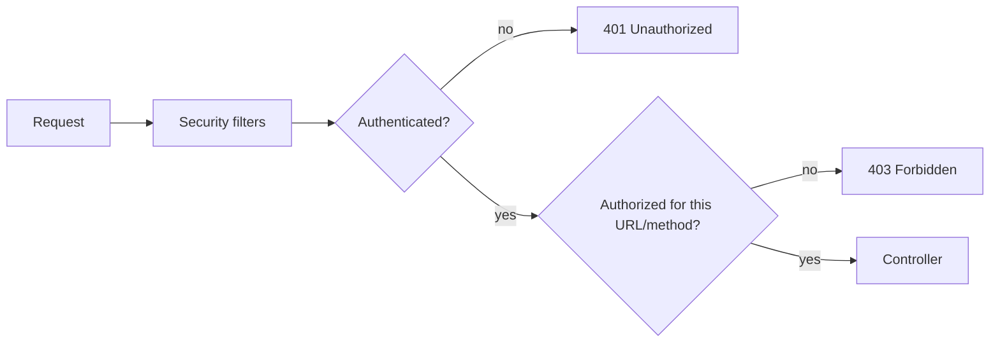

### Check yourself (Part VI)

1. Difference between authentication and authorization?
2. Why disable CSRF for a pure JWT API but not for cookie session form login?
3. Why add `@PreAuthorize` on services in addition to URL rules?

**Docs hub:** [Spring Security](https://docs.spring.io/spring-security/reference/) · [JWT Resource Server](https://docs.spring.io/spring-security/reference/servlet/oauth2/resource-server/jwt.html) · [Method Security](https://docs.spring.io/spring-security/reference/servlet/authorization/method-security.html)


### 401 vs 403

| Code | Meaning | Typical cause |
|------|---------|---------------|
| 401 | Not authenticated | Missing/invalid token/session |
| 403 | Authenticated, not allowed | Role/authority failed |

If you "fix" a 403 by disabling security, you learned nothing — fix authorities or matchers.

### Multi-chain apps

Common pattern: `@Order(1)` chain for `/api/**` (JWT, CSRF off), `@Order(2)` chain for browser admin (form login, CSRF on). Always set `securityMatcher` so chains don't steal each other's requests.


## Topic Atlas — Module 5 — Spring Security 6.x+

Every syllabus topic for this chapter. Read the lesson above first; use this atlas to drill and dive into docs.

### Architecture

#### Spring Security

Spring Security is the de-facto framework for authentication (proving identity) and authorization (controlling access) in Spring applications. It integrates as a servlet filter chain that runs before your controllers on every HTTP request, so security is enforced consistently rather than ad hoc in each endpoint. In real projects you add `spring-boot-starter-security` and immediately get sensible defaults: all endpoints require authentication until you explicitly open them. Production teams gate releases with automated tests on auth endpoints and review every permitAll path in security audits.

> **Watch out:** Adding starter-security without custom SecurityFilterChain — random default password and all routes locked.

**Official docs:** [Spring Security](https://docs.spring.io/spring-security/reference)

#### SecurityFilterChain

A `SecurityFilterChain` is an ordered list of security filters that process each HTTP request — authentication, authorization, CSRF, session management, and more. In Spring Security 6 you define it as a `@Bean` using the lambda DSL inside `filterChain(HttpSecurity http)`, replacing the deprecated `WebSecurityConfigurerAdapter`. Real projects often define multiple chains with `@Order`: one for stateless JWT APIs and another for browser form login. Assign explicit securityMatcher per chain when browser UI and REST API coexist so CSRF and session settings do not bleed across paths.

> **Watch out:** Single chain with csrf disabled — breaks form-login admin on same application.

**Official docs:** [SecurityFilterChain](https://docs.spring.io/spring-security/reference)

#### FilterChainProxy

FilterChainProxy is the Spring Security servlet filter that delegates incoming requests to the correct `SecurityFilterChain` bean. When you define multiple chains (API vs web), it selects the first chain whose request matcher fits the URL. It bridges the servlet container's filter model and Spring's composable security filter architecture. Log which chain matched failed requests in staging to catch reverse-proxy path-prefix mismatches early.

> **Watch out:** JWT chain without securityMatcher — form-login chain handles /api and returns HTML.

**Official docs:** [FilterChainProxy](https://docs.spring.io/spring-boot/reference/)

#### DelegatingFilterProxy

DelegatingFilterProxy is a standard servlet `Filter` registered in the container that delegates work to a Spring-managed bean — typically the `FilterChainProxy`. This lets Spring Security participate in the servlet filter chain while still using dependency injection and lifecycle management. Boot's security auto-configuration registers it automatically so you do not manually touch `web.xml`. For external Tomcat WAR deploys, confirm FilterChainProxy is registered; missing filter means controllers run completely unsecured.

> **Watch out:** Manual servlet Filter without delegating to Spring bean — SecurityFilterChain never runs.

**Official docs:** [DelegatingFilterProxy](https://docs.spring.io/spring-boot/reference/)

#### OncePerRequestFilter

OncePerRequestFilter is a base class guaranteeing your filter executes exactly once per request, even when the request is forwarded or included internally. Extend it for custom security filters: API key validation, tenant header extraction, or JWT parsing before username/password auth. Register it explicitly with `addFilterBefore` or `addFilterAfter` relative to filters like `UsernamePasswordAuthenticationFilter`. JWT parsing filters should fail fast with 401 and stop the chain; do not fall through to anonymous or form login.

> **Watch out:** Extending Filter instead of OncePerRequestFilter — double execution on internal forwards.

**Official docs:** [OncePerRequestFilter](https://docs.spring.io/spring-boot/reference/)

#### SecurityContext

SecurityContext is the holder object storing the current `Authentication` for the duration of a request or thread. It is populated after successful login, JWT validation, or OAuth2 callback processing. Your service code and SpEL expressions in `@PreAuthorize` read the authenticated principal and authorities from here. Custom filters must clear context in finally blocks to prevent thread-pool reuse leaking identities between requests.

> **Watch out:** Storing auth only in request attribute — @PreAuthorize still sees empty context.

**Official docs:** [SecurityContext](https://docs.spring.io/spring-security/reference)

#### SecurityContextHolder

SecurityContextHolder is the static accessor for the current `SecurityContext`, defaulting to a `ThreadLocal` strategy in servlet apps. Controllers use `@AuthenticationPrincipal`, while SpEL uses `authentication` and `principal` in expressions. In reactive WebFlux apps, context propagates via `ReactiveSecurityContextHolder` instead of thread locals. Use DelegatingSecurityContextRunnable for async work; never assume ThreadLocal context survives thread hops.

> **Watch out:** Reading SecurityContext in @Async worker — authorization always fails.

**Official docs:** [SecurityContextHolder](https://docs.spring.io/spring-security/reference)

#### Authentication

Authentication represents who the user is: a principal (identity), credentials (often cleared after validation), and granted authorities (roles/permissions). An `AuthenticationProvider` creates a fully populated instance after validating a password, JWT, or OAuth token. The object lives in `SecurityContext` for the request and drives both URL-level and method-level authorization decisions. Clear credential fields after successful authentication to keep passwords and OTPs out of logs and heap dumps.

> **Watch out:** Logging Authentication after login — secrets still in credentials field.

**Official docs:** [Authentication](https://docs.spring.io/spring-security/reference)

#### Authorization

Authorization decides what an authenticated user may access — URLs, HTTP methods, or individual domain objects. It runs after authentication; unauthenticated users hit the authentication entry point (401), while authenticated but forbidden users hit the access denied handler (403). Configure it via `authorizeHttpRequests` in the filter chain and `@PreAuthorize` on service methods for defense in depth. Return ProblemDetail JSON with distinct 401 (unauthenticated) and 403 (forbidden) codes for API clients and observability.

> **Watch out:** URL security only — @Scheduled or Kafka listener bypasses HTTP rules calling services.

**Official docs:** [Authorization](https://docs.spring.io/spring-security/reference)

#### Principal

The principal is the identity object inside `Authentication` — usually a username string or a custom `UserDetails` implementation with profile fields. Access it in controllers via `@AuthenticationPrincipal UserDetails user` or `@AuthenticationPrincipal Jwt jwt` for OAuth2 resource servers. Mapping principal to your domain user ID is a common pattern in multi-layer apps. Use typed principals (userId, tenantId) instead of raw strings to avoid ambiguous lookups in multi-tenant services.

> **Watch out:** Casting Jwt principal to UserDetails — ClassCastException in OAuth2 resource server.

**Official docs:** [Principal](https://docs.spring.io/spring-boot/reference/)

#### GrantedAuthority / Role

GrantedAuthority is a permission string attached to Authentication, often named `ROLE_ADMIN` or `READ_INVOICES`. Roles are a convention: authorities prefixed with `ROLE_` that pair with `hasRole("ADMIN")` in security expressions. Fine-grained permissions use exact authority strings with `hasAuthority("READ_INVOICES")` without the prefix requirement. Normalize IdP groups and OAuth scopes to internal authorities once in UserDetailsService or JwtAuthenticationConverter.

> **Watch out:** DB stores ADMIN while code uses hasRole — requires ROLE_ADMIN prefix.

**Official docs:** [GrantedAuthority / Role](https://docs.spring.io/spring-security/reference)

#### `ROLE_` prefix convention

Spring Security's `hasRole()` expression automatically prepends `ROLE_` when matching authorities, so `hasRole("ADMIN")` looks for `ROLE_ADMIN` in the user's authority list. `hasAuthority()` matches the exact string with no prefix added — use it for permission-style names like `SCOPE_read` or `DELETE_USER`. When loading users from a database, store authorities consistently: either all as `ROLE_*` for roles or use permission strings without the prefix. Document authority naming in onboarding; mixed prefixed and plain strings cause subtle hasRole vs hasAuthority bugs.

> **Watch out:** hasRole('READ_USERS') when DB has READ_USERS without ROLE_ — silent 403.

**Official docs:** [`ROLE_` prefix convention](https://docs.spring.io/spring-boot/reference/)

#### `@EnableWebSecurity`

Place `@EnableWebSecurity` on a `@Configuration` class to activate Spring Security's web support and enable custom HTTP security setup beyond Boot defaults. It imports the core web security configuration infrastructure and expects you to define at least one `SecurityFilterChain` bean. Every secured Boot app with custom rules needs this annotation alongside your security config class. Centralize HTTP security in one @Configuration; multiple EnableWebSecurity classes confuse bean ordering.

> **Watch out:** No SecurityFilterChain bean — Boot auto-generates securing actuator and static assets.

**Official docs:** [`@EnableWebSecurity`](https://docs.spring.io/spring-security/reference)

#### `@EnableMethodSecurity`

Add `@EnableMethodSecurity` on a configuration class to activate `@PreAuthorize`, `@PostAuthorize`, and `@Secured` on service and controller methods. This secures the service layer even when callers bypass HTTP — internal jobs, tests, or multiple controllers hitting the same service. Enable `prePostEnabled = true` explicitly if you rely on SpEL in `@PreAuthorize`. Apply @PreAuthorize on @Service methods invoked from schedulers and listeners, not only @RestController endpoints.

> **Watch out:** Secured controller only — same service called from unsecured internal path.

**Official docs:** [`@EnableMethodSecurity`](https://docs.spring.io/spring-boot/reference/)

#### SecurityFilterChain bean (Spring Security 6)

The modern Spring Security 6 pattern defines HTTP security as a `@Bean SecurityFilterChain filterChain(HttpSecurity http)` method using the fluent lambda DSL. It fully replaces the deprecated `WebSecurityConfigurerAdapter` subclass approach removed in Security 6. Inside the bean you chain `authorizeHttpRequests`, `sessionManagement`, `csrf`, `oauth2ResourceServer`, and custom filters. Factor shared exceptionHandling, headers, and cors into reusable methods shared across ordered chains.

> **Watch out:** Copying deprecated configure(WebSecurity) patterns — compile errors on Security 6.

**Official docs:** [SecurityFilterChain bean (Spring Security 6)](https://docs.spring.io/spring-security/reference)

#### `requestMatchers`

Use `requestMatchers` to specify which HTTP requests a security rule applies to — by path pattern, HTTP method, or custom matcher. It replaces deprecated `antMatchers` and `mvcMatchers` from older Spring Security versions. Chain multiple rules from most specific to most general; the first match wins and stops evaluation. Order rules from most specific path to catch-all; first match wins and stops further evaluation.

> **Watch out:** Broad /.authenticated() before /public/ permitAll — public routes never reachable.

**Official docs:** [`requestMatchers`](https://docs.spring.io/spring-boot/reference/)

#### `permitAll()`

Call `permitAll()` on a request matcher to allow access without authentication — login pages, health checks, static assets, and OAuth callback URLs. The request still passes through the full filter chain; only the authorization requirement is waived. Public endpoints in production should be explicitly listed rather than relying on accidental openness. Restrict permitAll to explicit paths; avoid wildcard permitAll on production API gateways.

> **Watch out:** permitAll on / — exposes admin and internal endpoints publicly.

**Official docs:** [`permitAll()`](https://docs.spring.io/spring-security/reference)

#### `authenticated()`

Require `authenticated()` when any logged-in user may access the endpoint — identity verified but no specific role required. Unauthenticated requests receive 401 via the configured authentication entry point. Use for user profile, dashboard, or any logged-in-only feature without role granularity. Ensure an authentication mechanism exists (JWT, form, basic); authenticated() alone does not log users in.

> **Watch out:** authenticated() on stateless API without JWT config — endless 401 responses.

**Official docs:** [`authenticated()`](https://docs.spring.io/spring-boot/reference/)

#### `hasRole("ADMIN")`

Use `hasRole("ADMIN")` in URL rules or SpEL to require the `ROLE_ADMIN` authority — Spring prepends the `ROLE_` prefix automatically. Typical for admin consoles, user management APIs, and back-office operations. Combine with path matchers: `requestMatchers("/admin/**").hasRole("ADMIN")`. Mirror URL hasRole checks with @PreAuthorize on destructive service operations for defense in depth.

> **Watch out:** Test uses @WithMockUser(roles=ADMIN) but prod loads ROLE_ADMIN differently — false confidence.

**Official docs:** [`hasRole("ADMIN")`](https://docs.spring.io/spring-security/reference)

#### `hasAuthority("READ_USERS")`

Use `hasAuthority("READ_USERS")` when the permission string must match exactly, without Spring adding a `ROLE_` prefix. Ideal for fine-grained ACL-style permissions, OAuth2 scopes mapped to authorities, or custom permission enums from your database. Works in both `authorizeHttpRequests` and `@PreAuthorize` SpEL expressions. Map OAuth2 scopes like read:users to READ_USERS explicitly; scopes are not automatic authorities.

> **Watch out:** Using hasAuthority('SCOPE_read') without mapping — always forbidden.

**Official docs:** [`hasAuthority("READ_USERS")`](https://docs.spring.io/spring-boot/reference/)

#### `@Order` on SecurityFilterChain

When multiple `SecurityFilterChain` beans exist, annotate each with `@Order` — lower numeric values are evaluated first by `FilterChainProxy`. Typical pattern: `@Order(1)` for stateless JWT API paths under `/api/**`, `@Order(2)` for browser form login on everything else. Without explicit ordering, bean registration order is undefined and behavior flips between environments. Document chain precedence in team wiki: @Order(1) API JWT, @Order(2) browser session is a common split.

> **Watch out:** Same @Order on two chains — non-deterministic selection after redeploy.

**Official docs:** [`@Order` on SecurityFilterChain](https://docs.spring.io/spring-security/reference)


### Authentication

#### AuthenticationManager

AuthenticationManager is the central interface for authentication — call `authenticate(Authentication)` to validate credentials and receive a populated Authentication or an exception. It delegates to registered `AuthenticationProvider` implementations, trying each until one supports the token type. Spring exposes it as a bean used internally by login filters and available for programmatic login (impersonation or custom REST login endpoints). Expose AuthenticationManager @Bean only when implementing custom REST login; otherwise let filters use the shared manager.

> **Watch out:** Calling authenticate() without registered provider for token type — ProviderNotFoundException.

**Official docs:** [AuthenticationManager](https://docs.spring.io/spring-security/reference)

#### AuthenticationProvider

AuthenticationProvider is a pluggable component that validates a specific Authentication token type and returns a fully authenticated token or throws `AuthenticationException`. `DaoAuthenticationProvider` handles username/password; others exist for LDAP, SAML, and JWT. Register custom providers via `HttpSecurity.authenticationProvider()` or as `@Bean` for enterprise identity systems. Chain multiple providers for username/password plus custom API-key token types with supports() guards.

> **Watch out:** Replacing DaoAuthenticationProvider incorrectly — breaks default form login silently.

**Official docs:** [AuthenticationProvider](https://docs.spring.io/spring-security/reference)

#### UserDetailsService

UserDetailsService loads user-specific data by username from your database, LDAP, or external API. It returns a `UserDetails` object containing the password hash and granted authorities for `DaoAuthenticationProvider` to verify. This is the primary integration point between your user store and Spring Security's authentication pipeline. Cache UserDetails carefully; stale authorities after role change require cache eviction on permission updates.

> **Watch out:** Hitting DB on every request without cache — latency spike under load.

**Official docs:** [UserDetailsService](https://docs.spring.io/spring-boot/reference/)

#### UserDetails interface

UserDetails is the contract for user data Spring Security needs: username, password hash, authorities, and account flags (enabled, expired, locked, credentialsExpired). Build instances with `User.builder()` or a custom class that also carries app-specific fields like tenantId. The password field must be the encoded hash, never plaintext. Implement accountLocked and enabled flags from DB columns; do not ignore them in custom UserDetails classes.

> **Watch out:** Custom UserDetails always returns true for isEnabled — disabled users still authenticate.

**Official docs:** [UserDetails interface](https://docs.spring.io/spring-boot/reference/)

#### InMemoryUserDetailsManager

InMemoryUserDetailsManager stores users in memory for development, demos, and integration tests. Configure users via `User.withUsername(...).password(...).roles(...).build()` registered on the manager bean. Data is lost on restart and does not scale across instances — never use in production. Use @Profile("dev") or test @TestConfiguration so in-memory users never ship to production clusters.

> **Watch out:** InMemory users in default profile — lost on restart and exposed in prod.

**Official docs:** [InMemoryUserDetailsManager](https://docs.spring.io/spring-boot/reference/)

#### JdbcUserDetailsManager

JdbcUserDetailsManager loads users from standard JDBC tables (`users`, `authorities`) matching Spring Security's default schema. Quick setup when your schema aligns exactly; many legacy apps already have compatible tables. Production teams usually outgrow it and implement custom `UserDetailsService` for richer user models, soft deletes, and multi-tenancy. Align schema with Spring defaults or replace with custom UserDetailsService when you need joins for tenant or soft-delete.

> **Watch out:** Custom user schema without adapting queries — login always UserNotFound.

**Official docs:** [JdbcUserDetailsManager](https://docs.spring.io/spring-boot/reference/data/sql.html)

#### DaoAuthenticationProvider

DaoAuthenticationProvider is the default provider for username/password authentication. It uses UserDetailsService to load the user and PasswordEncoder to verify the presented password against the stored hash. Enabled automatically when form login or HTTP basic is configured. Register the same PasswordEncoder bean used at registration; mismatched encoders cause valid passwords to fail.

> **Watch out:** BCrypt at signup, plain compare at login — every password invalid.

**Official docs:** [DaoAuthenticationProvider](https://docs.spring.io/spring-security/reference)

#### PasswordEncoder

PasswordEncoder defines one-way password hashing — you must never store or compare plaintext passwords. Inject the same encoder bean into both DaoAuthenticationProvider and your user registration service so hash algorithm stays consistent. Spring Security 5+ requires an explicit encoder bean — there is no unsafe default. Rotate encoder via DelegatingPasswordEncoder during migration; never decode or compare plaintext in application code.

> **Watch out:** No PasswordEncoder @Bean — application fails to start on Boot 3.

**Official docs:** [PasswordEncoder](https://docs.spring.io/spring-security/reference)

#### BCryptPasswordEncoder

BCryptPasswordEncoder is Spring Security's recommended adaptive hashing algorithm with built-in salt per hash. Configure strength (cost factor) balancing security vs login latency — 10–12 is typical. Each hash embeds its own salt, so identical passwords produce different hashes. Tune strength for your SLA: higher strength resists brute force but adds login latency under peak traffic.

> **Watch out:** Identical passwords same hash — BCrypt uses per-hash salt; duplicate hashes mean static salt bug.

**Official docs:** [BCryptPasswordEncoder](https://docs.spring.io/spring-security/reference)

#### Argon2PasswordEncoder

Argon2PasswordEncoder implements the Password Hashing Competition winner — memory-hard and resistant to GPU cracking at similar time cost to BCrypt. Preferred when security policy or regulators require modern algorithms. Available via Spring Security's encoder factory; configure memory, iterations, and parallelism parameters. Set memory and parallelism for your container limits; OOM kills occur if Argon2 memory exceeds pod RAM.

> **Watch out:** Argon2 on tiny K8s pods without memory limits — OOMKilled during login spikes.

**Official docs:** [Argon2PasswordEncoder](https://docs.spring.io/spring-security/reference)

#### `{bcrypt}` password prefix

DelegatingPasswordEncoder uses prefixed hashes like `{bcrypt}$2a$10$...` where the algorithm id precedes the encoded password. Enables storing multiple hash formats during migration — old `{sha256}` users re-hash on next login to `{bcrypt}`. New passwords use the configured default encoder id. On login success, upgrade legacy {sha256} hashes to {bcrypt} transparently and persist new hash.

> **Watch out:** Storing bcrypt hash without {bcrypt} prefix — DelegatingPasswordEncoder rejects valid passwords.

**Official docs:** [`{bcrypt}` password prefix](https://docs.spring.io/spring-security/reference)

#### Form login

Form login is traditional browser authentication: user POSTs username/password to `/login`, server validates and creates an HTTP session identified by JSESSIONID cookie. Spring Security provides a default login page or accepts a custom template at `/login`. Best for server-rendered apps (Thymeleaf, JSP) where the browser manages cookies automatically. Enable CSRF for form login POST; SPAs posting to /login need CSRF token from cookie or meta tag.

> **Watch out:** Form login with csrf disabled on session chain — CSRF state-changing attacks.

**Official docs:** [Form login](https://docs.spring.io/spring-security/reference)

#### HTTP Basic authentication

HTTP Basic sends credentials on every request in the `Authorization: Basic base64(user:pass)` header. Simple for scripts, curl, and internal tools; server validates each request without session state. Browser shows a native credential popup if you rely on browser Basic. Restrict Basic to internal tools or actuator behind network policy; credentials repeat on every request.

> **Watch out:** Basic auth over HTTP — credentials base64 visible; TLS mandatory.

**Official docs:** [HTTP Basic authentication](https://docs.spring.io/spring-security/reference)

#### Basic auth disadvantages

Basic auth resends credentials on every request, increasing exposure if logs capture Authorization headers or TLS is misconfigured. Browsers cache credentials with no standard logout mechanism. No built-in token expiry or refresh — compromise lasts until password change. Prefer short-lived tokens over Basic for service accounts; rotate secrets and audit Authorization header logging.

> **Watch out:** Logging request headers in prod — Basic credentials captured in log aggregation.

**Official docs:** [Basic auth disadvantages](https://docs.spring.io/spring-boot/reference/)

#### Digest authentication

Digest authentication uses a challenge-response protocol so the password is not sent plaintext over the wire. Rarely used in modern systems — complexity without benefits now that HTTPS is universal. Spring Security supports it but JWT and OAuth2 dominate new development. Do not choose Digest for new systems; use OAuth2 client credentials or mTLS for machine auth instead.

> **Watch out:** Enabling Digest assuming encryption — only challenge-response, still needs TLS.

**Official docs:** [Digest authentication](https://docs.spring.io/spring-security/reference)

#### Remember-me authentication

Remember-me issues a persistent cookie allowing return visits without re-entering password on each session expiry. Spring Security stores a secure token server-side or in a signed cookie depending on configuration. Always use HTTPS and short-lived session plus long but revocable remember-me token. Use persistent token repository backed by DB or Redis so tokens can be revoked on password reset.

> **Watch out:** Remember-me on HTTP without Secure cookie — token theft via network sniffing.

**Official docs:** [Remember-me authentication](https://docs.spring.io/spring-security/reference)

#### Anonymous authentication

Anonymous authentication assigns a special Authentication with `ROLE_ANONYMOUS` to unauthenticated requests so SecurityContext is never null. Enables consistent SpEL checks: `isAnonymous()` vs `isAuthenticated()` on public and mixed endpoints. Public `@PreAuthorize` methods can distinguish anonymous from logged-in users. Anonymous users still traverse filters; use requestMatchers permitAll for truly public assets instead of relying on ROLE_ANONYMOUS.

> **Watch out:** Assuming anonymous means unauthenticated in SecurityContext — object exists with ROLE_ANONYMOUS.

**Official docs:** [Anonymous authentication](https://docs.spring.io/spring-security/reference)

#### Authentication entry point

The authentication entry point handles missing or failed authentication — typically 401 JSON for REST APIs or redirect to `/login` for browsers. Customize when default redirect behavior breaks SPA or mobile clients expecting JSON errors. Inject via `http.exceptionHandling().authenticationEntryPoint(...)`. REST APIs should return JSON 401 with WWW-Authenticate only when using Basic; SPAs need consistent JSON error body.

> **Watch out:** Default redirect to /login for API — SPA receives HTML instead of JSON 401.

**Official docs:** [Authentication entry point](https://docs.spring.io/spring-security/reference)

#### AccessDeniedHandler

AccessDeniedHandler runs when the user is authenticated but lacks permission — returns 403 Forbidden or a custom error page. Different from the entry point which handles unauthenticated access (401). Customize to return ProblemDetail JSON matching your API error format. Log 403 with principal and requested resource for SOC review; avoid exposing internal policy details in response body.

> **Watch out:** Same handler for 401 and 403 — clients cannot distinguish auth vs authorization failure.

**Official docs:** [AccessDeniedHandler](https://docs.spring.io/spring-boot/reference/)

#### Logout configuration

Configure logout URL, session invalidation, and cookie deletion (JSESSIONID, remember-me) via `http.logout()` in the security chain. Form logout typically requires CSRF token on POST to `/logout`. For JWT APIs, logout is client-side token discard plus optional server-side blocklist or refresh token revocation. Invalidate server session and delete cookies on logout; for JWT add refresh-token revocation or blocklist.

> **Watch out:** Logout only client-side for JWT — access token valid until exp without blocklist.

**Official docs:** [Logout configuration](https://docs.spring.io/spring-boot/reference/)

#### Session fixation protection

Session fixation protection issues a new session ID after successful authentication so an attacker who fixed a pre-login session ID cannot hijack the authenticated session. Enabled by default in Spring Security's session management. Critical for cookie-based login apps; irrelevant for pure stateless JWT APIs with no session. Keep session fixation protection enabled on cookie apps; disable sessions entirely on pure JWT APIs.

> **Watch out:** Disabling session fixation to fix login bug — opens session hijack after auth.

**Official docs:** [Session fixation protection](https://docs.spring.io/spring-boot/reference/)

#### Concurrent session control

Concurrent session control limits simultaneous active sessions per user — expire oldest or prevent new login when limit exceeded. Configure via `sessionManagement().maximumSessions(n)` with optional `maxSessionsPreventsLogin(true)`. Useful for licensed seats or high-security apps preventing credential sharing. Pair maximumSessions with Spring Session Redis so session registry is cluster-wide, not local JVM memory.

> **Watch out:** maximumSessions without shared registry — limit ineffective across multiple pods.

**Official docs:** [Concurrent session control](https://docs.spring.io/spring-boot/reference/)


### Session management

#### HttpSession

HttpSession is the server-side object storing user state across HTTP requests — attributes, creation time, and timeout metadata. The browser identifies the session via a cookie (typically JSESSIONID) sent on every request. It is the default persistence mechanism for form-login and server-rendered Spring MVC applications. Set reasonable session timeout and monitor active session counts; unbounded sessions increase heap and Redis memory.

> **Watch out:** Storing large objects in session — memory bloat and poor horizontal scale.

**Official docs:** [HttpSession](https://docs.spring.io/spring-session/reference/)

#### Session cookie (JSESSIONID)

The session cookie is sent by the browser on each request to identify which server-side HttpSession to load. Spring Boot defaults to the name JSESSIONID. Set HttpOnly (prevents JavaScript theft) and Secure (HTTPS only) flags in production via `server.servlet.session.cookie.*` properties. Set SameSite=Lax or Strict in production to reduce CSRF risk; Secure flag mandatory behind HTTPS.

> **Watch out:** JSESSIONID without Secure on HTTPS site — cookie leaked on accidental HTTP link.

**Official docs:** [Session cookie (JSESSIONID)](https://docs.spring.io/spring-session/reference/)

#### Stateful authentication

Stateful authentication means the server remembers the logged-in user in a session store while the client only holds a session ID cookie. Each request looks up the session to restore SecurityContext without re-validating credentials. Simple for monoliths and traditional web apps with Thymeleaf or JSP frontends. Sticky sessions without Spring Session cause random logouts behind round-robin load balancers.

> **Watch out:** Multiple pods with in-memory sessions — user alternates between logged-in and anonymous.

**Official docs:** [Stateful authentication](https://docs.spring.io/spring-security/reference)

#### Stateless authentication

Stateless authentication means the server stores no session; the client sends a token (usually JWT) on every request proving identity. Enables horizontal scaling without session replication or sticky load balancers. Standard architecture for REST APIs, SPAs, and mobile backends. Document that logout is client-side plus optional server blocklist; no HttpSession.invalidate() for JWT APIs.

> **Watch out:** Mixing session and JWT on same API prefix — unpredictable auth behavior.

**Official docs:** [Stateless authentication](https://docs.spring.io/spring-security/reference)

#### Spring Session

Spring Session externalizes HttpSession to Redis, JDBC, Hazelcast, or MongoDB while keeping the same HttpSession API in your code. Sessions survive app restarts and replicate across all instances without sticky load balancers. Add `spring-session-data-redis` and configure `spring.session.store-type=redis` in Boot. Configure Redis TTL aligned with session timeout; orphaned keys accumulate if TTL exceeds inactive interval.

> **Watch out:** Spring Session Redis down — all users logged out simultaneously at failover.

**Official docs:** [Spring Session](https://docs.spring.io/spring-session/reference/)

#### Spring Session JDBC

Spring Session JDBC persists session data in database tables instead of memory or Redis. Slower than Redis but avoids extra infrastructure when PostgreSQL or MySQL is already in your stack. Suitable for small-to-medium clusters with moderate concurrent session counts. Index SPRING_SESSION tables and schedule cleanup; JDBC session store grows without expiry job.

> **Watch out:** High write volume to session tables — DB becomes bottleneck vs Redis.

**Official docs:** [Spring Session JDBC](https://docs.spring.io/spring-session/reference/)

#### Session clustering

Session clustering shares HttpSession data across multiple application instances so any node can serve any authenticated user. Achieved via Spring Session + Redis or sticky sessions at the load balancer. Required for stateful cookie auth behind round-robin load balancing without forced re-login. Prefer Spring Session over sticky sessions alone; sticky breaks when nodes drain during deploys.

> **Watch out:** Sticky sessions only — users forced re-login when pod killed during rollout.

**Official docs:** [Session clustering](https://docs.spring.io/spring-boot/reference/)

#### Session timeout

Configure inactive session expiry via `server.servlet.session.timeout` (e.g. `30m` or `3600s`). Server invalidates the session after the idle period; user must log in again. Align gateway idle timeout with session timeout; shorter proxy timeout causes mysterious mid-session logouts.

> **Watch out:** Very long session timeout — stolen session cookie usable for hours.

**Official docs:** [Session timeout](https://docs.spring.io/spring-boot/reference/)

#### `@EnableRedisHttpSession`

`@EnableRedisHttpSession` enables Redis-backed HTTP sessions with Spring Session, replacing in-memory Tomcat sessions. Sessions survive deploys and replicate across pods in Kubernetes. Set `spring.session.store-type=redis` and configure Redis connection in Boot properties. Secure Redis with TLS and ACL in production; session data contains authenticated user attributes.

> **Watch out:** Redis without password on public network — session hijack via key read.

**Official docs:** [`@EnableRedisHttpSession`](https://docs.spring.io/spring-session/reference/)


### JWT (JSON Web Tokens)

#### JWT structure (header.payload.signature)

A JWT consists of three Base64url-encoded parts separated by dots: header, payload, and signature. The header declares the signing algorithm (e.g., RS256) and token type; the payload holds claims; the signature proves integrity using a shared secret or private key. Anyone can decode header and payload—they are not encrypted, only signed. Treat payload as public; never put PII or secrets in claims without encryption (JWE).

> **Watch out:** Putting credit card or password in JWT payload — visible to anyone decoding.

**Official docs:** [JWT structure (header.payload.signature)](https://docs.spring.io/spring-security/reference)

#### JWT claims

Claims are key-value pairs in the JWT payload—standard registered claims include `sub` (subject), `exp` (expiry), `iat` (issued at), `iss` (issuer), and `aud` (audience). Custom claims commonly carry roles, tenant ID, or permissions for authorization without a database lookup. Keep claims minimal to reduce token size on every request. Validate iss, aud, and sub on every request; custom roles claim should be signed, not trusted from client.

> **Watch out:** Trusting client-supplied roles claim without signature verify — privilege escalation.

**Official docs:** [JWT claims](https://docs.spring.io/spring-security/reference)

#### JWT signing (HMAC vs RSA)

HMAC (HS256) uses a symmetric secret to sign and verify—simple for monoliths where one service both issues and validates tokens. RSA/EC (RS256, ES256) uses asymmetric keys: private key signs, public key verifies—better for distributed systems and OAuth2 where many resource servers trust one authorization server. Never share private keys across services; publish public keys via JWK Set URI. Use RS256 when multiple services verify tokens; share only public keys via JWK Set, never HMAC secret broadly.

> **Watch out:** Shared HS256 secret across ten microservices — one leak compromises all.

**Official docs:** [JWT signing (HMAC vs RSA)](https://docs.spring.io/spring-security/reference)

#### Access token

An access token is a short-lived JWT (typically 5–15 minutes) authorizing API requests. Clients send it as a Bearer token in the Authorization header on each call. Short expiry limits damage if the token is stolen or logged. Keep access tokens off URLs and logs; use Authorization header only to avoid leakage via Referer and access logs.

> **Watch out:** Access token in query string for SSE — logged in proxies and browser history.

**Official docs:** [Access token](https://docs.spring.io/spring-boot/reference/)

#### Refresh token

A refresh token is a long-lived credential used only to obtain new access tokens at a dedicated token endpoint—not sent on every API call. Store it securely: HttpOnly cookie for browser apps or OS secure storage for mobile. Rotate refresh tokens on each use and revoke on logout or password change. Rotate refresh tokens and detect reuse to invalidate token families on theft.

> **Watch out:** Long-lived refresh token in localStorage — XSS steals prolonged access.

**Official docs:** [Refresh token](https://docs.spring.io/spring-boot/reference/)

#### Bearer token

Bearer token is the HTTP Authorization scheme: `Authorization: Bearer <token>`. The word Bearer means whoever presents the token is assumed authorized—no additional proof required beyond valid token. Standard for REST APIs consuming JWT access tokens. Combine with HTTPS and short exp; Bearer alone means possession equals authorization.

> **Watch out:** Accepting token in custom header without standard validation — inconsistent security.

**Official docs:** [Bearer token](https://docs.spring.io/spring-boot/reference/)

#### JWT expiration (`exp` claim)

The `exp` claim is a Unix timestamp after which the JWT must be rejected as expired. Resource servers must validate `exp` on every request without exception—clock skew tolerance is typically a few minutes. Keep access token `exp` short (minutes); use refresh tokens for longer sessions. Sync resource server clock with NTP; skew causes false exp rejections or accepting expired tokens.

> **Watch out:** Ignoring exp validation in custom JwtDecoder — expired tokens accepted.

**Official docs:** [JWT expiration (`exp` claim)](https://docs.spring.io/spring-security/reference)

#### JWT validation

JWT validation verifies the signature with secret or public key, confirms `exp` has not passed, and optionally validates `iss`, `aud`, and `nbf` claims. Invalid signature, wrong issuer, or expired token must reject the request with 401. Spring OAuth2 resource server performs this when configured with `issuer-uri` or `jwk-set-uri`. Validate alg against allow-list; reject none algorithm and unexpected signing methods.

> **Watch out:** Parsing JWT without signature verify — attacker forges admin claims.

**Official docs:** [JWT validation](https://docs.spring.io/spring-security/reference)

#### `spring-boot-starter-oauth2-resource-server`

This starter adds JWT and OAuth2 token validation to your API as a resource server—it auto-configures security filters that extract and validate Bearer tokens. Add the dependency and configure issuer or JWK URI in properties; no custom filter code required for standard OIDC providers. Protects endpoints without session management—ideal for stateless REST APIs. Pair starter with spring.security.oauth2.resourceserver.jwt.issuer-uri for OIDC discovery auto-config.

> **Watch out:** Starter added but no issuer-uri — context fails or all routes 401.

**Official docs:** [`spring-boot-starter-oauth2-resource-server`](https://docs.spring.io/spring-security/reference)

#### `spring.security.oauth2.resourceserver.jwt`

These Boot configuration properties configure JWT validation—set `issuer-uri` for OIDC discovery or `jwk-set-uri` for direct public key fetch. Boot auto-discovers JWK Set and issuer metadata from well-known endpoints when using `issuer-uri`. Point to Keycloak realm, Auth0 tenant, or your authorization server base URL. Use issuer-uri for OIDC providers; jwk-set-uri when issuer metadata unavailable behind firewall.

> **Watch out:** Wrong issuer-uri trailing slash — JWK fetch fails intermittently.

**Official docs:** [`spring.security.oauth2.resourceserver.jwt`](https://docs.spring.io/spring-security/reference)

#### JWK Set URI

JWK Set URI is the URL returning a JSON Web Key Set—public keys used to verify JWT signatures signed with asymmetric algorithms. Spring caches keys and refreshes when encountering unknown `kid` (key id) in token header. Standard OIDC path: `{issuer}/.well-known/jwks.json`. Cache rotation handles kid changes; monitor auth server key rollover in staging before production cutover.

> **Watch out:** Hardcoding single RSA public key — tokens fail after IdP key rotation.

**Official docs:** [JWK Set URI](https://docs.spring.io/spring-boot/reference/)

#### Token revocation / blocklist

Token revocation invalidates JWTs before natural `exp`—needed for logout, password change, admin ban, or compromised token response. Pure JWTs cannot be revoked server-side without extra infrastructure; store revoked token `jti` or token hash in Redis with TTL matching remaining token lifetime. Check blocklist in a filter or custom `JwtDecoder` wrapper after signature validation. Store jti or token hash in Redis with TTL equal to remaining exp; check after signature validation.

> **Watch out:** Expecting JWT logout without blocklist — token works until natural exp.

**Official docs:** [Token revocation / blocklist](https://docs.spring.io/spring-boot/reference/)

#### jjwt library

jjwt (Java JWT) is a popular standalone library for manually creating, parsing, and validating JWTs outside Spring OAuth2 resource server. Use when you operate your own auth server in Boot without full OAuth2 Authorization Server framework, or need custom claim logic. You handle signing algorithm choice, key management, and validation rules explicitly. Prefer Spring JwtDecoder when possible; manual jjwt requires rigorous alg, exp, and key management.

> **Watch out:** jjwt parse without verify signature — critical security hole.

**Official docs:** [jjwt library](https://docs.spring.io/spring-security/reference)

#### Nimbus JOSE JWT

Nimbus JOSE JWT is the industry-standard low-level Java library for JWT, JWS, JWE, and JWK used internally by Spring Security OAuth2. It provides advanced operations: nested JWT, encrypted tokens, and custom JWS algorithms. Application code rarely imports it directly—configure via Spring properties and `JwtDecoder` beans instead. Spring wraps Nimbus; customize via NimbusJwtDecoder.withPublicKey rather than reimplementing crypto.

> **Watch out:** Adding nimbus directly duplicating Spring config — two decoders conflict.

**Official docs:** [Nimbus JOSE JWT](https://docs.spring.io/spring-security/reference)


### OAuth2 & OpenID Connect

#### OAuth2

OAuth2 is an industry-standard protocol for delegated authorization—users grant third-party applications limited access without sharing their password. Authorization flows exchange a user consent step for access tokens that APIs consume. It powers "Login with Google," machine-to-machine API access, and mobile app backends. Treat access tokens as opaque capability grants; scope minimization reduces blast radius on token leak.

> **Watch out:** Confusing OAuth2 authorization with authentication — use OIDC when identity required.

**Official docs:** [OAuth2](https://docs.spring.io/spring-security/reference)

#### OpenID Connect (OIDC)

OpenID Connect is an identity layer built on OAuth2 that adds authentication via an ID token—a JWT proving who the user is. Standard scopes include `openid`, `profile`, and `email` for basic user info. Use OIDC when you need to know the user's identity, not just API access permission. Always request openid scope for login flows; access token alone does not prove user identity.

> **Watch out:** Using access token claims as identity without ID token validation — wrong subject.

**Official docs:** [OpenID Connect (OIDC)](https://docs.spring.io/spring-security/reference)

#### OAuth2 Authorization Code flow

Authorization Code flow is the most secure OAuth2 pattern for web and mobile apps: redirect user to provider, user consents, provider redirects back with a short-lived code, server exchanges code for tokens server-side. Tokens never pass through browser JavaScript when exchange happens on the backend. This is the default and recommended flow for confidential clients (server-side Spring Boot apps). Exchange code server-side only; never expose client secret in SPA or mobile binaries.

> **Watch out:** Implicit or code in frontend without PKCE — token interception risk.

**Official docs:** [OAuth2 Authorization Code flow](https://docs.spring.io/spring-security/reference)

#### Authorization Code + PKCE

PKCE (Proof Key for Code Exchange) adds a code verifier and challenge to Authorization Code flow, preventing authorization code interception attacks. Required for SPAs, mobile apps, and any public client that cannot securely store a client secret. Spring Security OAuth2 client enables PKCE automatically for public clients registered in configuration. Require PKCE for all public clients including mobile; Spring enables PKCE for public registrations.

> **Watch out:** Public SPA without PKCE — stolen authorization code exchanged by attacker.

**Official docs:** [Authorization Code + PKCE](https://docs.spring.io/spring-security/reference)

#### Client Credentials flow

Client Credentials flow is machine-to-machine OAuth2: the client presents client ID and secret (or certificate) to obtain an access token with no user involved. Used for service accounts, batch jobs, and microservice-to-microservice API calls. Store client secrets in secrets manager or Kubernetes secrets—never in source code or frontend. Scope client credentials tokens to least privilege; rotate client secrets via secrets manager.

> **Watch out:** Shared client secret in git — full API access if repo leaked.

**Official docs:** [Client Credentials flow](https://docs.spring.io/spring-boot/reference/)

#### Resource Owner Password flow

Resource Owner Password Credentials flow lets the app collect username and password directly and exchange them for tokens at the token endpoint. It is deprecated in OAuth 2.1 and discouraged by security best practices because apps handle raw passwords. Only acceptable for highly trusted first-party legacy migrations with an exit plan to Authorization Code flow. Migrate to Authorization Code with PKCE; password flow bypasses consent and MFA at IdP.

> **Watch out:** New mobile app using password grant — fails security review and compliance.

**Official docs:** [Resource Owner Password flow](https://docs.spring.io/spring-boot/reference/)

#### OAuth2 Authorization Server

An OAuth2 Authorization Server issues access tokens, refresh tokens, and (for OIDC) ID tokens after validating client and user credentials. Examples include Keycloak, Auth0, Okta, Azure AD, and Spring Authorization Server. Your resource APIs trust tokens signed by this server—they do not login users themselves. Run auth server separately from business APIs; resource servers only validate JWT, never store passwords.

> **Watch out:** Building custom auth server without security review — subtle OAuth bugs.

**Official docs:** [OAuth2 Authorization Server](https://docs.spring.io/spring-security/reference)

#### OAuth2 Resource Server

An OAuth2 Resource Server is your API that validates Bearer tokens issued by an external authorization server—it does not perform login or issue tokens. Add `spring-boot-starter-oauth2-resource-server` and configure `issuer-uri` or `jwk-set-uri`. Each microservice can independently validate JWTs without calling the auth server per request. Configure issuer-uri once per service; avoid calling IdP introspection per request when JWT validation suffices.

> **Watch out:** Resource server performing login redirect — wrong role; use OAuth2 client for login.

**Official docs:** [OAuth2 Resource Server](https://docs.spring.io/spring-security/reference)

#### OAuth2 Client

An OAuth2 Client is an application that redirects users to an external identity provider for login and handles the callback to establish a local session or token. Spring Security OAuth2 client auto-configures redirect URIs, token exchange, and user info retrieval. Used for "Login with Google/GitHub/Okta" in Boot web apps. Register exact redirect URIs per environment; trailing slash mismatch causes intermittent login failures.

> **Watch out:** Wildcard redirect URI in production OAuth app — open redirect vulnerability.

**Official docs:** [OAuth2 Client](https://docs.spring.io/spring-security/reference)

#### `spring-boot-starter-oauth2-client`

This Boot starter enables your application to act as an OAuth2/OIDC client for social and enterprise login. Auto-configures security filter chain entries for `/oauth2/authorization/{registrationId}` redirect and `/login/oauth2/code/{registrationId}` callback. Configure provider details under `spring.security.oauth2.client.registration.*` and `provider.*` in YAML. Store client-secret in env or vault; use spring.security.oauth2.client.registration.* per provider.

> **Watch out:** Committing client-secret in application.yml to git — credential leak.

**Official docs:** [`spring-boot-starter-oauth2-client`](https://docs.spring.io/spring-security/reference)

#### Google OAuth2 login Spring Boot

Google OAuth2 login lets users authenticate via their Google account in your Spring Boot app. Register an OAuth 2.0 Client in Google Cloud Console, obtain client ID and secret, and add a `google` client registration in `application.yml`. Spring Security exposes `/oauth2/authorization/google` to start the flow. Verify hosted domain hd claim if restricting to company Google Workspace users.

> **Watch out:** Allowing any Google account when app is internal — data exposure to personal Gmail.

**Official docs:** [Google OAuth2 login Spring Boot](https://docs.spring.io/spring-security/reference)

#### GitHub OAuth2 login Spring Boot

GitHub OAuth2 login authenticates users via their GitHub account—common for developer tools and internal admin panels. Create an OAuth App in GitHub Settings → Developer settings, set callback URL to `{baseUrl}/login/oauth2/code/github`, and configure client ID/secret in Boot properties. GitHub returns user profile via API after token exchange. Map GitHub org membership to authorities; GitHub login alone does not prove org affiliation.

> **Watch out:** GitHub login for prod admin without org check — any GitHub user becomes admin.

**Official docs:** [GitHub OAuth2 login Spring Boot](https://docs.spring.io/spring-security/reference)

#### OIDC ID Token

The OIDC ID Token is a JWT issued by the identity provider proving the authenticated user's identity—it contains claims like `sub`, `email`, `name`, and `iss`. Distinct from the access token which authorizes API calls to resource servers. Validate ID token signature, issuer, audience, and expiry like any JWT. Validate aud matches your client_id and nonce for implicit/hybrid flows prevented in modern apps.

> **Watch out:** Trusting ID token without signature verify — forged identity.

**Official docs:** [OIDC ID Token](https://docs.spring.io/spring-security/reference)

#### OAuth2 scopes

OAuth2 scopes define the permissions an application requests during authorization—the user sees them on the consent screen. Standard OIDC scopes: `openid` (required for OIDC), `profile`, `email`. Custom scopes like `read:users` or `billing:write` map to API permissions. Request minimum scopes on consent screen; over-scoping erodes user trust and increases leak impact.

> **Watch out:** Requesting admin scope for read-only dashboard — unnecessary privilege.

**Official docs:** [OAuth2 scopes](https://docs.spring.io/spring-security/reference)

#### Redirect URI

Redirect URI is the callback URL the OAuth2 provider sends the user to after login with the authorization code. Must exactly match a URI registered in the provider's app configuration—character for character including scheme, port, and path. Spring Boot default: `{baseUrl}/login/oauth2/code/{registrationId}`. Use separate redirect URIs for local, staging, prod; never copy prod URI into dev registration.

> **Watch out:** http://localhost redirect registered in prod OAuth client — insecure callback.

**Official docs:** [Redirect URI](https://docs.spring.io/spring-boot/reference/)

#### Keycloak

Keycloak is an open-source identity and access management platform serving as OAuth2/OIDC authorization server with user management, SSO, social login, and MFA. Self-hosted alternative to Auth0/Okta—full control over data and customization. Integrates with Spring Boot via standard `issuer-uri` configuration pointing to your Keycloak realm. Run Keycloak HA with external DB; realm export/import for disaster recovery and environment promotion.

> **Watch out:** Single-node Keycloak without backup — SSO outage blocks all logins.

**Official docs:** [Keycloak](https://docs.spring.io/spring-boot/reference/)

#### Auth0 / Okta / Cognito

Auth0, Okta, and AWS Cognito are managed identity platforms providing hosted OAuth2/OIDC authorization servers with dashboards, MFA, social login, and user directories. Reduce operational burden compared to self-hosted Keycloak—no patching, HA, or key rotation to manage. Configure as OAuth2 provider in Spring Boot YAML with tenant-specific issuer-uri and client credentials. Configure custom claims and actions at IdP for roles rather than hardcoding in each microservice.

> **Watch out:** Different issuer strings per environment hardcoded — token validation fails after migration.

**Official docs:** [Auth0 / Okta / Cognito](https://docs.spring.io/spring-boot/reference/)


### Authorization

#### Role-Based Access Control (RBAC)

RBAC grants access based on named roles assigned to users—ADMIN, USER, MANAGER—rather than individual permissions per resource. Simple to implement and audit: map database role tables to `GrantedAuthority` at login, check with `hasRole()` in URL rules or `@PreAuthorize`. Suitable for most business apps where access aligns with job titles. Keep role count manageable; explosion of roles signals need for ABAC or permission tables.

> **Watch out:** Copying ROLE_ per feature — unmaintainable role matrix and wrong defaults.

**Official docs:** [Role-Based Access Control (RBAC)](https://docs.spring.io/spring-boot/reference/)

#### Attribute-Based Access Control (ABAC)

ABAC makes access decisions based on attributes of the user, resource, action, and environment—department, resource owner, time of day, IP address. More flexible than RBAC for complex policies like "managers can approve expenses in their department during business hours." Express ABAC rules via SpEL in `@PreAuthorize`: `#order.userId == authentication.principal.id`. Real multi-tenant SaaS apps combine RBAC (coarse roles) with ABAC (row-level ownership checks). Centralize complex SpEL in @Bean methods like @authz.canEdit(#id) instead of duplicating expressions.

> **Watch out:** Huge SpEL in every method — untestable and error-prone authorization logic.

**Official docs:** [Attribute-Based Access Control (ABAC)](https://docs.spring.io/spring-boot/reference/)

#### URL-based authorization

URL-based authorization secures HTTP endpoints by path pattern in the `SecurityFilterChain`—`/admin/**` requires ADMIN, `/api/public/**` is permitAll. First matching rule wins, so order from most specific to most general. Coarse-grained but fast and easy to audit in one configuration class. Supplement URL rules with method security; URL alone misses non-HTTP entry points.

> **Watch out:** Only securing /admin/ — actuator or alternate path exposes admin APIs.

**Official docs:** [URL-based authorization](https://docs.spring.io/spring-security/reference)

#### Method-level security

Method-level security protects individual Java methods with `@PreAuthorize`, `@PostAuthorize`, or `@Secured` regardless of how the method is invoked. Essential defense in depth—service methods called from schedulers, message listeners, or multiple controllers stay protected even if URL rules change. Requires `@EnableMethodSecurity` on a configuration class. Enable in test profile too so @PreAuthorize behavior matches production in CI.

> **Watch out:** Method security disabled in tests — green CI, 403 in production.

**Official docs:** [Method-level security](https://docs.spring.io/spring-boot/reference/)

#### `@PreAuthorize("hasRole('ADMIN')")`

`@PreAuthorize` evaluates a SpEL expression before the method executes—access denied (403) if expression returns false. `hasRole('ADMIN')` requires `ROLE_ADMIN` authority. Can reference method parameters: `@PreAuthorize("#userId == authentication.principal.id")` for ownership checks. Use @authz bean for dynamic rules; hasRole alone insufficient for row-level ownership.

> **Watch out:** PreAuthorize on controller without proxy — annotation ignored on concrete class.

**Official docs:** [`@PreAuthorize("hasRole('ADMIN')")`](https://docs.spring.io/spring-security/reference)

#### `@PostAuthorize`

`@PostAuthorize` evaluates SpEL after the method returns, allowing access decisions based on the return value. Example: `@PostAuthorize("returnObject.owner == authentication.name")` ensures users only receive their own data. Can filter collections: `@PostAuthorize("filterObject.owner == authentication.name")` on list returns. PostAuthorize runs method first — avoid on expensive queries when deny should happen before work.

> **Watch out:** PostAuthorize on list returning all rows then filtering — data leak before filter.

**Official docs:** [`@PostAuthorize`](https://docs.spring.io/spring-boot/reference/)

#### `@Secured("ROLE_ADMIN")`

`@Secured` is a legacy Spring Security annotation listing required role names as string array—no SpEL support, simpler but less flexible than `@PreAuthorize`. Enable via `@EnableMethodSecurity(securedEnabled = true)`. Role strings must include `ROLE_` prefix explicitly unlike `hasRole()` in PreAuthorize. Prefer @PreAuthorize for SpEL; @Secured requires ROLE_ prefix literally in annotation string.

> **Watch out:** @Secured("ADMIN") without ROLE_ prefix — never matches hasRole semantics.

**Official docs:** [`@Secured("ROLE_ADMIN")`](https://docs.spring.io/spring-boot/reference/)

#### `@RolesAllowed("ADMIN")`

`@RolesAllowed` is the JSR-250 standard security annotation portable across Java EE and Spring. Equivalent to `@Secured` but uses role names without requiring `ROLE_` prefix in the annotation—Spring maps "ADMIN" to `ROLE_ADMIN`. Enable via `@EnableMethodSecurity(jsr250Enabled = true)`. JSR-250 portable but less expressive than PreAuthorize; enable jsr250Enabled explicitly.

> **Watch out:** Mixing @RolesAllowed and @PreAuthorize without enabling both — one set silently ignored.

**Official docs:** [`@RolesAllowed("ADMIN")`](https://docs.spring.io/spring-boot/reference/)

#### SpEL in `@PreAuthorize`

SpEL (Spring Expression Language) enables dynamic authorization rules referencing method parameters, authentication, and custom beans. Examples: `#id == authentication.principal.id`, `hasAuthority('DELETE')`, `@authz.canEdit(#entity)`. Access parameters by name: `#orderId`, `#user.email`. Register MethodSecurityExpressionHandler for custom root objects; test SpEL with @SpringBootTest security.

> **Watch out:** Renamed parameter without @P — SpEL #id undefined, deny all.

**Official docs:** [SpEL in `@PreAuthorize`](https://docs.spring.io/spring-security/reference)

#### `@EnableMethodSecurity(prePostEnabled=true)`

`@EnableMethodSecurity(prePostEnabled = true)` explicitly enables processing of `@PreAuthorize` and `@PostAuthorize` annotations on Spring beans. In recent Spring Security versions, `@EnableMethodSecurity` enables pre/post by default, but explicit flag documents intent. Also configure `securedEnabled` and `jsr250Enabled` for `@Secured` and `@RolesAllowed` support. Also enable securedEnabled if legacy @Secured annotations remain in codebase.

> **Watch out:** Assuming annotations work without EnableMethodSecurity — open service methods.

**Official docs:** [`@EnableMethodSecurity(prePostEnabled=true)`](https://docs.spring.io/spring-boot/reference/)

#### Method security on `@Service`

Apply `@PreAuthorize` on `@Service` layer methods, not only controllers, for defense in depth. Controllers are one entry point—schedulers, Kafka listeners, `@Async` methods, and other services also invoke business logic. Securing only the REST layer leaves backdoor access through any unprotected caller. Audit all @Service public methods for PreAuthorize when exposing new Kafka or scheduler entry points.

> **Watch out:** Secured REST layer only — batch job invokes same service without auth.

**Official docs:** [Method security on `@Service`](https://docs.spring.io/spring-framework/reference/core.html)

#### Domain object security (ACL)

Spring Security ACL module grants permissions on individual domain object instances—user X can edit Document Y but not Document Z. Persists ACL entries in database tables mapping object identities to SIDs (security identities). Complex setup with `MutableAclService`, `AclPermissionEvaluator`, and `@PreAuthorize("@aclService.hasPermission(#id, 'WRITE')")`. ACL tables grow quickly; many teams prefer row-level checks in repository queries over full ACL module.

> **Watch out:** ACL without cache — permission check hits DB on every method call.

**Official docs:** [Domain object security (ACL)](https://docs.spring.io/spring-boot/reference/)


### Web security extras

#### CSRF (Cross-Site Request Forgery)

CSRF is an attack where a malicious website tricks an authenticated user's browser into submitting an unwanted request to your app using the user's session cookie. The browser automatically sends cookies, so the server sees a valid session and may execute the action—transfer funds, change email, delete data. Spring Security validates a CSRF token on state-changing requests (POST, PUT, DELETE) for cookie-based sessions. Enable CSRF for cookie-session apps; double-submit cookie or synchronizer token pattern for SPAs.

> **Watch out:** Disabling CSRF globally while session cookie auth exists — state-changing CSRF attacks.

**Official docs:** [CSRF (Cross-Site Request Forgery)](https://docs.spring.io/spring-security/reference)

#### CSRF token

A CSRF token is a random secret embedded in forms or request headers that the server validates on state-changing requests—the malicious site cannot read or forge it due to same-origin policy. Spring Security generates and validates tokens automatically for form login. SPAs fetch the token from a dedicated endpoint or include it in a meta tag rendered server-side. Expose CSRF token to SPA via CookieCsrfTokenRepository with HttpOnly false for JavaScript header.

> **Watch out:** CSRF token in session but SPA never sends X-XSRF-TOKEN header — POST always 403.

**Official docs:** [CSRF token](https://docs.spring.io/spring-security/reference)

#### CSRF disabled for REST JWT APIs

Disabling CSRF for stateless REST APIs using Bearer JWT in Authorization header is standard practice—no session cookie means no automatic credential sending for CSRF to exploit. Configure via `.csrf(csrf -> csrf.disable())` on the JWT API security filter chain. Cookie-based session authentication must keep CSRF enabled—never disable globally if any endpoint uses session cookies. Disable CSRF only on stateless JWT chain, not on session admin UI in same app.

> **Watch out:** csrf().disable() on session-based chain — login cookie vulnerable to CSRF.

**Official docs:** [CSRF disabled for REST JWT APIs](https://docs.spring.io/spring-security/reference)

#### CORS + Spring Security

CORS (Cross-Origin Resource Sharing) controls which browser origins may call your API from JavaScript—separate from authentication. Configure allowed origins, methods, and headers via `http.cors()` in SecurityFilterChain or global `WebMvcConfigurer.addCorsMappings()`. Preflight OPTIONS requests must be permitted—often `requestMatchers(HttpMethod.OPTIONS, "/**").permitAll()`. Configure CORS before authorization; preflight OPTIONS must succeed without authentication.

> **Watch out:** CORS only in WebMvcConfigurer but not Security chain — browser blocks authenticated API.

**Official docs:** [CORS + Spring Security](https://docs.spring.io/spring-security/reference)

#### Security headers (HSTS, X-Frame-Options)

Security headers are HTTP response headers instructing browsers to enforce safer behavior. HSTS (Strict-Transport-Security) forces HTTPS for future visits. X-Frame-Options prevents clickjacking by blocking iframe embedding. Enable HSTS includeSubDomains only when all subdomains serve HTTPS permanently.

> **Watch out:** HSTS on domain with HTTP-only legacy subdomain — users locked out.

**Official docs:** [Security headers (HSTS, X-Frame-Options)](https://docs.spring.io/spring-boot/reference/)

#### Content Security Policy (CSP)

CSP is an HTTP header restricting which scripts, styles, images, and frames can load on your pages—primary defense against XSS injection. Define policy string listing allowed sources: `script-src 'self' https://cdn.example.com`. Stricter policies need thorough frontend testing to avoid breaking inline scripts and third-party widgets. Roll out CSP report-only first; tighten script-src after fixing inline script violations.

> **Watch out:** Strict CSP breaking Stripe or analytics scripts — checkout fails silently.

**Official docs:** [Content Security Policy (CSP)](https://docs.spring.io/spring-boot/reference/)

#### XSS (Cross-Site Scripting)

XSS injects malicious JavaScript into pages viewed by other users—stealing session cookies, defacing UI, or performing actions as the victim. Spring MVC does not auto-prevent XSS—you must encode output and validate input. Thymeleaf auto-escapes template variables by default; avoid `th:utext` with user content. Validate input and encode output; CSP is backup, not substitute for escaping user content.

> **Watch out:** th:utext with user HTML — stored XSS steals session cookie.

**Official docs:** [XSS (Cross-Site Scripting)](https://docs.spring.io/spring-boot/reference/)

#### Clickjacking protection

Clickjacking embeds your site in a transparent iframe on an attacker's page, tricking users into clicking your buttons unknowingly. Prevent with `X-Frame-Options: DENY` or `SAMEORIGIN`, or CSP `frame-ancestors 'none'`. Spring Security enables X-Frame-Options by default in headers config. Use CSP frame-ancestors for modern browsers; X-Frame-Options for legacy support.

> **Watch out:** SAMEORIGIN when app must not be framed at all — use DENY or frame-ancestors none.

**Official docs:** [Clickjacking protection](https://docs.spring.io/spring-boot/reference/)

#### HTTPS / TLS termination

HTTPS encrypts HTTP traffic in transit using TLS, protecting credentials, tokens, and session cookies from network interception. Terminate TLS at load balancer (ALB, nginx) or embedded server (Boot with keystore). When terminating at load balancer, app may see HTTP internally—set `server.forward-headers-strategy=framework` for correct redirect URLs. Terminate TLS at load balancer but forward proto headers so Spring generates https redirect URLs.

> **Watch out:** Missing X-Forwarded-Proto — Spring redirects to http:// behind HTTPS LB.

**Official docs:** [HTTPS / TLS termination](https://docs.spring.io/spring-boot/reference/)

#### `@EnableWebSecurity` + `@Bean SecurityFilterChain`

The modern Spring Security 6 pattern combines `@EnableWebSecurity` on a `@Configuration` class with a `@Bean SecurityFilterChain filterChain(HttpSecurity http)` method using the lambda DSL. Fully replaces deprecated `WebSecurityConfigurerAdapter` removed in Security 6. All HTTP security—auth rules, CSRF, headers, OAuth2, custom filters—configures inside the bean method. Colocate security headers, CORS, and oauth2 config in one chain bean per app surface.

> **Watch out:** Multiple conflicting SecurityFilterChain beans without @Order — random security behavior.

**Official docs:** [`@EnableWebSecurity` + `@Bean SecurityFilterChain`](https://docs.spring.io/spring-security/reference)

#### Custom authentication filter

Custom authentication filters extend `OncePerRequestFilter` to handle non-standard auth: API keys in headers, custom JWT parsing, tenant identification, or mutual TLS client certificates. Register with `addFilterBefore(customFilter, UsernamePasswordAuthenticationFilter.class)` on the SecurityFilterChain. On successful validation, populate `SecurityContextHolder` with an authenticated `Authentication` object. On success call SecurityContextHolder.getContext().setAuthentication; on failure clear context.

> **Watch out:** Filter sets principal but not authenticated flag — authorizeHttpRequests treats user as anonymous.

**Official docs:** [Custom authentication filter](https://docs.spring.io/spring-security/reference)

#### Multi-factor authentication (MFA)

MFA requires a second verification factor after password—TOTP authenticator app, SMS code, hardware security key, or push notification. Not built into Spring Security core; implement via custom login flow, step-up authentication filter, or delegate to identity provider MFA (Keycloak, Auth0, Okta). Required for compliance in finance, healthcare, and admin access. Delegate MFA to IdP when possible; custom MFA filters need secure step-up session state.

> **Watch out:** SMS OTP only MFA — SIM swap bypass; prefer TOTP or WebAuthn.

**Official docs:** [Multi-factor authentication (MFA)](https://docs.spring.io/spring-security/reference)

#### LDAP authentication Spring Security

LDAP authentication validates users against LDAP or Active Directory instead of a local database. Configure via `ldapAuthentication()` with server URL, user DN pattern, and group search for authorities. Common in enterprise environments with existing directory infrastructure—users authenticate with corporate credentials. Use LDAPS and service account with least privilege for user/group search binds.

> **Watch out:** Plain LDAP bind password in properties file — domain credential leak.

**Official docs:** [LDAP authentication Spring Security](https://docs.spring.io/spring-security/reference)

#### SAML 2.0 Spring Security

SAML 2.0 is an XML-based enterprise SSO protocol where an Identity Provider (IdP) sends signed assertions proving user identity. Dominant in large organizations with existing IdP infrastructure (ADFS, Ping, Okta SAML). Spring Security SAML2 service provider support handles metadata exchange, assertion validation, and attribute mapping. Rotate IdP signing certificates with overlap period; stale metadata breaks SSO login company-wide.

> **Watch out:** SAML metadata expired — sudden production login outage at cert expiry.

**Official docs:** [SAML 2.0 Spring Security](https://docs.spring.io/spring-security/reference)

#### Passkeys / WebAuthn

Passkeys and WebAuthn enable passwordless authentication using public-key cryptography stored on device secure enclave, biometrics, or hardware security keys. Phishing-resistant—credentials are origin-bound and cannot be reused on fake sites. Integrate via WebAuthn4j library or identity provider passkey support (Auth0, Keycloak 23+). Require HTTPS and correct rpId; passkeys are origin-bound and fail on wrong domain.

> **Watch out:** Passkey registered on staging domain — does not work on production rpId.

**Official docs:** [Passkeys / WebAuthn](https://docs.spring.io/spring-boot/reference/)


*Atlas entries in this part: 110*

---

# Part VII


## Module 6 — Testing & Quality Assurance


> **Learning goal:** build a trustworthy test pyramid — unit, slice, integration, Testcontainers.

## Diagram · Test pyramid for Boot

```
            /\
           /E2E\          few, slow, critical journeys
          /------\
         / Integr.\       @SpringBootTest + Testcontainers
        /----------\
       / Slice tests\     @WebMvcTest, @DataJpaTest
      /--------------\
     /  Unit (JUnit)  \   pure domain + Mockito
    /------------------\
```

### Which annotation when?

| Annotation | Loads | Use for |
|------------|-------|---------|
| Plain JUnit + Mockito | Nothing Spring | Domain logic, pure services |
| `@WebMvcTest` | Web slice | Controllers + validation + advice |
| `@DataJpaTest` | JPA slice | Repositories + mappings |
| `@SpringBootTest` | Full context | Wiring + security + real HTTP optional |
| Testcontainers | Real Docker DB | Postgres dialect truth |

### Diagram · MockMvc path

```
@WebMvcTest
   MockMvc.perform(get("/api/orders"))
        → filters / DispatcherServlet / Controller
        → @MockBean OrderService
        → assert status + JSON
```

No real port. Fast. Perfect for API contract at the controller boundary.


### Check yourself (Part VII)

1. When is `@WebMvcTest` better than `@SpringBootTest`?
2. Why use Testcontainers instead of H2 for some tests?
3. What belongs in a unit test vs an integration test?

**Docs hub:** [Boot Testing](https://docs.spring.io/spring-boot/reference/testing/index.html) · [Testcontainers](https://java.testcontainers.org/) · [JUnit 5](https://junit.org/junit5/docs/current/user-guide/)


### Context cache — why suites explode to minutes

Spring caches `ApplicationContext` across tests with the same configuration signature. Anything that changes context config (`@MockBean` differences, `@DirtiesContext`, unique properties) **rebuilds** the context.

**Skill:** maximize cache hits; use slice tests; reserve full `@SpringBootTest` for true wiring proof.

### Currency note (Boot 3.4)

Prefer newer Mockito bean annotations where your Boot version documents them (`@MockitoBean` / `@MockitoSpyBean` superseding older patterns). Always check your Boot version's testing docs.


## Topic Atlas — Module 6 — Testing & Quality Assurance

Every syllabus topic for this chapter. Read the lesson above first; use this atlas to drill and dive into docs.

### Unit testing

#### JUnit 5 (Jupiter)

JUnit 5 (Jupiter) is the modern Java test framework replacing JUnit 4, included in `spring-boot-starter-test`. It uses annotations like `@Test`, `@BeforeEach`, and an extensible model via `@ExtendWith` for Mockito, Spring, and Testcontainers integration. Jupiter supports parameterized tests, nested test classes, and dynamic tests out of the box. JUnit 4 @RunWith and @Rule do not mix cleanly; migrate tests to Jupiter extensions for Boot 3.

> **Watch out:** JUnit 4 @Test on classpath — Surefire runs wrong engine or skips tests.

**Official docs:** [JUnit 5 (Jupiter)](https://docs.spring.io/spring-boot/reference/testing/index.html)

#### `@Test`

`@Test` marks a method as a JUnit 5 test case executed by Maven Surefire during `mvn test` or Gradle test task. Method must return void and be public or package-private. Failed assertions or uncaught exceptions fail the build and block CI merge. Keep tests deterministic; avoid Thread.sleep — use Awaitility for async assertions.

> **Watch out:** Tests depending on execution order without @Order — flaky CI on parallel Surefire.

**Official docs:** [`@Test`](https://docs.spring.io/spring-boot/reference/testing/index.html)

#### `@BeforeEach` / `@AfterEach`

`@BeforeEach` runs before every test method in the class—reset mocks, create fresh test data, initialize state for isolation. `@AfterEach` runs after each test—close resources, clear ThreadLocal, reset static state if unavoidable. Essential for test independence so one test's side effects do not break another. Reset shared static state in @AfterEach; pollution causes order-dependent failures.

> **Watch out:** Reusing mutable static list across tests — passes alone, fails in suite.

**Official docs:** [`@BeforeEach` / `@AfterEach`](https://docs.spring.io/spring-boot/reference/)

#### `@BeforeAll` / `@AfterAll`

`@BeforeAll` runs once before all tests in the class—for expensive one-time setup like starting Testcontainers or loading large fixtures. Must be `static` unless using `@TestInstance(Lifecycle.PER_CLASS)`. `@AfterAll` runs once after all tests—stop containers, delete temp directories. Static @Container in @BeforeAll pattern replaced by Testcontainers JUnit extension lifecycle.

> **Watch out:** Non-static @BeforeAll without PER_CLASS — compilation error in Jupiter.

**Official docs:** [`@BeforeAll` / `@AfterAll`](https://docs.spring.io/spring-boot/reference/)

#### `@DisplayName`

`@DisplayName` provides a human-readable test name shown in IDE runners and CI reports instead of the Java method name. Use descriptive sentences: `@DisplayName("should return 404 when user ID does not exist")`. Improves report readability for non-developers reviewing test results. Use @DisplayName on parameterized tests at template level plus readable method names for IDE navigation.

> **Watch out:** DisplayName with special chars — broken reports in older Surefire plugins.

**Official docs:** [`@DisplayName`](https://docs.spring.io/spring-boot/reference/)

#### `@ParameterizedTest`

`@ParameterizedTest` runs the same test logic with multiple input sets supplied by `@ValueSource`, `@CsvSource`, `@CsvFileSource`, or `@MethodSource`. Eliminates copy-paste tests for boundary values, invalid inputs, and enum permutations. Each invocation appears as separate test in reports. Prefer @MethodSource for complex cases; @ValueSource for primitives and simple enums only.

> **Watch out:** Huge inline @CsvSource strings — unreadable; use file or method source.

**Official docs:** [`@ParameterizedTest`](https://docs.spring.io/spring-boot/reference/)

#### AssertJ

AssertJ is a fluent assertion library preferred in Spring Boot projects over JUnit's bare `assertEquals`. Chain readable assertions: `assertThat(users).hasSize(3).extracting("name").contains("Alice")`. Failure messages show expected vs actual clearly—faster debugging than JUnit assertions. Use assertThatThrownBy for exception assertions instead of try/catch boilerplate.

> **Watch out:** JUnit assertEquals on collections — poor diff on failure vs AssertJ.

**Official docs:** [AssertJ](https://docs.spring.io/spring-boot/reference/testing/index.html)

#### Mockito

Mockito is the standard Java mocking framework for unit tests—isolating the class under test by replacing dependencies with controllable fakes. Stub return values with `when(mock.method()).thenReturn(value)` and verify interactions with `verify(mock).method()`. Core of fast unit testing without database, network, or Spring context. Prefer strict stubs in Mockito 2+; unnecessary stubbing fails tests and catches over-mocking.

> **Watch out:** Mocking concrete class without mockito-inline — fails on final methods.

**Official docs:** [Mockito](https://docs.spring.io/spring-boot/reference/testing/index.html)

#### `@Mock`

`@Mock` creates a Mockito mock instance—a fake object where you control method returns and verify calls. Used for dependencies of the class under test, not the class itself. Initialized automatically by `@ExtendWith(MockitoExtension.class)` without manual `Mockito.mock()`. Do not @Mock the class under test; mock collaborators only.

> **Watch out:** @Mock on class under test — testing fake of itself, zero coverage.

**Official docs:** [`@Mock`](https://docs.spring.io/spring-boot/reference/testing/index.html)

#### `@InjectMocks`

`@InjectMocks` creates a real instance of the class under test and injects `@Mock` and `@Spy` fields into it via constructor or field injection. Tests actual business logic of your service or component with faked collaborators. Mockito fills null mock dependencies automatically. Constructor injection in production code works best with @InjectMocks field matching.

> **Watch out:** Field injection in CUT but only constructor in mock — mocks not injected, NPE.

**Official docs:** [`@InjectMocks`](https://docs.spring.io/spring-boot/reference/testing/index.html)

#### `@Spy`

`@Spy` creates a partial mock wrapping a real object—real methods execute unless explicitly stubbed with `when(spy.method()).thenReturn()`. Use when most behavior should be real but one method needs stubbing, or to verify calls on real objects. `@SpyBean` is the Spring context equivalent. Spy real beans with caution; stub only methods that would hit DB or network.

> **Watch out:** Spy on object with heavy constructor side effects — test slow and brittle.

**Official docs:** [`@Spy`](https://docs.spring.io/spring-boot/reference/)

#### `when(...).thenReturn(...)`

`when(mock.method(args)).thenReturn(value)` stubs a mock to return a specific value when called with matching arguments. Chain `.thenThrow(exception)` for error path testing. Argument matchers like `any()`, `eq()`, `anyString()` match flexibly. Use eq() for value objects with equals; raw objects may not match mock stub.

> **Watch out:** when(mock.foo(new Obj())) — different instance, stub never matches.

**Official docs:** [`when(...).thenReturn(...)`](https://docs.spring.io/spring-boot/reference/)

#### `verify(mock).method()`

`verify(mock).method()` asserts the mock method was invoked during the test—optionally with `times(n)`, `never()`, `atLeastOnce()`, or `ArgumentCaptor` for argument inspection. Verifies collaboration and side effects without real dependencies. `verifyNoMoreInteractions(mock)` catches unexpected calls. Use verifyNoInteractions on collaborators when testing error paths that should short-circuit.

> **Watch out:** Over-verifying implementation details — tests break on harmless refactor.

**Official docs:** [`verify(mock).method()`](https://docs.spring.io/spring-boot/reference/)

#### `@ExtendWith(MockitoExtension.class)`

`@ExtendWith(MockitoExtension.class)` is the JUnit 5 extension that initializes `@Mock`, `@Spy`, and `@InjectMocks` fields before each test without calling `MockitoAnnotations.openMocks(this)` manually. Standard for pure unit tests with no Spring context. Faster than `@SpringBootTest` because no application context loads. Do not mix @ExtendWith(MockitoExtension) with @SpringBootTest for pure unit tests — slow context.

> **Watch out:** MockitoExtension test @Autowired real bean — context not loaded, NPE.

**Official docs:** [`@ExtendWith(MockitoExtension.class)`](https://docs.spring.io/spring-boot/reference/testing/index.html)

#### Test doubles (mock, stub, fake, spy)

Test doubles replace real dependencies in tests with controlled alternatives. **Mock** verifies behavior and interactions. **Stub** returns canned answers without behavior verification. Use fakes for in-memory repositories in service tests when behavior matters more than interaction.

> **Watch out:** Mocking entire layer when fake in-memory repo would test real logic — false confidence.

**Official docs:** [Test doubles (mock, stub, fake, spy)](https://docs.spring.io/spring-boot/reference/)

#### Given-When-Then pattern

Given-When-Then structures tests into three phases: **Given** setup/preconditions, **When** action under test, **Then** assertions on outcome. Maps directly to Arrange-Act-Assert (AAA) used interchangeably in Java communities. Improves readability and ensures tests have clear single actions. Name test methods given_when_then for report clarity without reading body.

> **Watch out:** Multiple When blocks in one test — failure unclear which action broke.

**Official docs:** [Given-When-Then pattern](https://docs.spring.io/spring-boot/reference/)

#### Test coverage

Test coverage measures what percentage of code lines, branches, or methods execute during test runs. High coverage does not guarantee good tests—100% coverage with weak assertions misses bugs. Useful for finding completely untested code paths and gating CI with minimum thresholds. Gate new code coverage in CI with JaCoCo diff, not whole-repo legacy percentage.

> **Watch out:** 100% line coverage with no assertions — green coverage, production bugs.

**Official docs:** [Test coverage](https://docs.spring.io/spring-ai/reference)

#### JaCoCo

JaCoCo is the standard Java code coverage tool integrated with Maven (`jacoco-maven-plugin`) and Gradle. Generates HTML reports showing green/red line coverage and branch coverage per class. Configure minimum coverage thresholds in CI to block merges below policy (e.g., 80% on new code). Exclude generated code and DTO packages from coverage gates to focus on business logic.

> **Watch out:** JaCoCo agent missing in Surefire argLine — zero coverage reported always.

**Official docs:** [JaCoCo](https://docs.spring.io/spring-boot/reference/testing/index.html)

#### SonarQube

SonarQube is a platform for continuous code quality inspection—static analysis, code smells, security vulnerabilities (SQL injection, hardcoded secrets), and coverage tracking. Integrates with CI to enforce quality gates on pull requests before merge. Spring Boot teams use it org-wide for consistent standards across microservices. Treat Sonar security hotspots as blocking for SQL injection and hardcoded secret patterns.

> **Watch out:** Sonar quality gate ignored on main — tech debt accumulates invisibly.

**Official docs:** [SonarQube](https://docs.spring.io/spring-boot/reference/)


### Spring Boot testing

#### `@SpringBootTest`

`@SpringBootTest` loads the full Spring application context including all auto-configuration, beans, and infrastructure—closest to production wiring in tests. Use for integration tests verifying end-to-end behavior across layers. Slower than slice tests because entire context starts—use sparingly for critical paths. Use test slices for most tests; reserve full @SpringBootTest for wiring smoke and end-to-end critical paths.

> **Watch out:** Every test @SpringBootTest — suite takes minutes, developers skip running tests.

**Official docs:** [`@SpringBootTest`](https://docs.spring.io/spring-boot/reference/testing/index.html)

#### `@SpringBootTest(webEnvironment=MOCK)`

`webEnvironment = MOCK` loads full context with mocked servlet environment—no real HTTP port opened. Default when webEnvironment not specified on servlet apps. Combine with `@AutoConfigureMockMvc` to simulate HTTP requests through the full filter chain including security. MOCK is default; combine with @AutoConfigureMockMvc for full filter chain without opening port.

> **Watch out:** MOCK expecting real TCP behavior — misses connector and serialization edge cases.

**Official docs:** [`@SpringBootTest(webEnvironment=MOCK)`](https://docs.spring.io/spring-boot/reference/testing/index.html)

#### `@SpringBootTest(webEnvironment=RANDOM_PORT)`

`webEnvironment = RANDOM_PORT` starts embedded Tomcat/Netty on a random available port for real HTTP integration tests. Use with `TestRestTemplate` or `WebTestClient` bound to `@LocalServerPort`. Tests actual HTTP serialization, connection handling, and port binding—catches issues MockMvc misses. Use RANDOM_PORT with TestRestTemplate for HTTP client timeout and chunk encoding issues MockMvc misses.

> **Watch out:** RANDOM_PORT without @LocalServerPort — tests connect to wrong port or 0.

**Official docs:** [`@SpringBootTest(webEnvironment=RANDOM_PORT)`](https://docs.spring.io/spring-boot/reference/testing/index.html)

#### `@AutoConfigureMockMvc`

`@AutoConfigureMockMvc` registers a MockMvc bean in the test context for simulating HTTP requests without network I/O. Inject with `@Autowired MockMvc mockMvc` and call `mockMvc.perform(get("/api/users"))`. Runs requests through DispatcherServlet, filters, and security chain in-process. Add @WithMockUser or SecurityMockMvcRequestPostProcessors when testing secured endpoints.

> **Watch out:** MockMvc test without security setup — 403 on every secured route.

**Official docs:** [`@AutoConfigureMockMvc`](https://docs.spring.io/spring-boot/reference/testing/index.html)

#### MockMvc

MockMvc is Spring's test API for simulating HTTP requests and asserting responses in-process without a running browser or network client. Assert status, JSON body with `jsonPath`, headers, and content type. Faster and more deterministic than Selenium for API testing. Use jsonPath and content().json for assertions; print() only while debugging failing test.

> **Watch out:** Asserting full JSON string — brittle on field order and whitespace.

**Official docs:** [MockMvc](https://docs.spring.io/spring-boot/reference/testing/index.html)

#### `mockMvc.perform(get("/api/users"))`

`mockMvc.perform(get("/api/users"))` sends a simulated GET through the full MVC stack including security filters, interceptors, and controller advice. Chain `.andExpect(status().isOk())`, `.andExpect(jsonPath("$[0].name").value("Alice"))`, and `.andDo(print())` for debugging. Use `post()`, `put()`, `delete()` with `.content(json).contentType(APPLICATION_JSON)` for mutations. Include contentType and CSRF for mutating session-auth endpoints in MockMvc tests.

> **Watch out:** POST without csrf() on session-secured app — 403 in test though API works in Postman with token.

**Official docs:** [`mockMvc.perform(get("/api/users"))`](https://docs.spring.io/spring-boot/reference/testing/index.html)

#### `@WebMvcTest`

`@WebMvcTest` is a slice test loading only the web layer—controllers, MVC configuration, Jackson, and exception handlers. Does not load JPA, full service layer, or entire application context. Other dependencies replaced with `@MockBean`. Slice loads @Controller only; @MockBean all service dependencies the controller needs.

> **Watch out:** WebMvcTest expecting JPA repository — context fails missing DataSource.

**Official docs:** [`@WebMvcTest`](https://docs.spring.io/spring-boot/reference/testing/index.html)

#### `@MockBean`

`@MockBean` replaces or adds a bean in the Spring test ApplicationContext with a Mockito mock. Spring injects the mock wherever that bean type is autowired in the test context. Different from `@Mock` which does not interact with Spring context. Each @MockBean can trigger context cache miss; reuse base test class with shared mocks.

> **Watch out:** Duplicate @MockBean types in hierarchy — context refresh or override confusion.

**Official docs:** [`@MockBean`](https://docs.spring.io/spring-boot/reference/testing/index.html)

#### `@SpyBean`

`@SpyBean` wraps an existing Spring context bean with a Mockito spy—real bean logic runs unless methods are stubbed. Useful when you need mostly real behavior with selective override or want to verify interactions on real beans. Slower to reason about than `@MockBean` because real side effects occur. SpyBean invokes real methods — ensure test data setup does not write to shared DB.

> **Watch out:** SpyBean on @Service hitting real repository — test mutates shared database.

**Official docs:** [`@SpyBean`](https://docs.spring.io/spring-boot/reference/)

#### `@DataJpaTest`

`@DataJpaTest` is a slice test configuring JPA, Spring Data repositories, and typically an embedded H2 database. Does not load web layer, security, or unrelated beans. Transactions roll back by default after each test keeping DB clean. Use @Import for entities and auditors not picked up by slice auto-config.

> **Watch out:** DataJpaTest without @EntityScan for entity in other package — empty persistence unit.

**Official docs:** [`@DataJpaTest`](https://docs.spring.io/spring-boot/reference/testing/index.html)

#### `@JdbcTest`

`@JdbcTest` configures JDBC infrastructure and `JdbcTemplate` without full JPA/Hibernate context. Loads schema via Flyway/Liquibase if configured. Ideal for testing raw SQL repositories, batch operations, or legacy JDBC code not using JPA. Flyway migrations run in @JdbcTest when configured; verify schema matches production dialect.

> **Watch out:** H2 in @JdbcTest while prod PostgreSQL — JSON operators fail in prod only.

**Official docs:** [`@JdbcTest`](https://docs.spring.io/spring-boot/reference/data/sql.html)

#### `@JsonTest`

`@JsonTest` is a slice test auto-configuring Jackson `ObjectMapper` and JSON testers for serialization/deserialization testing. Tests `@JsonComponent`, custom serializers, and DTO JSON shape without full web or JPA context. Use `@Autowired JacksonTester<UserDto>` for compact field-by-field JSON assertions. Test JSON unknown properties and null handling — common API contract breakages.

> **Watch out:** JsonTest without @JsonComponent under test — passes default mapper only.

**Official docs:** [`@JsonTest`](https://docs.spring.io/spring-boot/reference/)

#### `@RestClientTest`

`@RestClientTest` configures a slice for testing HTTP client code—`RestTemplate`, `RestClient`, or `@FeignClient` with mock server. Auto-configures MockRestServiceServer to stub external API responses without network calls. Verify client builds correct URLs, headers, and parses responses. MockRestServiceServer must expect exact URL and headers client sends.

> **Watch out:** Mock server expectation order wrong — test passes but prod client sends different header.

**Official docs:** [`@RestClientTest`](https://docs.spring.io/spring-framework/reference/web/webmvc.html)

#### `@DataMongoTest`

`@DataMongoTest` configures MongoDB test infrastructure and Spring Data MongoDB repositories without loading the full application. Uses embedded MongoDB or Testcontainers MongoDB depending on configuration. Tests document mapping, query methods, and MongoTemplate operations. Prefer Testcontainers Mongo over embedded flakiness on Apple Silicon CI runners.

> **Watch out:** Embedded Mongo version mismatch — @Query fails on prod MongoDB features.

**Official docs:** [`@DataMongoTest`](https://docs.spring.io/spring-boot/reference/)

#### `@DataRedisTest`

`@DataRedisTest` configures Redis test infrastructure for Spring Data Redis repositories, RedisTemplate, and cache annotations. Uses embedded Redis or Testcontainers depending on setup. Tests cache hit/miss behavior, TTL, and Redis-specific operations. Flush Redis in @BeforeEach when using shared Testcontainers instance across tests.

> **Watch out:** Tests sharing Redis keys — order-dependent pass/fail in parallel CI.

**Official docs:** [`@DataRedisTest`](https://docs.spring.io/spring-boot/reference/)

#### `@JsonTest` `@AutoConfigureJsonTesters`

`@AutoConfigureJsonTesters` works with `@JsonTest` to auto-configure `JacksonTester`, `JsonbTester`, and Gson testers for asserting serialized JSON field-by-field. Compact alternative to parsing JSON strings manually in tests. Example: `assertThat(json.write(dto)).isEqualToJson("expected.json")` or extracting specific fields. Use isEqualToJson with strict mode off for field-order-independent comparison.

> **Watch out:** Manual JSON string compare — brittle; JacksonTester catches missing fields clearly.

**Official docs:** [`@JsonTest` `@AutoConfigureJsonTesters`](https://docs.spring.io/spring-boot/reference/)

#### `@Import` in tests

`@Import(TestSecurityConfig.class)` adds specific `@Configuration` classes to the test ApplicationContext beyond what the slice auto-loads. Use for test-specific security config, custom beans, or `@TestConfiguration` inner classes. Does not replace missing auto-config—supplements it. Import test-specific SecurityFilterChain with permitAll for slice tests hitting secured controllers.

> **Watch out:** Import production SecurityConfig in slice — pulls full OAuth wiring, context fails.

**Official docs:** [`@Import` in tests](https://docs.spring.io/spring-boot/reference/)

#### `@ActiveProfiles("test")`

`@ActiveProfiles("test")` activates the `test` Spring profile during test execution, loading `application-test.yml` properties. Standard pattern for H2 database URL, disabled external services, mock API keys, and reduced logging. Apply on test class or base test class for entire suite. Keep test profile YAML free of real secrets; use placeholders and Testcontainers dynamic props.

> **Watch out:** test profile pointing at prod DB URL copy-paste — data loss incident.

**Official docs:** [`@ActiveProfiles("test")`](https://docs.spring.io/spring-boot/reference/)

#### `@TestPropertySource`

`@TestPropertySource(properties = {"key=value"})` or `@TestPropertySource("/test.properties")` overrides or adds property key-values for a specific test class without a separate YAML file. Higher precedence than application.properties for those keys. Useful for one-off test scenarios: feature flags, timeout overrides, or disabling specific auto-config. Prefer @DynamicPropertySource for container ports; static properties for feature flags only.

> **Watch out:** Hardcoded port in TestPropertySource — collision when parallel tests run.

**Official docs:** [`@TestPropertySource`](https://docs.spring.io/spring-boot/reference/testing/index.html)

#### `@DynamicPropertySource`

`@DynamicPropertySource` registers dynamic property values in a static method before ApplicationContext refresh—essential for Testcontainers port wiring. Example: registry.add("spring.datasource.url", postgres::getJdbcUrl). Runs after container starts but before beans initialize. Method must be static; register lambdas referencing started static @Container fields.

> **Watch out:** Non-static @DynamicPropertySource — silently ignored, tests use wrong DB.

**Official docs:** [`@DynamicPropertySource`](https://docs.spring.io/spring-boot/reference/)

#### `@Sql("/data.sql")`

`@Sql("/data.sql")` executes SQL scripts before (default) or after test methods or classes to seed test data. Cleaner than Java setup for complex relational fixtures. Use `@Sql(scripts = "/cleanup.sql", executionPhase = AFTER_TEST_METHOD)` for teardown. Keep scripts idempotent or scoped per test class to avoid cross-test pollution.

> **Watch out:** data.sql assumes empty tables — fails when @Transactional rollback hides prior state inconsistently.

**Official docs:** [`@Sql("/data.sql")`](https://docs.spring.io/spring-boot/reference/)

#### `@Transactional` on test class

`@Transactional` on test class wraps each test method in a transaction that rolls back by default after test completion—keeps test database clean without manual cleanup. Works with `@SpringBootTest` and `@DataJpaTest`. Test code sees committed-like behavior within the transaction. Default rollback hides commit-only bugs; use @Commit selectively for integration scenarios.

> **Watch out:** Assuming @Transactional test sees data committed by another thread — isolation surprise.

**Official docs:** [`@Transactional` on test class](https://docs.spring.io/spring-framework/reference/data-access/transaction.html)

#### `@Rollback(false)`

`@Rollback(false)` commits the test transaction instead of rolling back—use when testing behavior that only occurs on commit: database triggers, audit tables, or message publishing after commit. Rare in standard unit/integration tests because committed test data pollutes shared databases. Prefer `@Commit` annotation (semantic alias) for readability. Use @Commit sparingly with dedicated test schema; never on shared CI database without cleanup.

> **Watch out:** @Rollback(false) on shared Postgres CI — orphaned rows break downstream tests.

**Official docs:** [`@Rollback(false)`](https://docs.spring.io/spring-framework/reference/data-access/transaction.html)

#### `@DirtiesContext`

`@DirtiesContext` marks a test that modifies the shared Spring ApplicationContext—forcing context reload for subsequent test classes. Extremely slow because next tests pay full context startup cost again. Use only when test mutates singleton bean state, security context, or static `@Value` that cannot be reset otherwise. Mark narrowest scope CLASS vs METHOD; each reload adds seconds to suite runtime.

> **Watch out:** @DirtiesContext on every test method — suite runtime explodes.

**Official docs:** [`@DirtiesContext`](https://docs.spring.io/spring-boot/reference/)

#### TestRestTemplate

TestRestTemplate is a Spring HTTP client for integration tests against a running embedded server with `@SpringBootTest(webEnvironment = RANDOM_PORT)`. Sends real HTTP over localhost—tests serialization, status codes, and headers authentically. Inject with `@Autowired TestRestTemplate` or create with `@LocalServerPort`. Build with RestTemplateBuilder for same message converters as production @Bean.

> **Watch out:** Plain new TestRestTemplate() — different JSON config than prod RestTemplate.

**Official docs:** [TestRestTemplate](https://docs.spring.io/spring-framework/reference/web/webmvc.html)

#### WebTestClient

WebTestClient is a reactive, non-blocking HTTP test client primarily for WebFlux applications. Also works in MockMvc mode for servlet stack via `@AutoConfigureWebTestClient`. Fluent API: `webTestClient.get().uri("/api/users").exchange().expectStatus().isOk()`. For WebFlux, bindToApplicationContext replaces MockMvc; use for reactive security filters too.

> **Watch out:** WebTestClient on servlet app without bind setup — empty exchange results.

**Official docs:** [WebTestClient](https://docs.spring.io/spring-boot/reference/)

#### `@WithMockUser`

`@WithMockUser(username = "admin", roles = {"ADMIN"})` simulates an authenticated user in security tests without real login flow. Populates SecurityContext with mock Authentication before request executes. Works with MockMvc and `@WebMvcTest` secured endpoints. Roles array adds ROLE_ prefix; authorities array does not — pick consistently with production.

> **Watch out:** @WithMockUser(authorities="ROLE_ADMIN") double prefix — hasRole fails.

**Official docs:** [`@WithMockUser`](https://docs.spring.io/spring-security/reference)

#### `@WithUserDetails`

`@WithUserDetails("admin@example.com")` loads a real user from your `UserDetailsService` bean by username for security tests. Uses actual authorities and account flags from test setup—not hardcoded roles. Requires UserDetailsService bean in test context with matching test user seeded. Seed user in @Sql or Testcontainers before @WithUserDetails lookup runs.

> **Watch out:** WithUserDetails username not in test DB — EmptyStack or auth failure.

**Official docs:** [`@WithUserDetails`](https://docs.spring.io/spring-boot/reference/)

#### `@WithSecurityContext`

`@WithSecurityContext(factory = CustomSecurityContextFactory.class)` provides fully custom SecurityContext via a factory class implementing `WithSecurityContextFactory`. Maximum control for complex scenarios: custom principal types, JWT authentication tokens, multi-tenant context. Use when `@WithMockUser` and `@WithUserDetails` are insufficient. Factory must set fully authenticated token with correct granted authorities for JWT-like tests.

> **Watch out:** Custom factory returns null context — 403 or anonymous in secured test.

**Official docs:** [`@WithSecurityContext`](https://docs.spring.io/spring-security/reference)

#### `@SpringBootTest` + `@Autowired`

Combining `@SpringBootTest` with `@Autowired` injects real production beans—tests actual wiring, configuration, and integration between components. Verifies that `@Configuration`, auto-configuration, and conditional beans assemble correctly. Complement with Testcontainers for real Postgres/Redis instead of H2 fakes. Smoke test one critical path with Testcontainers Postgres instead of H2 for dialect fidelity.

> **Watch out:** Full context test asserting every bean exists — slow and duplicates unit coverage.

**Official docs:** [`@SpringBootTest` + `@Autowired`](https://docs.spring.io/spring-boot/reference/testing/index.html)


### Testcontainers

#### Testcontainers

Testcontainers is a Java library that spins up real Docker containers during tests—PostgreSQL, Redis, Kafka, Elasticsearch—for production-like infrastructure locally and in CI. Tests run against the same database engine and version as production, catching H2 incompatibility and dialect-specific SQL bugs. Requires Docker daemon available on developer machine and CI runner. Enable Docker in CI (dind or Docker socket); tests skip or fail on runners without Docker.

> **Watch out:** Local passes with Docker, CI fails — no Docker service in pipeline.

**Official docs:** [Testcontainers](https://java.testcontainers.org/)

#### `@Testcontainers`

`@Testcontainers` is a JUnit 5 extension (`@ExtendWith(TestcontainersExtension.class)`) managing Docker container lifecycle for the annotated test class. Ensures containers start before tests and stop after, even on test failure. Required on test class when using `@Container` fields. Annotate class using @Container fields; extension starts Ryuk and manages lifecycle.

> **Watch out:** Manual container start without extension — container leaks on test JVM kill.

**Official docs:** [`@Testcontainers`](https://java.testcontainers.org/)

#### `@Container`

`@Container` marks a field as a managed Testcontainers Docker container started and stopped by the JUnit extension. Instance `@Container` starts per test method (slow); `static @Container` shared across all tests in class (faster, preferred). Container must be initialized: `new PostgreSQLContainer<>("postgres:16")`. Always static @Container for expensive databases; instance container restarts per method and kills CI time.

> **Watch out:** Non-static PostgreSQL container — 30s startup per test method.

**Official docs:** [`@Container`](https://java.testcontainers.org/)

#### PostgreSQL Testcontainers

`PostgreSQLContainer` runs a real PostgreSQL Docker image for integration tests with identical SQL dialect, types, and behavior as production. Catches JSON operators, array types, and native queries that H2 mishandles. Configure with specific image tag matching production version: `postgres:16-alpine`. Match major Postgres version to production; use same extensions enabled in prod image.

> **Watch out:** Postgres 16 container testing queries using PG17-only features — prod migration surprise.

**Official docs:** [PostgreSQL Testcontainers](https://java.testcontainers.org/)

#### Redis Testcontainers

Redis Testcontainers runs a real Redis instance for testing cache, session, and pub/sub integration. Validates Redis-specific behavior—TTL expiry, hash operations, Lua scripts—that in-memory fakes cannot reproduce. Use `GenericContainer<>("redis:7-alpine")` or dedicated Redis module. Set requirepass in container when testing auth-enabled production Redis.

> **Watch out:** No password in test Redis while prod requires AUTH — false green integration tests.

**Official docs:** [Redis Testcontainers](https://java.testcontainers.org/)

#### Kafka Testcontainers

Kafka Testcontainers spins up a real Kafka broker using `KafkaContainer` or `ConfluentKafkaContainer` for messaging integration tests. Tests producers, consumers, serializers, and error handling against actual Kafka protocol—not mocks. Configure Spring Kafka bootstrap servers via dynamic properties from container address. Use @DynamicPropertySource or @ServiceConnection for bootstrap.servers before context refresh.

> **Watch out:** Kafka container started after Spring context — listeners bind to localhost:9092.

**Official docs:** [Kafka Testcontainers](https://java.testcontainers.org/)

#### GenericContainer

`GenericContainer` runs any Docker image when no dedicated Testcontainers module exists—Elasticsearch, LocalStack (AWS), MockServer, custom services. Configure exposed ports, wait strategies, and environment variables. Flexible escape hatch for exotic dependencies. Set wait strategy for slow images; default may mark started before port accepts connections.

> **Watch out:** Container started true but service not ready — flaky Connection refused.

**Official docs:** [GenericContainer](https://docs.spring.io/spring-boot/reference/)

#### `@ServiceConnection` (Boot 3.1+)

`@ServiceConnection` on a `@Container` field auto-wires Testcontainer connection properties to Spring Boot auto-configuration—DataSource, Redis, Kafka, MongoDB—without manual `@DynamicPropertySource` boilerplate. Boot detects container type and sets correct properties (URL, username, password). Dramatically simplifies Testcontainers setup in Boot 3.1+. Prefer @ServiceConnection over manual JDBC URL wiring for supported container types.

> **Watch out:** Boot 3.0 project copying @ServiceConnection — annotation ignored, wrong datasource.

**Official docs:** [`@ServiceConnection` (Boot 3.1+)](https://java.testcontainers.org/)

#### Testcontainers Ryuk

Ryuk is a Testcontainers sidecar container that cleans up orphaned Docker resources when the test JVM exits abnormally—crashes, kill -9, CI timeout. Prevents container leaks filling disk on shared CI runners. Enabled by default; disable only in restricted environments where Ryuk cannot run. Ryuk needs Docker socket access; some corporate policies block it — configure reuse or ryuk disabled carefully.

> **Watch out:** Disabling Ryuk globally — orphaned containers exhaust CI disk.

**Official docs:** [Testcontainers Ryuk](https://java.testcontainers.org/)

#### `@DynamicPropertySource` + Testcontainers

The `@DynamicPropertySource` + Testcontainers pattern registers container host, port, and credentials into Spring Environment before context refresh via static method with `DynamicPropertyRegistry`. Required before Boot 3.1 `@ServiceConnection` for custom containers or unsupported types. Example: `registry.add("spring.datasource.url", postgres::getJdbcUrl)`. Register all container-derived properties in one static method before @SpringBootTest loads.

> **Watch out:** Instance container with static DynamicPropertySource — NPE container not started yet.

**Official docs:** [`@DynamicPropertySource` + Testcontainers](https://java.testcontainers.org/)


### Other testing topics

#### Contract testing

Contract testing verifies API agreements between consumer and producer services without deploying both systems together. Consumer defines expected request/response shapes; provider tests must satisfy those contracts independently. Catches breaking API changes before integration environment testing. Publish contracts on consumer PR; provider verifies before deploy to shared integration env.

> **Watch out:** Only integration tests in shared env — breaking API found late Friday deploy.

**Official docs:** [Contract testing](https://docs.spring.io/spring-boot/reference/)

#### Spring Cloud Contract

Spring Cloud Contract implements consumer-driven contract testing in the JVM ecosystem. Consumers publish contracts in Groovy DSL or YAML; provider generates and runs tests verifying implementation matches. Integrates with Maven/Gradle plugins and Stub Runner for consumer-side stubs. Stub runner for consumers catches mismatch before provider releases breaking change.

> **Watch out:** Contracts in producer repo only — consumers never run stub tests.

**Official docs:** [Spring Cloud Contract](https://docs.spring.io/spring-boot/reference/)

#### Pact

Pact is a cross-language consumer-driven contract testing framework—consumer writes pact JSON file defining interactions; provider verifies against it. Works between Java Spring Boot and Node, Python, or Go services unlike Spring Cloud Contract's JVM focus. Pact Broker stores and versions contracts for multi-team workflows. Use Pact Broker for cross-team Java-to-Node contracts; JVM-only SCC misses polyglot consumers.

> **Watch out:** Pact file manually emailed — no version matrix, prod breakage.

**Official docs:** [Pact](https://docs.spring.io/spring-boot/reference/)

#### Integration test vs unit test

Unit tests isolate one class with mocked dependencies—milliseconds each, hundreds in a suite. Integration tests load Spring context, real or Testcontainers database, multiple layers—seconds each, fewer in number. Unit tests verify logic; integration tests verify wiring and SQL. Target 70%+ unit, selective integration; integration proves SQL and config wiring.

> **Watch out:** Deleting unit tests and only running @SpringBootTest — 20min CI feedback.

**Official docs:** [Integration test vs unit test](https://docs.spring.io/spring-boot/reference/)

#### End-to-end (E2E) test

E2E tests exercise the full system through UI (Selenium, Playwright) or public API with all services, databases, and infrastructure running. Slowest and most realistic—catches issues unit and integration tests miss. Run few in number covering critical user journeys: signup, checkout, payment. Run E2E against staging with prod-like data masking; never production credentials.

> **Watch out:** E2E hitting prod — data corruption and PII in test artifacts.

**Official docs:** [End-to-end (E2E) test](https://docs.spring.io/spring-boot/reference/)

#### Performance testing (JMeter, Gatling)

Performance testing measures system behavior under load—throughput, latency percentiles, error rates, and breaking point. JMeter offers GUI and CLI for HTTP load scripts; Gatling uses Scala DSL with better reports for CI integration. Run against staging environment matching production sizing before major releases. Baseline latency p95 before release; compare Gatling reports in CI artifact storage.

> **Watch out:** Load test against dev laptop Docker — meaningless numbers for capacity planning.

**Official docs:** [Performance testing (JMeter, Gatling)](https://docs.spring.io/spring-boot/reference/)

#### Mutation testing (PIT)

Mutation testing (PIT — Pitest) introduces small bugs (mutations) into compiled code and checks if existing tests fail—measuring test quality, not just line coverage. High coverage with weak assertions shows low mutation score. PIT reports surviving mutants indicating untested behavior. Run PIT on core payment module nightly; surviving mutants guide assertion improvements.

> **Watch out:** PIT on entire monorepo — hours runtime, team disables plugin.

**Official docs:** [Mutation testing (PIT)](https://docs.spring.io/spring-boot/reference/)

#### Flaky test

A flaky test passes and fails intermittently without code changes—caused by timing races, shared mutable state, test order dependency, or external service unreliability. Erodes CI trust when developers click "retry" instead of investigating. Fix immediately or quarantine with `@Disabled` and ticket—never ignore. Quarantine flaky test with @Disabled and ticket; retry in CI hides real race bugs.

> **Watch out:** CI retry 3x without fix — merges broken code, erodes trust.

**Official docs:** [Flaky test](https://docs.spring.io/spring-boot/reference/)

#### CI/CD testing pipeline

CI/CD testing pipeline runs unit tests, integration tests, static analysis, and coverage gates on every push and pull request—blocking merge on failure. Cache Maven/Gradle dependencies for speed. Parallelize test modules across CI matrix jobs. Run unit then integration stages in parallel modules; fail fast on compile before Docker pulls.

> **Watch out:** Integration tests before unit — developers wait 10min for Mockito failure.

**Official docs:** [CI/CD testing pipeline](https://docs.spring.io/spring-boot/reference/)

#### GitHub Actions Spring Boot CI

GitHub Actions workflow for Spring Boot: checkout code, setup Java with actions/setup-java, cache Maven dependencies, run `mvn verify`, optionally build and push Docker image. Matrix strategy tests multiple Java versions (17, 21) for compatibility. Add services: postgres or docker for Testcontainers. Cache ~/.m2 and Docker layers; matrix Java 17 and 21 for LTS compatibility.

> **Watch out:** No services: postgres in GHA — Testcontainers tests skip or fail.

**Official docs:** [GitHub Actions Spring Boot CI](https://docs.spring.io/spring-boot/reference/)

#### Test pyramid

The test pyramid recommends many fast unit tests at the base, fewer integration tests in the middle, and few slow E2E tests at the top. Fast feedback from unit tests on every keystroke; confidence from integration and E2E before release. Inverted pyramid (many E2E, few unit) causes slow CI and brittle suites. E2E covers checkout happy path only; edge cases belong in unit and contract tests.

> **Watch out:** Inverted pyramid 100 Selenium tests — 45min suite, nobody runs locally.

**Official docs:** [Test pyramid](https://docs.spring.io/spring-boot/reference/testing/index.html)

#### BDD (Cucumber)

BDD (Behavior-Driven Development) with Cucumber writes tests in Gherkin syntax (`Given/When/Then`) readable by product owners and QA. Step definitions map Gherkin steps to Java methods calling Spring beans. Good for acceptance criteria verification and living documentation. Keep step definitions thin; call Spring @Service beans, do not duplicate business logic in steps.

> **Watch out:** Gherkin scenarios mirroring unit tests — duplicate maintenance, drift.

**Official docs:** [BDD (Cucumber)](https://docs.spring.io/spring-boot/reference/)

#### ArchUnit

ArchUnit tests architectural rules as executable code enforcing layering and dependency constraints. Examples: "controllers must not depend on repositories directly", "service layer must not import web classes", "no cycles between packages". Runs as JUnit tests in CI—fails build on architectural violation. Add rule controllers must not depend on repositories — enforce layering in CI.

> **Watch out:** ArchUnit rules defined but not in CI — violations merge to main.

**Official docs:** [ArchUnit](https://docs.spring.io/spring-boot/reference/)

#### `@SpringBootTest` context caching

Spring Test Framework caches ApplicationContext across test classes sharing identical configuration—massive speedup in large test suites. Context key includes active profiles, properties, and imported configs. Changing any config property in one test class creates new context (slow). Share base class with identical @ActiveProfiles and imports to maximize cache hits.

> **Watch out:** Unique @TestPropertySource per class — new context each class, 10x startup time.

**Official docs:** [`@SpringBootTest` context caching](https://docs.spring.io/spring-boot/reference/testing/index.html)


*Atlas entries in this part: 73*

---

# Part VIII


## Module 7 — Microservices & Distributed Systems


> **Learning goal:** know when to split, how services talk, and how to survive partial failure.

## Start here: don't distribute by default

A **modular monolith** (or [Spring Modulith](https://docs.spring.io/spring-modulith/reference/)) often beats premature microservices. Split when **team boundaries**, **scale**, or **deploy cadence** demand it — not because of a blog post.

### Diagram · Sync vs async

```
SYNC:   A ──HTTP──► B ──HTTP──► C     (latency multiplies; failure cascades)

ASYNC:  A ──event──► Broker ──► B
                      │
                      └──► C           (decoupled; eventual consistency)
```

### Resilience patterns (Resilience4j)

| Pattern | Idea |
|---------|------|
| Circuit breaker | Stop calling a dying dependency |
| Retry | Transient blips with backoff |
| Time limiter | Fail fast |
| Bulkhead | Isolate thread pools |
| Rate limiter | Protect yourself |

### Diagram · API Gateway edge

```
Clients ──► Spring Cloud Gateway ──► service-a
                 │              └──► service-b
                 ├── auth termination
                 ├── routing / rate limits
                 └── observability headers
```


### Check yourself (Part VIII)

1. When is a modular monolith better than microservices?
2. Sync HTTP vs events — give one good use for each.
3. What does a circuit breaker prevent?

**Docs hub:** [Spring Cloud](https://docs.spring.io/spring-cloud/) · [Gateway](https://docs.spring.io/spring-cloud-gateway/reference/) · [OpenFeign](https://docs.spring.io/spring-cloud-openfeign/reference/) · [Stream](https://docs.spring.io/spring-cloud-stream/reference/) · [Resilience4j](https://resilience4j.readme.io/docs)


### Should you split? Decision sketch

```
Need independent deploy + team ownership + different scale?
  no  → modular monolith / Spring Modulith
  yes → microservice
Need shared transaction across the split?
  yes → boundary is probably wrong (or use saga/outbox deliberately)
```

### Outbox in one picture

```
Local TX:
  write business row
  write outbox row
commit
  → relay publishes outbox to Kafka/Rabbit
  → consumers idempotently apply
```

If you publish *before* commit, you will invent ghost events.


## Topic Atlas — Module 7 — Microservices & Distributed Systems

Every syllabus topic for this chapter. Read the lesson above first; use this atlas to drill and dive into docs.

### Fundamentals

#### Monolithic architecture

Single deployable application.

> **Watch out:** Interviewers expect monolith-first—splitting too early creates a distributed monolith with network pain and no team autonomy.

**Official docs:** [Monolithic architecture](https://docs.spring.io/spring-cloud)

#### Microservices architecture

Many small independent services.

> **Watch out:** One microservice per layer (controller service repo) is wrong—boundaries follow business capabilities and data ownership.

**Official docs:** [Microservices architecture](https://docs.spring.io/spring-cloud)

#### Service boundary

Domain-driven split (orders, users, payments).

> **Watch out:** Splitting on technical layers instead of domain contexts produces chatty services and shared-database coupling.

**Official docs:** [Service boundary](https://docs.spring.io/spring-boot/reference/)

#### Database per service

Each service owns its data.

> **Watch out:** Sharing one Postgres schema across services via views still couples deployments—true ownership means independent schema migration.

**Official docs:** [Database per service](https://docs.spring.io/spring-boot/reference/)

#### Shared database anti-pattern

Multiple services on one DB — tight coupling.

> **Watch out:** Teams keep a shared DB 'temporarily' for years—Flyway conflicts and schema coupling block independent releases.

**Official docs:** [Shared database anti-pattern](https://docs.spring.io/spring-boot/reference/)

#### API Gateway pattern

Single entry point for clients.

> **Watch out:** Putting business orchestration in the gateway turns it into a second monolith—keep domain logic in services.

**Official docs:** [API Gateway pattern](https://docs.spring.io/spring-cloud)

#### Backend for Frontend (BFF)

Separate API per client type.

> **Watch out:** One giant BFF for all clients reintroduces monolith coupling—prefer BFF per client surface (web vs mobile).

**Official docs:** [Backend for Frontend (BFF)](https://docs.spring.io/spring-boot/reference/)

#### 12-Factor App

Cloud-native app principles.

> **Watch out:** Checking 12-factor on slides but baking config into images violates factor III—externalize for real compliance.

**Official docs:** [12-Factor App](https://docs.spring.io/spring-boot/reference/)

#### CAP theorem

Consistency, Availability, Partition tolerance tradeoffs.

> **Watch out:** Claiming 'we chose CP' during partition without explaining outage behavior—interviewers want partition tolerance realism.

**Official docs:** [CAP theorem](https://docs.spring.io/spring-boot/reference/)

#### Distributed monolith

Microservices deployed together — worst of both.

> **Watch out:** Separate repos with mandatory coordinated releases are still a distributed monolith—measure deploy independence.

**Official docs:** [Distributed monolith](https://docs.spring.io/spring-framework/reference/web/webflux.html)

#### Spring Modulith

Modular monolith within one Boot app.

> **Watch out:** Modulith modules calling each other's internals bypasses module boundaries—enforce with ArchUnit and event APIs.

**Official docs:** [Spring Modulith](https://docs.spring.io/spring-modulith/reference/)

#### Domain-Driven Design (DDD)

Model software around business domains.

> **Watch out:** DDD jargon without ubiquitous language in code (Order vs Cart vs Basket) signals cargo-cult architecture.

**Official docs:** [Domain-Driven Design (DDD)](https://docs.spring.io/spring-boot/reference/)

#### Bounded context

Clear domain boundary for a service.

> **Watch out:** Same entity name in two contexts with different meanings causes integration bugs—document context maps explicitly.

**Official docs:** [Bounded context](https://docs.spring.io/spring-boot/reference/)

#### Ubiquitous language

Shared terms between devs and business.

> **Watch out:** Developers use different terms than product in APIs (`user` vs `member`)—REST paths become inconsistent quickly.

**Official docs:** [Ubiquitous language](https://docs.spring.io/spring-boot/reference/)


### Communication — synchronous

#### REST API between services

HTTP JSON calls service-to-service. REST over HTTP/JSON remains the lingua franca between Spring Boot services because it is debuggable, cacheable, and understood by every client stack. Design internal APIs with explicit versioning and ProblemDetail errors so consumers fail predictably. Keep payloads focused with DTOs—never expose JPA graphs across service boundaries.

> **Watch out:** Chaining five sync REST hops for one user request—tail latency explodes; cache, aggregate, or eventize.

**Official docs:** [REST API between services](https://docs.spring.io/spring-boot/reference/)

#### RestTemplate

Legacy sync HTTP client. RestTemplate maps one platform thread per blocking call, which was acceptable with bounded pools but is maintenance mode since Spring 5. Prefer RestClient (Spring 6.1+) for new blocking code with fluent API and better test hooks. If RestTemplate remains, wrap calls with timeouts, retries only on idempotent verbs, and Micrometer timers.

> **Watch out:** RestTemplate is maintenance mode—new code should use RestClient or WebClient with explicit connect/read timeouts.

**Official docs:** [RestTemplate](https://docs.spring.io/spring-framework/reference/web/webmvc.html)

#### `@LoadBalanced RestTemplate`

Client-side load balancing. The `@LoadBalanced` annotation integrates RestTemplate with Spring Cloud LoadBalancer, resolving logical service names to healthy instances from Eureka or Kubernetes discovery. It enables client-side load balancing without a hardware LB for east-west traffic. Pair with custom LoadBalancer configuration when you need zone-aware or weight-based routing.

> **Watch out:** Load-balanced RestTemplate without Resilience4j timeouts lets threads block on sick instances indefinitely.

**Official docs:** [`@LoadBalanced RestTemplate`](https://docs.spring.io/spring-framework/reference/web/webmvc.html)

#### WebClient

Non-blocking reactive HTTP client. WebClient is the non-blocking reactive HTTP client built on Reactor Netty, returning Mono and Flux for composable async pipelines. In MVC apps you can still use WebClient with `.block()` on virtual threads, but prefer fully reactive chains in WebFlux services. Configure exchange strategies, codecs, and connection provider limits explicitly for production.

> **Watch out:** Using blocking `.block()` everywhere on WebClient in MVC apps—use virtual threads or stay consistently reactive.

**Official docs:** [WebClient](https://docs.spring.io/spring-framework/reference/web/webmvc.html)

#### OpenFeign

Declarative REST client via interface. OpenFeign generates HTTP client implementations from annotated interfaces, eliminating boilerplate URL construction and serialization code. It integrates with Spring Cloud LoadBalancer, OAuth2 request interceptors, and Resilience4j fault tolerance. Declarative clients document inter-service contracts clearly in code reviews.

> **Watch out:** Feign interfaces without custom ErrorDecoder map all 4xx/5xx to opaque FeignException—handle domain errors explicitly.

**Official docs:** [OpenFeign](https://docs.spring.io/spring-cloud)

#### `@FeignClient`

Feign client annotation. The `@FeignClient` annotation declares a Feign interface with service name for discovery or explicit URL for direct hosts. Enable with `@EnableFeignClients` on the application class scanning client packages. Configure separate Feign configuration classes for timeouts, error decoders, and request interceptors per downstream.

> **Watch out:** Feign client without connect/read timeouts hangs threads when downstream stalls—configure in Feign builder or properties.

**Official docs:** [`@FeignClient`](https://docs.spring.io/spring-cloud)

#### Spring Cloud OpenFeign

Feign integrated with Spring Cloud. Spring Cloud OpenFeign adds Spring-aware integration—property-based configuration, circuit breakers, and OAuth2 propagation—to vanilla Feign. It is the standard declarative client in Spring Cloud microservice stacks alongside Gateway and Config. Version alignment with Spring Cloud BOM prevents subtle Feign/LoadBalancer incompatibilities.

> **Watch out:** Feign plus OkHttp without connection pool tuning exhausts sockets under burst traffic—reuse connections.

**Official docs:** [Spring Cloud OpenFeign](https://docs.spring.io/spring-cloud)

#### Service-to-service authentication

JWT or mTLS between services. Internal APIs must authenticate callers even inside the VPC—network perimeter alone is insufficient in zero-trust architectures. Common patterns include OAuth2 client credentials, signed service JWTs, or mutual TLS between sidecars. Spring Security resource server filters validate tokens on every internal endpoint, not just the public gateway.

> **Watch out:** Trusting network perimeter only—zero-trust requires JWT or mTLS between services, not just edge auth.

**Official docs:** [Service-to-service authentication](https://docs.spring.io/spring-security/reference)

#### API composition

Gateway aggregates multiple service calls. API composition aggregates multiple downstream service responses into one payload—typically in a BFF or gateway using parallel WebClient or CompletableFuture calls. It reduces mobile round trips but concentrates failure modes; implement partial responses and circuit breakers per dependency. Cache stable fragments when eventual staleness is acceptable.

> **Watch out:** Gateway composition without parallel calls and partial failure handling—one slow service blocks entire mobile screen.

**Official docs:** [API composition](https://docs.spring.io/spring-boot/reference/)

#### Sync communication drawbacks

Cascading latency and failures. Synchronous chains multiply latency—each hop adds its p99 to the user-facing request—and create temporal coupling between teams' deploy schedules. A downstream slowdown backs up caller thread pools and triggers cascading timeouts without bulkheads. Mitigate with aggressive timeouts, circuit breakers, caching, and shifting non-critical paths to events.

> **Watch out:** Ignoring timeouts because 'our network is fast'—one GC pause downstream still freezes callers.

**Official docs:** [Sync communication drawbacks](https://docs.spring.io/spring-boot/reference/)

#### gRPC

High-performance binary RPC (alternative to REST). gRPC uses HTTP/2 and Protocol Buffers for compact, high-throughput RPC between internal services—ideal for low-latency service meshes and polyglot backends. Spring gRPC starter exposes `@GrpcService` implementations and clients with streaming support. Keep REST at the edge for browsers; use gRPC east-west where teams control both ends.

> **Watch out:** gRPC through corporate HTTP-only proxies without sidecar translation—infra surprises block adoption; validate early.

**Official docs:** [gRPC](https://docs.spring.io/spring-boot/reference/)

#### Protocol Buffers

gRPC serialization format. Protocol Buffers define language-neutral schemas with efficient binary serialization and backward-compatible field evolution via numbered fields. Generated Java classes integrate with gRPC stubs and enforce contract-first development. Treat `.proto` files like public APIs—review breaking changes and maintain compatibility across service versions.

> **Watch out:** Changing proto fields without backward-compatible field numbers breaks older clients—treat protos like public API versions.

**Official docs:** [Protocol Buffers](https://docs.spring.io/spring-boot/reference/)


### Communication — asynchronous

#### Event-Driven Architecture (EDA)

Services react to events, not direct calls. EDA replaces point-to-point synchronous calls with events that multiple subscribers consume independently at their own pace. It improves resilience during traffic spikes because brokers buffer messages while consumers catch up. Spring applications publish domain events via Kafka templates or Cloud Stream bindings after successful local transactions.

> **Watch out:** Events without schema registry/versioning—consumers break silently when producers add required fields.

**Official docs:** [Event-Driven Architecture (EDA)](https://docs.spring.io/spring-cloud)

#### Message broker

Middleware routing messages (Kafka, RabbitMQ). A message broker routes, persists, and delivers messages between producers and consumers with configurable delivery guarantees. Kafka excels at high-throughput event logs with replay; RabbitMQ excels at flexible routing and classic queues. Operational maturity—monitoring lag, disk usage, and upgrades—matters as much as the API choice.

> **Watch out:** Choosing broker by hype not ops skills—Kafka without staffing for topic governance becomes an outage factory.

**Official docs:** [Message broker](https://docs.spring.io/spring-boot/reference/)

#### Apache Kafka

Distributed event streaming platform. Kafka stores events in append-only partitioned logs consumed by independent consumer groups, enabling horizontal scale and replay for new services. Spring Kafka provides KafkaTemplate for producers and `@KafkaListener` for consumers with manual or auto acknowledgment. Tune partition count, retention, and compression for cost and performance in production clusters.

> **Watch out:** Single partition for all messages—no parallelism; partition key must preserve needed ordering only where required.

**Official docs:** [Apache Kafka](https://docs.spring.io/spring-cloud)

#### RabbitMQ

AMQP message broker. RabbitMQ implements AMQP exchanges and queues with flexible routing—direct, topic, fanout—for classic message-oriented middleware patterns. Spring AMQP integrates with `@RabbitListener` and RabbitTemplate for request-reply and pub/sub. Use publisher confirms and durable queues when message loss is unacceptable.

> **Watch out:** Non-durable queues in prod—broker restart drops in-flight work; durability and publisher confirms matter.

**Official docs:** [RabbitMQ](https://docs.spring.io/spring-cloud)

#### Spring Cloud Stream

Abstraction over Kafka/RabbitMQ. Spring Cloud Stream abstracts broker-specific APIs behind binders for Kafka, RabbitMQ, and Pulsar with unified configuration properties. The functional programming model uses `Consumer`, `Supplier`, and `Function` beans bound to destinations via `spring.cloud.stream.bindings`. It reduces vendor lock-in at the application layer while still requiring broker expertise in operations.

> **Watch out:** Mixing legacy `@EnableBinding` with functional beans in one app—pick one programming model per service.

**Official docs:** [Spring Cloud Stream](https://docs.spring.io/spring-cloud)

#### `@EnableBinding` (legacy Stream)

Old Stream API — know it exists. The legacy `@EnableBinding` annotation paired with `@Input` and `@Output` channels was the Spring Cloud Stream 2.x programming model. Boot 3 and current Stream versions favor functional beans instead; legacy bindings remain in brownfield codebases. Know the old pattern for maintenance but implement new services with functional consumers.

> **Watch out:** Copy-pasting Boot 2 Stream tutorials into Boot 3—functional `Consumer`/`Supplier` is the supported path.

**Official docs:** [`@EnableBinding` (legacy Stream)](https://docs.spring.io/spring-boot/reference/)

#### Functional Spring Cloud Stream

`Consumer<T>` / `Supplier<T>` beans (modern). Functional Stream defines messaging as Spring beans—`Consumer<OrderCreated>`, `Supplier<MetricsSnapshot>`—with binding names matching YAML configuration. It simplifies testing because consumers are plain `@Bean` methods invokable in unit tests. Error handling uses `IntegrationFlow` or custom error channels for DLQ routing.

> **Watch out:** Functional bean name must match binding name in yaml—mismatch silently drops messages.

**Official docs:** [Functional Spring Cloud Stream](https://docs.spring.io/spring-cloud)

#### Publish-subscribe pattern

One event, many subscribers. Pub/sub delivers one published event to all active subscribers—order-created notifies inventory, billing, and analytics simultaneously. Kafka consumer groups implement competing consumers within one logical subscriber; fanout exchanges in RabbitMQ broadcast to all bound queues. Design subscribers to be independent and idempotent because delivery order across subscribers is not guaranteed.

> **Watch out:** Subscribers doing heavy sync work block broker dispatch—scale consumers and use DLQ for poison messages.

**Official docs:** [Publish-subscribe pattern](https://docs.spring.io/spring-boot/reference/)

#### Point-to-point queue

One consumer per message. Point-to-point delivers each message to exactly one consumer instance—work queue pattern for task distribution. Competing consumers on the same queue share load but require idempotent processing because redelivery happens on failure. Use when only one service should react, not every downstream system.

> **Watch out:** Multiple competing consumers without idempotency—duplicate delivery after redelivery corrupts state.

**Official docs:** [Point-to-point queue](https://docs.spring.io/spring-boot/reference/)

#### Event notification vs Event-carried state transfer

Thin event vs event contains full data. Event notification sends minimal payloads—IDs and event types—forcing consumers to fetch current state via API. Event-carried state transfer embeds enough data in the event for consumers to update local read models without extra calls. Balance payload size against coupling: fat events reduce chattiness but increase schema coordination.

> **Watch out:** Thin notifications force N+1 fetches across services—balance payload size vs chattiness.

**Official docs:** [Event notification vs Event-carried state transfer](https://docs.spring.io/spring-boot/reference/)

#### Eventual consistency

Data syncs over time, not instantly. Eventual consistency means read models converge after events propagate—seconds to minutes depending on pipeline lag. UX must surface pending and stale states explicitly so users do not assume immediate global consistency. Spring services reconcile with scheduled jobs, sagas, or CQRS projections reading from event streams.

> **Watch out:** Showing stale reads without UX strategy—users think payment failed when read model lags; explain pending states.

**Official docs:** [Eventual consistency](https://docs.spring.io/spring-boot/reference/)

#### Idempotent consumer

Processing same message twice is safe. Idempotent consumers produce the same side effects whether a message is processed once or twice—essential under at-least-once delivery. Implement with unique business-key constraints, processed-message tables (inbox pattern), or compare-and-set updates. Without idempotency, broker redelivery duplicates orders, charges, or inventory adjustments.

> **Watch out:** Idempotency only in memory—restarts lose dedup store; persist processed message IDs or business keys.

**Official docs:** [Idempotent consumer](https://docs.spring.io/spring-boot/reference/)

#### Dead letter queue (DLQ)

Failed messages moved here for inspection. DLQ routes messages that fail processing after retries to a separate topic or queue for inspection and manual replay. Configure max attempts, backoff, and alerting on DLQ depth in production—silent DLQ growth means lost revenue events. Spring Cloud Stream and Kafka listeners support error handlers publishing to DLQ destinations.

> **Watch out:** DLQ without alerting and replay tooling—poison messages accumulate until manual firefighting.

**Official docs:** [Dead letter queue (DLQ)](https://docs.spring.io/spring-boot/reference/)

#### Message ordering (Kafka partitions)

Order guaranteed within partition. Kafka guarantees strict ordering only within a single partition keyed by business ID—orders for customer 123 stay ordered on one partition. Cross-partition ordering does not exist; design aggregates so in-order processing scope matches partition key choice. Increasing partitions increases parallelism but splits ordering domains.

> **Watch out:** Assuming global order across partitions—only per-partition order holds; design keys accordingly.

**Official docs:** [Message ordering (Kafka partitions)](https://docs.spring.io/spring-cloud)

#### At-least-once delivery

Message may duplicate — design for it. At-least-once means messages may duplicate but should not be lost if consumers acknowledge after processing. Spring Kafka manual ack after DB commit aligns with this guarantee; auto ack before processing risks loss on crash. Always pair with idempotent consumers rather than chasing exactly-once illusions end-to-end.

> **Watch out:** Retry without idempotent writes duplicates orders—use idempotency keys or natural unique constraints.

**Official docs:** [At-least-once delivery](https://docs.spring.io/spring-boot/reference/)

#### At-most-once delivery

Message may be lost. At-most-once acknowledges before processing completes, trading possible loss for no duplicates—rare for money or inventory domains. Fire-and-forget metrics or log shipping may tolerate it. Document delivery semantics explicitly in service contracts so downstream teams design accordingly.

> **Watch out:** Choosing at-most-once for money movement—lost messages are unacceptable; compensate with outbox and acks.

**Official docs:** [At-most-once delivery](https://docs.spring.io/spring-boot/reference/)

#### Exactly-once semantics

Hard; Kafka transactions + idempotent consumer. True exactly-once end-to-end across services is rare; Kafka transactional produce and idempotent producers help within the broker pipeline only. Spring projects typically implement effective exactly-once via idempotent consumers plus outbox pattern for cross-service consistency. Interviewers want honesty about limits, not buzzword claims.

> **Watch out:** Claiming exactly-once end-to-end without idempotent consumers—broker EOS does not fix duplicate side effects.

**Official docs:** [Exactly-once semantics](https://docs.spring.io/spring-boot/reference/)

#### Outbox pattern

Write event to DB outbox table; relay to broker. Transactional outbox writes events to an outbox table in the same DB transaction as business data, then a relay process publishes to Kafka reliably. Debezium CDC or polling publishers read outbox rows and mark them sent—eliminating dual-write inconsistency. Essential when you must not lose events if the app crashes after commit.

> **Watch out:** Publishing to Kafka before DB commit—crash leaves inconsistent state; transactional outbox with relay is the fix.

**Official docs:** [Outbox pattern](https://docs.spring.io/spring-cloud)

#### Inbox pattern

Deduplicate incoming events. Inbox stores processed message IDs or business keys so duplicate deliveries are detected and skipped safely. Insert inbox row in same transaction as side effects before acknowledging the broker message. Schedule retention cleanup so inbox tables do not grow without bound.

> **Watch out:** Inbox table without retention cleanup—grows forever; archive processed keys on schedule.

**Official docs:** [Inbox pattern](https://docs.spring.io/spring-boot/reference/)

#### Saga pattern

Distributed transaction as sequence of local txs. Sagas coordinate multi-service business processes as a sequence of local transactions with compensating actions on failure—booking payment then inventory without 2PC. Each step commits locally; failures trigger compensating events or API calls reversing prior steps. Spring implementations use state machines, orchestrators, or choreographed events.

> **Watch out:** Saga without defined compensations—partial failure leaves orphaned reservations and angry customers.

**Official docs:** [Saga pattern](https://docs.spring.io/spring-cloud)

#### Choreography saga

Services react to events — no coordinator. Choreography sagas have no central coordinator—each service listens for events and publishes the next step reactively. It reduces coupling and single points of failure but makes global state harder to visualize. Correlation IDs in every event are mandatory for debugging stuck flows across logs.

> **Watch out:** Choreography without correlation IDs—debugging which event chain failed becomes guesswork across logs.

**Official docs:** [Choreography saga](https://docs.spring.io/spring-cloud)

#### Orchestration saga

Central orchestrator directs steps. Orchestration uses a central saga manager or workflow engine directing each step and handling compensations explicitly. Temporal, Camunda, or custom Spring `@Service` orchestrators track saga state in a durable store. Easier to monitor than choreography but the orchestrator must be highly available.

> **Watch out:** Central orchestrator as single point of failure without HA—state store and idempotent steps required.

**Official docs:** [Orchestration saga](https://docs.spring.io/spring-cloud)

#### CQRS (Command Query Responsibility Segregation)

Separate read and write models. CQRS separates write models optimized for commands from read models optimized for queries—often fed by domain events into Elasticsearch or Postgres projections. It scales read-heavy dashboards independently from write-heavy transactional cores. Overkill for simple CRUD; valuable when read patterns diverge sharply from writes.

> **Watch out:** CQRS everywhere for simple CRUD—operational cost of dual models rarely pays off.

**Official docs:** [CQRS (Command Query Responsibility Segregation)](https://docs.spring.io/spring-cloud)

#### Event sourcing

Store state changes as event log. Event sourcing persists state as an append-only sequence of domain events rather than overwriting rows—current state is rebuilt by replaying events. It provides audit trails and temporal queries but adds complexity for snapshots and schema evolution. Pair with CQRS so projections serve queries while the event store remains source of truth.

> **Watch out:** Event sourcing without snapshot strategy—replays become too slow for read paths after millions of events.

**Official docs:** [Event sourcing](https://docs.spring.io/spring-boot/reference/)

#### `@EventListener` vs message broker

In-process vs cross-service events. Spring `@EventListener` handles in-process ApplicationEvents within one JVM—fast and transactional with the publisher but invisible to other services. Message brokers carry events across network boundaries with durability and replay. Use `@EventListener` inside a monolith or Modulith; use Kafka/RabbitMQ at microservice boundaries.

> **Watch out:** Using `@EventListener` for cross-service integration—events lost on restart; use broker for boundaries.

**Official docs:** [`@EventListener` vs message broker](https://docs.spring.io/spring-boot/reference/)


### Service discovery & routing

#### Service discovery

Services find each other dynamically. Dynamic routing lets pods scale and replace without hard-coded hostnames—essential once you run more than a handful of Boot services. Spring Cloud Gateway, Kubernetes DNS, or a service mesh become the control plane for auth, rate limits, and path-based routing. Client-side load balancing (Spring Cloud LoadBalancer) pairs with Eureka or K8s service names for resilient Feign and RestTemplate calls. Operational gotcha: discovery misconfiguration causes intermittent 503s—health checks and registry TTL tuning matter in prod.

> **Watch out:** Hard-coded service URLs in Feign—breaks in K8s; use discovery name or service DNS.

**Official docs:** [Service discovery](https://docs.spring.io/spring-boot/reference/)

#### Netflix Eureka

Service registry (Spring Cloud). Dynamic routing lets pods scale and replace without hard-coded hostnames—essential once you run more than a handful of Boot services. Spring Cloud Gateway, Kubernetes DNS, or a service mesh become the control plane for auth, rate limits, and path-based routing. Client-side load balancing (Spring Cloud LoadBalancer) pairs with Eureka or K8s service names for resilient Feign and RestTemplate calls. Operational gotcha: discovery misconfiguration causes intermittent 503s—health checks and registry TTL tuning matter in prod.

> **Watch out:** Eureka without self-preservation tuning during network blips—mass deregistration causes thundering herd.

**Official docs:** [Netflix Eureka](https://docs.spring.io/spring-cloud)

#### Eureka server / Eureka client

Register and lookup services. Dynamic routing lets pods scale and replace without hard-coded hostnames—essential once you run more than a handful of Boot services. Spring Cloud Gateway, Kubernetes DNS, or a service mesh become the control plane for auth, rate limits, and path-based routing. Client-side load balancing (Spring Cloud LoadBalancer) pairs with Eureka or K8s service names for resilient Feign and RestTemplate calls. Operational gotcha: discovery misconfiguration causes intermittent 503s—health checks and registry TTL tuning matter in prod.

> **Watch out:** Single Eureka server in prod—registry outage blocks new instance registration; cluster Eureka for HA.

**Official docs:** [Eureka server / Eureka client](https://docs.spring.io/spring-cloud)

#### Consul

HashiCorp service discovery + config. Dynamic routing lets pods scale and replace without hard-coded hostnames—essential once you run more than a handful of Boot services. Spring Cloud Gateway, Kubernetes DNS, or a service mesh become the control plane for auth, rate limits, and path-based routing. Client-side load balancing (Spring Cloud LoadBalancer) pairs with Eureka or K8s service names for resilient Feign and RestTemplate calls. Operational gotcha: discovery misconfiguration causes intermittent 503s—health checks and registry TTL tuning matter in prod.

> **Watch out:** Consul ACL tokens in plaintext yaml—rotate tokens and inject via secrets manager.

**Official docs:** [Consul](https://docs.spring.io/spring-boot/reference/)

#### Spring Cloud LoadBalancer

Client-side load balancing (replaces Ribbon). Dynamic routing lets pods scale and replace without hard-coded hostnames—essential once you run more than a handful of Boot services. Spring Cloud Gateway, Kubernetes DNS, or a service mesh become the control plane for auth, rate limits, and path-based routing. Client-side load balancing (Spring Cloud LoadBalancer) pairs with Eureka or K8s service names for resilient Feign and RestTemplate calls. Operational gotcha: discovery misconfiguration causes intermittent 503s—health checks and registry TTL tuning matter in prod.

> **Watch out:** Assuming round-robin is enough—use health-check aware suppliers or K8s readiness-gated endpoints.

**Official docs:** [Spring Cloud LoadBalancer](https://docs.spring.io/spring-boot/reference/)

#### Ribbon (legacy)

Old load balancer — replaced. Dynamic routing lets pods scale and replace without hard-coded hostnames—essential once you run more than a handful of Boot services. Spring Cloud Gateway, Kubernetes DNS, or a service mesh become the control plane for auth, rate limits, and path-based routing. Client-side load balancing (Spring Cloud LoadBalancer) pairs with Eureka or K8s service names for resilient Feign and RestTemplate calls. Operational gotcha: discovery misconfiguration causes intermittent 503s—health checks and registry TTL tuning matter in prod.

> **Watch out:** Still importing Ribbon in 2026 Boot 3 projects—removed; use Spring Cloud LoadBalancer.

**Official docs:** [Ribbon (legacy)](https://docs.spring.io/spring-boot/reference/)

#### Spring Cloud Gateway

Reactive API gateway. Dynamic routing lets pods scale and replace without hard-coded hostnames—essential once you run more than a handful of Boot services. Spring Cloud Gateway, Kubernetes DNS, or a service mesh become the control plane for auth, rate limits, and path-based routing. Client-side load balancing (Spring Cloud LoadBalancer) pairs with Eureka or K8s service names for resilient Feign and RestTemplate calls. Operational gotcha: discovery misconfiguration causes intermittent 503s—health checks and registry TTL tuning matter in prod.

> **Watch out:** Gateway routes without timeout filters—slow downstream ties up gateway connections and blocks clients.

**Official docs:** [Spring Cloud Gateway](https://docs.spring.io/spring-cloud)

#### Gateway routes

Path-based routing to downstream services. Dynamic routing lets pods scale and replace without hard-coded hostnames—essential once you run more than a handful of Boot services. Spring Cloud Gateway, Kubernetes DNS, or a service mesh become the control plane for auth, rate limits, and path-based routing. Client-side load balancing (Spring Cloud LoadBalancer) pairs with Eureka or K8s service names for resilient Feign and RestTemplate calls. Operational gotcha: discovery misconfiguration causes intermittent 503s—health checks and registry TTL tuning matter in prod.

> **Watch out:** Overlapping route predicates—first match wins unexpectedly; order routes explicitly and test with integration tests.

**Official docs:** [Gateway routes](https://docs.spring.io/spring-cloud)

#### Gateway filters

Auth, rate limit, rewrite path at gateway. Dynamic routing lets pods scale and replace without hard-coded hostnames—essential once you run more than a handful of Boot services. Spring Cloud Gateway, Kubernetes DNS, or a service mesh become the control plane for auth, rate limits, and path-based routing. Client-side load balancing (Spring Cloud LoadBalancer) pairs with Eureka or K8s service names for resilient Feign and RestTemplate calls. Operational gotcha: discovery misconfiguration causes intermittent 503s—health checks and registry TTL tuning matter in prod.

> **Watch out:** JWT validation only at gateway but services trust all internal traffic—defense in depth requires service-level auth.

**Official docs:** [Gateway filters](https://docs.spring.io/spring-cloud)

#### Zuul (legacy)

Old gateway — replaced by Gateway. Dynamic routing lets pods scale and replace without hard-coded hostnames—essential once you run more than a handful of Boot services. Spring Cloud Gateway, Kubernetes DNS, or a service mesh become the control plane for auth, rate limits, and path-based routing. Client-side load balancing (Spring Cloud LoadBalancer) pairs with Eureka or K8s service names for resilient Feign and RestTemplate calls. Operational gotcha: discovery misconfiguration causes intermittent 503s—health checks and registry TTL tuning matter in prod.

> **Watch out:** Zuul 1 on servlet stack in new projects—migrate to Spring Cloud Gateway on WebFlux.

**Official docs:** [Zuul (legacy)](https://docs.spring.io/spring-boot/reference/)

#### Kubernetes service discovery

K8s DNS for service names. Dynamic routing lets pods scale and replace without hard-coded hostnames—essential once you run more than a handful of Boot services. Spring Cloud Gateway, Kubernetes DNS, or a service mesh become the control plane for auth, rate limits, and path-based routing. Client-side load balancing (Spring Cloud LoadBalancer) pairs with Eureka or K8s service names for resilient Feign and RestTemplate calls. Operational gotcha: discovery misconfiguration causes intermittent 503s—health checks and registry TTL tuning matter in prod.

> **Watch out:** Using `localhost` in service URL inside cluster—use `http://service-name.namespace` DNS forms.

**Official docs:** [Kubernetes service discovery](https://docs.spring.io/spring-boot/reference/packaging/container-images/index.html)

#### Kubernetes Ingress

External HTTP routing in K8s. Dynamic routing lets pods scale and replace without hard-coded hostnames—essential once you run more than a handful of Boot services. Spring Cloud Gateway, Kubernetes DNS, or a service mesh become the control plane for auth, rate limits, and path-based routing. Client-side load balancing (Spring Cloud LoadBalancer) pairs with Eureka or K8s service names for resilient Feign and RestTemplate calls. Operational gotcha: discovery misconfiguration causes intermittent 503s—health checks and registry TTL tuning matter in prod.

> **Watch out:** Ingress without TLS and rate limits—public exposure of internal Actuator paths through misconfigured paths.

**Official docs:** [Kubernetes Ingress](https://docs.spring.io/spring-boot/reference/packaging/container-images/index.html)

#### DNS-based service discovery

Simple; used in K8s and cloud. Dynamic routing lets pods scale and replace without hard-coded hostnames—essential once you run more than a handful of Boot services. Spring Cloud Gateway, Kubernetes DNS, or a service mesh become the control plane for auth, rate limits, and path-based routing. Client-side load balancing (Spring Cloud LoadBalancer) pairs with Eureka or K8s service names for resilient Feign and RestTemplate calls. Operational gotcha: discovery misconfiguration causes intermittent 503s—health checks and registry TTL tuning matter in prod.

> **Watch out:** Stale DNS TTL during rolling deploy—clients cache dead IPs; tune TTL and use readiness gates.

**Official docs:** [DNS-based service discovery](https://docs.spring.io/spring-boot/reference/)

#### Service mesh (Istio, Linkerd)

Sidecar handles traffic, security, observability. Dynamic routing lets pods scale and replace without hard-coded hostnames—essential once you run more than a handful of Boot services. Spring Cloud Gateway, Kubernetes DNS, or a service mesh become the control plane for auth, rate limits, and path-based routing. Client-side load balancing (Spring Cloud LoadBalancer) pairs with Eureka or K8s service names for resilient Feign and RestTemplate calls. Operational gotcha: discovery misconfiguration causes intermittent 503s—health checks and registry TTL tuning matter in prod.

> **Watch out:** Mesh for two services—operational cost huge; adopt when mTLS, traffic shadowing, and SLO policy justify it.

**Official docs:** [Service mesh (Istio, Linkerd)](https://docs.spring.io/spring-boot/reference/)

#### Sidecar pattern

Helper container alongside app container. Dynamic routing lets pods scale and replace without hard-coded hostnames—essential once you run more than a handful of Boot services. Spring Cloud Gateway, Kubernetes DNS, or a service mesh become the control plane for auth, rate limits, and path-based routing. Client-side load balancing (Spring Cloud LoadBalancer) pairs with Eureka or K8s service names for resilient Feign and RestTemplate calls. Operational gotcha: discovery misconfiguration causes intermittent 503s—health checks and registry TTL tuning matter in prod.

> **Watch out:** Sidecar resource limits unset—Envoy consumes memory and OOMKills app container alongside it.

**Official docs:** [Sidecar pattern](https://docs.spring.io/spring-boot/reference/)


### Resilience

#### Resilience4j

Fault tolerance library for Java. Downstream databases, payment APIs, and legacy systems fail—resilience patterns keep your Boot service responsive instead of hanging threads. Resilience4j integrates cleanly with Spring Boot 3 for circuit breakers, retries, bulkheads, and rate limits on Feign and service methods. Tune failure thresholds from real incident data; a breaker that never opens hides dependency outages, one that opens too eagerly causes false alarms. Always pair resilience with fallbacks or graceful degradation UX—not blind retries on non-idempotent POST without idempotency keys.

> **Watch out:** Circuit breaker on classpath without metrics export—OPEN state invisible until users complain.

**Official docs:** [Resilience4j](https://resilience4j.readme.io/docs)

#### Circuit breaker pattern

Stop calling failing service. Downstream databases, payment APIs, and legacy systems fail—resilience patterns keep your Boot service responsive instead of hanging threads. Resilience4j integrates cleanly with Spring Boot 3 for circuit breakers, retries, bulkheads, and rate limits on Feign and service methods. Tune failure thresholds from real incident data; a breaker that never opens hides dependency outages, one that opens too eagerly causes false alarms. Always pair resilience with fallbacks or graceful degradation UX—not blind retries on non-idempotent POST without idempotency keys.

> **Watch out:** Breaker with no fallback or half-open probe plan—OPEN just throws generic errors forever.

**Official docs:** [Circuit breaker pattern](https://resilience4j.readme.io/docs)

#### Circuit breaker states (CLOSED, OPEN, HALF_OPEN)

Normal → failing → testing recovery. Downstream databases, payment APIs, and legacy systems fail—resilience patterns keep your Boot service responsive instead of hanging threads. Resilience4j integrates cleanly with Spring Boot 3 for circuit breakers, retries, bulkheads, and rate limits on Feign and service methods. Tune failure thresholds from real incident data; a breaker that never opens hides dependency outages, one that opens too eagerly causes false alarms. Always pair resilience with fallbacks or graceful degradation UX—not blind retries on non-idempotent POST without idempotency keys.

> **Watch out:** HALF_OPEN allows too many trial calls—flapping dependency re-trips breaker repeatedly.

**Official docs:** [Circuit breaker states (CLOSED, OPEN, HALF_OPEN)](https://resilience4j.readme.io/docs)

#### `@CircuitBreaker` (Resilience4j)

Annotation-based circuit breaker. Downstream databases, payment APIs, and legacy systems fail—resilience patterns keep your Boot service responsive instead of hanging threads. Resilience4j integrates cleanly with Spring Boot 3 for circuit breakers, retries, bulkheads, and rate limits on Feign and service methods. Tune failure thresholds from real incident data; a breaker that never opens hides dependency outages, one that opens too eagerly causes false alarms. Always pair resilience with fallbacks or graceful degradation UX—not blind retries on non-idempotent POST without idempotency keys.

> **Watch out:** `@CircuitBreaker` on private method—AOP proxy miss; breaker never triggers.

**Official docs:** [`@CircuitBreaker` (Resilience4j)](https://resilience4j.readme.io/docs)

#### Retry pattern

Retry transient failures with backoff. Downstream databases, payment APIs, and legacy systems fail—resilience patterns keep your Boot service responsive instead of hanging threads. Resilience4j integrates cleanly with Spring Boot 3 for circuit breakers, retries, bulkheads, and rate limits on Feign and service methods. Tune failure thresholds from real incident data; a breaker that never opens hides dependency outages, one that opens too eagerly causes false alarms. Always pair resilience with fallbacks or graceful degradation UX—not blind retries on non-idempotent POST without idempotency keys.

> **Watch out:** Retrying non-idempotent POST on 500—creates duplicate charges; retry only safe operations or with idempotency keys.

**Official docs:** [Retry pattern](https://docs.spring.io/spring-boot/reference/)

#### `@Retry` (Resilience4j)

Annotation-based retry. Downstream databases, payment APIs, and legacy systems fail—resilience patterns keep your Boot service responsive instead of hanging threads. Resilience4j integrates cleanly with Spring Boot 3 for circuit breakers, retries, bulkheads, and rate limits on Feign and service methods. Tune failure thresholds from real incident data; a breaker that never opens hides dependency outages, one that opens too eagerly causes false alarms. Always pair resilience with fallbacks or graceful degradation UX—not blind retries on non-idempotent POST without idempotency keys.

> **Watch out:** Infinite retries on dependency outage—retry storm amplifies failure; cap attempts with exponential backoff.

**Official docs:** [`@Retry` (Resilience4j)](https://resilience4j.readme.io/docs)

#### Exponential backoff

Increasing delay between retries. Downstream databases, payment APIs, and legacy systems fail—resilience patterns keep your Boot service responsive instead of hanging threads. Resilience4j integrates cleanly with Spring Boot 3 for circuit breakers, retries, bulkheads, and rate limits on Feign and service methods. Tune failure thresholds from real incident data; a breaker that never opens hides dependency outages, one that opens too eagerly causes false alarms. Always pair resilience with fallbacks or graceful degradation UX—not blind retries on non-idempotent POST without idempotency keys.

> **Watch out:** Identical backoff for all exceptions—retrying 400 Bad Request wastes resources; classify retryable errors.

**Official docs:** [Exponential backoff](https://docs.spring.io/spring-boot/reference/)

#### Rate limiter

Limit calls per time window. Downstream databases, payment APIs, and legacy systems fail—resilience patterns keep your Boot service responsive instead of hanging threads. Resilience4j integrates cleanly with Spring Boot 3 for circuit breakers, retries, bulkheads, and rate limits on Feign and service methods. Tune failure thresholds from real incident data; a breaker that never opens hides dependency outages, one that opens too eagerly causes false alarms. Always pair resilience with fallbacks or graceful degradation UX—not blind retries on non-idempotent POST without idempotency keys.

> **Watch out:** Rate limit only at edge—internal service-to-service abuse still possible without per-caller limits.

**Official docs:** [Rate limiter](https://docs.spring.io/spring-boot/reference/)

#### `@RateLimiter`

Annotation-based rate limiting. Downstream databases, payment APIs, and legacy systems fail—resilience patterns keep your Boot service responsive instead of hanging threads. Resilience4j integrates cleanly with Spring Boot 3 for circuit breakers, retries, bulkheads, and rate limits on Feign and service methods. Tune failure thresholds from real incident data; a breaker that never opens hides dependency outages, one that opens too eagerly causes false alarms. Always pair resilience with fallbacks or graceful degradation UX—not blind retries on non-idempotent POST without idempotency keys.

> **Watch out:** Shared rate limiter name across unrelated dependencies—one noisy neighbor blocks all.

**Official docs:** [`@RateLimiter`](https://docs.spring.io/spring-boot/reference/)

#### Bulkhead pattern

Isolate thread pools per dependency. Downstream databases, payment APIs, and legacy systems fail—resilience patterns keep your Boot service responsive instead of hanging threads. Resilience4j integrates cleanly with Spring Boot 3 for circuit breakers, retries, bulkheads, and rate limits on Feign and service methods. Tune failure thresholds from real incident data; a breaker that never opens hides dependency outages, one that opens too eagerly causes false alarms. Always pair resilience with fallbacks or graceful degradation UX—not blind retries on non-idempotent POST without idempotency keys.

> **Watch out:** Bulkhead pool too small—legitimate traffic rejected while threads idle elsewhere; size from load tests.

**Official docs:** [Bulkhead pattern](https://docs.spring.io/spring-boot/reference/)

#### `@Bulkhead`

Limit concurrent calls to service. Downstream databases, payment APIs, and legacy systems fail—resilience patterns keep your Boot service responsive instead of hanging threads. Resilience4j integrates cleanly with Spring Boot 3 for circuit breakers, retries, bulkheads, and rate limits on Feign and service methods. Tune failure thresholds from real incident data; a breaker that never opens hides dependency outages, one that opens too eagerly causes false alarms. Always pair resilience with fallbacks or graceful degradation UX—not blind retries on non-idempotent POST without idempotency keys.

> **Watch out:** Bulkhead without fallback—rejected executions bubble as obscure exceptions to clients.

**Official docs:** [`@Bulkhead`](https://docs.spring.io/spring-boot/reference/)

#### Time limiter / timeout

Fail fast if call too slow. Downstream databases, payment APIs, and legacy systems fail—resilience patterns keep your Boot service responsive instead of hanging threads. Resilience4j integrates cleanly with Spring Boot 3 for circuit breakers, retries, bulkheads, and rate limits on Feign and service methods. Tune failure thresholds from real incident data; a breaker that never opens hides dependency outages, one that opens too eagerly causes false alarms. Always pair resilience with fallbacks or graceful degradation UX—not blind retries on non-idempotent POST without idempotency keys.

> **Watch out:** Timeout longer than client/gateway timeout—caller already aborted while server still works.

**Official docs:** [Time limiter / timeout](https://docs.spring.io/spring-boot/reference/)

#### `@TimeLimiter`

Timeout wrapper. Downstream databases, payment APIs, and legacy systems fail—resilience patterns keep your Boot service responsive instead of hanging threads. Resilience4j integrates cleanly with Spring Boot 3 for circuit breakers, retries, bulkheads, and rate limits on Feign and service methods. Tune failure thresholds from real incident data; a breaker that never opens hides dependency outages, one that opens too eagerly causes false alarms. Always pair resilience with fallbacks or graceful degradation UX—not blind retries on non-idempotent POST without idempotency keys.

> **Watch out:** TimeLimiter shorter than DB query p99—false timeouts under normal load.

**Official docs:** [`@TimeLimiter`](https://docs.spring.io/spring-boot/reference/)

#### Fallback method

Return default when circuit open. Downstream databases, payment APIs, and legacy systems fail—resilience patterns keep your Boot service responsive instead of hanging threads. Resilience4j integrates cleanly with Spring Boot 3 for circuit breakers, retries, bulkheads, and rate limits on Feign and service methods. Tune failure thresholds from real incident data; a breaker that never opens hides dependency outages, one that opens too eagerly causes false alarms. Always pair resilience with fallbacks or graceful degradation UX—not blind retries on non-idempotent POST without idempotency keys.

> **Watch out:** Fallback returning null without logging—silent data loss in dashboards and lists.

**Official docs:** [Fallback method](https://docs.spring.io/spring-boot/reference/)

#### Cascading failure

One down service takes down callers. Downstream databases, payment APIs, and legacy systems fail—resilience patterns keep your Boot service responsive instead of hanging threads. Resilience4j integrates cleanly with Spring Boot 3 for circuit breakers, retries, bulkheads, and rate limits on Feign and service methods. Tune failure thresholds from real incident data; a breaker that never opens hides dependency outages, one that opens too eagerly causes false alarms. Always pair resilience with fallbacks or graceful degradation UX—not blind retries on non-idempotent POST without idempotency keys.

> **Watch out:** No bulkhead between dependencies—one slow auth service stalls entire thread pool.

**Official docs:** [Cascading failure](https://docs.spring.io/spring-boot/reference/)

#### Graceful degradation

Reduced functionality when dependency down. Downstream databases, payment APIs, and legacy systems fail—resilience patterns keep your Boot service responsive instead of hanging threads. Resilience4j integrates cleanly with Spring Boot 3 for circuit breakers, retries, bulkheads, and rate limits on Feign and service methods. Tune failure thresholds from real incident data; a breaker that never opens hides dependency outages, one that opens too eagerly causes false alarms. Always pair resilience with fallbacks or graceful degradation UX—not blind retries on non-idempotent POST without idempotency keys.

> **Watch out:** Degraded mode without feature flag to recover—teams forget re-enabling full functionality after fix.

**Official docs:** [Graceful degradation](https://docs.spring.io/spring-boot/reference/)

#### Hystrix (legacy)

Old circuit breaker — replaced by Resilience4j. Downstream databases, payment APIs, and legacy systems fail—resilience patterns keep your Boot service responsive instead of hanging threads. Resilience4j integrates cleanly with Spring Boot 3 for circuit breakers, retries, bulkheads, and rate limits on Feign and service methods. Tune failure thresholds from real incident data; a breaker that never opens hides dependency outages, one that opens too eagerly causes false alarms. Always pair resilience with fallbacks or graceful degradation UX—not blind retries on non-idempotent POST without idempotency keys.

> **Watch out:** Mentioning Hystrix as current in interview—Netflix retired it; say Resilience4j for Boot 3.

**Official docs:** [Hystrix (legacy)](https://docs.spring.io/spring-boot/reference/)

#### `@FeignClient` + fallback

Feign fallback on failure. Downstream databases, payment APIs, and legacy systems fail—resilience patterns keep your Boot service responsive instead of hanging threads. Resilience4j integrates cleanly with Spring Boot 3 for circuit breakers, retries, bulkheads, and rate limits on Feign and service methods. Tune failure thresholds from real incident data; a breaker that never opens hides dependency outages, one that opens too eagerly causes false alarms. Always pair resilience with fallbacks or graceful degradation UX—not blind retries on non-idempotent POST without idempotency keys.

> **Watch out:** Fallback factory swallowing root exception—lose root cause in logs; log and tag metrics.

**Official docs:** [`@FeignClient` + fallback](https://docs.spring.io/spring-cloud)


### Centralized configuration

#### Spring Cloud Config Server

Central git-backed config. Twelve-factor Spring Boot apps externalize config; centralized servers and secret stores prevent rebuilding images per environment. Spring Cloud Config, Vault, and Kubernetes ConfigMaps/Secrets are how platform teams propagate JDBC URLs, feature flags, and API keys safely. Refresh without restart (`@RefreshScope`, Spring Cloud Bus) helps hot-fix toggles but can surprise you with bean lifecycle side effects. Never commit secrets to git—bootstrap properties and sealed secrets are interview and compliance basics.

> **Watch out:** Config server without encryption for secrets—git leak exposes prod credentials.

**Official docs:** [Spring Cloud Config Server](https://docs.spring.io/spring-cloud)

#### `@RefreshScope`

Re-load config bean on refresh. Twelve-factor Spring Boot apps externalize config; centralized servers and secret stores prevent rebuilding images per environment. Spring Cloud Config, Vault, and Kubernetes ConfigMaps/Secrets are how platform teams propagate JDBC URLs, feature flags, and API keys safely. Refresh without restart (`@RefreshScope`, Spring Cloud Bus) helps hot-fix toggles but can surprise you with bean lifecycle side effects. Never commit secrets to git—bootstrap properties and sealed secrets are interview and compliance basics.

> **Watch out:** RefreshScope bean holding open DB pool—refresh without proper destroy leaks connections.

**Official docs:** [`@RefreshScope`](https://docs.spring.io/spring-cloud)

#### Spring Cloud Bus

Broadcast config refresh via message broker. Twelve-factor Spring Boot apps externalize config; centralized servers and secret stores prevent rebuilding images per environment. Spring Cloud Config, Vault, and Kubernetes ConfigMaps/Secrets are how platform teams propagate JDBC URLs, feature flags, and API keys safely. Refresh without restart (`@RefreshScope`, Spring Cloud Bus) helps hot-fix toggles but can surprise you with bean lifecycle side effects. Never commit secrets to git—bootstrap properties and sealed secrets are interview and compliance basics.

> **Watch out:** Bus broadcast refresh in prod without change control—accidental refresh hits all instances at once.

**Official docs:** [Spring Cloud Bus](https://docs.spring.io/spring-boot/reference/)

#### `/actuator/refresh`

Trigger config reload. Twelve-factor Spring Boot apps externalize config; centralized servers and secret stores prevent rebuilding images per environment. Spring Cloud Config, Vault, and Kubernetes ConfigMaps/Secrets are how platform teams propagate JDBC URLs, feature flags, and API keys safely. Refresh without restart (`@RefreshScope`, Spring Cloud Bus) helps hot-fix toggles but can surprise you with bean lifecycle side effects. Never commit secrets to git—bootstrap properties and sealed secrets are interview and compliance basics.

> **Watch out:** Public `/actuator/refresh`—attackers toggle config; lock behind admin auth and internal network.

**Official docs:** [`/actuator/refresh`](https://docs.spring.io/spring-boot/reference/actuator.html)

#### Externalized configuration

Config outside JAR. Twelve-factor Spring Boot apps externalize config; centralized servers and secret stores prevent rebuilding images per environment. Spring Cloud Config, Vault, and Kubernetes ConfigMaps/Secrets are how platform teams propagate JDBC URLs, feature flags, and API keys safely. Refresh without restart (`@RefreshScope`, Spring Cloud Bus) helps hot-fix toggles but can surprise you with bean lifecycle side effects. Never commit secrets to git—bootstrap properties and sealed secrets are interview and compliance basics.

> **Watch out:** Same property key in yaml, env, and config server—precedence surprises override prod JDBC URL with dev.

**Official docs:** [Externalized configuration](https://docs.spring.io/spring-boot/reference/)

#### HashiCorp Vault

Secrets management. Twelve-factor Spring Boot apps externalize config; centralized servers and secret stores prevent rebuilding images per environment. Spring Cloud Config, Vault, and Kubernetes ConfigMaps/Secrets are how platform teams propagate JDBC URLs, feature flags, and API keys safely. Refresh without restart (`@RefreshScope`, Spring Cloud Bus) helps hot-fix toggles but can surprise you with bean lifecycle side effects. Never commit secrets to git—bootstrap properties and sealed secrets are interview and compliance basics.

> **Watch out:** Long-lived root token in application properties—use AppRole with short TTL tokens.

**Official docs:** [HashiCorp Vault](https://docs.spring.io/spring-boot/reference/)

#### AWS Parameter Store / Secrets Manager

Cloud secret storage. Twelve-factor Spring Boot apps externalize config; centralized servers and secret stores prevent rebuilding images per environment. Spring Cloud Config, Vault, and Kubernetes ConfigMaps/Secrets are how platform teams propagate JDBC URLs, feature flags, and API keys safely. Refresh without restart (`@RefreshScope`, Spring Cloud Bus) helps hot-fix toggles but can surprise you with bean lifecycle side effects. Never commit secrets to git—bootstrap properties and sealed secrets are interview and compliance basics.

> **Watch out:** IAM role too broad on ECS task—compromised app reads all secrets in account.

**Official docs:** [AWS Parameter Store / Secrets Manager](https://docs.spring.io/spring-boot/reference/)

#### Azure Key Vault

Azure secrets. Twelve-factor Spring Boot apps externalize config; centralized servers and secret stores prevent rebuilding images per environment. Spring Cloud Config, Vault, and Kubernetes ConfigMaps/Secrets are how platform teams propagate JDBC URLs, feature flags, and API keys safely. Refresh without restart (`@RefreshScope`, Spring Cloud Bus) helps hot-fix toggles but can surprise you with bean lifecycle side effects. Never commit secrets to git—bootstrap properties and sealed secrets are interview and compliance basics.

> **Watch out:** Key Vault access from local dev using prod service principal—credential sprawl risk.

**Official docs:** [Azure Key Vault](https://docs.spring.io/spring-boot/reference/)

#### Kubernetes ConfigMap

Non-secret config in K8s. Twelve-factor Spring Boot apps externalize config; centralized servers and secret stores prevent rebuilding images per environment. Spring Cloud Config, Vault, and Kubernetes ConfigMaps/Secrets are how platform teams propagate JDBC URLs, feature flags, and API keys safely. Refresh without restart (`@RefreshScope`, Spring Cloud Bus) helps hot-fix toggles but can surprise you with bean lifecycle side effects. Never commit secrets to git—bootstrap properties and sealed secrets are interview and compliance basics.

> **Watch out:** Putting DB passwords in ConfigMap—base64 is not encryption; use Secret or external vault.

**Official docs:** [Kubernetes ConfigMap](https://docs.spring.io/spring-boot/reference/packaging/container-images/index.html)

#### Kubernetes Secret

Sensitive config in K8s. Twelve-factor Spring Boot apps externalize config; centralized servers and secret stores prevent rebuilding images per environment. Spring Cloud Config, Vault, and Kubernetes ConfigMaps/Secrets are how platform teams propagate JDBC URLs, feature flags, and API keys safely. Refresh without restart (`@RefreshScope`, Spring Cloud Bus) helps hot-fix toggles but can surprise you with bean lifecycle side effects. Never commit secrets to git—bootstrap properties and sealed secrets are interview and compliance basics.

> **Watch out:** Secrets mounted as env vars logged on crash dumps—prefer volume mounts with restricted RBAC.

**Official docs:** [Kubernetes Secret](https://docs.spring.io/spring-boot/reference/packaging/container-images/index.html)

#### Feature flags

Toggle features without redeploy. Twelve-factor Spring Boot apps externalize config; centralized servers and secret stores prevent rebuilding images per environment. Spring Cloud Config, Vault, and Kubernetes ConfigMaps/Secrets are how platform teams propagate JDBC URLs, feature flags, and API keys safely. Refresh without restart (`@RefreshScope`, Spring Cloud Bus) helps hot-fix toggles but can surprise you with bean lifecycle side effects. Never commit secrets to git—bootstrap properties and sealed secrets are interview and compliance basics.

> **Watch out:** Feature flags without removal date—dead code paths accumulate and complicate testing matrices.

**Official docs:** [Feature flags](https://docs.spring.io/spring-boot/reference/)

#### Bootstrap context (Spring Cloud legacy)

Early config loading — mostly deprecated. Twelve-factor Spring Boot apps externalize config; centralized servers and secret stores prevent rebuilding images per environment. Spring Cloud Config, Vault, and Kubernetes ConfigMaps/Secrets are how platform teams propagate JDBC URLs, feature flags, and API keys safely. Refresh without restart (`@RefreshScope`, Spring Cloud Bus) helps hot-fix toggles but can surprise you with bean lifecycle side effects. Never commit secrets to git—bootstrap properties and sealed secrets are interview and compliance basics.

> **Watch out:** Still using bootstrap.yml in Boot 3 without spring-cloud-starter-bootstrap—properties never load.

**Official docs:** [Bootstrap context (Spring Cloud legacy)](https://docs.spring.io/spring-boot/reference/)


### Distributed data & transactions

#### Two-Phase Commit (2PC)

Distributed transaction protocol. Cross-service ACID transactions are rare in microservices; teams instead use sagas, outbox, and idempotency for safe distributed workflows. Spring Boot services usually own one database; 2PC/JTA/XA appear mainly in brownfield integrations—not greenfield REST estates. BASE (eventual consistency) is the pragmatic default when Kafka events and read models lag writers by seconds. Design compensating actions and idempotency keys before chasing distributed locks or two-phase commit across HTTP boundaries.

> **Watch out:** 2PC across microservices—coordinator failure blocks all participants; sagas are the pragmatic alternative.

**Official docs:** [Two-Phase Commit (2PC)](https://docs.spring.io/spring-boot/reference/)

#### JTA (Java Transaction API)

Distributed transactions in Java. Cross-service ACID transactions are rare in microservices; teams instead use sagas, outbox, and idempotency for safe distributed workflows. Spring Boot services usually own one database; 2PC/JTA/XA appear mainly in brownfield integrations—not greenfield REST estates. BASE (eventual consistency) is the pragmatic default when Kafka events and read models lag writers by seconds. Design compensating actions and idempotency keys before chasing distributed locks or two-phase commit across HTTP boundaries.

> **Watch out:** JTA spanning two Boot services over HTTP—does not work; JTA is same-process multiple XA resources only.

**Official docs:** [JTA (Java Transaction API)](https://docs.spring.io/spring-boot/reference/)

#### XA datasource

Participates in 2PC. Cross-service ACID transactions are rare in microservices; teams instead use sagas, outbox, and idempotency for safe distributed workflows. Spring Boot services usually own one database; 2PC/JTA/XA appear mainly in brownfield integrations—not greenfield REST estates. BASE (eventual consistency) is the pragmatic default when Kafka events and read models lag writers by seconds. Design compensating actions and idempotency keys before chasing distributed locks or two-phase commit across HTTP boundaries.

> **Watch out:** XA datasource for performance—2PC overhead kills latency; use only when legally required consolidation.

**Official docs:** [XA datasource](https://docs.spring.io/spring-boot/reference/data/sql.html)

#### Distributed transaction problems

Slow, fragile across services. Cross-service ACID transactions are rare in microservices; teams instead use sagas, outbox, and idempotency for safe distributed workflows. Spring Boot services usually own one database; 2PC/JTA/XA appear mainly in brownfield integrations—not greenfield REST estates. BASE (eventual consistency) is the pragmatic default when Kafka events and read models lag writers by seconds. Design compensating actions and idempotency keys before chasing distributed locks or two-phase commit across HTTP boundaries.

> **Watch out:** Believing 'we need ACID everywhere'—blocks event-driven designs that scale independently.

**Official docs:** [Distributed transaction problems](https://docs.spring.io/spring-boot/reference/)

#### BASE vs ACID

Basically Available Soft state Eventual consistency. Cross-service ACID transactions are rare in microservices; teams instead use sagas, outbox, and idempotency for safe distributed workflows. Spring Boot services usually own one database; 2PC/JTA/XA appear mainly in brownfield integrations—not greenfield REST estates. BASE (eventual consistency) is the pragmatic default when Kafka events and read models lag writers by seconds. Design compensating actions and idempotency keys before chasing distributed locks or two-phase commit across HTTP boundaries.

> **Watch out:** Ignoring eventual consistency in UI—users refresh and see inconsistent totals; design for lag.

**Official docs:** [BASE vs ACID](https://docs.spring.io/spring-framework/reference/data-access/transaction.html)

#### Compensating transaction

Undo step in saga on failure. Cross-service ACID transactions are rare in microservices; teams instead use sagas, outbox, and idempotency for safe distributed workflows. Spring Boot services usually own one database; 2PC/JTA/XA appear mainly in brownfield integrations—not greenfield REST estates. BASE (eventual consistency) is the pragmatic default when Kafka events and read models lag writers by seconds. Design compensating actions and idempotency keys before chasing distributed locks or two-phase commit across HTTP boundaries.

> **Watch out:** Compensation that itself can fail without manual playbook—automate alerts and human escalation paths.

**Official docs:** [Compensating transaction](https://docs.spring.io/spring-boot/reference/)

#### Idempotency key

Client sends unique key; safe to retry. Cross-service ACID transactions are rare in microservices; teams instead use sagas, outbox, and idempotency for safe distributed workflows. Spring Boot services usually own one database; 2PC/JTA/XA appear mainly in brownfield integrations—not greenfield REST estates. BASE (eventual consistency) is the pragmatic default when Kafka events and read models lag writers by seconds. Design compensating actions and idempotency keys before chasing distributed locks or two-phase commit across HTTP boundaries.

> **Watch out:** Idempotency key only checked in controller—not enforced at DB unique constraint—race duplicates still possible.

**Official docs:** [Idempotency key](https://docs.spring.io/spring-boot/reference/)

#### Distributed locking

Coordinate across services (Redis, Zookeeper). Cross-service ACID transactions are rare in microservices; teams instead use sagas, outbox, and idempotency for safe distributed workflows. Spring Boot services usually own one database; 2PC/JTA/XA appear mainly in brownfield integrations—not greenfield REST estates. BASE (eventual consistency) is the pragmatic default when Kafka events and read models lag writers by seconds. Design compensating actions and idempotency keys before chasing distributed locks or two-phase commit across HTTP boundaries.

> **Watch out:** Redis lock without fencing token—stale holder writes after TTL expires; use Redlock patterns carefully.

**Official docs:** [Distributed locking](https://docs.spring.io/spring-boot/reference/)


*Atlas entries in this part: 104*

---

# Part IX


## Module 8 — Advanced Features & Performance (2026)


> **Learning goal:** run Boot in production in 2026 — virtual threads, observability, containers, optional native/AI/reactive.

## Virtual threads (Project Loom)

Enable with `spring.threads.virtual.enabled=true` (Boot 3.2+, Java 21).

**Good for:** many concurrent blocking I/O calls (classic MVC + JDBC).  
**Not magic for:** CPU-bound work.  
**Watch for:** pinning (`synchronized` / native) on carrier threads.

### Diagram · Observability triangle

```
          Traces (Micrometer Tracing / OTel)
                 ╱         ╲
               ╱             ╲
         Metrics            Logs
      (Actuator/Prometheus) (JSON + traceId)
```

Golden signals: **latency, traffic, errors, saturation**.

### Packaging choices

| Approach | When |
|----------|------|
| Fat JAR + JVM | Default always-on services |
| Buildpacks / multi-stage Docker | Cloud/K8s deploy |
| GraalVM native | Cold start / density sensitive |

### WebFlux vs MVC + virtual threads

For most CRUD APIs in 2026: **MVC + virtual threads + JDBC/JPA**. Choose WebFlux when you need reactive streaming/backpressure end-to-end (and usually R2DBC).


### Mermaid · Virtual threads vs platform threads

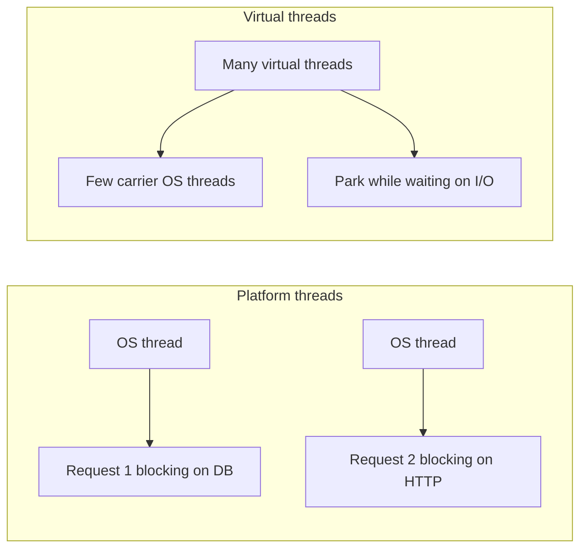

### Check yourself (Part IX)

1. What workload benefits most from virtual threads?
2. Name the four golden signals.
3. When would you choose GraalVM native over a regular JVM fat JAR?

**Docs hub:** [Actuator](https://docs.spring.io/spring-boot/reference/actuator.html) · [Virtual threads](https://docs.spring.io/spring-boot/reference/web/servlet.html) · [Native Image](https://docs.spring.io/spring-boot/reference/packaging/native-image/index.html) · [Containers](https://docs.spring.io/spring-boot/reference/packaging/container-images/index.html) · [Spring AI](https://docs.spring.io/spring-ai/reference/)


## Split view · Module 8 as four tracks

Treat Part IX as four mini-books. Do not skim them as one blob.

| Track | Core question | Ship criterion |
|-------|---------------|----------------|
| **8A Virtual threads** | Where do we block? Pinning? Pool vs VT? | Load test notes + no synchronized on hot path |
| **8B Observability** | Can we debug prod in 5 minutes? | Traces + metrics + JSON logs correlated |
| **8C Packaging / Native / containers** | How do we ship reproducibly? | Multi-stage or Buildpacks image in CI |
| **8D Spring AI** | What is the blast radius of LLM calls? | Token budget, PII policy, fallback path |

### Observability wiring (conceptual)

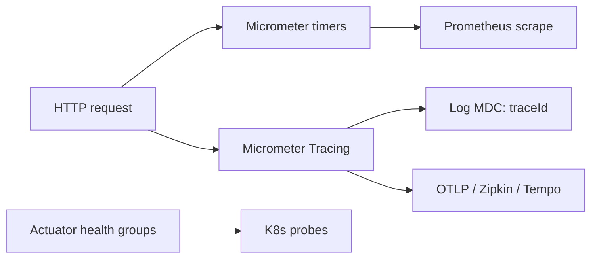

### Native Image decision sketch

```
Need sub-second cold start at scale-from-zero?
  no  → stay on JVM (simpler ops)
  yes → AOT + native image CI gate
Uses heavy runtime reflection / agents?
  yes → budget reachability metadata or stay JVM
```

### Spring AI production checklist

1. Never log raw PII prompts.
2. Cap tokens and timeout every model call.
3. Circuit-break / fallback to deterministic API when LLM is down.
4. Separate vector-store credentials from app DB credentials.
5. Measure cost and latency as SLOs.


### Virtual threads — what changes / what doesn't

| Changes | Doesn't magically fix |
|---------|------------------------|
| Cheap blocking waits | CPU-bound algorithms |
| Thread-per-request style at high concurrency | Undersized DB pools |
| Simpler code than reactive for many CRUD apps | Pinning from `synchronized`/native |

### Observability minimum

1. RED/golden signals on HTTP
2. DB pool metrics
3. Distributed trace ids in JSON logs
4. Health groups for K8s probes
5. Alert on error rate + latency SLO burn


## Topic Atlas — Module 8 — Advanced Features & Performance (2026)

Every syllabus topic for this chapter. Read the lesson above first; use this atlas to drill and dive into docs.

### Virtual threads (Project Loom)

#### Virtual threads

Virtual threads (Project Loom) are lightweight threads scheduled by the JVM on a small pool of carrier platform threads instead of mapping one-to-one to OS threads. Millions can exist concurrently, making them ideal for I/O-bound Spring MVC workloads that block on JDBC, HTTP, or file I/O. They let teams keep familiar blocking code while scaling concurrency far beyond traditional thread pool limits. Available as preview in Java 19–20 and finalized in Java 21 LTS. Enable in Spring Boot 3.2+ for Tomcat request handling with a single property change.

> **Watch out:** Virtual threads help I/O-bound work, not CPU-bound computation—profile before expecting magic on heavy JSON parsing or crypto.

**Official docs:** [Virtual threads](https://docs.spring.io/spring-boot/reference/web/servlet.html)

#### Platform threads (OS threads)

Platform threads are traditional Java threads backed 1:1 by operating system threads, expensive to create in large numbers due to stack memory and kernel scheduling overhead. Classic servlet containers used bounded platform thread pools—typically 200 threads—capping concurrent requests regardless of CPU headroom. Blocking I/O on platform threads holds the OS thread idle, wasting resources during waits. Virtual threads mount/unmount from carriers during blocking calls, freeing carriers for other work. Understanding the distinction explains why old thread pool sizing rules differ under Loom.

> **Watch out:** Setting `-Xmx` huge but keeping tiny platform pool still limits carriers—virtual threads need enough carrier threads for CPU work during mounts.

**Official docs:** [Platform threads (OS threads)](https://docs.spring.io/spring-boot/reference/)

#### `spring.threads.virtual.enabled=true`

This Boot 3.2+ property switches embedded Tomcat (and Jetty/Undertow where supported) to dispatch each HTTP request on a virtual thread instead of a platform thread pool. It is the simplest concurrency upgrade for existing blocking Spring MVC applications without rewriting to WebFlux. Also affects `@Async` default executor when configured to use virtual threads. One line in application.yml can dramatically improve throughput for I/O-heavy APIs under load. Test thoroughly with JDBC drivers, synchronized blocks, and third-party SDKs for pinning issues.

> **Watch out:** Enabling virtual threads while also using a tiny fixed platform pool for `@Async` creates mixed model confusion—align all executors intentionally.

**Official docs:** [`spring.threads.virtual.enabled=true`](https://docs.spring.io/spring-boot/reference/web/servlet.html)

#### Virtual threads for I/O-bound work

When a virtual thread blocks on JDBC, HTTP client, or sleep, the JVM unmounts it from its carrier platform thread so the carrier serves other virtual threads. This makes blocking calls cheap at scale—the opposite of platform thread blocking that wastes OS threads. Spring Boot REST APIs calling Postgres and downstream Feign services are textbook I/O-bound beneficiaries. Throughput improves because carriers stay busy while thousands of requests wait on network. CPU-bound work still consumes carriers for full compute duration—virtual threads do not parallelize CPU.

> **Watch out:** Blocking on synchronized native JDBC driver internals may pin carrier—watch JFR for pinned virtual thread events.

**Official docs:** [Virtual threads for I/O-bound work](https://docs.spring.io/spring-boot/reference/web/servlet.html)

#### Virtual threads vs reactive (WebFlux)

Virtual threads let developers write familiar blocking Spring MVC code while achieving high concurrency previously requiring reactive WebFlux and `Mono`/`Flux` chains. WebFlux uses non-blocking I/O on event loops with fewer threads but demands reactive programming throughout the stack including R2DBC. For typical CRUD microservices in 2026, MVC plus virtual threads often wins on developer productivity and library compatibility. Choose WebFlux when you need streaming backpressure end-to-end or already have reactive expertise. Many teams migrate from reactive back to MVC after virtual threads matured.

> **Watch out:** Mixing blocking JDBC in WebFlux still blocks event loop threads—pick one model per service, don't hybrid without bounded elastic scheduler.

**Official docs:** [Virtual threads vs reactive (WebFlux)](https://docs.spring.io/spring-boot/reference/web/servlet.html)

#### Thread-per-request model

Thread-per-request assigns one thread to handle each HTTP request from acceptance through response, simplifying programming model versus async callbacks or reactive pipelines. Servlet containers have used this model for decades; virtual threads remove the OS thread cost that made large pools impractical. Each request's stack variables and ThreadLocal context stay isolated naturally. Spring Security and MDC logging work with minimal changes under virtual threads. Tomcat's default model maps cleanly—enable virtual threads and keep writing synchronous controllers.

> **Watch out:** ThreadLocal leaks (forgetting to clear MDC) hurt more with millions of virtual thread lifecycles—always clear in finally blocks.

**Official docs:** [Thread-per-request model](https://docs.spring.io/spring-boot/reference/)

#### Pinning virtual threads

Pinning occurs when a virtual thread cannot unmount from its carrier—typically during synchronized blocks on monitors, native JNI code, or some legacy library internals—reducing scalability to platform thread limits during that section. JDK 21 improved pinning detection via JFR events. Replace `synchronized` with `ReentrantLock` in hot paths when profiling shows pinning. Some JDBC drivers pinned in early Loom releases—verify driver versions. Pinning one section does not break correctness but caps throughput during that code path.

> **Watch out:** `synchronized` on entire service methods pins for whole request—narrow synchronized regions or use locks/striped concurrency.

**Official docs:** [Pinning virtual threads](https://docs.spring.io/spring-boot/reference/web/servlet.html)

#### `@Async` with virtual threads

`@Async` methods can run on virtual thread executors by configuring `SimpleAsyncTaskExecutor` with `setVirtualThreads(true)` or custom `TaskExecutor` bean in Boot 3.2+. Background email sending, report generation, and audit logging benefit from cheap async concurrency without massive platform pools. Caller still gets `CompletableFuture` or void fire-and-forget semantics. Ensure exception handling via `AsyncUncaughtExceptionHandler` because failures won't propagate to HTTP layer. Do not `@Async` self-invocation on same class—proxy bypass breaks async.

> **Watch out:** `@Async` on methods called internally (this.asyncMethod()) runs synchronously—inject self proxy or move to separate bean.

**Official docs:** [`@Async` with virtual threads](https://docs.spring.io/spring-boot/reference/web/servlet.html)

#### Structured concurrency (Java 21+)

Structured concurrency (StructuredTaskScope in Java 21–22, evolving in JEPs) groups related subtasks with explicit lifetime—if one fails, siblings cancel; scope closes when all complete. It prevents orphaned background tasks leaking beyond request boundaries. Preview/incubator API—not yet the default Spring pattern but important for future async composition inside virtual thread request handlers. Conceptually replaces manual `ExecutorService` shutdown and nested CompletableFuture error handling. Watch JDK releases for stabilization before production adoption.

> **Watch out:** Structured concurrency APIs are preview/incubator—check `--enable-preview` and JDK version before using in production Spring apps.

**Official docs:** [Structured concurrency (Java 21+)](https://docs.spring.io/spring-boot/reference/)


### Observability & monitoring

#### Spring Boot Actuator

Spring Boot Actuator exposes production-ready operational endpoints for health, metrics, environment inspection, and runtime management over HTTP or JMX. Add `spring-boot-starter-actuator` and expose only needed endpoints via `management.endpoints.web.exposure.include`. In real deployments, Actuator is how Kubernetes probes, Prometheus scrapes, and on-call engineers interact with running apps. Secure sensitive endpoints (`/env`, `/beans`) with Spring Security or disable them in production. Actuator is not optional for serious production Spring Boot—it's the standard ops interface.

> **Watch out:** Exposing all actuator endpoints publicly on port 8080 leaks secrets via `/env`—use separate management port and authentication.

**Official docs:** [Spring Boot Actuator](https://docs.spring.io/spring-boot/reference/actuator.html)

#### `@EnableActuator` / starter

Spring Boot 3 auto-configures Actuator when `spring-boot-starter-actuator` is on the classpath—no `@EnableActuator` annotation exists or is needed. The starter registers health contributors, metrics binders, and endpoint mappings automatically. Configure base path (default `/actuator`), port, and exposure in `management.*` properties. Add Micrometer registry dependencies separately for Prometheus or Datadog export. Treat actuator as part of production architecture from day one, not a late add-on.

> **Watch out:** Old tutorials reference `@EnableActuator`—that annotation never existed; just add the starter dependency.

**Official docs:** [`@EnableActuator` / starter](https://docs.spring.io/spring-boot/reference/)

#### /actuator/health

`/actuator/health` returns aggregate application health—UP, DOWN, or custom status—with optional component details for database, disk space, and custom indicators. Kubernetes liveness and readiness probes typically hit this endpoint with `management.endpoint.health.probes.enabled=true` for K8s-specific probe groups. Liveness should be lightweight; readiness may check DB connectivity to gate traffic during startup. In production, disable verbose component details publicly to avoid information disclosure. Custom `HealthIndicator` beans integrate domain-specific checks—payment gateway reachability, queue depth.

> **Watch out:** Readiness checking external services causes all pods not-ready when dependency blips—readiness should reflect this app's ability to serve, not entire chain.

**Official docs:** [/actuator/health](https://docs.spring.io/spring-boot/reference/actuator.html)

#### Liveness probe

Kubernetes liveness probe asks: is the JVM process alive and not deadlocked? Failure triggers pod restart. Should be a simple check that the app responds—`/actuator/health/liveness`—without depending on external databases that could cause restart loops during network partitions. Misconfigured liveness killing pods during slow GC is a common production incident. Set `initialDelaySeconds` high enough for Spring context startup. Liveness failing during dependency outage is an anti-pattern—use readiness for dependency checks.

> **Watch out:** Liveness probe hitting DB—when Postgres is down, K8s kills all pods repeatedly instead of waiting; keep liveness dumb.

**Official docs:** [Liveness probe](https://docs.spring.io/spring-boot/reference/)

#### Readiness probe

Readiness probe determines whether the pod should receive traffic from Service load balancers. Failure removes pod from endpoints without restarting it—useful during startup or when dependencies are temporarily unavailable. Spring Boot 3 supports `/actuator/health/readiness` grouping DB and custom checks. During deploys, old pods stay ready until new pods pass readiness—controls rolling update safety. Tune failure thresholds to avoid flapping on brief DB latency spikes.

> **Watch out:** All pods not-ready simultaneously causes total outage—stagger checks and ensure at least one generation stays ready during rollouts.

**Official docs:** [Readiness probe](https://docs.spring.io/spring-boot/reference/)

#### /actuator/info

`/actuator/info` exposes arbitrary application metadata—version, git commit, build timestamp, environment name—for operators and support teams. Populate via `info.app.*` properties, `info.env.enabled`, or custom `InfoContributor` beans reading git.properties from Maven/Gradle plugin. In CI/CD, inject build number and git SHA at image build time for traceability during incidents. Does not replace structured logging but gives quick human-readable context from browser or curl.

> **Watch out:** Forgetting to generate git.properties in build—`/info` shows empty version during incident when you need it most.

**Official docs:** [/actuator/info](https://docs.spring.io/spring-boot/reference/actuator.html)

#### /actuator/metrics

`/actuator/metrics` lists available Micrometer metric names or returns measurements for a specific metric like `jvm.memory.used` or `http.server.requests`. Foundation for understanding what your app exposes before building Grafana dashboards. Use `/actuator/metrics/{name}` with tags to drill into specific endpoints or status codes. Custom business metrics register via `MeterRegistry` beans. High-cardinality tags (userId on every metric) explode storage—tag wisely.

> **Watch out:** High-cardinality tags like URL path with IDs crash Prometheus—use templated paths or low-cardinality tags only.

**Official docs:** [/actuator/metrics](https://docs.spring.io/spring-boot/reference/actuator.html)

#### /actuator/prometheus

`/actuator/prometheus` exposes metrics in Prometheus text exposition format for scraping by Prometheus server or Grafana Agent. Add `micrometer-registry-prometheus` dependency and include `prometheus` in exposed endpoints. Standard setup in Kubernetes: ServiceMonitor or PodMonitor scrapes this path every 15–30 seconds. Metric names follow Micrometer naming conventions with `_total` suffix for counters. Secure scrape path if metrics reveal sensitive business data in labels.

> **Watch out:** Scraping `/metrics` instead of `/actuator/prometheus` returns wrong format—enable prometheus endpoint explicitly.

**Official docs:** [/actuator/prometheus](https://docs.spring.io/spring-boot/reference/actuator.html)

#### /actuator/env

`/actuator/env` displays all PropertySources and resolved property values including environment variables and config server values—powerful for debugging but dangerous in production. May expose database URLs, API keys if not masked, and internal infrastructure hostnames. Restrict via Spring Security, disable in prod, or relocate to internal management port only. Use `/actuator/env/{property}` for single key lookup during authorized troubleshooting. Prefer structured secret management over relying on env endpoint visibility.

> **Watch out:** Public `/env` has caused real CVE-level disclosures—never expose on internet-facing port without auth.

**Official docs:** [/actuator/env](https://docs.spring.io/spring-boot/reference/actuator.html)

#### /actuator/loggers

`/actuator/loggers` lists all logger configurations and allows POST to change log levels at runtime without restart—set `com.myapp` to DEBUG during incident investigation. Revert to INFO after debugging to avoid log volume costs and PII exposure in debug traces. Works with Logback and Log4j2 via Spring Boot logging abstraction. Audit log level changes in regulated environments. Pair with centralized logging so temporary DEBUG captures appear in ELK/Datadog.

> **Watch out:** Leaving DEBUG on package `org.hibernate.SQL` in prod floods logs and exposes data—set timer to revert level.

**Official docs:** [/actuator/loggers](https://docs.spring.io/spring-boot/reference/actuator.html)

#### /actuator/beans

`/actuator/beans` dumps all Spring beans in the ApplicationContext with dependencies—invaluable for debugging wiring conflicts and missing auto-configuration during development. Shows conditional beans that did or did not match. Too verbose and information-rich for production exposure—disable or secure heavily. Use beans endpoint locally when `@Autowired` fails mysteriously. Alternative: `--debug` startup report or `ApplicationContext.getBeanDefinitionNames()` in tests.

> **Watch out:** Relying on `/beans` in prod instead of fixing startup tests—automate context load tests in CI instead.

**Official docs:** [/actuator/beans](https://docs.spring.io/spring-boot/reference/actuator.html)

#### /actuator/mappings

`/actuator/mappings` shows all registered HTTP request mappings—controller paths, actuator endpoints, error pages—verifying your REST API surface matches expectations. Useful after adding springdoc, security rules, or gateway path prefixes to confirm routes registered correctly. Dev and staging troubleshooting tool; restrict in production to prevent API surface reconnaissance by attackers. Compare output against OpenAPI spec for drift detection in CI.

> **Watch out:** Missing controller in mappings means component scan or `@RequestMapping` typo—404 mystery solved by checking mappings first.

**Official docs:** [/actuator/mappings](https://docs.spring.io/spring-boot/reference/actuator.html)

#### /actuator/httptrace` (legacy)

HttpTrace endpoint logged recent HTTP request/response summaries including headers and timing—it was useful for quick debugging but removed/replaced in Boot 3 observability stack. Boot 3 replaces it with Micrometer Observation, HTTP server metrics, and distributed tracing via Micrometer Tracing. Do not search for httptrace in new projects—configure Zipkin, Jaeger, or OpenTelemetry export instead. Legacy tutorials referencing httptrace need updating for Boot 3 production request tracking.

> **Watch out:** Enabling deprecated httptrace patterns in Boot 3—use Micrometer Tracing with OpenTelemetry or Brave instead.

**Official docs:** [/actuator/httptrace` (legacy)](https://docs.spring.io/spring-boot/reference/actuator.html)

#### Micrometer

Micrometer is a vendor-neutral metrics facade used by Spring Boot, collecting counters, timers, gauges, and distribution summaries from JVM, HTTP, cache, and custom sources. Add registry implementations for Prometheus, Datadog, CloudWatch, or Atlas via dependencies. `@Timed` and `@Counted` annotate methods; `MeterRegistry` registers business KPIs. Metrics drive autoscaling, SLO dashboards, and alert rules. Micrometer naming and tagging conventions ensure portable dashboards across services.

> **Watch out:** Creating new Timer per request path with raw UUID in tag exhausts memory—use low-cardinality tags only.

**Official docs:** [Micrometer](https://docs.spring.io/spring-boot/reference/actuator.html)

#### Micrometer Tracing

Micrometer Tracing is Spring Boot 3's unified tracing abstraction bridging Brave (Zipkin) and OpenTelemetry backends with auto-configuration. It propagates trace context over HTTP (W3C traceparent), messaging, and scheduled tasks when configured. Add `micrometer-tracing-bridge-otel` and exporter for production cross-service latency analysis. Replaces Spring Cloud Sleuth which is discontinued. Trace context links logs via MDC traceId when logging pattern configured.

> **Watch out:** Tracing without log correlation (traceId in JSON logs) forces clicking between tools—configure MDC pattern in logback-spring.xml.

**Official docs:** [Micrometer Tracing](https://docs.spring.io/spring-boot/reference/actuator.html)

#### OpenTelemetry

OpenTelemetry (OTel) is the vendor-neutral industry standard for traces, metrics, and logs with unified SDKs and OTLP export protocol. Spring Boot 3 supports OTel via Micrometer bridge and direct OTel Java agent for auto-instrumentation without code changes. Cloud vendors (Datadog, Honeycomb, Grafana Cloud) ingest OTLP natively. OTel is the long-term direction—prefer over proprietary agents when starting new observability stacks. Collector deployment pattern decouples apps from backend vendor lock-in.

> **Watch out:** Running both OTel agent and Micrometer bridge without coordination duplicates spans—pick one instrumentation path per app.

**Official docs:** [OpenTelemetry](https://docs.spring.io/spring-boot/reference/)

#### Brave / Zipkin

Brave is the Java tracing library originating from Twitter; Zipkin is the distributed tracing UI and storage backend visualizing request latency across microservices. Spring Cloud Sleuth historically wrapped Brave; Boot 3 uses Micrometer Tracing bridge to Brave. Zipkin UI shows trace timelines—identify which Feign call added 2 seconds. Self-host Zipkin for dev; production often uses managed tracing (Jaeger, Tempo, Datadog APM). Propagate B3 or W3C headers between Spring services for complete traces.

> **Watch out:** Broken trace propagation—missing header forwarding in Feign/WebClient splits one user request into orphan spans.

**Official docs:** [Brave / Zipkin](https://docs.spring.io/spring-boot/reference/)

#### Trace ID / Span ID

Trace ID uniquely identifies an entire distributed request chain across all services; Span ID identifies one operation within that trace. Passed via HTTP headers (`traceparent`, `X-B3-TraceId`) and injected into SLF4J MDC for log correlation. In incident response, grep logs by traceId to reconstruct full request path. Each outbound Feign call should create child span under same trace. Missing propagation breaks observability—configure WebClient and RestTemplate interceptors.

> **Watch out:** TraceId in logs but not returned to client support—include traceId in ProblemDetail response for user ticket correlation.

**Official docs:** [Trace ID / Span ID](https://docs.spring.io/spring-boot/reference/)

#### `@Observed`

`@Observed` (Micrometer Observation) wraps methods to record metrics and tracing spans with configurable name and contextual tags in one annotation. Replaces separate `@Timed` plus manual span creation for service layer operations. Observations propagate through reactive and synchronous stacks when observation registry configured. Use on critical business operations—payment processing, order creation—for SLO tracking. Low overhead when AOP applied to coarse-grained service methods, not every getter.

> **Watch out:** `@Observed` on controller AND service double-counts latency—observe at boundary or service layer, not both without nesting awareness.

**Official docs:** [`@Observed`](https://docs.spring.io/spring-boot/reference/actuator.html)

#### Grafana

Grafana is the leading open-source dashboard and alerting platform visualizing metrics from Prometheus, Loki, Tempo, and dozens of datasources. SRE teams build golden-signal dashboards per service and SLO burn-rate alerts. Spring Boot metrics scraped into Prometheus become Grafana graphs for p99 latency and error rates. Grafana OnCall or PagerDuty integration routes alerts to engineers. Use folder-per-team organization and dashboard-as-code (Jsonnet, Terraform) for reproducibility.

> **Watch out:** Dashboard without alert rules is vanity—define SLO-based alerts on error rate and latency, not just pretty graphs.

**Official docs:** [Grafana](https://docs.spring.io/spring-boot/reference/)

#### Prometheus

Prometheus is a time-series metrics database using pull-based scraping from `/actuator/prometheus` endpoints on a schedule. Standard metrics backbone for Kubernetes monitoring—Prometheus Operator, kube-prometheus-stack helm chart. PromQL queries power alerts (Alertmanager) and Grafana panels. Retention and cardinality planning matter—runaway label cardinality crashes Prometheus. Spring Boot Micrometer export aligns metric types with Prometheus conventions automatically.

> **Watch out:** 15s scrape interval on 500 metrics × 100 pods with high-cardinality tags OOMs Prometheus—audit metric cardinality quarterly.

**Official docs:** [Prometheus](https://docs.spring.io/spring-boot/reference/actuator.html)

#### ELK stack (Elasticsearch, Logstash, Kibana)

ELK aggregates logs: Logstash or Filebeat ships JSON logs from pods, Elasticsearch indexes them, Kibana searches and visualizes. Spring Boot structured JSON logging (Logstash encoder) integrates cleanly with traceId and userId fields. In incidents, Kibana queries correlate errors across microservices faster than SSH grep. Elastic Cloud or OpenSearch are managed alternatives. Size Elasticsearch clusters for retention days and ingest volume—log storms during outages can overwhelm undersized clusters.

> **Watch out:** Plain text logs in prod make Kibana useless—configure JSON log pattern with traceId before shipping to ELK.

**Official docs:** [ELK stack (Elasticsearch, Logstash, Kibana)](https://docs.spring.io/spring-boot/reference/)

#### Spring Boot Admin

Spring Boot Admin is a dedicated UI server registering Boot apps as clients, displaying health, metrics, log levels, and thread dumps in one dashboard. Useful for internal tooling teams managing dozens of Boot services without full Kubernetes access. Clients register via HTTP with optional authentication. Complements but does not replace Prometheus/Grafana for long-term metrics retention. Good for dev/staging ops portals and smaller deployments without full observability stack.

> **Watch out:** Boot Admin exposed publicly reveals internal service topology—protect with OAuth2 or VPN-only access.

**Official docs:** [Spring Boot Admin](https://docs.spring.io/spring-boot/reference/)

#### APM tools (Datadog, New Relic)

Application Performance Monitoring SaaS tools provide auto-instrumentation, distributed tracing, JVM profiling, and anomaly detection with minimal manual Micrometer setup. Datadog Java agent attaches to Spring Boot for deep JDBC, HTTP, and Kafka span capture. Commercial APM suits teams prioritizing time-to-value over self-hosted Prometheus/Grafana ops. Cost scales with hosts and custom metrics—budget accordingly. Correlate APM traces with logs using shared traceId.

> **Watch out:** Running APM agent + full Micrometer Prometheus export duplicates telemetry and cost—align instrumentation strategy.

**Official docs:** [APM tools (Datadog, New Relic)](https://docs.spring.io/spring-boot/reference/)

#### SLO / SLI / SLA

**SLI** (Service Level Indicator) is a measured metric like successful request rate or p99 latency. **SLO** (Service Level Objective) is the target for that SLI—99.9% availability, p99 < 300ms. **SLA** is a contractual commitment to customers with consequences for breach, usually looser than internal SLO. Error budget = allowed downtime derived from SLO—when budget burns, freeze features and fix reliability. Spring Micrometer metrics feed SLI calculations in Grafana/Datadog.

> **Watch out:** Confusing SLA with SLO in interviews—SLA is customer contract; SLO is internal team target driving engineering decisions.

**Official docs:** [SLO / SLI / SLA](https://docs.spring.io/spring-boot/reference/)

#### Golden signals (latency, traffic, errors, saturation)

Google SRE defines four golden signals: **latency** (time to serve requests), **traffic** (demand volume), **errors** (failed request rate), and **saturation** (resource fullness—CPU, DB pool, thread queue). Monitoring these four covers most production incidents before users flood support. Spring Boot exposes HTTP latency timers, request counters, error status tags, and JVM/pool gauges via Actuator/Micrometer. Build dashboards around golden signals per service before adding exotic custom metrics.

> **Watch out:** Monitoring CPU only misses DB connection pool saturation—watch HikariCP pending threads as saturation signal.

**Official docs:** [Golden signals (latency, traffic, errors, saturation)](https://docs.spring.io/spring-boot/reference/actuator.html)


### Performance tuning

#### JVM heap tuning (`-Xmx`, `-Xms`)

Set max/min heap size. Before rewriting to reactive, profile JVM heap, GC pauses, connection pools, and SQL—most Boot APIs are I/O-bound and fixable with tuning. HikariCP sizing, HTTP keep-alive pools, and `@Cacheable` on hot reads deliver faster wins than premature architectural rewrites. Load tests (k6, Gatling) and JFR/async-profiler evidence justify `-Xmx`, pool sizes, and virtual-thread adoption in production. Layered JARs and startup lazy-init reduce deploy time in Kubernetes without sacrificing runtime correctness when tested in CI.

> **Watch out:** Setting -Xmx to full container limit—JVM needs headroom for metaspace and off-heap; OOMKilled pods.

**Official docs:** [JVM heap tuning (`-Xmx`, `-Xms`)](https://docs.oracle.com/en/java/javase/21/docs/api/index.html)

#### Garbage collector selection (G1, ZGC)

GC algorithm for workload. Before rewriting to reactive, profile JVM heap, GC pauses, connection pools, and SQL—most Boot APIs are I/O-bound and fixable with tuning. HikariCP sizing, HTTP keep-alive pools, and `@Cacheable` on hot reads deliver faster wins than premature architectural rewrites. Load tests (k6, Gatling) and JFR/async-profiler evidence justify `-Xmx`, pool sizes, and virtual-thread adoption in production. Layered JARs and startup lazy-init reduce deploy time in Kubernetes without sacrificing runtime correctness when tested in CI.

> **Watch out:** Switching to ZGC without measuring—G1 may already meet p99; GC choice needs JFR evidence.

**Official docs:** [Garbage collector selection (G1, ZGC)](https://docs.spring.io/spring-boot/reference/)

#### HikariCP pool sizing

Right-size DB connections. Before rewriting to reactive, profile JVM heap, GC pauses, connection pools, and SQL—most Boot APIs are I/O-bound and fixable with tuning. HikariCP sizing, HTTP keep-alive pools, and `@Cacheable` on hot reads deliver faster wins than premature architectural rewrites. Load tests (k6, Gatling) and JFR/async-profiler evidence justify `-Xmx`, pool sizes, and virtual-thread adoption in production. Layered JARs and startup lazy-init reduce deploy time in Kubernetes without sacrificing runtime correctness when tested in CI.

> **Watch out:** Pool size = number of pods × max pool exceeds DB max connections—Postgres rejects new connections cluster-wide.

**Official docs:** [HikariCP pool sizing](https://docs.spring.io/spring-boot/reference/data/sql.html)

#### HTTP connection pooling

Reuse outbound HTTP connections. Before rewriting to reactive, profile JVM heap, GC pauses, connection pools, and SQL—most Boot APIs are I/O-bound and fixable with tuning. HikariCP sizing, HTTP keep-alive pools, and `@Cacheable` on hot reads deliver faster wins than premature architectural rewrites. Load tests (k6, Gatling) and JFR/async-profiler evidence justify `-Xmx`, pool sizes, and virtual-thread adoption in production. Layered JARs and startup lazy-init reduce deploy time in Kubernetes without sacrificing runtime correctness when tested in CI.

> **Watch out:** New HttpClient per request—socket exhaustion under load; reuse pooled clients for Feign/RestClient.

**Official docs:** [HTTP connection pooling](https://docs.spring.io/spring-boot/reference/)

#### Response compression

gzip responses. Before rewriting to reactive, profile JVM heap, GC pauses, connection pools, and SQL—most Boot APIs are I/O-bound and fixable with tuning. HikariCP sizing, HTTP keep-alive pools, and `@Cacheable` on hot reads deliver faster wins than premature architectural rewrites. Load tests (k6, Gatling) and JFR/async-profiler evidence justify `-Xmx`, pool sizes, and virtual-thread adoption in production. Layered JARs and startup lazy-init reduce deploy time in Kubernetes without sacrificing runtime correctness when tested in CI.

> **Watch out:** Compressing already compressed assets—CPU waste; exclude images and pre-compressed responses.

**Official docs:** [Response compression](https://docs.spring.io/spring-boot/reference/)

#### HTTP/2

Multiplexed HTTP connections. Before rewriting to reactive, profile JVM heap, GC pauses, connection pools, and SQL—most Boot APIs are I/O-bound and fixable with tuning. HikariCP sizing, HTTP keep-alive pools, and `@Cacheable` on hot reads deliver faster wins than premature architectural rewrites. Load tests (k6, Gatling) and JFR/async-profiler evidence justify `-Xmx`, pool sizes, and virtual-thread adoption in production. Layered JARs and startup lazy-init reduce deploy time in Kubernetes without sacrificing runtime correctness when tested in CI.

> **Watch out:** HTTP/2 without TLS in some load balancers—ALPN negotiation fails; verify ingress supports h2.

**Official docs:** [HTTP/2](https://docs.spring.io/spring-boot/reference/)

#### Caching (`@Cacheable`)

Avoid repeated expensive calls. Before rewriting to reactive, profile JVM heap, GC pauses, connection pools, and SQL—most Boot APIs are I/O-bound and fixable with tuning. HikariCP sizing, HTTP keep-alive pools, and `@Cacheable` on hot reads deliver faster wins than premature architectural rewrites. Load tests (k6, Gatling) and JFR/async-profiler evidence justify `-Xmx`, pool sizes, and virtual-thread adoption in production. Layered JARs and startup lazy-init reduce deploy time in Kubernetes without sacrificing runtime correctness when tested in CI.

> **Watch out:** Caching mutable entities without eviction on update—stale reads until TTL luck runs out.

**Official docs:** [Caching (`@Cacheable`)](https://docs.spring.io/spring-boot/reference/io/caching.html)

#### Database indexing

Speed up queries. Before rewriting to reactive, profile JVM heap, GC pauses, connection pools, and SQL—most Boot APIs are I/O-bound and fixable with tuning. HikariCP sizing, HTTP keep-alive pools, and `@Cacheable` on hot reads deliver faster wins than premature architectural rewrites. Load tests (k6, Gatling) and JFR/async-profiler evidence justify `-Xmx`, pool sizes, and virtual-thread adoption in production. Layered JARs and startup lazy-init reduce deploy time in Kubernetes without sacrificing runtime correctness when tested in CI.

> **Watch out:** Index every column—write amplification slows inserts; index query predicates from EXPLAIN plans.

**Official docs:** [Database indexing](https://docs.spring.io/spring-boot/reference/)

#### Query optimization / EXPLAIN

Analyze slow SQL. Before rewriting to reactive, profile JVM heap, GC pauses, connection pools, and SQL—most Boot APIs are I/O-bound and fixable with tuning. HikariCP sizing, HTTP keep-alive pools, and `@Cacheable` on hot reads deliver faster wins than premature architectural rewrites. Load tests (k6, Gatling) and JFR/async-profiler evidence justify `-Xmx`, pool sizes, and virtual-thread adoption in production. Layered JARs and startup lazy-init reduce deploy time in Kubernetes without sacrificing runtime correctness when tested in CI.

> **Watch out:** Fixing SQL without EXPLAIN ANALYZE—assumed wrong index; measure rows and cost.

**Official docs:** [Query optimization / EXPLAIN](https://docs.spring.io/spring-boot/reference/)

#### Lazy loading tuning

Avoid N+1; use fetch joins. Before rewriting to reactive, profile JVM heap, GC pauses, connection pools, and SQL—most Boot APIs are I/O-bound and fixable with tuning. HikariCP sizing, HTTP keep-alive pools, and `@Cacheable` on hot reads deliver faster wins than premature architectural rewrites. Load tests (k6, Gatling) and JFR/async-profiler evidence justify `-Xmx`, pool sizes, and virtual-thread adoption in production. Layered JARs and startup lazy-init reduce deploy time in Kubernetes without sacrificing runtime correctness when tested in CI.

> **Watch out:** Open session in view masking N+1—disable OSIV and use fetch join or `@EntityGraph` in services.

**Official docs:** [Lazy loading tuning](https://docs.spring.io/spring-boot/reference/)

#### Batch inserts (JPA batch size)

`spring.jpa.properties.hibernate.jdbc.batch_size`. Before rewriting to reactive, profile JVM heap, GC pauses, connection pools, and SQL—most Boot APIs are I/O-bound and fixable with tuning. HikariCP sizing, HTTP keep-alive pools, and `@Cacheable` on hot reads deliver faster wins than premature architectural rewrites. Load tests (k6, Gatling) and JFR/async-profiler evidence justify `-Xmx`, pool sizes, and virtual-thread adoption in production. Layered JARs and startup lazy-init reduce deploy time in Kubernetes without sacrificing runtime correctness when tested in CI.

> **Watch out:** Batch size set but IDENTITY PK—Hibernate disables batching; use SEQUENCE for bulk inserts.

**Official docs:** [Batch inserts (JPA batch size)](https://docs.spring.io/spring-data/jpa/reference)

#### `@Async`

Run method on background thread. Before rewriting to reactive, profile JVM heap, GC pauses, connection pools, and SQL—most Boot APIs are I/O-bound and fixable with tuning. HikariCP sizing, HTTP keep-alive pools, and `@Cacheable` on hot reads deliver faster wins than premature architectural rewrites. Load tests (k6, Gatling) and JFR/async-profiler evidence justify `-Xmx`, pool sizes, and virtual-thread adoption in production. Layered JARs and startup lazy-init reduce deploy time in Kubernetes without sacrificing runtime correctness when tested in CI.

> **Watch out:** Self-invocation `this.async()`—runs synchronously; inject self or separate bean.

**Official docs:** [`@Async`](https://docs.spring.io/spring-boot/reference/)

#### `@EnableAsync`

Enable async method execution. Before rewriting to reactive, profile JVM heap, GC pauses, connection pools, and SQL—most Boot APIs are I/O-bound and fixable with tuning. HikariCP sizing, HTTP keep-alive pools, and `@Cacheable` on hot reads deliver faster wins than premature architectural rewrites. Load tests (k6, Gatling) and JFR/async-profiler evidence justify `-Xmx`, pool sizes, and virtual-thread adoption in production. Layered JARs and startup lazy-init reduce deploy time in Kubernetes without sacrificing runtime correctness when tested in CI.

> **Watch out:** `@Async` without `@EnableAsync`—appears to work in tests but never leaves caller thread in prod config.

**Official docs:** [`@EnableAsync`](https://docs.spring.io/spring-boot/reference/)

#### TaskExecutor / ThreadPoolTaskExecutor

Configure thread pool. Before rewriting to reactive, profile JVM heap, GC pauses, connection pools, and SQL—most Boot APIs are I/O-bound and fixable with tuning. HikariCP sizing, HTTP keep-alive pools, and `@Cacheable` on hot reads deliver faster wins than premature architectural rewrites. Load tests (k6, Gatling) and JFR/async-profiler evidence justify `-Xmx`, pool sizes, and virtual-thread adoption in production. Layered JARs and startup lazy-init reduce deploy time in Kubernetes without sacrificing runtime correctness when tested in CI.

> **Watch out:** Unbounded queue on fixed pool—OOM under spike; bound queue with rejection policy.

**Official docs:** [TaskExecutor / ThreadPoolTaskExecutor](https://docs.spring.io/spring-boot/reference/)

#### `@Scheduled`

Cron/fixed-rate scheduled tasks. Before rewriting to reactive, profile JVM heap, GC pauses, connection pools, and SQL—most Boot APIs are I/O-bound and fixable with tuning. HikariCP sizing, HTTP keep-alive pools, and `@Cacheable` on hot reads deliver faster wins than premature architectural rewrites. Load tests (k6, Gatling) and JFR/async-profiler evidence justify `-Xmx`, pool sizes, and virtual-thread adoption in production. Layered JARs and startup lazy-init reduce deploy time in Kubernetes without sacrificing runtime correctness when tested in CI.

> **Watch out:** Three K8s replicas all run same cron—tripled job executions; use ShedLock or K8s CronJob.

**Official docs:** [`@Scheduled`](https://docs.spring.io/spring-boot/reference/)

#### `@EnableScheduling`

Enable scheduled tasks. Before rewriting to reactive, profile JVM heap, GC pauses, connection pools, and SQL—most Boot APIs are I/O-bound and fixable with tuning. HikariCP sizing, HTTP keep-alive pools, and `@Cacheable` on hot reads deliver faster wins than premature architectural rewrites. Load tests (k6, Gatling) and JFR/async-profiler evidence justify `-Xmx`, pool sizes, and virtual-thread adoption in production. Layered JARs and startup lazy-init reduce deploy time in Kubernetes without sacrificing runtime correctness when tested in CI.

> **Watch out:** Long `@Scheduled` job blocks single-thread scheduler—other schedules starve.

**Official docs:** [`@EnableScheduling`](https://docs.spring.io/spring-boot/reference/)

#### Load testing

JMeter, Gatling, k6. Before rewriting to reactive, profile JVM heap, GC pauses, connection pools, and SQL—most Boot APIs are I/O-bound and fixable with tuning. HikariCP sizing, HTTP keep-alive pools, and `@Cacheable` on hot reads deliver faster wins than premature architectural rewrites. Load tests (k6, Gatling) and JFR/async-profiler evidence justify `-Xmx`, pool sizes, and virtual-thread adoption in production. Layered JARs and startup lazy-init reduce deploy time in Kubernetes without sacrificing runtime correctness when tested in CI.

> **Watch out:** Load test only happy path—omit auth, think time, and payload variance; false confidence.

**Official docs:** [Load testing](https://docs.spring.io/spring-boot/reference/)

#### Profiling (JFR, async-profiler)

Find CPU/memory hotspots. Before rewriting to reactive, profile JVM heap, GC pauses, connection pools, and SQL—most Boot APIs are I/O-bound and fixable with tuning. HikariCP sizing, HTTP keep-alive pools, and `@Cacheable` on hot reads deliver faster wins than premature architectural rewrites. Load tests (k6, Gatling) and JFR/async-profiler evidence justify `-Xmx`, pool sizes, and virtual-thread adoption in production. Layered JARs and startup lazy-init reduce deploy time in Kubernetes without sacrificing runtime correctness when tested in CI.

> **Watch out:** Profiling in prod without short window—overhead impacts users; use continuous profiling with sampling.

**Official docs:** [Profiling (JFR, async-profiler)](https://docs.spring.io/spring-boot/reference/)

#### Spring Boot startup optimization

Lazy init, AOT, native image. Before rewriting to reactive, profile JVM heap, GC pauses, connection pools, and SQL—most Boot APIs are I/O-bound and fixable with tuning. HikariCP sizing, HTTP keep-alive pools, and `@Cacheable` on hot reads deliver faster wins than premature architectural rewrites. Load tests (k6, Gatling) and JFR/async-profiler evidence justify `-Xmx`, pool sizes, and virtual-thread adoption in production. Layered JARs and startup lazy-init reduce deploy time in Kubernetes without sacrificing runtime correctness when tested in CI.

> **Watch out:** Lazy-init everywhere hiding wiring errors until first request—balance with smoke tests.

**Official docs:** [Spring Boot startup optimization](https://docs.spring.io/spring-boot/reference/)

#### Layered JAR

Docker cache-friendly JAR layers. Before rewriting to reactive, profile JVM heap, GC pauses, connection pools, and SQL—most Boot APIs are I/O-bound and fixable with tuning. HikariCP sizing, HTTP keep-alive pools, and `@Cacheable` on hot reads deliver faster wins than premature architectural rewrites. Load tests (k6, Gatling) and JFR/async-profiler evidence justify `-Xmx`, pool sizes, and virtual-thread adoption in production. Layered JARs and startup lazy-init reduce deploy time in Kubernetes without sacrificing runtime correctness when tested in CI.

> **Watch out:** Docker COPY whole fat JAR—any code change rebuilds image; extract layers for cache efficiency.

**Official docs:** [Layered JAR](https://docs.spring.io/spring-boot/reference/)


### Spring AI

#### Spring AI

Spring integration for LLMs. Spring AI standardizes LLM access behind `ChatModel`, embeddings, and vector stores so Boot apps do not hard-code vendor SDKs everywhere. Production RAG pipelines sanitize PII, cap token budgets, and log prompts/responses with retention policies—not raw dumps of customer data. Ollama suits local dev; OpenAI/Azure OpenAI suit managed prod with key rotation via Vault or cloud secret managers. Stream responses with SSE for chat UX; monitor latency and cost per request as first-class SLOs alongside traditional HTTP metrics.

> **Watch out:** Sending full customer record to LLM—PII violation; redact and minimize context.

**Official docs:** [Spring AI](https://docs.spring.io/spring-ai/reference)

#### ChatModel

Abstraction over LLM chat API. Spring AI standardizes LLM access behind `ChatModel`, embeddings, and vector stores so Boot apps do not hard-code vendor SDKs everywhere. Production RAG pipelines sanitize PII, cap token budgets, and log prompts/responses with retention policies—not raw dumps of customer data. Ollama suits local dev; OpenAI/Azure OpenAI suit managed prod with key rotation via Vault or cloud secret managers. Stream responses with SSE for chat UX; monitor latency and cost per request as first-class SLOs alongside traditional HTTP metrics.

> **Watch out:** No timeout on ChatModel call—LLM hang blocks HTTP thread; set resilience timeouts.

**Official docs:** [ChatModel](https://docs.spring.io/spring-ai/reference)

#### Prompt template

Structured prompt with variables. Spring AI standardizes LLM access behind `ChatModel`, embeddings, and vector stores so Boot apps do not hard-code vendor SDKs everywhere. Production RAG pipelines sanitize PII, cap token budgets, and log prompts/responses with retention policies—not raw dumps of customer data. Ollama suits local dev; OpenAI/Azure OpenAI suit managed prod with key rotation via Vault or cloud secret managers. Stream responses with SSE for chat UX; monitor latency and cost per request as first-class SLOs alongside traditional HTTP metrics.

> **Watch out:** Prompt injection via user text in template—sanitize and separate system vs user roles.

**Official docs:** [Prompt template](https://docs.spring.io/spring-boot/reference/)

#### OpenAI Spring AI integration

Call GPT models. Spring AI standardizes LLM access behind `ChatModel`, embeddings, and vector stores so Boot apps do not hard-code vendor SDKs everywhere. Production RAG pipelines sanitize PII, cap token budgets, and log prompts/responses with retention policies—not raw dumps of customer data. Ollama suits local dev; OpenAI/Azure OpenAI suit managed prod with key rotation via Vault or cloud secret managers. Stream responses with SSE for chat UX; monitor latency and cost per request as first-class SLOs alongside traditional HTTP metrics.

> **Watch out:** API key in application.yml committed to git—use env or vault rotation.

**Official docs:** [OpenAI Spring AI integration](https://docs.spring.io/spring-ai/reference)

#### Ollama Spring AI integration

Run local LLM models. Spring AI standardizes LLM access behind `ChatModel`, embeddings, and vector stores so Boot apps do not hard-code vendor SDKs everywhere. Production RAG pipelines sanitize PII, cap token budgets, and log prompts/responses with retention policies—not raw dumps of customer data. Ollama suits local dev; OpenAI/Azure OpenAI suit managed prod with key rotation via Vault or cloud secret managers. Stream responses with SSE for chat UX; monitor latency and cost per request as first-class SLOs alongside traditional HTTP metrics.

> **Watch out:** Ollama in prod without GPU capacity planning—latency unacceptable at scale.

**Official docs:** [Ollama Spring AI integration](https://docs.spring.io/spring-ai/reference)

#### Embeddings

Vector representation of text. Spring AI standardizes LLM access behind `ChatModel`, embeddings, and vector stores so Boot apps do not hard-code vendor SDKs everywhere. Production RAG pipelines sanitize PII, cap token budgets, and log prompts/responses with retention policies—not raw dumps of customer data. Ollama suits local dev; OpenAI/Azure OpenAI suit managed prod with key rotation via Vault or cloud secret managers. Stream responses with SSE for chat UX; monitor latency and cost per request as first-class SLOs alongside traditional HTTP metrics.

> **Watch out:** Embedding model swap without reindex—vector space mismatch breaks semantic search quality.

**Official docs:** [Embeddings](https://docs.spring.io/spring-ai/reference)

#### Vector store

Store/search embeddings (PGVector, Redis). Spring AI standardizes LLM access behind `ChatModel`, embeddings, and vector stores so Boot apps do not hard-code vendor SDKs everywhere. Production RAG pipelines sanitize PII, cap token budgets, and log prompts/responses with retention policies—not raw dumps of customer data. Ollama suits local dev; OpenAI/Azure OpenAI suit managed prod with key rotation via Vault or cloud secret managers. Stream responses with SSE for chat UX; monitor latency and cost per request as first-class SLOs alongside traditional HTTP metrics.

> **Watch out:** PGVector without index on embedding column—sequential scan fails at million-row scale.

**Official docs:** [Vector store](https://docs.spring.io/spring-boot/reference/)

#### RAG (Retrieval Augmented Generation)

Retrieve docs → augment prompt → answer. Spring AI standardizes LLM access behind `ChatModel`, embeddings, and vector stores so Boot apps do not hard-code vendor SDKs everywhere. Production RAG pipelines sanitize PII, cap token budgets, and log prompts/responses with retention policies—not raw dumps of customer data. Ollama suits local dev; OpenAI/Azure OpenAI suit managed prod with key rotation via Vault or cloud secret managers. Stream responses with SSE for chat UX; monitor latency and cost per request as first-class SLOs alongside traditional HTTP metrics.

> **Watch out:** RAG retrieving wrong tenant's docs—missing tenant filter in vector query leaks data.

**Official docs:** [RAG (Retrieval Augmented Generation)](https://docs.spring.io/spring-ai/reference)

#### Function calling (tool use)

LLM calls your Java functions. Spring AI standardizes LLM access behind `ChatModel`, embeddings, and vector stores so Boot apps do not hard-code vendor SDKs everywhere. Production RAG pipelines sanitize PII, cap token budgets, and log prompts/responses with retention policies—not raw dumps of customer data. Ollama suits local dev; OpenAI/Azure OpenAI suit managed prod with key rotation via Vault or cloud secret managers. Stream responses with SSE for chat UX; monitor latency and cost per request as first-class SLOs alongside traditional HTTP metrics.

> **Watch out:** LLM tool calls without authorization check—model can trigger privileged operations.

**Official docs:** [Function calling (tool use)](https://docs.spring.io/spring-boot/reference/)

#### Token usage / cost control

Limit prompt size and model calls. Spring AI standardizes LLM access behind `ChatModel`, embeddings, and vector stores so Boot apps do not hard-code vendor SDKs everywhere. Production RAG pipelines sanitize PII, cap token budgets, and log prompts/responses with retention policies—not raw dumps of customer data. Ollama suits local dev; OpenAI/Azure OpenAI suit managed prod with key rotation via Vault or cloud secret managers. Stream responses with SSE for chat UX; monitor latency and cost per request as first-class SLOs alongside traditional HTTP metrics.

> **Watch out:** No max tokens on output—runaway completions burn budget in one request.

**Official docs:** [Token usage / cost control](https://docs.spring.io/spring-boot/reference/)

#### Streaming chat response

Stream tokens to client via SSE. Spring AI standardizes LLM access behind `ChatModel`, embeddings, and vector stores so Boot apps do not hard-code vendor SDKs everywhere. Production RAG pipelines sanitize PII, cap token budgets, and log prompts/responses with retention policies—not raw dumps of customer data. Ollama suits local dev; OpenAI/Azure OpenAI suit managed prod with key rotation via Vault or cloud secret managers. Stream responses with SSE for chat UX; monitor latency and cost per request as first-class SLOs alongside traditional HTTP metrics.

> **Watch out:** SSE stream without backpressure handling—slow client buffers memory on server.

**Official docs:** [Streaming chat response](https://docs.spring.io/spring-boot/reference/)


### GraalVM native images

#### GraalVM Native Image

AOT compile Java to native binary. Native images trade longer builds and reflection constraints for millisecond startup and smaller memory—ideal for Knative, Lambda-style, and edge. Spring Boot 3 AOT processing generates reachability metadata; skipping `process-aot` yields runtime ClassNotFound failures on Jackson or JPA. Not every Boot app should go native—dynamic classpath features, heavy reflection, and some agents work better on JVM. Validate native images in CI with integration tests; profile memory at steady state, not only cold start marketing numbers.

> **Watch out:** Native build succeeds but fails on reflection at runtime—run AOT tests in CI.

**Official docs:** [GraalVM Native Image](https://docs.spring.io/spring-boot/reference/packaging/native-image/index.html)

#### Spring Boot Native / AOT

Ahead-of-time processing for Boot. Native images trade longer builds and reflection constraints for millisecond startup and smaller memory—ideal for Knative, Lambda-style, and edge. Spring Boot 3 AOT processing generates reachability metadata; skipping `process-aot` yields runtime ClassNotFound failures on Jackson or JPA. Not every Boot app should go native—dynamic classpath features, heavy reflection, and some agents work better on JVM. Validate native images in CI with integration tests; profile memory at steady state, not only cold start marketing numbers.

> **Watch out:** Skipping native profile in CI—regressions discovered only at release time.

**Official docs:** [Spring Boot Native / AOT](https://docs.spring.io/spring-boot/reference/packaging/native-image/index.html)

#### `spring-boot-maven-plugin` native profile

Build native executable. Native images trade longer builds and reflection constraints for millisecond startup and smaller memory—ideal for Knative, Lambda-style, and edge. Spring Boot 3 AOT processing generates reachability metadata; skipping `process-aot` yields runtime ClassNotFound failures on Jackson or JPA. Not every Boot app should go native—dynamic classpath features, heavy reflection, and some agents work better on JVM. Validate native images in CI with integration tests; profile memory at steady state, not only cold start marketing numbers.

> **Watch out:** Native build on developer laptop only—CI architecture mismatch (ARM vs x86) breaks binaries.

**Official docs:** [`spring-boot-maven-plugin` native profile](https://maven.apache.org/guides/introduction/introduction-to-the-lifecycle.html)

#### Native image startup time

Milliseconds vs seconds on JVM. Native images trade longer builds and reflection constraints for millisecond startup and smaller memory—ideal for Knative, Lambda-style, and edge. Spring Boot 3 AOT processing generates reachability metadata; skipping `process-aot` yields runtime ClassNotFound failures on Jackson or JPA. Not every Boot app should go native—dynamic classpath features, heavy reflection, and some agents work better on JVM. Validate native images in CI with integration tests; profile memory at steady state, not only cold start marketing numbers.

> **Watch out:** Optimizing cold start but steady-state throughput worse—profile both before choosing native.

**Official docs:** [Native image startup time](https://docs.spring.io/spring-boot/reference/packaging/native-image/index.html)

#### Native image memory footprint

Lower than JVM. Native images trade longer builds and reflection constraints for millisecond startup and smaller memory—ideal for Knative, Lambda-style, and edge. Spring Boot 3 AOT processing generates reachability metadata; skipping `process-aot` yields runtime ClassNotFound failures on Jackson or JPA. Not every Boot app should go native—dynamic classpath features, heavy reflection, and some agents work better on JVM. Validate native images in CI with integration tests; profile memory at steady state, not only cold start marketing numbers.

> **Watch out:** Assuming native always uses less memory—some workloads higher due to metadata duplication.

**Official docs:** [Native image memory footprint](https://docs.spring.io/spring-boot/reference/packaging/native-image/index.html)

#### Reachability metadata

Hints for reflection in native. Native images trade longer builds and reflection constraints for millisecond startup and smaller memory—ideal for Knative, Lambda-style, and edge. Spring Boot 3 AOT processing generates reachability metadata; skipping `process-aot` yields runtime ClassNotFound failures on Jackson or JPA. Not every Boot app should go native—dynamic classpath features, heavy reflection, and some agents work better on JVM. Validate native images in CI with integration tests; profile memory at steady state, not only cold start marketing numbers.

> **Watch out:** Hand-written JSON metadata out of sync with code—regenerate with tracing agent during tests.

**Official docs:** [Reachability metadata](https://docs.spring.io/spring-boot/reference/)

#### `@RegisterReflectionForBinding`

Register classes for native reflection. Native images trade longer builds and reflection constraints for millisecond startup and smaller memory—ideal for Knative, Lambda-style, and edge. Spring Boot 3 AOT processing generates reachability metadata; skipping `process-aot` yields runtime ClassNotFound failures on Jackson or JPA. Not every Boot app should go native—dynamic classpath features, heavy reflection, and some agents work better on JVM. Validate native images in CI with integration tests; profile memory at steady state, not only cold start marketing numbers.

> **Watch out:** Missing registration for nested DTO—Jackson fails only in native prod build.

**Official docs:** [`@RegisterReflectionForBinding`](https://docs.spring.io/spring-boot/reference/)

#### Native image limitations

Reflection, dynamic classloading restricted. Native images trade longer builds and reflection constraints for millisecond startup and smaller memory—ideal for Knative, Lambda-style, and edge. Spring Boot 3 AOT processing generates reachability metadata; skipping `process-aot` yields runtime ClassNotFound failures on Jackson or JPA. Not every Boot app should go native—dynamic classpath features, heavy reflection, and some agents work better on JVM. Validate native images in CI with integration tests; profile memory at steady state, not only cold start marketing numbers.

> **Watch out:** Using dynamic Groovy scripts in native—unsupported; keep native apps statically analyzable.

**Official docs:** [Native image limitations](https://docs.spring.io/spring-boot/reference/packaging/native-image/index.html)

#### Spring Boot 3 AOT processing

Process beans at build time. Native images trade longer builds and reflection constraints for millisecond startup and smaller memory—ideal for Knative, Lambda-style, and edge. Spring Boot 3 AOT processing generates reachability metadata; skipping `process-aot` yields runtime ClassNotFound failures on Jackson or JPA. Not every Boot app should go native—dynamic classpath features, heavy reflection, and some agents work better on JVM. Validate native images in CI with integration tests; profile memory at steady state, not only cold start marketing numbers.

> **Watch out:** AOT processed beans diverge from dev profile beans—test native artifact not only JVM jar.

**Official docs:** [Spring Boot 3 AOT processing](https://docs.spring.io/spring-boot/reference/packaging/native-image/index.html)

#### Cloud Native Buildpacks native

Build native image via pack. Native images trade longer builds and reflection constraints for millisecond startup and smaller memory—ideal for Knative, Lambda-style, and edge. Spring Boot 3 AOT processing generates reachability metadata; skipping `process-aot` yields runtime ClassNotFound failures on Jackson or JPA. Not every Boot app should go native—dynamic classpath features, heavy reflection, and some agents work better on JVM. Validate native images in CI with integration tests; profile memory at steady state, not only cold start marketing numbers.

> **Watch out:** Buildpack native without resource limits in K8s—limits differ from JVM tuning assumptions.

**Official docs:** [Cloud Native Buildpacks native](https://docs.spring.io/spring-boot/reference/packaging/container-images/index.html)


### Docker & deployment

#### Dockerfile multi-stage build

Build in one stage, run in slim stage. Containerizing Boot apps means reproducible builds, layered caching, and health probes wired to Actuator—not fat JARs on bare VMs only. Distroless or slim JRE images, `JAVA_TOOL_OPTIONS`, and externalized secrets are baseline production hygiene on EKS, ECS, or Cloud Run. Rolling, blue-green, and canary deploys rely on readiness probes and backward-compatible APIs so mixed versions coexist safely. CI/CD gates (tests, coverage, image scan) prevent shipping broken layers; `.dockerignore` keeps build contexts small and fast.

> **Watch out:** Copying entire build context including `target/`—bloated images and leaked test data.

**Official docs:** [Dockerfile multi-stage build](https://docs.spring.io/spring-boot/reference/packaging/container-images/index.html)

#### Docker layer caching for Spring Boot

Layered JAR for faster rebuilds. Containerizing Boot apps means reproducible builds, layered caching, and health probes wired to Actuator—not fat JARs on bare VMs only. Distroless or slim JRE images, `JAVA_TOOL_OPTIONS`, and externalized secrets are baseline production hygiene on EKS, ECS, or Cloud Run. Rolling, blue-green, and canary deploys rely on readiness probes and backward-compatible APIs so mixed versions coexist safely. CI/CD gates (tests, coverage, image scan) prevent shipping broken layers; `.dockerignore` keeps build contexts small and fast.

> **Watch out:** Changing dependencies invalidates all layers—use Spring Boot layertools or buildpacks.

**Official docs:** [Docker layer caching for Spring Boot](https://docs.spring.io/spring-boot/reference/packaging/container-images/index.html)

#### Cloud Native Buildpacks

`pack build` — no Dockerfile needed. Containerizing Boot apps means reproducible builds, layered caching, and health probes wired to Actuator—not fat JARs on bare VMs only. Distroless or slim JRE images, `JAVA_TOOL_OPTIONS`, and externalized secrets are baseline production hygiene on EKS, ECS, or Cloud Run. Rolling, blue-green, and canary deploys rely on readiness probes and backward-compatible APIs so mixed versions coexist safely. CI/CD gates (tests, coverage, image scan) prevent shipping broken layers; `.dockerignore` keeps build contexts small and fast.

> **Watch out:** Buildpack version unpinned—reproducible builds break when builder updates JDK patch.

**Official docs:** [Cloud Native Buildpacks](https://docs.spring.io/spring-boot/reference/packaging/container-images/index.html)

#### `spring-boot:build-image`

Boot Maven plugin builds OCI image. Containerizing Boot apps means reproducible builds, layered caching, and health probes wired to Actuator—not fat JARs on bare VMs only. Distroless or slim JRE images, `JAVA_TOOL_OPTIONS`, and externalized secrets are baseline production hygiene on EKS, ECS, or Cloud Run. Rolling, blue-green, and canary deploys rely on readiness probes and backward-compatible APIs so mixed versions coexist safely. CI/CD gates (tests, coverage, image scan) prevent shipping broken layers; `.dockerignore` keeps build contexts small and fast.

> **Watch out:** build-image without CI registry auth—local success, pipeline fails pushing image.

**Official docs:** [`spring-boot:build-image`](https://docs.spring.io/spring-boot/reference/)

#### Distroless container images

Minimal attack surface runtime. Containerizing Boot apps means reproducible builds, layered caching, and health probes wired to Actuator—not fat JARs on bare VMs only. Distroless or slim JRE images, `JAVA_TOOL_OPTIONS`, and externalized secrets are baseline production hygiene on EKS, ECS, or Cloud Run. Rolling, blue-green, and canary deploys rely on readiness probes and backward-compatible APIs so mixed versions coexist safely. CI/CD gates (tests, coverage, image scan) prevent shipping broken layers; `.dockerignore` keeps build contexts small and fast.

> **Watch out:** Distroless without distroless debug shell—on-call cannot jattach easily; plan observability sidecars.

**Official docs:** [Distroless container images](https://docs.spring.io/spring-boot/reference/)

#### Container JVM flags

Pass `-Xmx` via JAVA_TOOL_OPTIONS. Containerizing Boot apps means reproducible builds, layered caching, and health probes wired to Actuator—not fat JARs on bare VMs only. Distroless or slim JRE images, `JAVA_TOOL_OPTIONS`, and externalized secrets are baseline production hygiene on EKS, ECS, or Cloud Run. Rolling, blue-green, and canary deploys rely on readiness probes and backward-compatible APIs so mixed versions coexist safely. CI/CD gates (tests, coverage, image scan) prevent shipping broken layers; `.dockerignore` keeps build contexts small and fast.

> **Watch out:** JAVA_TOOL_OPTIONS typo silent—container runs default heap and OOMs under load.

**Official docs:** [Container JVM flags](https://docs.oracle.com/en/java/javase/21/docs/api/index.html)

#### Kubernetes Deployment

Run Boot app pods in K8s. Containerizing Boot apps means reproducible builds, layered caching, and health probes wired to Actuator—not fat JARs on bare VMs only. Distroless or slim JRE images, `JAVA_TOOL_OPTIONS`, and externalized secrets are baseline production hygiene on EKS, ECS, or Cloud Run. Rolling, blue-green, and canary deploys rely on readiness probes and backward-compatible APIs so mixed versions coexist safely. CI/CD gates (tests, coverage, image scan) prevent shipping broken layers; `.dockerignore` keeps build contexts small and fast.

> **Watch out:** Deployment without resource requests—scheduler packs pods causing node memory pressure.

**Official docs:** [Kubernetes Deployment](https://docs.spring.io/spring-boot/reference/packaging/container-images/index.html)

#### Kubernetes Service

Expose pods internally. Containerizing Boot apps means reproducible builds, layered caching, and health probes wired to Actuator—not fat JARs on bare VMs only. Distroless or slim JRE images, `JAVA_TOOL_OPTIONS`, and externalized secrets are baseline production hygiene on EKS, ECS, or Cloud Run. Rolling, blue-green, and canary deploys rely on readiness probes and backward-compatible APIs so mixed versions coexist safely. CI/CD gates (tests, coverage, image scan) prevent shipping broken layers; `.dockerignore` keeps build contexts small and fast.

> **Watch out:** Headless service confusion with StatefulSet—DNS returns all pods; clients must handle.

**Official docs:** [Kubernetes Service](https://docs.spring.io/spring-boot/reference/packaging/container-images/index.html)

#### Horizontal Pod Autoscaler (HPA)

Scale pods by CPU/memory. Containerizing Boot apps means reproducible builds, layered caching, and health probes wired to Actuator—not fat JARs on bare VMs only. Distroless or slim JRE images, `JAVA_TOOL_OPTIONS`, and externalized secrets are baseline production hygiene on EKS, ECS, or Cloud Run. Rolling, blue-green, and canary deploys rely on readiness probes and backward-compatible APIs so mixed versions coexist safely. CI/CD gates (tests, coverage, image scan) prevent shipping broken layers; `.dockerignore` keeps build contexts small and fast.

> **Watch out:** HPA on CPU only while app is I/O bound—never scales; use custom metrics from Micrometer.

**Official docs:** [Horizontal Pod Autoscaler (HPA)](https://docs.spring.io/spring-boot/reference/)

#### Helm chart

Package K8s manifests. Containerizing Boot apps means reproducible builds, layered caching, and health probes wired to Actuator—not fat JARs on bare VMs only. Distroless or slim JRE images, `JAVA_TOOL_OPTIONS`, and externalized secrets are baseline production hygiene on EKS, ECS, or Cloud Run. Rolling, blue-green, and canary deploys rely on readiness probes and backward-compatible APIs so mixed versions coexist safely. CI/CD gates (tests, coverage, image scan) prevent shipping broken layers; `.dockerignore` keeps build contexts small and fast.

> **Watch out:** Helm values without schema validation—prod deploy with null replica count.

**Official docs:** [Helm chart](https://docs.spring.io/spring-boot/reference/)

#### Blue-green deployment

Switch traffic between two versions. Containerizing Boot apps means reproducible builds, layered caching, and health probes wired to Actuator—not fat JARs on bare VMs only. Distroless or slim JRE images, `JAVA_TOOL_OPTIONS`, and externalized secrets are baseline production hygiene on EKS, ECS, or Cloud Run. Rolling, blue-green, and canary deploys rely on readiness probes and backward-compatible APIs so mixed versions coexist safely. CI/CD gates (tests, coverage, image scan) prevent shipping broken layers; `.dockerignore` keeps build contexts small and fast.

> **Watch out:** Blue-green without schema backward compatibility—green crashes on old DB migration order.

**Official docs:** [Blue-green deployment](https://docs.spring.io/spring-boot/reference/)

#### Canary deployment

Roll out to small % of traffic first. Containerizing Boot apps means reproducible builds, layered caching, and health probes wired to Actuator—not fat JARs on bare VMs only. Distroless or slim JRE images, `JAVA_TOOL_OPTIONS`, and externalized secrets are baseline production hygiene on EKS, ECS, or Cloud Run. Rolling, blue-green, and canary deploys rely on readiness probes and backward-compatible APIs so mixed versions coexist safely. CI/CD gates (tests, coverage, image scan) prevent shipping broken layers; `.dockerignore` keeps build contexts small and fast.

> **Watch out:** Canary 5% without metric guardrails—bad build hurts revenue before automatic rollback.

**Official docs:** [Canary deployment](https://docs.spring.io/spring-boot/reference/)

#### Rolling update

Gradually replace old pods. Containerizing Boot apps means reproducible builds, layered caching, and health probes wired to Actuator—not fat JARs on bare VMs only. Distroless or slim JRE images, `JAVA_TOOL_OPTIONS`, and externalized secrets are baseline production hygiene on EKS, ECS, or Cloud Run. Rolling, blue-green, and canary deploys rely on readiness probes and backward-compatible APIs so mixed versions coexist safely. CI/CD gates (tests, coverage, image scan) prevent shipping broken layers; `.dockerignore` keeps build contexts small and fast.

> **Watch out:** maxUnavailable 100% with single replica—downtime during every deploy.

**Official docs:** [Rolling update](https://docs.spring.io/spring-boot/reference/)

#### CI/CD pipeline

Automated build → test → deploy. Containerizing Boot apps means reproducible builds, layered caching, and health probes wired to Actuator—not fat JARs on bare VMs only. Distroless or slim JRE images, `JAVA_TOOL_OPTIONS`, and externalized secrets are baseline production hygiene on EKS, ECS, or Cloud Run. Rolling, blue-green, and canary deploys rely on readiness probes and backward-compatible APIs so mixed versions coexist safely. CI/CD gates (tests, coverage, image scan) prevent shipping broken layers; `.dockerignore` keeps build contexts small and fast.

> **Watch out:** Deploy on green unit tests only—no integration Testcontainers gate misses JDBC regressions.

**Official docs:** [CI/CD pipeline](https://docs.spring.io/spring-boot/reference/)

#### GitHub Actions deploy Spring Boot

Workflow to build and push Docker image. Containerizing Boot apps means reproducible builds, layered caching, and health probes wired to Actuator—not fat JARs on bare VMs only. Distroless or slim JRE images, `JAVA_TOOL_OPTIONS`, and externalized secrets are baseline production hygiene on EKS, ECS, or Cloud Run. Rolling, blue-green, and canary deploys rely on readiness probes and backward-compatible APIs so mixed versions coexist safely. CI/CD gates (tests, coverage, image scan) prevent shipping broken layers; `.dockerignore` keeps build contexts small and fast.

> **Watch out:** Docker push using long-lived PAT in workflow yaml—rotate to OIDC federation.

**Official docs:** [GitHub Actions deploy Spring Boot](https://docs.spring.io/spring-boot/reference/)

#### AWS ECS / EKS

Run containers on AWS. Containerizing Boot apps means reproducible builds, layered caching, and health probes wired to Actuator—not fat JARs on bare VMs only. Distroless or slim JRE images, `JAVA_TOOL_OPTIONS`, and externalized secrets are baseline production hygiene on EKS, ECS, or Cloud Run. Rolling, blue-green, and canary deploys rely on readiness probes and backward-compatible APIs so mixed versions coexist safely. CI/CD gates (tests, coverage, image scan) prevent shipping broken layers; `.dockerignore` keeps build contexts small and fast.

> **Watch out:** Task role and execution role confused—app cannot reach S3 at runtime.

**Official docs:** [AWS ECS / EKS](https://docs.spring.io/spring-boot/reference/)

#### Azure Container Apps

Managed containers on Azure. Containerizing Boot apps means reproducible builds, layered caching, and health probes wired to Actuator—not fat JARs on bare VMs only. Distroless or slim JRE images, `JAVA_TOOL_OPTIONS`, and externalized secrets are baseline production hygiene on EKS, ECS, or Cloud Run. Rolling, blue-green, and canary deploys rely on readiness probes and backward-compatible APIs so mixed versions coexist safely. CI/CD gates (tests, coverage, image scan) prevent shipping broken layers; `.dockerignore` keeps build contexts small and fast.

> **Watch out:** Ingress public by default—internal-only APIs exposed without private link.

**Official docs:** [Azure Container Apps](https://docs.spring.io/spring-boot/reference/)

#### Google Cloud Run

Serverless containers. Containerizing Boot apps means reproducible builds, layered caching, and health probes wired to Actuator—not fat JARs on bare VMs only. Distroless or slim JRE images, `JAVA_TOOL_OPTIONS`, and externalized secrets are baseline production hygiene on EKS, ECS, or Cloud Run. Rolling, blue-green, and canary deploys rely on readiness probes and backward-compatible APIs so mixed versions coexist safely. CI/CD gates (tests, coverage, image scan) prevent shipping broken layers; `.dockerignore` keeps build contexts small and fast.

> **Watch out:** Cloud Run CPU always allocated false—CPU throttled between requests breaks background work.

**Official docs:** [Google Cloud Run](https://docs.spring.io/spring-boot/reference/)

#### Environment variables in containers

Externalize config. Containerizing Boot apps means reproducible builds, layered caching, and health probes wired to Actuator—not fat JARs on bare VMs only. Distroless or slim JRE images, `JAVA_TOOL_OPTIONS`, and externalized secrets are baseline production hygiene on EKS, ECS, or Cloud Run. Rolling, blue-green, and canary deploys rely on readiness probes and backward-compatible APIs so mixed versions coexist safely. CI/CD gates (tests, coverage, image scan) prevent shipping broken layers; `.dockerignore` keeps build contexts small and fast.

> **Watch out:** 12-factor env vars for local secrets in K8s manifest git—use External Secrets Operator.

**Official docs:** [Environment variables in containers](https://docs.spring.io/spring-boot/reference/)

#### Secrets in Docker/K8s

Never bake secrets into image. Containerizing Boot apps means reproducible builds, layered caching, and health probes wired to Actuator—not fat JARs on bare VMs only. Distroless or slim JRE images, `JAVA_TOOL_OPTIONS`, and externalized secrets are baseline production hygiene on EKS, ECS, or Cloud Run. Rolling, blue-green, and canary deploys rely on readiness probes and backward-compatible APIs so mixed versions coexist safely. CI/CD gates (tests, coverage, image scan) prevent shipping broken layers; `.dockerignore` keeps build contexts small and fast.

> **Watch out:** Secrets in image layers from `ENV API_KEY`—visible in image history; mount at runtime.

**Official docs:** [Secrets in Docker/K8s](https://docs.spring.io/spring-boot/reference/packaging/container-images/index.html)

#### `.dockerignore`

Exclude unnecessary files from image. Containerizing Boot apps means reproducible builds, layered caching, and health probes wired to Actuator—not fat JARs on bare VMs only. Distroless or slim JRE images, `JAVA_TOOL_OPTIONS`, and externalized secrets are baseline production hygiene on EKS, ECS, or Cloud Run. Rolling, blue-green, and canary deploys rely on readiness probes and backward-compatible APIs so mixed versions coexist safely. CI/CD gates (tests, coverage, image scan) prevent shipping broken layers; `.dockerignore` keeps build contexts small and fast.

> **Watch out:** Lab config for `.dockerignore` copied to prod without resource limits, probes, or secrets hygiene—validate on staging cluster first.

**Official docs:** [`.dockerignore`](https://docs.spring.io/spring-boot/reference/packaging/container-images/index.html)


### Reactive stack (alternative)

#### Spring WebFlux

Reactive web framework.

> **Watch out:** WebFlux for team with no reactive experience—debugging stack traces and block detection cost months.

**Official docs:** [Spring WebFlux](https://docs.spring.io/spring-framework/reference/web/webflux.html)

#### Project Reactor

`Mono` (0-1) and `Flux` (0-N) reactive types.

> **Watch out:** `.block()` in WebFlux controller—defeats non-blocking; use reactive end-to-end or MVC+VT.

**Official docs:** [Project Reactor](https://docs.spring.io/spring-framework/reference/web/webflux.html)

#### Netty (WebFlux server)

Non-blocking server for WebFlux.

> **Watch out:** Default Netty worker count on small containers—underutilizes CPU; tune for workload.

**Official docs:** [Netty (WebFlux server)](https://docs.spring.io/spring-framework/reference/web/webflux.html)

#### `@RestController` + `Mono<T>`

Reactive REST endpoint.

> **Watch out:** Returning `Mono` from blocking service without `subscribeOn`—blocks event loop.

**Official docs:** [`@RestController` + `Mono<T>`](https://docs.spring.io/spring-framework/reference/web/webmvc.html)

#### Backpressure

Slow consumer controls fast producer.

> **Watch out:** Ignoring backpressure on hot `Flux`—OOM when consumer slower than DB scan.

**Official docs:** [Backpressure](https://docs.spring.io/spring-boot/reference/)

#### R2DBC

Reactive database connectivity.

> **Watch out:** R2DBC with blocking business logic in map operator—still blocks; offload carefully.

**Official docs:** [R2DBC](https://docs.spring.io/spring-framework/reference/web/webflux.html)

#### Spring Data R2DBC

Reactive repos (PostgreSQL, MySQL).

> **Watch out:** R2DBC transactions across multiple DBs—limited; design single-database services.

**Official docs:** [Spring Data R2DBC](https://docs.spring.io/spring-framework/reference/web/webflux.html)

#### WebFlux vs MVC + virtual threads

Two paths to high concurrency.

> **Watch out:** Choosing WebFlux only for hype—MVC+virtual threads often simpler for JDBC CRUD.

**Official docs:** [WebFlux vs MVC + virtual threads](https://docs.spring.io/spring-boot/reference/web/servlet.html)

#### BlockHound

Detect blocking calls in reactive code.

> **Watch out:** BlockHound only in tests not CI—blocking regression ships to prod WebFlux.

**Official docs:** [BlockHound](https://docs.spring.io/spring-framework/reference/web/webflux.html)


### Other advanced topics

#### Spring Batch

Large-volume batch job processing.

> **Watch out:** Spring Batch in request thread—batch belongs off HTTP path with job repository.

**Official docs:** [Spring Batch](https://docs.spring.io/spring-batch/reference/)

#### `@EnableBatchProcessing`

Enable Spring Batch.

> **Watch out:** Batch job without restart metadata—failed chunk reprocesses from scratch incorrectly.

**Official docs:** [`@EnableBatchProcessing`](https://docs.spring.io/spring-boot/reference/)

#### Chunk-oriented processing

Read → process → write in chunks.

> **Watch out:** Chunk size huge—one failure rolls back entire chunk repeatedly; tune chunk and skip policy.

**Official docs:** [Chunk-oriented processing](https://docs.spring.io/spring-boot/reference/)

#### Spring Integration

Enterprise integration patterns.

> **Watch out:** Integration flows without error channel—poison message kills adapter silently.

**Official docs:** [Spring Integration](https://docs.spring.io/spring-boot/reference/)

#### Apache Camel

Alternative integration framework.

> **Watch out:** Two integration frameworks (Camel + Stream) in one service—operational duplication.

**Official docs:** [Apache Camel](https://docs.spring.io/spring-boot/reference/)

#### Quartz scheduler

Advanced job scheduling.

> **Watch out:** Quartz JDBC without cluster mode—duplicate firings on multiple pods.

**Official docs:** [Quartz scheduler](https://docs.spring.io/spring-boot/reference/)

#### `@Scheduled` cron expression

Cron syntax for schedules.

> **Watch out:** Cron in UTC vs local timezone—financial jobs run at wrong wall-clock time.

**Official docs:** [`@Scheduled` cron expression](https://docs.spring.io/spring-boot/reference/)

#### Email sending (`JavaMailSender`)

Send email from Boot app.

> **Watch out:** Sync email in HTTP request—timeouts when SMTP slow; use `@Async` or queue.

**Official docs:** [Email sending (`JavaMailSender`)](https://docs.spring.io/spring-boot/reference/)

#### Templating (Thymeleaf, Freemarker)

HTML email and pages.

> **Watch out:** Server-side HTML in JSON-only microservice—wrong stack; keep templates in BFF.

**Official docs:** [Templating (Thymeleaf, Freemarker)](https://docs.spring.io/spring-boot/reference/)

#### PDF generation (iText, OpenPDF)

Generate PDF reports.

> **Watch out:** PDF generation on request thread for large reports—gateway timeout; batch or async.

**Official docs:** [PDF generation (iText, OpenPDF)](https://docs.spring.io/spring-boot/reference/)

#### WebSocket STOMP messaging

Real-time messaging.

> **Watch out:** STOMP without heartbeats—proxies drop idle connections silently.

**Official docs:** [WebSocket STOMP messaging](https://docs.spring.io/spring-framework/reference/web/webmvc.html)

#### RSocket

Reactive stream protocol.

> **Watch out:** RSocket without understanding semantics—fire-and-forget loss mistaken for at-least-once.

**Official docs:** [RSocket](https://docs.spring.io/spring-boot/reference/)

#### Spring Shell

CLI apps with Spring.

> **Watch out:** Spring Shell commands hitting prod DB without auth—CLI treated as internal only incorrectly.

**Official docs:** [Spring Shell](https://docs.spring.io/spring-boot/reference/)

#### JSR-356 WebSocket API

Standard WebSocket in Java.

> **Watch out:** Mixing JSR-356 with STOMP without understanding—duplicate endpoint models.

**Official docs:** [JSR-356 WebSocket API](https://docs.spring.io/spring-framework/reference/web/webmvc.html)

#### Multi-tenancy in Spring Boot

Tenant isolation strategies.

> **Watch out:** Tenant ID only in query param—cross-tenant data leak via IDOR; enforce in service layer.

**Official docs:** [Multi-tenancy in Spring Boot](https://docs.spring.io/spring-boot/reference/)

#### Feature toggles (Togglz, FF4J)

Feature flag libraries.

> **Watch out:** Toggle state only in memory per pod—inconsistent UX; centralize toggle store.

**Official docs:** [Feature toggles (Togglz, FF4J)](https://docs.spring.io/spring-boot/reference/)

#### Audit logging

Track who did what when.

> **Watch out:** Audit log without actor and correlation ID—compliance review fails who-did-what test.

**Official docs:** [Audit logging](https://docs.spring.io/spring-boot/reference/)

#### GDPR / data privacy patterns

PII handling, right to delete.

> **Watch out:** Soft delete without purging backups—right-to-erasure incomplete.

**Official docs:** [GDPR / data privacy patterns](https://docs.spring.io/spring-boot/reference/)

#### Rate limiting API (Bucket4j)

Protect API from abuse.

> **Watch out:** In-memory Bucket4j on multiple pods—global limit is N × per-pod limit.

**Official docs:** [Rate limiting API (Bucket4j)](https://docs.spring.io/spring-boot/reference/)

#### API key authentication

Simple token in header.

> **Watch out:** API keys in query string—logged in access logs and referrer leaks.

**Official docs:** [API key authentication](https://docs.spring.io/spring-security/reference)

#### Webhook pattern

HTTP callback on event.

> **Watch out:** Webhook without signature verification—spoofed callbacks trigger fraudulent actions.

**Official docs:** [Webhook pattern](https://docs.spring.io/spring-boot/reference/)

#### Idempotent REST API design

Safe retries with idempotency keys.

> **Watch out:** PUT idempotency without storing response body—client retries get 409 instead of same result.

**Official docs:** [Idempotent REST API design](https://docs.spring.io/spring-boot/reference/)

#### Problem Details in production

Consistent error format.

> **Watch out:** ProblemDetail `detail` exposes stack trace—information disclosure to clients.

**Official docs:** [Problem Details in production](https://docs.spring.io/spring-boot/reference/)

#### Contract-first OpenAPI codegen

Generate server from spec.

> **Watch out:** Generated server stubs never updated when spec changes—contract drift until integration tests fail.

**Official docs:** [Contract-first OpenAPI codegen](https://springdoc.org/)


*Atlas entries in this part: 130*

---

# Part X


## Capstone — Enterprise Portfolio API


> **Learning goal:** assemble Modules 0–8 into one demoable production-shaped system.

## Target architecture

```
api module          → controllers, DTOs, OpenAPI, security config
service module      → use cases, @Transactional boundaries
domain/repository   → entities, Spring Data repos, Flyway migrations
        │
        ▼
 PostgreSQL  +  JWT/OAuth2  +  Actuator  +  Docker/CI
```

### Build order (follow this)

1. Multi-module skeleton + domain model + Flyway  
2. Services + transactions + tests  
3. REST + validation + ProblemDetail  
4. JWT (+ optional OAuth2 social)  
5. Actuator, structured logging, OpenAPI  
6. Testcontainers CI + Docker image + coverage gate  

### Definition of done

- [ ] No entities leaked as JSON  
- [ ] Migrations, not `ddl-auto=update`  
- [ ] Security filter chain + method security on admin ops  
- [ ] Liveness ≠ readiness (don't restart pods on DB blips)  
- [ ] >80% meaningful coverage on services/repos  

**Docs hub:** [Boot Reference](https://docs.spring.io/spring-boot/reference/) · [Security](https://docs.spring.io/spring-security/reference/) · [Spring Data JPA](https://docs.spring.io/spring-data/jpa/reference/)


## Topic Atlas — Capstone — Enterprise Portfolio API

Every syllabus topic for this chapter. Read the lesson above first; use this atlas to drill and dive into docs.

### Overview

#### Multi-module Maven project

Separate api, service, repository modules.

> **Watch out:** Circular module dependencies—domain depending on web module breaks layering.

**Official docs:** [Multi-module Maven project](https://maven.apache.org/guides/introduction/introduction-to-the-lifecycle.html)

#### Layered architecture

Controller → Service → Repository.

> **Watch out:** Controllers injecting repositories directly—skips service layer transactions and validation.

**Official docs:** [Layered architecture](https://docs.spring.io/spring-boot/reference/)

#### Hexagonal architecture (Ports & Adapters)

Domain core isolated from infrastructure.

> **Watch out:** Ports defined but adapters call JPA entities in domain—leaky boundary remains.

**Official docs:** [Hexagonal architecture (Ports & Adapters)](https://docs.spring.io/spring-boot/reference/)

#### Clean architecture

Dependencies point inward to domain.

> **Watch out:** Domain depending on Spring annotations—framework lock-in negates clean architecture benefits.

**Official docs:** [Clean architecture](https://docs.spring.io/spring-boot/reference/)

#### JWT authentication capstone

Login returns token; protected routes.

> **Watch out:** JWT without refresh/expiry strategy—stolen token valid until manual revoke list grows.

**Official docs:** [JWT authentication capstone](https://docs.spring.io/spring-security/reference)

#### OAuth2 social login capstone

Google/GitHub sign-in.

> **Watch out:** OAuth2 login without linking local user record—duplicate accounts per provider.

**Official docs:** [OAuth2 social login capstone](https://docs.spring.io/spring-security/reference)

#### PostgreSQL production database

Real DB instead of H2.

> **Watch out:** Using H2 in prod profile by mistake—data loss on pod restart.

**Official docs:** [PostgreSQL production database](https://docs.spring.io/spring-boot/reference/data/sql.html)

#### Flyway migrations capstone

Version-controlled schema.

> **Watch out:** Flyway migrate on app startup without lock in multi-pod deploy—race corrupts schema history.

**Official docs:** [Flyway migrations capstone](https://documentation.red-gate.com/fd/flyway-documentation-138346877.html)

#### OpenAPI 3 documentation

Swagger UI for API.

> **Watch out:** Swagger UI enabled in prod without auth—API surface reconnaissance for attackers.

**Official docs:** [OpenAPI 3 documentation](https://springdoc.org/)

#### Virtual threads in capstone

Enable for I/O-heavy endpoints.

> **Watch out:** Virtual threads enabled but synchronized JDBC driver pins carriers—test under load.

**Official docs:** [Virtual threads in capstone](https://docs.spring.io/spring-boot/reference/web/servlet.html)

#### Docker-ready capstone

Containerized deployment.

> **Watch out:** Fat JAR Dockerfile without non-root user—container runs as root.

**Official docs:** [Docker-ready capstone](https://docs.spring.io/spring-boot/reference/packaging/container-images/index.html)

#### CI/CD with test coverage >80%

GitHub Actions + JaCoCo gate.

> **Watch out:** Coverage gate on line count only—mock-heavy tests pass gate with zero integration confidence.

**Official docs:** [CI/CD with test coverage >80%](https://docs.spring.io/spring-ai/reference)

#### Environment-specific config

dev/staging/prod profiles.

> **Watch out:** Prod secrets in `application-prod.yml` in git—use vault or sealed secrets.

**Official docs:** [Environment-specific config](https://docs.spring.io/spring-boot/reference/)

#### Secrets management in capstone

Vault or env vars, not in git.

> **Watch out:** Logging env on startup debug—secrets in log aggregation.

**Official docs:** [Secrets management in capstone](https://docs.spring.io/spring-boot/reference/)

#### Health checks for deployment

Actuator liveness/readiness.

> **Watch out:** Liveness checks DB—dependency blip restarts all pods repeatedly.

**Official docs:** [Health checks for deployment](https://docs.spring.io/spring-boot/reference/)

#### Structured logging in production

JSON logs with trace ID.

> **Watch out:** JSON logs without traceId—cannot correlate across microservices in incident.

**Official docs:** [Structured logging in production](https://docs.spring.io/spring-boot/reference/)

#### Global exception handling capstone

ProblemDetail for all errors.

> **Watch out:** Catch `Exception` and return 200 with error message—breaks HTTP semantics.

**Official docs:** [Global exception handling capstone](https://docs.spring.io/spring-boot/reference/)

#### DTO mapping in capstone

Never expose entities.

> **Watch out:** MapStruct ignored for lazy associations—serialization still triggers N+1.

**Official docs:** [DTO mapping in capstone](https://docs.spring.io/spring-framework/reference/web/webmvc.html)

#### Integration tests with Testcontainers

Real Postgres in CI.

> **Watch out:** Testcontainers works locally but CI has no Docker—pipeline skips real DB tests.

**Official docs:** [Integration tests with Testcontainers](https://java.testcontainers.org/)

#### API versioning in capstone

`/api/v1/...`.

> **Watch out:** Breaking change under same `/api/v1`—clients break; bump version or additive-only policy.

**Official docs:** [API versioning in capstone](https://docs.spring.io/spring-boot/reference/)

#### Pagination on list endpoints

`Pageable` in capstone.

> **Watch out:** Unbounded `findAll()` on portfolios—OOM when user has thousands of holdings.

**Official docs:** [Pagination on list endpoints](https://docs.spring.io/spring-boot/reference/)

#### Role-based admin endpoints

ADMIN vs USER roles.

> **Watch out:** ROLE_ADMIN checked only in controller—service method callable without `@PreAuthorize`.

**Official docs:** [Role-based admin endpoints](https://docs.spring.io/spring-boot/reference/)

#### Portfolio API domain model

Users, portfolios, holdings, transactions.

> **Watch out:** Anemic domain model—all logic in service god class—hard to test business rules in isolation.

**Official docs:** [Portfolio API domain model](https://docs.spring.io/spring-boot/reference/)


*Atlas entries in this part: 23*

---

# Part XI


## Quick reference — every `@` annotation (Spring Boot)


> **Learning goal:** recognize every common annotation and know which layer it belongs to.

### Annotation map by layer

```
BOOTSTRAP     @SpringBootApplication @EnableAutoConfiguration
CONFIG        @Configuration @Bean @ConfigurationProperties @Profile @Value
COMPONENTS    @Component @Service @Repository @Controller @RestController
INJECTION     @Autowired @Qualifier @Primary @Lazy @Scope
LIFECYCLE     @PostConstruct @PreDestroy
WEB           @RequestMapping @GetMapping… @PathVariable @RequestBody @Valid
ERRORS        @RestControllerAdvice @ExceptionHandler @ResponseStatus
DATA          @Entity @Id @Transactional @Query @Modifying
CACHE/ASYNC   @Cacheable @EnableCaching @Async @Scheduled
SECURITY      @EnableWebSecurity @PreAuthorize @EnableMethodSecurity
TEST          @SpringBootTest @WebMvcTest @DataJpaTest @MockBean @WithMockUser
```

Use this chapter as a **lookup**, not a first read. Learn annotations in context in earlier chapters, then return here to drill.


## Topic Atlas — Quick reference — every `@` annotation (Spring Boot)

Every syllabus topic for this chapter. Read the lesson above first; use this atlas to drill and dive into docs.

### Overview

#### `@SpringBootApplication`

`@SpringBootApplication` is the composite annotation on your main class combining `@Configuration`, `@EnableAutoConfiguration`, and `@ComponentScan`. It bootstraps the Spring Boot application context and starts embedded Tomcat or reactive server when you run `main`. Every Boot app has exactly one class annotated with it. The `scanBasePackages` attribute controls which packages Spring scans for components—default is the main class package and below. This is the entry point interviewers expect you to recognize instantly.

> **Watch out:** Placing main class in wrong package—components in sibling packages are not scanned unless you set scanBasePackages.

**Official docs:** [`@SpringBootApplication`](https://docs.spring.io/spring-boot/reference/)

#### `@Component`

`@Component` is the generic Spring stereotype marking a class as a managed bean discovered by component scanning. It registers the class in the ApplicationContext with default singleton scope. Use when no more specific stereotype fits; prefer `@Service`, `@Repository`, or `@Controller` for clarity. Any class annotated with `@Component` in a scanned package becomes injectable via `@Autowired`. It is the foundation of annotation-based configuration replacing XML bean definitions.

> **Watch out:** Annotating every class `@Component` without semantic stereotypes—code reviews cannot distinguish layers at a glance.

**Official docs:** [`@Component`](https://docs.spring.io/spring-framework/reference/core.html)

#### `@Service`

`@Service` is a specialization of `@Component` indicating business logic layer responsibilities. It carries no extra behavior beyond `@Component` but communicates architectural intent to humans and tools. Place transactional business operations, domain orchestration, and use-case implementations in `@Service` classes—not in controllers or repositories. Spring's `@Transactional` on service methods is the standard production pattern. Interviewers expect service layer between controller and repository.

> **Watch out:** Fat controllers with business logic instead of `@Service`—untestable and violates layered architecture.

**Official docs:** [`@Service`](https://docs.spring.io/spring-framework/reference/core.html)

#### `@Repository`

`@Repository` marks persistence layer beans and enables Spring's persistence exception translation from vendor-specific exceptions to `DataAccessException` hierarchy. Apply to Spring Data JPA repository interfaces and custom DAO implementations. It signals data access concerns to the team and AOP infrastructure. Combined with `@Transactional` on service layer, repositories stay thin CRUD/query focused. Do not put HTTP or business rule logic in `@Repository` classes.

> **Watch out:** Using `@Repository` on a class that does not touch persistence—misleading stereotype; use `@Service` or `@Component`.

**Official docs:** [`@Repository`](https://docs.spring.io/spring-framework/reference/core.html)

#### `@Controller`

`@Controller` marks MVC controllers returning view names for server-rendered HTML via Thymeleaf or JSP. Spring maps return values to view templates through ViewResolver. Distinct from `@RestController` which adds `@ResponseBody` for JSON APIs. Use `@Controller` when building traditional web apps with form posts and page navigation. REST microservices typically use `@RestController` instead. Both are `@Component` stereotypes scanned at startup.

> **Watch out:** Using `@Controller` for JSON API—return value treated as view name causing 404 template errors; use `@RestController`.

**Official docs:** [`@Controller`](https://docs.spring.io/spring-boot/reference/)

#### `@RestController`

`@RestController` combines `@Controller` and `@ResponseBody`, serializing return values directly to HTTP response body via Jackson. It is the standard annotation for Spring Boot REST APIs returning JSON or XML. Method return types become response payloads; use `ResponseEntity` when you need custom status or headers. Every public API endpoint in modern Boot microservices lives in `@RestController` classes. Pair with validation annotations on request DTOs.

> **Watch out:** Returning JPA entity directly from `@RestController`—exposes lazy associations and internal fields; map to DTO.

**Official docs:** [`@RestController`](https://docs.spring.io/spring-framework/reference/web/webmvc.html)

#### `@Configuration`

`@Configuration` marks a class as a source of bean definitions, processed by Spring as full configuration class with `@Bean` method support. Configuration classes are themselves beans and can be `@Import`ed. Use for explicit bean wiring when auto-configuration is insufficient—security, custom DataSource, third-party client setup. `@Configuration` classes are proxied so `@Bean` method inter-calls return singletons. Prefer auto-configuration and `@ConfigurationProperties` before large manual `@Configuration` classes.

> **Watch out:** `@Configuration` class without `@Bean` methods—empty config adds noise; use `@Component` or delete.

**Official docs:** [`@Configuration`](https://docs.spring.io/spring-boot/reference/)

#### `@Bean`

`@Bean` on a method inside `@Configuration` registers the method return value as a Spring bean in the ApplicationContext. You control instantiation logic—third-party classes, conditional setup, multiple implementations. Method name becomes default bean name. Use when you cannot annotate the class itself with `@Component` (library classes). `@Bean` methods participate in dependency injection—parameters are autowired. Overusing `@Bean` when `@Component` scanning suffices adds unnecessary configuration.

> **Watch out:** Two `@Bean` methods returning same type without `@Qualifier`—ambiguous injection failure at startup.

**Official docs:** [`@Bean`](https://docs.spring.io/spring-framework/reference/core.html)

#### `@Autowired`

`@Autowired` instructs Spring to inject a matching bean by type into constructor, setter, field, or method parameter. Constructor injection is preferred—immutable dependencies and testability without Spring context. Field injection is discouraged in production code despite tutorial prevalence. `@Autowired(required=false)` allows optional dependencies. Spring 4.3+ implicitly autowires single-constructor classes without explicit `@Autowired`. Multiple candidates require `@Qualifier` or `@Primary`.

> **Watch out:** Field `@Autowired` in production—hard to test without reflection; use constructor injection.

**Official docs:** [`@Autowired`](https://docs.spring.io/spring-framework/reference/core.html)

#### `@Qualifier`

`@Qualifier` disambiguates injection when multiple beans of the same type exist—pair with `@Autowired` or constructor parameter. Specify the bean name or custom qualifier string matching `@Bean(name=...)` or `@Qualifier` on the bean class. Essential for strategy pattern implementations, multiple DataSources, or multiple RestTemplate beans. Without it, Spring throws `NoUniqueBeanDefinitionException` at startup. Document qualifier strings as constants to avoid typos.

> **Watch out:** String typo in `@Qualifier("primaryDb")` vs bean name `primaryDB`—subtle startup failure.

**Official docs:** [`@Qualifier`](https://docs.spring.io/spring-framework/reference/core.html)

#### `@Primary`

`@Primary` marks one bean as the default candidate when multiple beans of the same type exist and no `@Qualifier` is specified. Use sparingly—one primary per type. Common for default RestTemplate, ObjectMapper customization, or main DataSource among several. Lower precedence than explicit `@Qualifier` on injection point. Helps reduce `@Qualifier` proliferation when one implementation is clearly default. Do not mark multiple beans `@Primary` for same type.

> **Watch out:** Two `@Primary` beans of same type—Spring still fails with NoUniqueBeanDefinitionException.

**Official docs:** [`@Primary`](https://docs.spring.io/spring-boot/reference/)

#### `@Lazy`

`@Lazy` on a class or `@Bean` method defers bean creation until first use instead of eager initialization at context startup. Speeds startup when bean is expensive or rarely used. `@Lazy` injection injects a proxy that resolves real bean on first method call. Can hide misconfiguration until runtime first access. Use for optional heavy dependencies—not as default for all beans. `@Lazy` on `@ComponentScan` makes all scanned beans lazy.

> **Watch out:** Lazy bean fails on first request in prod—startup tests miss wiring errors; balance lazy init with smoke tests.

**Official docs:** [`@Lazy`](https://docs.spring.io/spring-boot/reference/)

#### `@Scope`

`@Scope` defines bean lifecycle—singleton (default), prototype, request, session, application, websocket. Singleton: one instance per container. Prototype: new instance per injection/getBean call. Web scopes require web context and often scoped proxies when injected into singletons. `@RequestScope` and `@SessionScope` are convenience aliases. Wrong scope causes state leaks—prototype state accidentally shared via singleton holder.

> **Watch out:** Prototype bean injected into singleton without scoped proxy—singleton holds one prototype instance forever.

**Official docs:** [`@Scope`](https://docs.spring.io/spring-framework/reference/core.html)

#### `@Value`

`@Value("${property.key}")` injects a single property value from Environment—application.yml, env vars, command line. Supports defaults: `${key:defaultValue}` and SpEL: `#{...}`. Simple for one-off values; prefer `@ConfigurationProperties` for groups of related properties. `@Value` on constructor parameter works with immutable config. Secrets via `@Value` still appear in logs if misconfigured—use secret manager for sensitive values.

> **Watch out:** Missing default on optional property—context fails to start if property absent; use `${key:}` or ConfigurationProperties.

**Official docs:** [`@Value`](https://docs.spring.io/spring-boot/reference/)

#### `@ConfigurationProperties`

`@ConfigurationProperties(prefix="app")` binds hierarchical configuration properties to a typed Java class with validation. Enables IDE autocomplete and type-safe config versus scattered `@Value` fields. Register with `@EnableConfigurationProperties` or `@ConfigurationPropertiesScan`. Supports relaxed binding—`retry-limit` in YAML maps to `retryLimit` field. Add `@Validated` and JSR-303 annotations for fail-fast on invalid config at startup.

> **Watch out:** Not registering `@ConfigurationProperties` class—properties silently ignored; enable via `@EnableConfigurationProperties`.

**Official docs:** [`@ConfigurationProperties`](https://docs.spring.io/spring-boot/reference/)

#### `@Profile`

`@Profile("dev")` activates a bean or `@Configuration` class only when that Spring profile is active. Enables environment-specific beans—H2 config in dev, Postgres in prod. Activate profiles via `spring.profiles.active` property or env var. Multiple profiles combine with `@Profile({"dev", "local"})`. `@Profile("!prod")` means all except prod. Keep profile-specific code minimal—prefer externalized properties over duplicate beans.

> **Watch out:** Forgetting to activate prod profile in production deployment—dev beans or H2 accidentally run.

**Official docs:** [`@Profile`](https://docs.spring.io/spring-boot/reference/)

#### `@PostConstruct`

`@PostConstruct` (JSR-250) marks a method invoked once after dependency injection completes and before bean is used. Use for initialization requiring injected dependencies—cache warming, connection validation. Prefer over `InitializingBean` interface to avoid Spring API coupling. Cannot be `@Transactional` reliably on all containers for all cases—keep init logic simple. Runs before `ApplicationRunner` which runs after full context ready.

> **Watch out:** Heavy work in `@PostConstruct` slows startup for every bean—defer to ApplicationRunner or lazy init.

**Official docs:** [`@PostConstruct`](https://docs.spring.io/spring-framework/reference/core.html)

#### `@PreDestroy`

`@PreDestroy` marks cleanup method called before bean destruction when context shuts down gracefully. Release resources—close connections, flush buffers. Pair with `@PostConstruct` for symmetric lifecycle. In Kubernetes, graceful shutdown must complete before SIGKILL—keep destroy logic fast. Not guaranteed on `kill -9`—design idempotent cleanup. Alternative: `DisposableBean` interface or `@Bean(destroyMethod=...)`.

> **Watch out:** Assuming `@PreDestroy` always runs—SIGKILL and crash skip it; persist critical state before shutdown.

**Official docs:** [`@PreDestroy`](https://docs.spring.io/spring-boot/reference/)

#### `@Transactional`

`@Transactional` declares a method or class boundary where Spring starts/commits/rolls back a database transaction via AOP proxy. Default propagation REQUIRED joins existing or creates new; rollback on unchecked exceptions. Apply on service layer methods, not controllers or repositories (except modifying queries). `readOnly=true` optimizes read paths. Self-invocation (`this.method()`) bypasses proxy—transaction not applied. Requires `@EnableTransactionManagement` (auto in Boot).

> **Watch out:** `@Transactional` on private method—proxy cannot intercept; transaction silently not applied.

**Official docs:** [`@Transactional`](https://docs.spring.io/spring-framework/reference/data-access/transaction.html)

#### `@EnableTransactionManagement`

`@EnableTransactionManagement` activates Spring's annotation-driven transaction infrastructure registering transaction advisors. Spring Boot auto-configures it when spring-tx and JPA/JDBC on classpath—explicit annotation rarely needed. Use on `@Configuration` when customizing transaction manager or in non-Boot Spring apps. Enables `@Transactional` processing across `@Service` beans. Without it, `@Transactional` annotations are ignored.

> **Watch out:** Assuming `@Transactional` works without transaction manager bean—misconfigured DataSource means no TX.

**Official docs:** [`@EnableTransactionManagement`](https://docs.spring.io/spring-boot/reference/)

#### `@Entity`

`@Entity` marks a JPA class mapped to a database table managed by the persistence provider (Hibernate). Requires `@Id` field; other fields map to columns with defaults. Entities are managed within persistence context during transactions. Place in domain or entity package scanned by `@EntityScan` if outside main package. Never expose directly as REST response—map to DTO. Entity equals/hashCode on id only to avoid subtle collection bugs.

> **Watch out:** Entity without no-arg constructor—JPA requires public or protected no-arg constructor for proxy creation.

**Official docs:** [`@Entity`](https://docs.spring.io/spring-data/jpa/reference)

#### `@Id` / `@GeneratedValue`

`@Id` marks primary key field; `@GeneratedValue` configures auto-generation strategy—IDENTITY, SEQUENCE, TABLE, UUID. IDENTITY uses DB auto-increment—simple but can break Hibernate batch inserts. SEQUENCE preferred for batch-friendly inserts with PostgreSQL. Choose strategy matching DB capabilities and performance needs. Composite keys use `@IdClass` or `@EmbeddedId` instead of single `@Id`.

> **Watch out:** IDENTITY generation with Hibernate batch_size—insert batching disabled on some databases; use SEQUENCE for bulk inserts.

**Official docs:** [`@Id` / `@GeneratedValue`](https://docs.spring.io/spring-data/jpa/reference)

#### `@Query`

`@Query` on Spring Data repository methods defines custom JPQL or native SQL when derived query method names become unwieldy. JPQL queries entities; native SQL queries tables directly. Use `@Param` to bind method parameters. Native queries need careful column mapping for interfaces/projections. Prefer JPQL for portability; native when DB-specific features required. Validate queries in tests—JPQL typos fail at runtime not compile time.

> **Watch out:** Native query returning wrong column aliases for interface projection—null fields at runtime.

**Official docs:** [`@Query`](https://docs.spring.io/spring-data/jpa/reference)

#### `@Modifying`

`@Modifying` marks `@Query` as UPDATE or DELETE requiring explicit transaction and clear persistence context. Must pair with `@Transactional` on repository method or calling service. Return type int/long for affected row count. Call `entityManager.flush()` and `clear()` after bulk updates to avoid stale persistence context. Bulk JPQL bypasses entity lifecycle callbacks and auditing—use with awareness.

> **Watch out:** Bulk `@Modifying` query without `@Transactional`—TransactionRequiredException or partial commit.

**Official docs:** [`@Modifying`](https://docs.spring.io/spring-boot/reference/)

#### `@Valid` / `@Validated`

`@Valid` (Jakarta) triggers validation on `@RequestBody` object using JSR-303 annotations like `@NotBlank`. `@Validated` on class enables method-level validation groups on service methods. Controller parameter needs `@Valid` to run validation—without it constraints ignored. Validation failures throw `MethodArgumentNotValidException` handled by `@ControllerAdvice`. Use validation groups for create vs update different rules.

> **Watch out:** Constraint annotations on DTO without `@Valid` on controller parameter—invalid data reaches service layer.

**Official docs:** [`@Valid` / `@Validated`](https://jakarta.ee/specifications/bean-validation/3.0/jakarta-bean-validation-spec-3.0.html)

#### `@RequestMapping` / `@GetMapping` etc.

HTTP mapping annotations route requests to handler methods—`@GetMapping`, `@PostMapping`, `@PutMapping`, `@DeleteMapping`, `@PatchMapping` are composed `@RequestMapping` shortcuts. Specify path, consumes, produces media types. Class-level `@RequestMapping("/api/v1")` prefixes all methods. Prefer specific mapping annotations over generic `@RequestMapping` for clarity. Order and specificity matter when patterns overlap.

> **Watch out:** Duplicate path mappings on two methods—ambiguous mapping startup error or wrong handler invoked.

**Official docs:** [`@RequestMapping` / `@GetMapping` etc.](https://docs.spring.io/spring-framework/reference/web/webmvc.html)

#### `@PathVariable` / `@RequestParam` / `@RequestBody`

`@PathVariable` binds URI template variables—`/users/{id}`. `@RequestParam` binds query parameters—`?page=1`. `@RequestBody` deserializes JSON request body to object via Jackson. Combine for RESTful designs—path for resource identity, query for filters/pagination, body for create/update payload. Missing required params throw 400; use `required=false` or `Optional` for optional query params.

> **Watch out:** Missing `@RequestBody` on POST JSON—parameters null with 200 and empty create bugs.

**Official docs:** [`@PathVariable` / `@RequestParam` / `@RequestBody`](https://docs.spring.io/spring-framework/reference/web/webmvc.html)

#### `@ControllerAdvice` / `@ExceptionHandler`

`@ControllerAdvice` marks global exception handler applying across controllers. `@ExceptionHandler` on methods maps exception types to HTTP responses. Centralizes error handling—validation, not found, business exceptions to consistent JSON. Use `@RestControllerAdvice` for APIs returning ProblemDetail JSON. Order multiple handlers from specific to general exception types.

> **Watch out:** Exception handler in controller only—other controllers still return whitelabel 500; use `@ControllerAdvice`.

**Official docs:** [`@ControllerAdvice` / `@ExceptionHandler`](https://docs.spring.io/spring-framework/reference/web/webmvc.html)

#### `@EnableWebSecurity`

`@EnableWebSecurity` on `@Configuration` class activates Spring Security web support for custom `SecurityFilterChain` beans. Required when overriding Boot security defaults beyond properties. Imports web security infrastructure. Pair with `@Bean SecurityFilterChain` method using lambda DSL. Does not define rules by itself—must configure authorizeHttpRequests in filter chain bean.

> **Watch out:** Only `@EnableWebSecurity` without SecurityFilterChain bean—defaults may not match API JWT requirements.

**Official docs:** [`@EnableWebSecurity`](https://docs.spring.io/spring-security/reference)

#### `@PreAuthorize` / `@PostAuthorize`

`@PreAuthorize` evaluates SpEL before method execution—`hasRole('ADMIN')`, `#id == authentication.principal.id`. `@PostAuthorize` checks after return—`returnObject.owner == authentication.name`. Requires `@EnableMethodSecurity`. Secures service layer beyond URL rules. Use for row-level security. SpEL can access method parameters by name when compiled with `-parameters` flag.

> **Watch out:** Forgetting `@EnableMethodSecurity`—annotations compile but security not enforced; always integration test 403.

**Official docs:** [`@PreAuthorize` / `@PostAuthorize`](https://docs.spring.io/spring-security/reference)

#### `@EnableMethodSecurity`

`@EnableMethodSecurity` enables `@PreAuthorize`, `@PostAuthorize`, `@Secured`, and JSR-250 annotations on beans. Set `prePostEnabled = true` for Pre/Post annotations. Apply on `@Configuration` class in secured Boot apps using method-level checks. Secures `@Service` methods even when called internally from schedulers or other entry points. URL security alone insufficient when multiple paths hit same service.

> **Watch out:** Method security only on controllers—service methods callable from `@Scheduled` job bypass URL security.

**Official docs:** [`@EnableMethodSecurity`](https://docs.spring.io/spring-boot/reference/)

#### `@WithMockUser`

`@WithMockUser` on test method or class simulates authenticated user with username, roles, and authorities for MockMvc and service tests. Avoids full OAuth2 flow in unit tests. Default user is `user` with `ROLE_USER`. Customize: `@WithMockUser(username="admin", roles="ADMIN")`. Does not populate full JWT claims—use `@WithSecurityContext` factory for custom Authentication objects.

> **Watch out:** MockMvc test without `@WithMockUser` on secured endpoint—403 fails test for wrong reason; add security test annotations.

**Official docs:** [`@WithMockUser`](https://docs.spring.io/spring-security/reference)

#### `@SpringBootTest`

`@SpringBootTest` loads full application context including auto-configuration, web environment optional (MOCK, RANDOM_PORT, DEFINED_PORT). Integration test workhorse—real beans, real database when configured. Slower than slice tests—use judiciously. `@Autowired` injects real components. Combine with Testcontainers for production-like integration tests. Context caching speeds suite when configs match.

> **Watch out:** Every test `@SpringBootTest`—suite takes minutes; use slice tests for web/JPA layers separately.

**Official docs:** [`@SpringBootTest`](https://docs.spring.io/spring-boot/reference/testing/index.html)

#### `@WebMvcTest` / `@DataJpaTest`

Slice tests load only part of context—`@WebMvcTest` loads web layer with `@MockBean` for services; `@DataJpaTest` loads JPA with embedded or Testcontainers DB. Faster focused tests. `@WebMvcTest(Controller.class)` tests one controller. `@DataJpaTest` excludes `@Service` beans—test repositories in isolation. Import required config with `@Import` when slice too narrow.

> **Watch out:** `@WebMvcTest` without `@MockBean` for service dependency—context fails to start on missing bean.

**Official docs:** [`@WebMvcTest` / `@DataJpaTest`](https://docs.spring.io/spring-boot/reference/testing/index.html)

#### `@MockBean` / `@SpyBean`

`@MockBean` replaces bean in test context with Mockito mock—define behavior with when/verify. `@SpyBean` wraps real bean partial mocking. Use in `@SpringBootTest` and slice tests to isolate layer under test. Replaces bean definition—different mock config per test class creates new context (slow). Prefer `@MockitoBean` in JUnit 5 Spring 6.2+ where available.

> **Watch out:** Over-mocking in `@SpringBootTest`—test proves nothing about real integration; use real beans where feasible.

**Official docs:** [`@MockBean` / `@SpyBean`](https://docs.spring.io/spring-boot/reference/testing/index.html)

#### `@Cacheable` / `@CacheEvict` / `@CachePut`

`@Cacheable` stores method result in cache on first call; subsequent calls with same key skip method. `@CacheEvict` removes entries on update/delete. `@CachePut` always runs method and updates cache. Requires `@EnableCaching` and CacheManager bean (Caffeine, Redis). SpEL in key attribute—`#id`. Cache only idempotent read methods—never cache mutations with side effects.

> **Watch out:** `@Cacheable` on method that mutates data—stale cache serves wrong reads until TTL expires.

**Official docs:** [`@Cacheable` / `@CacheEvict` / `@CachePut`](https://docs.spring.io/spring-boot/reference/io/caching.html)

#### `@EnableCaching`

`@EnableCaching` activates Spring Cache abstraction processing `@Cacheable` annotations via AOP. Add on `@Configuration` with CacheManager `@Bean`. Boot auto-configures CacheManager when spring-boot-starter-cache and provider on classpath. Without `@EnableCaching`, cache annotations ignored silently. Configure cache names matching `@Cacheable("users")` value.

> **Watch out:** Cache annotations without `@EnableCaching`—no caching happens; verify with metrics or debug logs.

**Official docs:** [`@EnableCaching`](https://docs.spring.io/spring-boot/reference/io/caching.html)

#### `@Async` / `@EnableAsync`

`@Async` runs method on separate thread pool; `@EnableAsync` activates async processing. Return `CompletableFuture` for composable async or void for fire-and-forget. Configure TaskExecutor bean for pool sizing or virtual threads. Self-invocation bypasses async proxy. Exceptions in void async methods need AsyncUncaughtExceptionHandler.

> **Watch out:** `@Async` without `@EnableAsync`—runs synchronously; latency unchanged.

**Official docs:** [`@Async` / `@EnableAsync`](https://docs.spring.io/spring-boot/reference/)

#### `@Scheduled` / `@EnableScheduling`

`@Scheduled` runs method on cron or fixed rate; `@EnableScheduling` enables scheduler infrastructure. Default single-thread scheduler—long job blocks others. Use ShedLock for multi-instance singleton schedule. Prefer K8s CronJob for cluster-critical schedules needing HA.

> **Watch out:** Three replicas each run `@Scheduled` job—tripled executions; add ShedLock or external scheduler.

**Official docs:** [`@Scheduled` / `@EnableScheduling`](https://docs.spring.io/spring-boot/reference/)

#### `@EventListener`

`@EventListener` marks method handling ApplicationEvent published in same JVM context. Synchronous by default; add `@Async` for decoupled handling. Loose coupling within monolith or Modulith. Not cross-service—use Kafka for microservice events. Method parameter type determines which events trigger handler.

> **Watch out:** Heavy work in synchronous `@EventListener` blocks publisher thread—use `@Async` or message broker.

**Official docs:** [`@EventListener`](https://docs.spring.io/spring-boot/reference/)

#### `@FeignClient`

`@FeignClient` declares HTTP client interface for service-to-service calls—Spring generates implementation at runtime. Specify name for load-balanced service discovery or url for direct host. Requires `@EnableFeignClients` on application class. Configure timeouts and error decoders in Feign configuration class. Add Resilience4j circuit breaker for production resilience.

> **Watch out:** Feign client without timeout config—hangs indefinitely when downstream slow; set connect/read timeouts.

**Official docs:** [`@FeignClient`](https://docs.spring.io/spring-cloud)

#### `@RefreshScope`

`@RefreshScope` on `@Component` or `@Bean` creates refreshable proxy reloading bean when `/actuator/refresh` called after config server change. Used with Spring Cloud Config for dynamic property updates without restart. Bean recreated on refresh—state lost. Not all beans safe to refresh—avoid for singletons holding connections without proper destroy.

> **Watch out:** RefreshScope bean holding stale DB connection after refresh—design stateless refreshable beans.

**Official docs:** [`@RefreshScope`](https://docs.spring.io/spring-cloud)

#### `@ConditionalOn*`

Boot auto-configuration uses `@ConditionalOnClass`, `@ConditionalOnMissingBean`, `@ConditionalOnProperty`, etc., to register beans only when conditions match. Enables sensible defaults you override by defining your own bean. `--debug` startup shows condition evaluation report. Custom `@Conditional` for feature flags. Understanding conditions explains why bean missing or duplicate.

> **Watch out:** Defining bean that matches `@ConditionalOnMissingBean` accidentally—disables auto-config you still needed.

**Official docs:** [`@ConditionalOn*`](https://docs.spring.io/spring-boot/reference/)

#### `@EnableAspectJAutoProxy`

`@EnableAspectJAutoProxy` enables Spring AOP for `@Aspect` classes—`@Before`, `@Around`, `@After`. Required for custom aspects; `@Transactional` and `@Cacheable` use AOP internally (enabled by default in Boot). `proxyTargetClass=true` forces CGLIB for class-based proxies. Aspects apply to external calls through proxy—self-invocation bypasses aspect.

> **Watch out:** Aspect not applied—method called via `this` internal call bypasses proxy; inject self or refactor.

**Official docs:** [`@EnableAspectJAutoProxy`](https://docs.spring.io/spring-framework/reference/core.html)

#### `@Aspect`

`@Aspect` class contains pointcuts and advice methods intercepting join points—logging, metrics, authorization cross-cuts. Combine with `@EnableAspectJAutoProxy`. Pointcut expressions match method signatures or annotations. `@Around` controls proceed/not proceed. Keep aspects thin—heavy logic in aspects obscures business flow. Order aspects with `@Order` when multiple apply.

> **Watch out:** Aspect with business rules—hard to test and trace; keep domain logic in services.

**Official docs:** [`@Aspect`](https://docs.spring.io/spring-framework/reference/core.html)

#### `@Order`

`@Order` sets precedence for beans affecting same concern—SecurityFilterChain (lower first), `@ControllerAdvice` exception handlers, AOP aspects. Multiple `@Order(1)` beans have undefined relative order among themselves. Document ordering when multiple filters or handlers compete. Critical for security filter chain rule evaluation.

> **Watch out:** Security filter chains without `@Order`—non-deterministic which chain handles request in multi-chain setup.

**Official docs:** [`@Order`](https://docs.spring.io/spring-boot/reference/)

#### `@Import`

`@Import` pulls other `@Configuration` classes or `@Component` classes into current context without component scanning. Use in tests to add config or split configuration modules. `@Import(MyConfig.class)` on test class or `@SpringBootApplication`. Prefer component scanning for production; `@Import` for explicit modular test setup.

> **Watch out:** Circular `@Import` between config classes—context refresh failure; refactor shared config.

**Official docs:** [`@Import`](https://docs.spring.io/spring-boot/reference/)

#### `@PropertySource`

`@PropertySource("classpath:extra.properties")` loads additional properties file into Environment. Multiple sources compose with precedence rules. YAML files need `@PropertySource` factory for YAML support in plain Spring; Boot prefers application.yml automatically. Use for legacy property files or module-specific config.

> **Watch out:** Expecting `@PropertySource` YAML without YamlPropertySourceLoader—properties not loaded; use Boot yaml or factory.

**Official docs:** [`@PropertySource`](https://docs.spring.io/spring-boot/reference/)

#### `@CrossOrigin`

`@CrossOrigin` on controller class or method enables CORS for browser clients calling API from different origin. Configure allowed origins, methods, headers. Global config via `WebMvcConfigurer.addCorsMappings` preferred for consistency. Preflight OPTIONS handled automatically when configured. Do not use `*` origins with credentials in production.

> **Watch out:** CORS on controller but Spring Security blocks OPTIONS preflight—configure CORS in security chain too.

**Official docs:** [`@CrossOrigin`](https://docs.spring.io/spring-boot/reference/)

#### `@ResponseStatus`

`@ResponseStatus(HttpStatus.NOT_FOUND)` on exception class or controller method sets HTTP status without ResponseEntity wrapper. Exception classes annotated propagate status when thrown and handled. Method-level sets status for successful return with empty body scenarios. Less flexible than ResponseEntity for dynamic headers.

> **Watch out:** Only `@ResponseStatus` without `@ControllerAdvice` handler—works for uncaught exceptions if registered properly.

**Official docs:** [`@ResponseStatus`](https://docs.spring.io/spring-boot/reference/)

#### `@EnableConfigurationProperties`

`@EnableConfigurationProperties(MyProps.class)` registers `@ConfigurationProperties` class as bean without `@Component`. Use on `@Configuration` or main class. Alternative: `@ConfigurationPropertiesScan` for package scanning. Required step—properties class alone is not a bean until enabled.

> **Watch out:** ConfigurationProperties class not registered—values null; add `@EnableConfigurationProperties` or `@Component`.

**Official docs:** [`@EnableConfigurationProperties`](https://docs.spring.io/spring-boot/reference/)

#### `@DynamicPropertySource`

`@DynamicPropertySource` static method registers dynamic properties in tests—typically Testcontainers host/port after container starts. Integrates with Spring Test context before beans initialize. Replaces deprecated `@TestPropertySource` for dynamic values. Essential pattern for Testcontainers + Spring Boot integration tests.

> **Watch out:** Non-static `@DynamicPropertySource` method—ignored; must be static void method accepting DynamicPropertyRegistry.

**Official docs:** [`@DynamicPropertySource`](https://docs.spring.io/spring-boot/reference/)

#### `@Testcontainers` / `@Container`

`@Testcontainers` JUnit 5 extension manages Docker container lifecycle; `@Container` marks container field started before tests. Pair with `@DynamicPropertySource` to wire JDBC URL. `@ServiceConnection` (Boot 3.1+) simplifies further. Requires Docker available in CI environment.

> **Watch out:** Testcontainers in CI without Docker service—tests skipped or fail; configure CI Docker socket.

**Official docs:** [`@Testcontainers` / `@Container`](https://java.testcontainers.org/)

#### `@ServiceConnection`

`@ServiceConnection` on `@Container` field auto-configures Spring Boot properties for known container types—Postgres, Redis, Kafka—without manual `@DynamicPropertySource`. Boot 3.1+ feature reducing test boilerplate. Requires spring-boot-testcontainers dependency. Container must be running before context loads—extension handles ordering.

> **Watch out:** Wrong container type without `@ServiceConnection` support—manual property wiring still required.

**Official docs:** [`@ServiceConnection`](https://java.testcontainers.org/)

#### `@EnableJpaAuditing`

`@EnableJpaAuditing` activates JPA entity auditing for `@CreatedDate`, `@LastModifiedDate`, `@CreatedBy`, `@LastModifiedBy` fields auto-populated on persist/update. Requires AuditorAware bean for `@CreatedBy` user resolution. Add on `@Configuration` in JPA apps needing audit columns. Auditing uses AOP on repository save methods.

> **Watch out:** Auditing fields null—missing `@EnableJpaAuditing` or AuditorAware not returning current user.

**Official docs:** [`@EnableJpaAuditing`](https://docs.spring.io/spring-data/jpa/reference)

#### `@CreatedDate` / `@LastModifiedDate`

Spring Data JPA auditing annotations auto-set timestamp fields on entity persist and update. Field type typically `Instant` or `LocalDateTime`. Requires `@EnableJpaAuditing`. `@CreatedDate` set once; `@LastModifiedDate` updated each save. Complements manual `@PrePersist` but standardized across entities.

> **Watch out:** Auditing with `@LastModifiedDate` but entity not saved through repository—auditing not triggered.

**Official docs:** [`@CreatedDate` / `@LastModifiedDate`](https://docs.spring.io/spring-data/jpa/reference)

#### `@Version`

JPA `@Version` field enables optimistic locking—incremented on each update; concurrent update throws `OptimisticLockException`. Prevents lost updates without pessimistic DB locks. Client should retry on conflict. Long or Integer version column. Essential for concurrent edit scenarios in REST APIs.

> **Watch out:** Missing `@Version` on entity edited concurrently—last write wins silently; data loss undetected.

**Official docs:** [`@Version`](https://docs.spring.io/spring-data/jpa/reference)

#### `@EnableJpaRepositories`

`@EnableJpaRepositories` configures Spring Data JPA repository scanning base packages. Auto-configured in Boot when starter-data-jpa present. Use explicit annotation when repositories outside main package tree. `basePackageClasses` anchors scan to marker class package.

> **Watch out:** Repositories in unscanned package—NoSuchBeanDefinitionException for repository injection at startup.

**Official docs:** [`@EnableJpaRepositories`](https://docs.spring.io/spring-data/jpa/reference)

#### `@EntityScan`

`@EntityScan("com.example.domain")` tells JPA where to find `@Entity` classes when outside `@SpringBootApplication` package. Alternative to moving main class or broadening component scan. Use in multi-module apps where entities live in domain module package. Without it, Hibernate never manages those entities and Flyway may target the wrong schema. Pair with `@EnableJpaRepositories` when repository packages also sit outside the default scan tree.

> **Watch out:** Entities not managed—tables not created or `Unknown entity` errors; add `@EntityScan` for entity packages.

**Official docs:** [`@EntityScan`](https://docs.spring.io/spring-data/jpa/reference)

#### `@EnableWebMvc`

`@EnableWebMvc` disables Boot web auto-configuration enabling full manual Spring MVC setup. Usually avoid in Boot—lose auto-configured Jackson, error handling, static resources defaults. Use only when complete control over MVC configuration required. Boot apps rarely need it.

> **Watch out:** Adding `@EnableWebMvc` accidentally—breaks Boot MVC defaults; remove unless intentional full manual config.

**Official docs:** [`@EnableWebMvc`](https://docs.spring.io/spring-boot/reference/)

#### `@RestControllerAdvice`

`@RestControllerAdvice` combines `@ControllerAdvice` and `@ResponseBody` for global REST exception handlers returning JSON ProblemDetail. Standard pattern for API error consistency. Handles exceptions from all `@RestController` classes. Order multiple advice beans with `@Order`.

> **Watch out:** ControllerAdvice without REST variant returning ProblemDetail as HTML—use `@RestControllerAdvice` for APIs.

**Official docs:** [`@RestControllerAdvice`](https://docs.spring.io/spring-framework/reference/web/webmvc.html)

#### `@Schema` / `@Operation`

OpenAPI annotations from swagger-core—`@Schema` on DTO fields documents types, examples, required; `@Operation` on controller methods describes endpoint summary and responses. springdoc-openapi reads annotations for Swagger UI generation. Keep in sync with actual API behavior. Improves consumer developer experience.

> **Watch out:** OpenAPI annotations out of date after API change—treat spec annotations as code requiring PR review.

**Official docs:** [`@Schema` / `@Operation`](https://springdoc.org/)

#### `@Observed`

`@Observed` (Micrometer Observation) records metrics and trace span for annotated method in one step. Configure name and contextual tags. Use on service layer critical paths for SLO monitoring. Requires observation registry on classpath from actuator/micrometer. Avoid duplicate observation on controller and service for same request.

> **Watch out:** Double `@Observed` on nested calls inflates metric counts—observe at architectural boundary only.

**Official docs:** [`@Observed`](https://docs.spring.io/spring-boot/reference/actuator.html)


*Atlas entries in this part: 63*

---

# Part XII


## Interview power tips


> **Learning goal:** nail the questions that separate "used Boot tutorials" from "can debug production Spring".

Focus on: auto-config vs your `@Bean`, transactional self-invocation, N+1, SecurityFilterChain order, test pyramid, virtual threads vs WebFlux, and microservice boundaries. Each tip below links to the deeper chapter topic.


## Topic Atlas — Interview power tips

Every syllabus topic for this chapter. Read the lesson above first; use this atlas to drill and dive into docs.

### Quick tips before interviews

#### Auto-configuration vs manual `@Bean`

Spring Boot auto-configuration registers sensible defaults when classpath conditions match, letting you override by declaring your own `@Bean` of the same type. In interviews, explain that `@ConditionalOnMissingBean` is why defining a custom `DataSource` disables Boot's embedded default. Manual `@Bean` wiring belongs where auto-config cannot know your vendor SDK or multi-step setup. Production teams prefer `@ConfigurationProperties` plus auto-config over large `@Configuration` classes. Understanding condition evaluation (`--debug`) separates Boot beginners from engineers who debug missing beans in prod.

> **Watch out:** Defining a partial `@Bean` accidentally disables entire auto-config chain you still needed.

**Official docs:** [Auto-configuration vs manual `@Bean`](https://docs.spring.io/spring-framework/reference/core.html)

#### `@Transactional` self-invocation

Spring applies `@Transactional` via AOP proxy—external calls through injected bean participate in transactions; internal `this.method()` calls bypass the proxy entirely. This is the most common silent transaction bug in service classes splitting public methods. Fix by injecting self, moving transactional method to another bean, or using AspectJ weaving (rare). In interviews, mention rollback rules: default rolls back on unchecked exceptions only, not checked. `readOnly=true` on read paths reduces flush overhead and is a production optimization worth stating.

> **Watch out:** `@Transactional` on private method—proxy cannot intercept; transaction never starts.

**Official docs:** [`@Transactional` self-invocation](https://docs.spring.io/spring-framework/reference/data-access/transaction.html)

#### N+1 query problem

N+1 occurs when one query loads N entities then N additional queries load each association lazily—common when iterating `@OneToMany` in a service or serializing entities to JSON. Fix with JOIN FETCH, `@EntityGraph`, DTO projections, or batch fetching. Disable `spring.jpa.open-in-view=false` for REST APIs to force explicit fetch in service layer where you control queries. In production, N+1 appears only under load—always verify with Hibernate statistics or datasource proxy in staging. Interviewers want EXPLAIN-level awareness, not just naming the problem.

> **Watch out:** `@EntityGraph` on wrong attribute—still N+1 on other associations.

**Official docs:** [N+1 query problem](https://docs.spring.io/spring-data/jpa/reference)

#### Security filter chain order

Spring Security 6 uses `SecurityFilterChain` beans evaluated in `@Order`—first matching chain wins. JWT resource server filters must run before authorization; CORS must integrate with security, not only `@CrossOrigin` on controllers. Method security (`@PreAuthorize`) supplements URL rules but does not replace them for all entry points like `@Scheduled` jobs. In microservices, propagate identity headers consistently through Feign interceptors. Misordered filters cause mysterious 403 on OPTIONS preflight or anonymous access to protected paths.

> **Watch out:** CORS on controller but security blocks OPTIONS—browser shows CORS error not 403.

**Official docs:** [Security filter chain order](https://docs.spring.io/spring-boot/reference/)

#### Test pyramid for Spring Boot

Unit tests mock collaborators fast; slice tests (`@WebMvcTest`, `@DataJpaTest`) load minimal context; `@SpringBootTest` plus Testcontainers validates integration. Overusing full context tests makes CI slow and flaky. `@MockBean` replaces beans in test context—different mock config per class rebuilds context (slow). Prefer constructor injection and pure unit tests for domain logic without Spring. Interview answer: know when Testcontainers beats H2 (Postgres JSONB, dialect, constraints).

> **Watch out:** Every test `@SpringBootTest`—suite takes minutes; use slices for layer-focused tests.

**Official docs:** [Test pyramid for Spring Boot](https://docs.spring.io/spring-boot/reference/testing/index.html)

#### Virtual threads vs WebFlux decision

For typical 2026 CRUD microservices, Spring MVC with `spring.threads.virtual.enabled=true` on Java 21 delivers high I/O concurrency with blocking JDBC and JPA unchanged. WebFlux requires reactive stack end-to-end including R2DBC for non-blocking DB access. Choose WebFlux for streaming, backpressure, or existing Reactor investment—not because threads are inherently slow. Virtual threads do not help CPU-bound workloads. Interviewers expect you to articulate tradeoffs, not parrot "reactive is faster."

> **Watch out:** Blocking JDBC on WebFlux event loop—never mix without boundedElastic escape hatch.

**Official docs:** [Virtual threads vs WebFlux decision](https://docs.spring.io/spring-boot/reference/web/servlet.html)

#### Microservice boundaries

Service boundaries should follow DDD bounded contexts and business capabilities, not technical layers like "database service." Database-per-service prevents shared-schema coupling; cross-service joins are anti-patterns. Wrong boundaries cause sync call chains and distributed transactions. Spring Modulith prototypes boundaries inside a monolith before network extraction. Interview tip: if two services need same transaction often, boundary is likely wrong.

> **Watch out:** One microservice per layer—creates chatty distributed monolith with no team autonomy.

**Official docs:** [Microservice boundaries](https://docs.spring.io/spring-boot/reference/)

#### Observability golden signals

Monitor latency, traffic, errors, and saturation (Google SRE golden signals) via Micrometer metrics exported to Prometheus and Grafana. Actuator `/actuator/health` for K8s probes; `/actuator/prometheus` for scrape. Correlate logs with traceId in JSON logging. SLOs drive error budgets—when budget burns, prioritize reliability over features. APM tools add depth but self-hosted Prometheus suits many K8s shops.

> **Watch out:** Public `/actuator/env` in production—real security incidents from exposed config.

**Official docs:** [Observability golden signals](https://docs.spring.io/spring-boot/reference/actuator.html)

#### Config externalization & secrets

Twelve-factor apps store config in environment, not in JAR—same image promotes dev to prod. Spring Cloud Config Server centralizes Git-backed config; Vault rotates secrets. K8s ConfigMap for non-sensitive; Secret for credentials via External Secrets Operator. `@RefreshScope` reloads beans on config change via Bus. Never commit secrets; never bake into Docker layers via build-args.

> **Watch out:** bootstrap.yml in Spring Cloud 2020+—deprecated; use spring.config.import=configserver:.

**Official docs:** [Config externalization & secrets](https://docs.spring.io/spring-boot/reference/)

#### Native image tradeoffs

GraalVM native images offer sub-second startup and lower RSS for serverless and dense K8s, at cost of longer builds and reflection metadata maintenance. Spring Boot AOT (`process-aot`) generates reachability hints. Not all libraries support native—verify Hibernate, Flyway, and SDKs. For always-on APIs, JVM with virtual threads may be simpler than native migration. Interview: state limitations (no dynamic class loading) not just benefits.

> **Watch out:** Skipping AOT processing—native build succeeds in CI but fails at runtime on reflection.

**Official docs:** [Native image tradeoffs](https://docs.spring.io/spring-boot/reference/packaging/native-image/index.html)


*Atlas entries in this part: 10*

---


# Part XIII

## Write your own starter (auto-configuration mastery)


> **Learning goal:** stop being a consumer of Boot magic — author `@AutoConfiguration`, condition correctly, and prove it with `ApplicationContextRunner`.

## Why this chapter exists

The book so far teaches you to *use* Boot. Architects must also *extend* it. Every company eventually ships an internal starter (`acme-logging-spring-boot-starter`, `acme-security-spring-boot-starter`). That starter is just:

1. Dependencies (a Maven/Gradle module)
2. `@AutoConfiguration` classes
3. An entry in `META-INF/spring/org.springframework.boot.autoconfigure.AutoConfiguration.imports`
4. `@ConfigurationProperties` + docs

### Diagram · How Boot discovers your auto-config

```
META-INF/spring/org.springframework.boot.autoconfigure.AutoConfiguration.imports
        │
        ▼
SpringFactories / Imports loader at startup
        │
        ▼
Evaluate @Conditional* on each @AutoConfiguration class
        │
        ├── match → register @Bean methods
        └── no match → skip (visible in --debug report)
```

### Mermaid · Conditional decision tree

```mermaid
flowchart TD
  A[@AutoConfiguration class] --> B{@ConditionalOnClass?}
  B -->|missing| Z[Skip]
  B -->|present| C{@ConditionalOnProperty enabled?}
  C -->|false| Z
  C -->|true| D{@ConditionalOnMissingBean?}
  D -->|user already defined bean| Z
  D -->|missing| E[Register @Bean definitions]
```

### Critical pair: `@ConditionalOnBean` vs `@ConditionalOnMissingBean`

| Annotation | Meaning | Trap |
|------------|---------|------|
| `@ConditionalOnMissingBean` | Create only if user didn't | Safe default for overrides |
| `@ConditionalOnBean` | Create only if another bean exists | **Order matters** — the other bean must already be defined |

Most custom-starter bugs are `@ConditionalOnBean` evaluating too early. Prefer `@AutoConfigureAfter` / `@AutoConfigureBefore` and test with `ApplicationContextRunner`.

### Worked mental example · AcmeMetricsAutoConfiguration

```
IF micrometer MeterRegistry is on classpath
AND property acme.metrics.enabled=true (default true)
AND user did not define AcmeMetricsCustomizer
THEN register AcmeMetricsCustomizer @Bean
```

### Lab XIII · Build a toy starter

1. Create module `demo-greeting-spring-boot-starter`.
2. Add `GreetingProperties` (`prefix=demo.greeting`) with `message`.
3. Add `@AutoConfiguration` that exposes a `GreetingService` `@Bean` when `demo.greeting.enabled=true`.
4. List the class in `AutoConfiguration.imports`.
5. Write a test with `ApplicationContextRunner` asserting: bean present by default; absent when property false; absent when user supplies their own `@Bean`.

**Official docs:** [Creating Your Own Auto-configuration](https://docs.spring.io/spring-boot/reference/features/developing-auto-configuration.html) · [ApplicationContextRunner](https://docs.spring.io/spring-boot/reference/features/developing-auto-configuration.html#features.developing-auto-configuration.testing)

---

# Part XIV

## Configuration & Actuator deep dive


> **Learning goal:** predict which property wins, bind typed config correctly, and operate Actuator like production.

## Full property source precedence (not the simplified version)

Higher wins over lower (conceptual Boot 3 order — always verify with `/actuator/env` for your version):

```
1. DevTools global settings (dev only)
2. @TestPropertySource / DynamicPropertySource (tests)
3. Command line args (--foo=bar)
4. Java System properties
5. OS environment variables
6. RandomValuePropertySource (random.*)
7. Application properties outside jar (file:./config/)
8. Application properties outside jar (file:./)
9. Profile-specific application-{profile} inside jar
10. Application properties inside jar
11. @PropertySource on @Configuration
12. Default properties (SpringApplication.setDefaultProperties)
```

**Rule of ops:** production secrets come from **env / secret store / configtree**, never from committed `application-prod.yml`.

### Config trees (how Kubernetes secrets arrive)

```
spring.config.import=optional:configtree:/etc/secrets/
```

Files under `/etc/secrets/db/password` become property `db.password`. This is the modern 12-factor path on Kubernetes.

### Typed binding that architects use

| Type | Example property | Java field |
|------|------------------|------------|
| `Duration` | `app.timeout=5s` | `Duration timeout` |
| `DataSize` | `app.max-file=10MB` | `DataSize maxFile` |
| Nested | `app.mail.host` | `Mail mail` object |
| List | `app.servers[0]=a` | `List<String> servers` |
| Map | `app.roles.admin=...` | `Map<String,String> roles` |

Prefer **immutable `@ConfigurationProperties` on records** with constructor binding in Boot 3.

## Actuator as an operating system

### Diagram · Separate management port

```
Public traffic ──:8080──► application endpoints
Ops traffic   ──:8090──► /actuator/*   (management.server.port)
```

Never expose `/actuator/env`, `/heapdump`, `/configprops` publicly.

### Health groups · liveness vs readiness

| Probe | Question | Typical checks |
|-------|----------|----------------|
| **Liveness** | Should K8s restart me? | Process alive — **not** DB |
| **Readiness** | Should I receive traffic? | DB, broker, critical deps |

If liveness includes DB, a database blip **restarts all pods** — classic outage amplifier.

### Custom HealthIndicator (concept)

```
HealthIndicator.health()
  → call dependency
  → UP with details OR DOWN with error
  → included in /actuator/health (if authorized)
```

### Micrometer minimum viable production

Track at least:

- `http.server.requests` (auto)
- Business timer: `orders.placed`
- Gauge: Hikari idle/active connections
- Custom health for payment provider

Cardinality rule: **never** put `userId` in metric tags.

**Official docs:** [Externalized Configuration](https://docs.spring.io/spring-boot/reference/features/external-config.html) · [Actuator](https://docs.spring.io/spring-boot/reference/actuator.html) · [Production-ready features](https://docs.spring.io/spring-boot/reference/actuator/endpoints.html)

---

# Part XV

## Persistence matrices & battle scenarios


> **Learning goal:** reason about transactions, isolation, N+1, and locking with grids — not slogans.

## Propagation matrix (caller already has a TX?)

| Propagation | No existing TX | Existing TX |
|-------------|----------------|-------------|
| **REQUIRED** | Create new | Join |
| **REQUIRES_NEW** | Create new | Suspend + create new |
| **NESTED** | Create new | Nested savepoint |
| **SUPPORTS** | Non-TX | Join |
| **NOT_SUPPORTED** | Non-TX | Suspend, run non-TX |
| **MANDATORY** | **Exception** | Join |
| **NEVER** | Non-TX | **Exception** |

**Architect rule:** use `REQUIRES_NEW` for audit/outbox rows that must survive a business rollback — and only via **another bean** (proxy), never `this.audit()`.

## Isolation × anomaly matrix

| Isolation | Dirty read | Non-repeatable | Phantom |
|-----------|------------|----------------|---------|
| READ_UNCOMMITTED | possible | possible | possible |
| READ_COMMITTED | no | possible | possible |
| REPEATABLE_READ | no | no | possible* |
| SERIALIZABLE | no | no | no |

\*DB-specific (MySQL RR uses gap locks differently than PostgreSQL).

Default for most apps: **DB default** (often READ_COMMITTED). Raise isolation only with a measured concurrency bug.

## Mermaid · Optimistic lock lost update

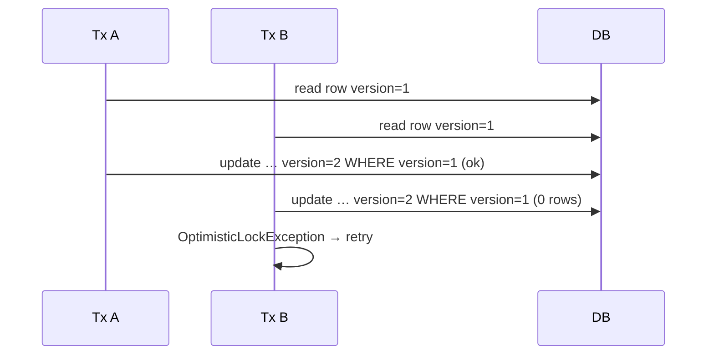

## N+1 with SQL shape

**Broken:**

```
SELECT * FROM orders;                 -- 1
SELECT * FROM items WHERE order_id=1; -- N times
SELECT * FROM items WHERE order_id=2;
...
```

**Fixed (JOIN FETCH / EntityGraph):**

```
SELECT o FROM Order o JOIN FETCH o.items WHERE …
→ one SQL with join (watch cartesian products on multiple bags)
```

## OSIV decision

| Setting | Behavior |
|---------|----------|
| `spring.jpa.open-in-view=true` (Boot default) | Session open for whole HTTP request — lazy loads in controller/json work, N+1 hides |
| `false` | Lazy load outside service TX fails — **forces** explicit fetch plans |

For JSON APIs: prefer **`false`** + conscious fetching.

## Flyway expand/contract (zero-downtime)

```
Deploy 1: ADD nullable column (expand)
Deploy 2: dual-write old+new
Deploy 3: backfill
Deploy 4: read from new
Deploy 5: drop old column (contract)
```

Never rename/drop in one shot under rolling deploys.

**Official docs:** [Transactions](https://docs.spring.io/spring-framework/reference/data-access/transaction.html) · [Spring Data JPA](https://docs.spring.io/spring-data/jpa/reference/) · [Flyway](https://documentation.red-gate.com/fd/)

---

# Part XVI

## Security internals (filter chain → JWT → method security)


> **Learning goal:** debug 401/403 like an engineer — know the filter chain, JWT resource server path, and SecurityContext propagation.

## Default filter chain (conceptual order)

You will not memorize every class — memorize **stages**:

```
1. SecurityContext persistence / clear
2. CORS
3. CSRF (if enabled)
4. Logout
5. UsernamePassword / Bearer token / OAuth2 login filters
6. Anonymous authentication
7. Session management
8. ExceptionTranslationFilter (401 vs 403 entry points)
9. AuthorizationFilter (authorizeHttpRequests)
```

**Debug technique:** `logging.level.org.springframework.security=TRACE` and read which filter rejected the call.

## Mermaid · Form login vs JWT API

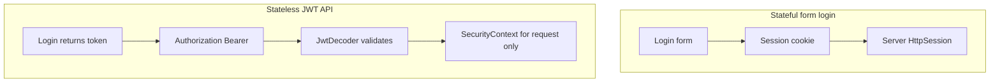

## JWT resource server — pieces you must name

| Piece | Role |
|-------|------|
| `spring-boot-starter-oauth2-resource-server` | Brings JWT support |
| `spring.security.oauth2.resourceserver.jwt.issuer-uri` | OIDC discovery / JWK set |
| `JwtDecoder` | Signature + standard claims |
| `JwtAuthenticationConverter` | Map claims → `GrantedAuthority` |
| Short-lived access + refresh | Limits stolen-token window |

Opaque tokens use **introspection** instead of local JWT validation — different property namespace (`opaquetoken`).

## CSRF in 2026

| App type | CSRF |
|----------|------|
| Cookie session + browser forms/SPA with cookies | **On** (cookie + header pattern) |
| Pure Bearer JWT in `Authorization` header | Often **off** (no cookie session to forge) |
| Hybrid | Design carefully — don't cargo-cult disable |

## SecurityContext under async / virtual threads

`SecurityContextHolder` defaults to `ThreadLocal`. `@Async`, reactive, or thread hops can drop identity. Use:

- `DelegatingSecurityContextExecutor` / wrappers
- Or explicit principal passing

Virtual threads amplify "I created a million threads" thinking — don't put heavy `ThreadLocal` state everywhere; prefer request-scoped values and careful propagation.

## Lab XVI · Why is this 403?

1. Enable Security TRACE.
2. Hit endpoint with JWT missing role.
3. Find whether failure is AuthenticationEntryPoint (401) or AccessDeniedHandler (403).
4. Fix either URL `hasRole` or `@PreAuthorize`, not randomly both.

**Official docs:** [Security Filter Chain](https://docs.spring.io/spring-security/reference/servlet/architecture.html) · [OAuth2 Resource Server JWT](https://docs.spring.io/spring-security/reference/servlet/oauth2/resource-server/jwt.html) · [Method Security](https://docs.spring.io/spring-security/reference/servlet/authorization/method-security.html) · [Authorization Server](https://docs.spring.io/spring-authorization-server/reference/)

---

# Part XVII

## Web advanced · conversion, HTTP clients, async, GraphQL


> **Learning goal:** own the full MVC pipeline and modern outbound HTTP — plus GraphQL as a first-class alternative API style.

## DispatcherServlet pipeline (complete)

```
Filters
  → DispatcherServlet
    → HandlerMapping
    → Interceptors (preHandle)
    → Argument resolvers (@RequestBody, @PathVariable, converters)
    → Controller method
    → Return value handlers
    → HttpMessageConverters
    → Interceptors (postHandle/afterCompletion)
    → ControllerAdvice / ExceptionHandler on errors
```

### Type conversion

`String` query params become `LocalDate`, enums, etc. via `ConversionService` / `Formatter`. Customize with `WebMvcConfigurer.addFormatters` or `@InitBinder`. Validation (`@Valid`) runs **after** binding.

### Outbound HTTP — pick deliberately

| Client | Use |
|--------|-----|
| **RestClient** (6.1+) | Modern sync HTTP |
| **WebClient** | Reactive / streaming |
| **@HttpExchange** interfaces | Declarative clients (framework-native) |
| **OpenFeign** | Still common in Spring Cloud stacks |
| **RestTemplate** | Legacy — maintenance mode |

Always set **connect/read timeouts**. Instrument with Micrometer. For service-to-service OAuth2, use authorized client / token relay — don't paste tokens by hand forever.

### Async MVC tools

| API | Meaning |
|-----|---------|
| `Callable` / `DeferredResult` | Release servlet thread while work continues |
| `SseEmitter` | Server-Sent Events stream |
| `StreamingResponseBody` | Stream large downloads |

With virtual threads, many teams keep simple blocking controllers — still know these for streaming.

## GraphQL with Spring for GraphQL

```
schema.graphqls  →  @QueryMapping / @MutationMapping / @SchemaMapping
                 →  BatchMapping to avoid N+1 on graph edges
```

GraphQL is not "REST with one endpoint" — it is a **schema + resolver** model. Use when clients need flexible graphs; keep REST for file upload, webhooks, and simple resources.

**Official docs:** [Web MVC](https://docs.spring.io/spring-framework/reference/web/webmvc.html) · [RestClient](https://docs.spring.io/spring-framework/reference/integration/rest-clients.html) · [Spring for GraphQL](https://docs.spring.io/spring-graphql/reference/) · [HTTP Interface](https://docs.spring.io/spring-framework/reference/integration/rest-clients.html#rest-http-interface)

---

# Part XVIII

## Messaging, SSL, Docker Compose & Boot 3 migration


> **Learning goal:** cover production surfaces the atlas under-taught: brokers, TLS bundles, local orchestration, and Boot 2→3.

## Messaging map

| Tech | Boot starter angle | When |
|------|--------------------|------|
| **Kafka** | `spring-kafka` | Event streaming, high throughput |
| **RabbitMQ** | `spring-amqp` | Traditional messaging, flexible routing |
| **JMS** | Artemis/ActiveMQ | Enterprise JMS shops |
| **Pulsar** | `spring-pulsar` | Multi-tenant streaming |
| **Cloud Stream** | Binder abstraction | Portability across brokers |

### Delivery truths

```
At-most-once   → can lose
At-least-once  → can duplicate  ← design idempotent consumers
Exactly-once   → marketing + careful TX/idempotency engineering
```

Always plan **DLT/DLQ**, retry, and idempotency keys.

## SSL Bundles (Boot 3.1+)

Central TLS material reused by Tomcat, RestClient, Kafka, etc.:

```
spring.ssl.bundle.pem.mybundle.certificate=...
spring.ssl.bundle.pem.mybundle.private-key=...
```

Stops copying keystore config into five places.

## Docker Compose & Testcontainers for developers

| Feature | Purpose |
|---------|---------|
| `spring-boot-docker-compose` | Boot starts `compose.yaml` services on `run` |
| `@ServiceConnection` | Tests wire containers to Boot auto-config |
| Compose + reuse | Faster local loops |

Dev and CI should share the same Postgres image tag as prod.

## Boot 2 → Boot 3 migration checklist

| Area | Change |
|------|--------|
| Namespace | `javax.*` → `jakarta.*` |
| Security | No `WebSecurityConfigurerAdapter`; use `SecurityFilterChain` |
| Matchers | `antMatchers` → `requestMatchers` |
| Hibernate | 5 → 6 behavior shifts |
| Baseline Java | 17+ |
| Helpers | `spring-boot-properties-migrator` |

## Java 21 + Spring notes

- Records as DTOs / `@ConfigurationProperties`
- Virtual threads for MVC I/O
- Text blocks for JPQL
- Be careful with `ThreadLocal` (SecurityContext, MDC) under VT — prefer scoped propagation patterns

**Official docs:** [SSL](https://docs.spring.io/spring-boot/reference/features/ssl.html) · [Docker Compose](https://docs.spring.io/spring-boot/reference/features/dev-services.html) · [Kafka](https://docs.spring.io/spring-kafka/reference/) · [AMQP](https://docs.spring.io/spring-amqp/reference/) · [Pulsar](https://docs.spring.io/spring-pulsar/reference/) · [Migrating](https://github.com/spring-projects/spring-boot/wiki/Spring-Boot-3.0-Migration-Guide)

---

# Part XIX

## Labs catalog (do these with the atlas)


> **Learning goal:** convert reading into muscle memory. Each lab maps to earlier parts.

| Lab | Maps to | Pass criteria |
|-----|---------|---------------|
| L0 Initializr → fat JAR | I | `java -jar` serves hello |
| L0B dependency:tree conflict | I | Exclusion or BOM fix explained |
| L1 DI failure gallery | II | Circular, duplicate bean, prototype trap fixed |
| L1B @Transactional self-call | II | Prove rollback missing, then fix via another bean |
| L2 Disable an auto-config | III | `--debug` shows CONDITIONAL OFF |
| L2B Toy starter | XIII | ContextRunner tests green |
| L3 REST+ProblemDetail | IV | Invalid body → RFC7807 400 |
| L4 N+1 hunt | XV | Query count drops after EntityGraph |
| L4B Propagation experiment | XV | REQUIRES_NEW audit survives rollback |
| L5 JWT resource server | XVI | 401 without token; 403 without role |
| L6 Slice vs full vs containers | VII | Timing notes written |
| L7 Outbox sketch | VIII | Event only after commit |
| L8 VT load smoke | IX | Throughput notes + pinning awareness |
| L9 Actuator hardening | XIV | management port + health groups |
| Capstone milestones | X | README + Docker + CI |

---

# Part XX

## Capstone specification (real project brief)


> **Learning goal:** ship a portfolio-grade API with acceptance tests, not a checkbox fantasy.

## Domain

**Portfolio API:** Users, Portfolios, Holdings, Transactions.

```
User 1──* Portfolio 1──* Holding
                │
                └──* Transaction
```

## Modules

```
portfolio-api/          # Boot app, controllers, security, OpenAPI
portfolio-service/      # use cases, TX boundaries
portfolio-domain/       # entities, repositories
portfolio-security/     # JWT config (optional split)
```

## Non-functionals

- PostgreSQL + Flyway; `ddl-auto=validate` or `none`
- JWT access + refresh; optional GitHub OAuth2 login
- `ProblemDetail` everywhere
- DTOs only on the wire
- Actuator on management port; Prometheus
- Testcontainers integration tests in CI
- Coverage gate on service module ≥ 80%
- Virtual threads enabled on Java 21
- Multi-stage Docker or Buildpacks

## Milestone acceptance

| M | Done when |
|---|-----------|
| M1 | Flyway V1–V3 + entities + repository tests on Testcontainers |
| M2 | CRUD + pagination + validation + ProblemDetail |
| M3 | JWT login + role-protected admin endpoints + `@WithMockUser`/`jwt()` tests |
| M4 | OpenAPI published; Actuator secured; structured JSON logs with request id |
| M5 | Docker image runs with compose Postgres; CI green on PR |


## API surface (minimum)

| Method | Path | Auth | Notes |
|--------|------|------|-------|
| POST | `/api/auth/login` | public | returns access + refresh |
| POST | `/api/auth/refresh` | public | rotate refresh |
| GET | `/api/me` | user | current principal |
| GET/POST | `/api/portfolios` | user | list/create |
| GET/PATCH | `/api/portfolios/{id}` | owner | |
| GET/POST | `/api/portfolios/{id}/holdings` | owner | |
| POST | `/api/portfolios/{id}/transactions` | owner | buy/sell; transactional |
| GET | `/api/admin/users` | ROLE_ADMIN | |
| GET | `/actuator/health` | management | groups only |

### Mermaid · Capstone domain

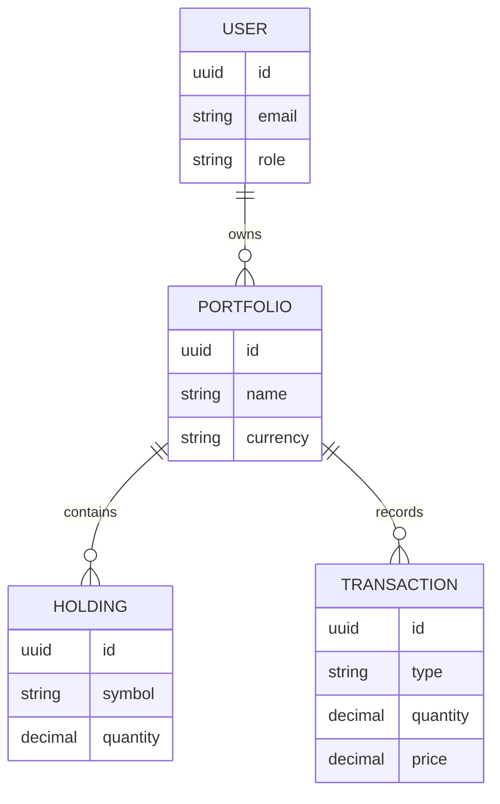

### Demo script (interview)

1. Show OpenAPI → create portfolio → add holding.
2. Break validation → show ProblemDetail JSON.
3. Call admin without role → 403; with admin JWT → 200.
4. Kill Postgres briefly → readiness fails, liveness stays up.
5. Open Grafana/Prometheus scrape of `http.server.requests`.


**Official docs:** [Boot](https://docs.spring.io/spring-boot/reference/) · [Security](https://docs.spring.io/spring-security/reference/) · [Data JPA](https://docs.spring.io/spring-data/jpa/reference/)


# Part XXI

## Remaining architect surfaces (JdbcClient, Kotlin, CDS/CRaC, Actuator custom, AuthorizationManager)


> **Learning goal:** close the last gaps a 2026 Spring Boot architect is expected to know by name.

## JdbcClient (Spring Framework 6.1+ / Boot 3.2+)

When you do not need a full JPA model — reporting queries, simple CRUD, or SQL you already trust — `JdbcClient` is the fluent face over JDBC:

```
select → query(sql).param(...).query(RowMapper).list()
update → sql(sql).param(...).update()
```

| Choose | When |
|--------|------|
| **Spring Data JPA** | Rich domain, associations, dirty checking |
| **JdbcClient / NamedParameterJdbcTemplate** | Explicit SQL, performance-critical reads, simple writes |
| **jOOQ** | Complex SQL DSL, multi-DB codegen |

Do not mix JPA and JDBC on the **same** entity without understanding the persistence context — you can invent stale reads.

**Official docs:** [JdbcClient](https://docs.spring.io/spring-framework/reference/data-access/jdbc/core.html#jdbc-JdbcClient)

---

## Kotlin + Spring Boot

Kotlin is first-class on Initializr. Mental shifts:

| Java habit | Kotlin note |
|------------|-------------|
| Null checks everywhere | Prefer non-null types; use `?` deliberately |
| Lombok data classes | `data class` + `@JvmRecord` / constructor binding |
| Open for CGLIB proxies | Spring needs `kotlin-spring` plugin (`all-open`) or interface-based beans |
| `Optional` | Prefer nullable types at boundaries |

Coroutines + WebFlux is a separate track; for MVC + virtual threads, Kotlin still shines on null-safety and concise DTOs.

**Official docs:** [Kotlin support](https://docs.spring.io/spring-boot/reference/features/kotlin.html) · [Spring Framework Kotlin](https://docs.spring.io/spring-framework/reference/languages/kotlin.html)

---

## CDS & CRaC (startup / pause-resume)

| Tech | Idea | Fit |
|------|------|-----|
| **CDS / AppCDS** | Share class metadata across JVM starts | Faster warm starts on classic JVM |
| **CRaC** | Checkpoint process → restore later | Near-instant restore; needs coordinated resources (sockets, threads) |

Neither replaces good architecture. Use when cold-start SLOs hurt (serverless, scale-from-zero). Validate that DB pools and HTTP clients reconnect cleanly after restore.

**Official docs:** [Efficient deployments](https://docs.spring.io/spring-boot/reference/packaging/efficient.html) · [CRaC](https://docs.spring.io/spring-boot/reference/packaging/efficient.html)

---

## Custom Actuator endpoints & health contributions

Beyond enabling stock endpoints:

1. **`@Endpoint` / `@RestControllerEndpoint`** — expose ops actions (drain, reindex trigger) behind management port + auth.
2. **`HealthIndicator` / `ReactiveHealthIndicator`** — dependency checks (disk, broker, downstream).
3. **Health groups** — `liveness` vs `readiness` mapped to K8s probes.
4. **InfoContributor** — build version, git commit (never secrets).

```
K8s liveness  → /actuator/health/liveness   (am I broken?)
K8s readiness → /actuator/health/readiness  (can I take traffic?)
```

Never put destructive admin actions on the public web port.

**Official docs:** [Production-ready features](https://docs.spring.io/spring-boot/reference/actuator/endpoints.html) · [Customizing health](https://docs.spring.io/spring-boot/reference/actuator/endpoints.html#actuator.endpoints.health.writing-custom-health-indicators)

---

## AuthorizationManager (Security 6 authorization model)

Security 6 moved authorization from the old AccessDecisionManager stack toward **`AuthorizationManager`**:

```
Request → AuthorizationFilter → AuthorizationManager#check
         → AuthorizationDecision (granted / denied)
```

| Layer | Typical manager |
|-------|-----------------|
| HTTP request matchers | `RequestMatcherDelegatingAuthorizationManager` / `authorizeHttpRequests` DSL |
| Method security | `AuthorizationManagerBeforeMethodInterceptor` |
| Custom rules | Implement `AuthorizationManager<T>` for domain decisions |

Prefer composing managers over inventing a parallel security framework. Keep JWT → `JwtAuthenticationConverter` → authorities separate from the authorization decision itself.

**Official docs:** [Authorization Architecture](https://docs.spring.io/spring-security/reference/servlet/authorization/architecture.html) · [Authorize HttpRequests](https://docs.spring.io/spring-security/reference/servlet/authorization/authorize-http-requests.html)

---

## Spring Modulith — practice, not slogan

A Modulith module owns:

- API package (public types)
- Internal package (implementation)
- Events for cross-module collaboration

Verify with:

- Modulith verification at test time (illegal package access fails CI)
- ArchUnit as belt-and-suspenders
- Application-module canvas diagrams in docs

Extract a network service only after the module boundary already works in-process.

**Official docs:** [Spring Modulith](https://docs.spring.io/spring-modulith/reference/)

---

## Spring Authorization Server (when you mint tokens)

If you are not Keycloak/Auth0:

| Concern | Decision |
|---------|----------|
| Clients | confidential vs public; PKCE for SPA/mobile |
| Grants | authorization_code (+ refresh); avoid password grant |
| Tokens | JWT vs opaque; key rotation |
| Consent | required for third-party clients |

Resource servers only **validate**; they should not share the auth DB.

**Official docs:** [Spring Authorization Server](https://docs.spring.io/spring-authorization-server/reference/)


# Study plan · 10 weeks to competence

| Week | Focus | Build |
|------|-------|-------|
| 1 | Parts I–II + Lab L1 | Initializr app + DI failure gallery |
| 2 | Parts III–IV + L3 | REST CRUD + validation + ProblemDetail |
| 3 | Parts V + XV + L4 | JPA + Flyway + N+1 hunt + propagation experiment |
| 4 | Parts VI + XVI + L5 | JWT resource server + TRACE debugging 403 |
| 5 | Part VII + L6 | Slice tests + Testcontainers + context-cache awareness |
| 6 | Parts VIII + L7 | Events/outbox sketch + Resilience4j |
| 7 | Parts IX + XIV + L8/L9 | Virtual threads smoke + Actuator hardening + Docker |
| 8 | Parts XIII + XX | Toy starter + Capstone milestones M1–M5 |
| 9 | Parts XVII–XVIII | GraphQL or messaging elective + SSL bundles / Compose |
| 10 | Polish | Interview drills (XII) + README + demo script |

**Daily habit:** pick 10 atlas entries, explain each aloud in one sentence, open the docs link for any hesitation.

---

# Closing · How Spring Boot fits in one page

```
Clients
  │
  ▼
SecurityFilterChain  (AuthN / AuthZ)
  │
  ▼
@RestController  →  DTOs + @Valid + ProblemDetail
  │
  ▼
@Service + @Transactional  (proxied)
  │
  ▼
Spring Data JPA / JDBC  →  Flyway  →  Database

Boot auto-config + application.yml wire the graph.
Actuator + Micrometer observe it.
Tests (unit → slice → Testcontainers) prove it.
Docker/K8s run it.
```

## Key Takeaways

- Master **IoC + constructor injection** before chasing annotations.
- Boot **auto-config** is conditional defaults — learn to **author** starters, not only consume them.
- **Proxies** power `@Transactional`, `@Cacheable`, and method security — self-invocation bypasses them.
- Keep **entities off the wire**; validate DTOs; return Problem Details.
- Prefer **Flyway expand/contract** + service-layer transactions; hunt N+1 with measured SQL.
- Use the **propagation and isolation matrices** — slogans are not enough.
- Security is **filter chain first**, method security second; debug with TRACE, not guesswork.
- Grow a **test pyramid**; protect the context cache; Testcontainers for dialect truth.
- Split to microservices only with clear boundaries; **outbox + idempotency** beat wishful exactly-once.
- Operate with **health groups, metrics cardinality discipline, and a management port**.
- In 2026, default to **Java 21 virtual threads** for MVC I/O; add GraphQL/messaging/native/AI when the problem demands it.

---

## Author notes

- Written as a course-book companion to a Spring Boot masterclass syllabus.
- Prefer [official Spring docs](https://docs.spring.io) when blog posts disagree — especially Security 6 and Boot 3.
- Capstone path: multi-module Portfolio API with JWT/OAuth2, PostgreSQL, Flyway, OpenAPI, Actuator, Docker, CI.
- Further reading: [Spring Guides](https://spring.io/guides) · [Baeldung Spring](https://www.baeldung.com/spring-tutorial) (verify against docs)

*Edition: 2026-08-08 (deep-analysis refresh) · Parts I–XXI + atlas · 972 topics · Spring Boot 3.4.x / Security 6.x / Java 21+*
